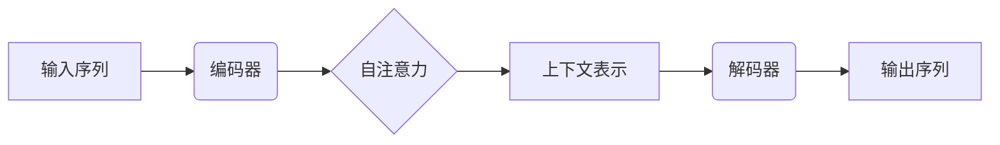

# AI人工智能核心算法原理与代码实例讲解：语言生成

## 1.背景介绍

语言生成是自然语言处理(NLP)领域的一个重要任务,旨在根据给定的上下文或提示生成连贯、流畅和有意义的文本。随着深度学习技术的发展,基于神经网络的语言生成模型取得了令人瞩目的进展,在机器翻译、对话系统、文本摘要、内容创作等多个领域展现出巨大的潜力。

传统的基于规则和统计模型难以处理语言的复杂性和多样性,而神经网络模型则能够从大量数据中自动学习语言的模式和规律,生成更加自然流畅的文本。目前,基于Transformer的语言模型在各种语言生成任务中表现出色,如GPT、BERT等,展现出强大的文本生成能力。

## 2.核心概念与联系

### 2.1 语言模型(Language Model)

语言模型是自然语言处理中的一个基础模型,旨在学习语言的统计规律,估计一个语句或词序列的概率。形式化地,给定一个词序列$w_1, w_2, ..., w_n$,语言模型需要计算该序列的概率:

$$P(w_1, w_2, ..., w_n) = \prod_{i=1}^{n}P(w_i|w_1, ..., w_{i-1})$$

根据链式法则,语言模型的目标是估计每个词$w_i$在给定前导词$w_1, ..., w_{i-1}$的条件概率。

### 2.2 序列到序列模型(Sequence-to-Sequence Model)

序列到序列(Seq2Seq)模型是一种广泛应用于语言生成任务的模型框架,它将输入序列(如源语言句子)映射到输出序列(如目标语言句子)。该模型由两个主要组件组成:

1. **编码器(Encoder)**: 将输入序列编码为一个向量表示。
2. **解码器(Decoder)**: 根据编码器的输出和先前生成的词,逐步预测输出序列的下一个词。

Seq2Seq模型常用于机器翻译、文本摘要、对话系统等任务。

### 2.3 注意力机制(Attention Mechanism)

注意力机制是序列模型中的一种关键技术,它允许模型在生成每个输出词时,动态地关注输入序列的不同部分,从而捕获长距离依赖关系。

在Transformer等新型语言模型中,多头自注意力(Multi-Head Self-Attention)机制被广泛应用,它能够同时关注输入序列中的多个位置,并将这些信息融合到模型的表示中。



## 3.核心算法原理具体操作步骤

以下是基于Transformer的语言生成模型的核心算法原理和操作步骤:

### 3.1 输入表示

1. 将输入文本tokenize为一系列token(词或子词)。
2. 将每个token映射为一个向量表示(embedding)。
3. 添加位置编码(positional encoding),使模型能够捕获序列中token的位置信息。

### 3.2 编码器(Encoder)

1. 对输入序列的embedding进行多头自注意力运算,捕获token之间的依赖关系。
2. 通过前馈神经网络(Feed-Forward Neural Network)对注意力输出进行非线性映射。
3. 对上述步骤进行多层堆叠,形成深层编码器表示。

### 3.3 解码器(Decoder)

1. 在每个解码步骤,将上一时刻生成的token作为输入。
2. 对输入embedding进行掩码多头自注意力,只关注已生成的token。
3. 进行编码器-解码器注意力,关注输入序列的不同部分。
4. 通过前馈神经网络对注意力输出进行非线性映射。
5. 对上述步骤进行多层堆叠,形成深层解码器表示。
6. 基于解码器表示,生成下一个token的概率分布。
7. 从概率分布中采样或选择概率最大的token作为输出。
8. 重复步骤1-7,直到生成终止token或达到最大长度。

## 4.数学模型和公式详细讲解举例说明

### 4.1 自注意力机制(Self-Attention)

自注意力机制是Transformer模型的核心部分,它允许模型在计算表示时关注输入序列的不同部分。给定一个输入序列$X = (x_1, x_2, ..., x_n)$,其中$x_i \in \mathbb{R}^{d_x}$是第$i$个token的embedding,自注意力的计算过程如下:

1. 计算查询(Query)、键(Key)和值(Value)向量:

$$\begin{aligned}
Q &= XW^Q \\
K &= XW^K \\
V &= XW^V
\end{aligned}$$

其中$W^Q, W^K, W^V \in \mathbb{R}^{d_x \times d_k}$是可学习的权重矩阵,将embedding映射到查询、键和值空间。

2. 计算注意力分数:

$$\text{Attention}(Q, K, V) = \text{softmax}\left(\frac{QK^T}{\sqrt{d_k}}\right)V$$

其中$\frac{QK^T}{\sqrt{d_k}}$是查询和键之间的缩放点积,用于计算注意力分数。$\sqrt{d_k}$是一个缩放因子,用于避免过大或过小的注意力分数。

3. 多头注意力(Multi-Head Attention)通过将注意力计算分成多个"头"(head)来提高模型的表示能力:

$$\text{MultiHead}(Q, K, V) = \text{Concat}(head_1, ..., head_h)W^O$$

$$\text{where } head_i = \text{Attention}(QW_i^Q, KW_i^K, VW_i^V)$$

其中$W_i^Q, W_i^K, W_i^V$是每个头的可学习权重矩阵,$W^O$是用于将多头注意力输出连接并映射回原始embedding空间的权重矩阵。

自注意力机制允许模型动态地关注输入序列的不同部分,捕获长距离依赖关系,从而提高了模型的表示能力。

### 4.2 掩码自注意力(Masked Self-Attention)

在解码器中,我们需要防止注意力机制关注未来的token,因为在生成时,模型只能访问当前和过去的token。为了实现这一点,我们引入了掩码自注意力机制。

给定一个输入序列$X = (x_1, x_2, ..., x_n)$和一个掩码向量$M = (m_1, m_2, ..., m_n)$,其中$m_i$表示是否掩码第$i$个token(0表示不掩码,负无穷表示掩码),掩码自注意力的计算过程如下:

1. 计算查询、键和值向量,同上述自注意力机制。
2. 修改注意力分数矩阵,将掩码位置的分数设为负无穷:

$$\text{Masked\_Attention}(Q, K, V, M) = \text{softmax}\left(\frac{QK^T + M}{\sqrt{d_k}}\right)V$$

其中$M$是一个广播到适当形状的掩码向量。

3. 多头掩码自注意力的计算方式与多头自注意力相同。

掩码自注意力机制确保了解码器在生成每个token时,只关注当前和过去的token,从而保证了生成的连贯性和一致性。

### 4.3 编码器-解码器注意力(Encoder-Decoder Attention)

在序列到序列模型中,解码器需要关注编码器的输出,以获取输入序列的信息。这是通过编码器-解码器注意力机制实现的。

给定编码器的输出$H^{enc} = (h_1^{enc}, h_2^{enc}, ..., h_n^{enc})$和解码器的当前状态$s_t$,编码器-解码器注意力的计算过程如下:

1. 计算查询向量:

$$q_t = s_tW^Q$$

其中$W^Q$是可学习的权重矩阵。

2. 计算注意力分数:

$$\text{Attention}(q_t, H^{enc}, H^{enc}) = \text{softmax}\left(\frac{q_t(H^{enc})^T}{\sqrt{d_k}}\right)H^{enc}$$

3. 将注意力输出与解码器状态结合,作为解码器的输入:

$$s_{t+1} = \text{DecoderRNN}(s_t, y_t, c_t)$$

其中$c_t$是注意力输出,用于提供编码器的上下文信息。

编码器-解码器注意力机制允许解码器动态地关注输入序列的不同部分,从而更好地捕获输入和输出之间的对应关系。

## 5.项目实践:代码实例和详细解释说明

以下是一个使用PyTorch实现的简化Transformer语言模型的示例代码,用于生成文本:

```python
import torch
import torch.nn as nn

class TransformerLM(nn.Module):
    def __init__(self, vocab_size, d_model, nhead, num_layers, max_len=512):
        super(TransformerLM, self).__init__()
        self.embedding = nn.Embedding(vocab_size, d_model)
        self.pos_encoder = PositionalEncoding(d_model, max_len=max_len)
        encoder_layer = nn.TransformerEncoderLayer(d_model, nhead, dim_feedforward=2048, dropout=0.1, batch_first=True)
        self.encoder = nn.TransformerEncoder(encoder_layer, num_layers)
        decoder_layer = nn.TransformerDecoderLayer(d_model, nhead, dim_feedforward=2048, dropout=0.1, batch_first=True)
        self.decoder = nn.TransformerDecoder(decoder_layer, num_layers)
        self.out = nn.Linear(d_model, vocab_size)

    def forward(self, src, tgt, src_mask=None, tgt_mask=None):
        src = self.embedding(src) * math.sqrt(self.d_model)
        src = self.pos_encoder(src)
        memory = self.encoder(src, mask=src_mask)
        tgt = self.embedding(tgt) * math.sqrt(self.d_model)
        tgt = self.pos_encoder(tgt)
        output = self.decoder(tgt, memory, tgt_mask=tgt_mask, memory_mask=src_mask)
        return self.out(output)

# 示例用法
model = TransformerLM(vocab_size, d_model, nhead, num_layers)
src = torch.randint(vocab_size, (batch_size, src_len))
tgt = torch.randint(vocab_size, (batch_size, tgt_len))
output = model(src, tgt[:, :-1], tgt_mask=generate_square_subsequent_mask(tgt_len))
loss = F.cross_entropy(output.view(-1, vocab_size), tgt[:, 1:].contiguous().view(-1))
```

这个示例实现了一个简化版的Transformer语言模型,包括以下主要组件:

1. `TransformerLM`类继承自`nn.Module`,定义了模型的结构。
2. `embedding`层将token ID映射为embedding向量。
3. `pos_encoder`层添加位置编码,使模型能够捕获序列中token的位置信息。
4. `encoder`是一个标准的Transformer编码器,由多层编码器层组成。
5. `decoder`是一个标准的Transformer解码器,由多层解码器层组成。
6. `out`层将解码器的输出映射回词汇大小的logits,用于预测下一个token。

在`forward`函数中,输入序列`src`首先通过embedding层和位置编码层,然后传递给编码器获得记忆(`memory`)。目标序列`tgt`也经过相同的embedding和位置编码,然后传递给解码器,同时提供编码器的记忆和掩码,以防止关注未来的token。最后,解码器的输出通过`out`层得到预测的logits。

在示例用法中,我们创建了一个`TransformerLM`实例,并使用随机输入进行前向传播。通过计算预测logits和目标序列之间的交叉熵损失,可以优化模型的参数。

需要注意的是,这只是一个简化的示例,实际应用中的Transformer语言模型可能会更加复杂,包括更多的技术细节和优化策略。

## 6.实际应用场景

语言生成模型在多个领域都有广泛的应用,以下是一些典型的场景:

1. **机器翻译**: 将源语言文本翻译成目标语言,如谷歌翻译、微软翻译等。
2. **对话系统**: 根据上下文生成自然的对话响应,如智能助手、客服机器人等。
3