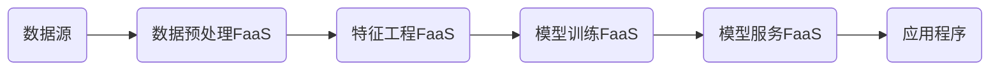

# AI系统Serverless原理与代码实战案例讲解

## 1.背景介绍
### 1.1 Serverless的兴起
近年来,随着云计算的快速发展,Serverless无服务器架构逐渐成为新的技术热点。Serverless让开发者无需关心底层服务器的运维和管理,只需专注于核心业务逻辑的开发,大大提高了开发效率。尤其在人工智能领域,Serverless为AI系统的开发和部署带来了新的思路。

### 1.2 AI系统面临的挑战
传统的AI系统开发通常需要配置复杂的环境,搭建庞大的服务器集群,运维成本高昂。同时,AI算法的训练和推理也非常耗费计算资源,对基础设施提出了更高的要求。这些问题限制了AI应用的快速迭代和规模化部署。

### 1.3 Serverless助力AI系统发展
Serverless为AI系统的开发提供了新的思路。通过Serverless架构,AI系统可以更加敏捷地开发和部署,降低了运维成本,提高了资源利用率。Serverless平台提供了自动伸缩、按需计费等能力,非常适合AI工作负载的特点。

## 2.核心概念与联系
### 2.1 Serverless的定义
Serverless是一种云计算执行模型,用户无需管理服务器,只需上传代码,由云平台根据请求自动分配计算资源,并按实际使用量计费。Serverless包含两个主要概念:
- FaaS(Function as a Service):函数即服务,用户上传函数代码,平台自动执行和伸缩。
- BaaS(Backend as a Service):后端即服务,平台提供后端服务,如数据库、对象存储、消息队列等,简化应用开发。

### 2.2 Serverless与AI系统的关系
AI系统开发通常包括数据处理、模型训练、模型服务等环节,对计算资源和灵活性有很高要求,非常适合使用Serverless架构:
- 数据处理:可使用FaaS函数对数据进行清洗、特征提取、数据增强等处理。
- 模型训练:可使用FaaS触发模型训练任务,动态申请GPU资源,弹性训练。  
- 模型服务:可使用FaaS封装模型推理,实现模型服务的自动伸缩。
- 管道编排:可使用工作流服务如AWS Step Functions编排AI系统的各个阶段。

下图展示了一个基于Serverless的AI系统架构:



## 3.核心算法原理具体操作步骤
下面以一个具体的案例来说明如何使用Serverless构建AI系统。本案例实现了一个基于Serverless的图像分类服务。

### 3.1 数据准备
- 步骤1:将图像数据上传到对象存储如S3中。
- 步骤2:使用FaaS函数对图像进行预处理,如缩放、裁剪等,并将结果存储到S3。
- 步骤3:使用FaaS函数提取图像特征,采用预训练的CNN模型如ResNet提取特征向量,并存储到S3。

### 3.2 模型训练
- 步骤1:使用FaaS函数读取图像特征和标签数据。
- 步骤2:使用FaaS函数启动模型训练任务,动态创建GPU实例,传入训练数据和超参数。
- 步骤3:模型训练完成后,将模型文件存储到S3。

### 3.3 模型服务
- 步骤1:使用FaaS函数加载训练好的模型。
- 步骤2:通过API网关暴露推理接口,接收图像base64编码。
- 步骤3:FaaS函数对请求的图像进行预处理,提取特征,调用模型进行预测,返回结果。
- 步骤4:配置API网关的自动伸缩策略,根据请求量弹性调整FaaS实例数。

## 4.数学模型和公式详细讲解举例说明
本案例中使用softmax回归作为分类模型。设图像特征向量为 $x$,类别标签为 $y$,模型参数为 $\theta$,则softmax回归的数学表达式为:

$$
h_\theta(x) = 
\begin{bmatrix}
p(y=1|x;\theta) \\
p(y=2|x;\theta) \\
\vdots \\
p(y=K|x;\theta)
\end{bmatrix}
=\frac{1}{\sum_{j=1}^K e^{\theta_j^Tx} }
\begin{bmatrix}
e^{\theta_1^Tx} \\
e^{\theta_2^Tx} \\
\vdots \\
e^{\theta_K^Tx} \\
\end{bmatrix}
$$

其中, $\theta_1,\theta_2,\ldots,\theta_K$ 是模型的参数,需要通过训练学习得到。训练时采用极大似然估计,最小化交叉熵损失函数:

$$
J(\theta) = -\frac{1}{m}\sum_{i=1}^m\sum_{j=1}^K 1\{y^{(i)}=j\}\log\frac{e^{\theta_j^Tx^{(i)}}}{\sum_{l=1}^K e^{\theta_l^Tx^{(i)}}}
$$

通过梯度下降法不断迭代更新参数 $\theta$ ,最终得到最优模型。

## 5.项目实践：代码实例和详细解释说明
下面给出基于AWS Serverless服务的代码实现。

### 5.1 数据预处理
使用AWS Lambda函数和S3触发器,对上传的图像进行预处理。

```python
import boto3
from PIL import Image
import io

s3 = boto3.client('s3')

def lambda_handler(event, context):
    # 获取触发事件的图像对象
    bucket = event['Records'][0]['s3']['bucket']['name']  
    key = event['Records'][0]['s3']['object']['key']
    
    # 读取图像内容
    img_obj = s3.get_object(Bucket=bucket, Key=key)
    img = Image.open(io.BytesIO(img_obj['Body'].read()))
    
    # 图像缩放裁剪
    img = img.resize((224,224))
    
    # 图像增强
    # ...
    
    # 存储处理后的图像
    buffer = io.BytesIO()
    img.save(buffer, format='JPEG')
    
    dest_key = 'processed/' + key
    response = s3.put_object(Bucket=bucket, Key=dest_key, Body=buffer.getvalue())
    
    return response
```

### 5.2 模型训练
使用AWS Step Functions编排模型训练工作流,包含数据准备、启动训练、模型持久化等步骤。

```python
import json
import boto3
import sagemaker

# 读取图像特征和标签
def prepare_data(event, context):
    # ...
    return {'data_uri': data_uri}

# 启动SageMaker训练任务  
def train_model(event, context):
    data_uri = event['data_uri']
    
    sagemaker_session = sagemaker.Session()
    image_uri = sagemaker.image_uris.retrieve("pytorch", sagemaker_session.boto_region_name, "1.8.0", "gpu", "py3")
    
    # 配置超参数
    hyperparameters = {'epochs': 10, 'batch_size': 32, 'learning_rate': 0.001}
    
    # 创建SageMaker estimator
    softmax_estimator = sagemaker.estimator.Estimator(
        image_uri,
        sagemaker.get_execution_role(), 
        instance_count=1, 
        instance_type='ml.p3.2xlarge',
        hyperparameters=hyperparameters,
        output_path='s3://my-bucket/model-output'
    )
    
    # 启动训练任务
    softmax_estimator.fit({'train': data_uri}, wait=False)
    
    return {'model_uri': softmax_estimator.model_data}

# 模型持久化
def persist_model(event, context):
    model_uri = event['model_uri']
    # ...
    return {'statusCode': 200}

# 定义Step Functions工作流
training_workflow = {
    "StartAt": "PrepareData",
    "States": {
        "PrepareData": {
            "Type": "Task",
            "Resource": "arn:aws:lambda:us-west-2:123456789012:function:prepare-data",
            "Next": "TrainModel"
        },
        "TrainModel": {
            "Type": "Task",
            "Resource": "arn:aws:lambda:us-west-2:123456789012:function:train-model",
            "Next": "PersistModel"
        },
        "PersistModel": {
            "Type": "Task",
            "Resource": "arn:aws:lambda:us-west-2:123456789012:function:persist-model",
            "End": true
        }
    }
}
```

### 5.3 模型服务
使用AWS Lambda函数和API Gateway实现模型推理服务。

```python
import json
import boto3
import base64
from PIL import Image
import io  

s3 = boto3.client('s3')

def lambda_handler(event, context):
    # 解析请求参数
    body = json.loads(event['body'])
    img_data = body['image']
    
    # Base64解码图像
    img_data = base64.b64decode(img_data.encode('utf-8'))
    img = Image.open(io.BytesIO(img_data))
    
    # 图像预处理
    # ...
    
    # 加载模型
    model = load_model('model.pth')
    
    # 模型推理
    output = model(img)
    predict = int(torch.argmax(output))
    
    return {
        'statusCode': 200,
        'body': json.dumps({'predicted_label': predict})
    }
```

## 6.实际应用场景
Serverless在AI领域已有广泛应用,一些实际的应用场景包括:

- 智能客服:通过Serverless部署对话机器人,根据用户问题给出智能应答。
- 内容审核:利用Serverless对图片、视频、文本进行实时审核,过滤违规内容。
- 推荐系统:使用Serverless处理海量用户行为数据,实时更新推荐模型。
- 语音助手:通过Serverless集成语音识别和自然语言处理,打造智能语音助手。
- 工业质检:利用Serverless分析工业相机图像,实时检测产品缺陷。

## 7.工具和资源推荐
- 云平台:AWS Lambda、Google Cloud Functions、Azure Functions等。
- 机器学习平台:Amazon SageMaker、Google AI Platform、Azure ML等。
- 工作流编排:AWS Step Functions、Azure Durable Functions等。
- 开源框架:Serverless Framework、Kubeless、OpenFaaS等。
- 学习资源:《Serverless架构:从原理、设计到项目实战》、《Serverless Applications with Node.js》、《Learning Serverless》等。

## 8.总结：未来发展趋势与挑战
Serverless正在深刻影响着AI系统的开发模式,为AI应用的快速迭代和规模化部署提供了新的思路。未来Serverless与AI的结合将更加紧密,一些发展趋势包括:

- 更多AI平台将提供Serverless部署模式,简化机器学习工作流。
- Serverless将支持更复杂的编排和工作流,满足端到端AI系统的需求。
- 基于Serverless的AI应用市场将逐渐兴起,促进AI能力的共享和交易。

同时,Serverless在AI领域的应用也面临一些挑战:

- 数据隐私和安全问题。
- 冷启动延迟问题。
- 支持更多机器学习框架和异构硬件。
- 成本控制与优化。

相信随着技术的不断发展,Serverless与AI的结合将越来越成熟,为人工智能的普及应用带来更多可能。

## 9.附录：常见问题与解答
- Q: Serverless和微服务的区别是什么?
  A: 微服务强调应用逻辑的拆分,Serverless强调运行时的托管。两者可以结合,将微服务部署为Serverless函数。
  
- Q: Serverless是否适合长时间运行的任务?
  A: Serverless更适合事件驱动的短时间任务。对于长时间运行的任务,可以考虑将其拆分为多个短任务,或使用其他计算服务如AWS Batch。

- Q: Serverless是否会限制开发语言和框架?
  A: 主流的Serverless平台支持多种开发语言,如Python、Java、Node.js等。但在某些场景下,平台可能限制机器学习框架的选择,需要进行适配。
  
- Q: 如何控制Serverless应用的成本?
  A: 一些成本优化的最佳实践包括:减少函数包大小、优化内存配置、设置超时时间、使用预留实例等。

- Q: Serverless是否适合大规模机器学习训练?
  A: 在一些