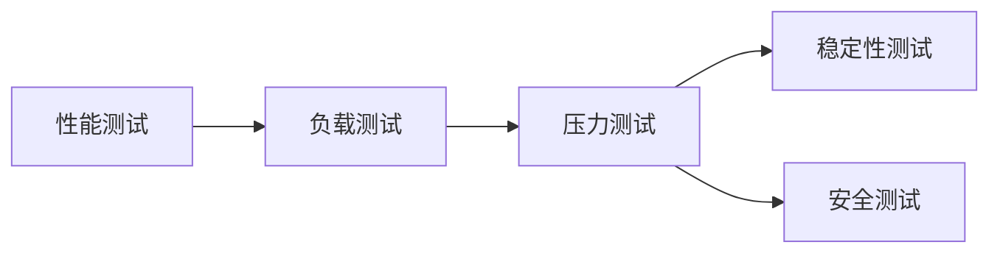

# AI系统压力测试原理与代码实战案例讲解

## 1. 背景介绍
### 1.1 AI系统压力测试的重要性
随着人工智能技术的快速发展,AI系统在各个领域得到了广泛应用。为了确保AI系统的稳定性、可靠性和性能,对其进行压力测试变得越来越重要。压力测试可以帮助我们发现系统在高负载、大数据量、并发访问等极端情况下可能存在的问题,从而及时优化和改进系统设计。

### 1.2 AI系统压力测试面临的挑战
AI系统的压力测试与传统软件系统的压力测试有所不同。AI系统通常涉及复杂的模型、算法和数据,对系统资源和计算能力有较高的要求。此外,AI系统的输入数据具有不确定性和多样性,需要考虑各种边界情况和异常情况。这些因素都给AI系统的压力测试带来了新的挑战。

### 1.3 本文的目的和内容安排
本文旨在深入探讨AI系统压力测试的原理和实践,提供系统性的方法和工具,帮助读者更好地理解和实施AI系统压力测试。文章将从以下几个方面展开:

1. 介绍AI系统压力测试的核心概念和关键指标
2. 详细阐述AI系统压力测试的核心算法原理和操作步骤
3. 给出AI系统压力测试相关的数学模型和公式,并举例说明
4. 提供实际的代码实例,对压力测试过程进行详细解释
5. 讨论AI系统压力测试在实际应用场景中的考虑因素
6. 推荐常用的AI系统压力测试工具和学习资源
7. 总结AI系统压力测试的未来发展趋势和面临的挑战
8. 在附录中解答一些常见问题

## 2. 核心概念与联系
### 2.1 AI系统压力测试的定义
AI系统压力测试是指在一定负载条件下,对AI系统进行测试,以评估其性能、稳定性、资源消耗等指标,发现系统瓶颈和潜在问题的过程。通过模拟实际应用场景中的高并发、大数据量等极端情况,压力测试可以验证AI系统的边界和极限,为系统优化提供依据。

### 2.2 压力测试相关的关键指标
在进行AI系统压力测试时,需要关注以下几个关键指标:

1. 响应时间:AI系统对请求做出响应的时间,反映系统的实时性能。
2. 吞吐量:单位时间内AI系统能够处理的请求数量,衡量系统的处理能力。 
3. 资源利用率:AI系统在压力测试过程中对CPU、内存、磁盘等资源的占用情况。
4. 错误率:在压力测试过程中,AI系统发生错误或异常的比例,反映系统的稳定性。
5. 可扩展性:AI系统在负载增加时,通过横向或纵向扩展资源来提升性能的能力。

### 2.3 压力测试与其他测试类型的关系
压力测试与其他几种常见的测试类型有着密切的联系:

1. 性能测试:评估AI系统在正常负载下的性能表现,压力测试是性能测试的一种极端形式。
2. 负载测试:通过逐步增加负载,确定AI系统的最大承载能力,压力测试是负载测试的延伸。
3. 稳定性测试:长时间运行AI系统,验证其稳定性和可靠性,压力测试可以加速稳定性问题的暴露。
4. 安全测试:模拟恶意攻击场景,测试AI系统的安全防护能力,压力测试可以揭示安全漏洞。

下图展示了AI系统压力测试与其他测试类型之间的关系:



## 3. 核心算法原理具体操作步骤
### 3.1 确定压力测试目标和场景
首先需要明确压力测试的目标,例如评估AI系统在高并发、大数据量下的性能表现,发现系统瓶颈等。然后根据目标设计具体的测试场景,模拟实际应用中可能出现的极端情况,如流量突增、数据爆炸等。

### 3.2 设计压力测试数据集
为了全面测试AI系统的性能边界,需要准备覆盖各种情况的测试数据集。测试数据集应该具有以下特点:

1. 数据量足够大,能够模拟实际应用中的数据规模。
2. 数据分布合理,覆盖不同的数据类型、格式和分布情况。
3. 包含边界值和异常值,验证系统的鲁棒性和容错能力。
4. 考虑数据的相关性和依赖关系,构建真实的数据场景。

### 3.3 选择压力测试工具和框架
根据AI系统的特点和测试需求,选择合适的压力测试工具和框架。常用的工具包括:

1. Apache JMeter:一款开源的压力测试工具,支持多种协议和测试类型。
2. Locust:一个基于Python的分布式压力测试框架,适用于测试Web系统。
3. Gatling:一个基于Scala的高性能压力测试工具,提供了丰富的测试场景和报告功能。
4. TensorFlow Serving:专门用于测试TensorFlow模型服务的压力测试工具。

### 3.4 设计压力测试脚本和场景
使用选定的压力测试工具,编写测试脚本来模拟用户行为和请求。测试脚本应该尽可能接近实际应用场景,包括请求的发送频率、数据传输、并发用户数等。同时,还需要设计不同的测试场景,如逐步增加并发用户数、持续高负载测试等。

### 3.5 执行压力测试并收集结果
在配置好测试环境后,启动压力测试,并实时监控系统性能指标。压力测试过程中,需要关注以下几点:

1. 逐步增加负载,观察系统性能变化趋势。
2. 在不同负载级别下,记录响应时间、吞吐量、资源利用率等关键指标。
3. 注意系统的错误率和异常情况,分析原因并记录。
4. 适时调整测试参数,如并发用户数、数据量等,探索系统的极限。

### 3.6 分析压力测试结果并优化系统
收集压力测试过程中的各项指标数据,对其进行分析和可视化展示。根据分析结果,可以发现系统的性能瓶颈、稳定性问题、资源利用不均等问题。针对发现的问题,提出优化方案,如调整系统架构、优化算法实现、增加硬件资源等。不断迭代优化,直到系统满足预期的性能要求。

## 4. 数学模型和公式详细讲解举例说明
在AI系统压力测试中,一些数学模型和公式可以帮助我们更好地理解和评估系统性能。下面以Little定律为例,详细讲解其在压力测试中的应用。

### 4.1 Little定律简介
Little定律是一个用于描述排队系统性能的基本定律,由约翰·利特尔(John Little)在1961年提出。它建立了系统中请求的平均数量、平均响应时间和到达率之间的关系。公式如下:

$$
L = λ * W
$$

其中:
- $L$表示系统中请求的平均数量
- $λ$表示请求到达率,即单位时间内到达系统的请求数量
- $W$表示请求的平均响应时间

### 4.2 Little定律在压力测试中的应用
在AI系统压力测试中,我们可以利用Little定律来估计系统的性能指标。假设我们通过压力测试得到以下数据:

- 请求到达率$λ$为100个请求/秒
- 平均响应时间$W$为0.5秒

根据Little定律,我们可以计算出系统中请求的平均数量:

$$
L = 100 * 0.5 = 50
$$

这意味着,在稳定状态下,系统中平均有50个请求在等待或处理。

### 4.3 利用Little定律优化系统
了解了Little定律,我们可以从以下几个方面优化AI系统的性能:

1. 降低请求的平均响应时间$W$:通过优化算法、增加硬件资源等方式,减少请求的处理时间。
2. 提高系统的并发处理能力:通过横向或纵向扩展,增加系统处理请求的能力,从而降低$L$。
3. 控制请求的到达率$λ$:在高峰期,可以通过限流、排队等机制,控制请求的到达率,避免系统过载。

例如,如果我们将平均响应时间$W$优化到0.2秒,则系统中请求的平均数量将变为:

$$
L = 100 * 0.2 = 20
$$

这表明优化后,系统中等待或处理的请求数量显著减少,性能得到提升。

### 4.4 Little定律的局限性
虽然Little定律提供了一种简单而有效的方法来评估系统性能,但它也有一些局限性:

1. Little定律假设系统处于稳定状态,请求到达率和处理率保持平衡。在实际压力测试中,系统可能处于非稳态。
2. Little定律不考虑请求的优先级和处理顺序,假设所有请求都是同等重要的。
3. Little定律只提供了系统性能的平均值,无法反映性能的波动和分布情况。

因此,在应用Little定律时,需要结合其他性能指标和分析方法,全面评估AI系统的性能表现。

## 5. 项目实践:代码实例和详细解释说明
下面以一个基于Python的压力测试代码实例,演示如何使用Locust框架对AI系统进行压力测试。

### 5.1 安装Locust框架
首先,使用pip安装Locust框架:

```bash
pip install locust
```

### 5.2 编写压力测试脚本
创建一个名为`ai_system_load_test.py`的Python脚本,编写压力测试任务:

```python
from locust import HttpUser, task, between

class AISystemUser(HttpUser):
    wait_time = between(1, 5)  # 模拟用户思考时间,在1到5秒之间随机等待

    @task
    def predict(self):
        # 发送POST请求,调用AI系统的预测接口
        data = {"text": "This is a sample text for sentiment analysis."}
        self.client.post("/predict", json=data)

    @task
    def feedback(self):
        # 发送POST请求,提交用户反馈数据
        data = {"text": "The prediction is accurate.", "sentiment": "positive"}
        self.client.post("/feedback", json=data)
```

在这个脚本中:
- 定义了一个名为`AISystemUser`的Locust用户类,继承自`HttpUser`。
- 通过`wait_time`属性设置模拟用户的思考时间,在每次任务执行后随机等待1到5秒。
- 定义了两个测试任务:`predict`和`feedback`,分别模拟调用AI系统的预测接口和提交用户反馈。
- 使用`self.client.post`方法发送POST请求,传递JSON格式的数据。

### 5.3 启动压力测试
在命令行中执行以下命令启动压力测试:

```bash
locust -f ai_system_load_test.py --host=http://localhost:8080
```

其中:
- `-f`参数指定压力测试脚本文件。
- `--host`参数指定被测系统的基础URL。

启动后,打开Web浏览器访问`http://localhost:8089`,进入Locust的Web界面。

### 5.4 配置并运行压力测试
在Locust的Web界面中:

1. 设置并发用户数(Number of users)和每秒启动的用户数(Spawn rate)。
2. 点击"Start swarming"按钮,开始压力测试。

Locust将根据设置的用户数和启动速率,模拟用户并发访问AI系统,生成压力。

### 5.5 监控压力测试结果
在压力测试运行过程中,Locust的Web界面会实时显示测试结果,包括:

- 总请求数、成功请求数、失败请求数等。
- 平均响应时间、最大响应时间、吞吐量等性能指标。
- 请求的响应时间分