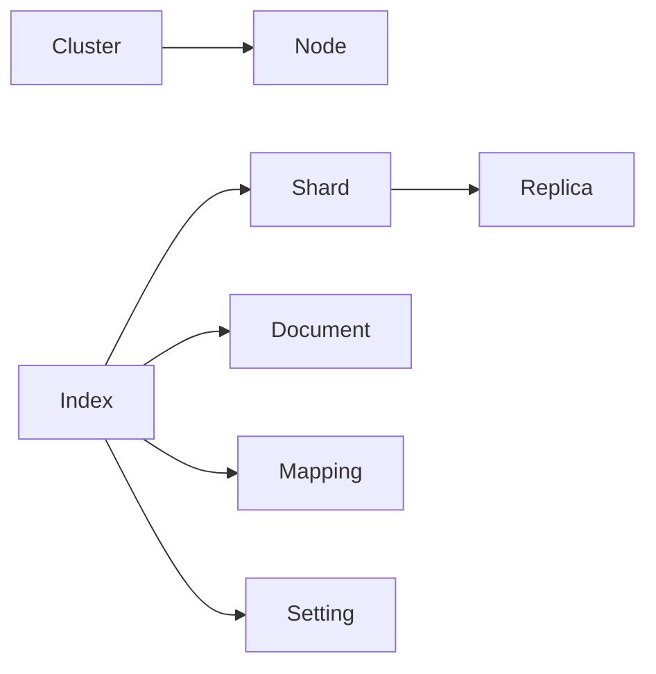

# ElasticSearch原理与代码实例讲解

## 1.背景介绍
### 1.1 全文搜索引擎的发展历程
#### 1.1.1 早期的文件系统搜索
#### 1.1.2 关系型数据库的全文检索
#### 1.1.3 专门的全文搜索引擎出现

### 1.2 ElasticSearch的诞生
#### 1.2.1 Lucene搜索库
#### 1.2.2 Solr搜索服务器
#### 1.2.3 ElasticSearch的崛起

### 1.3 ElasticSearch的应用现状
#### 1.3.1 主流互联网公司的广泛应用
#### 1.3.2 ElasticSearch生态圈的繁荣
#### 1.3.3 ElasticStack技术栈

## 2.核心概念与联系
### 2.1 Node与Cluster
#### 2.1.1 Node节点
#### 2.1.2 Cluster集群
#### 2.1.3 Node与Cluster的关系

### 2.2 Index与Document
#### 2.2.1 Index索引的概念
#### 2.2.2 Document文档
#### 2.2.3 Index与Document的关系

### 2.3 Shard与Replica
#### 2.3.1 Shard分片机制
#### 2.3.2 Replica副本
#### 2.3.3 Shard与Replica的作用

### 2.4 Mapping与Setting
#### 2.4.1 Mapping映射
#### 2.4.2 Setting设置
#### 2.4.3 Dynamic Mapping

### 2.5 核心概念之间的关系



## 3.核心算法原理具体操作步骤
### 3.1 分词Analyzer
#### 3.1.1 Character Filter 
#### 3.1.2 Tokenizer
#### 3.1.3 Token Filter

### 3.2 倒排索引
#### 3.2.1 Term Dictionary
#### 3.2.2 Posting List
#### 3.2.3 倒排索引构建过程

### 3.3 文档打分算法
#### 3.3.1 TF-IDF
#### 3.3.2 BM25
#### 3.3.3 字段长度归一化因子

### 3.4 相关度评分
#### 3.4.1 Query-Time Boosting
#### 3.4.2 查询语句权重
#### 3.4.3 协调因子

## 4.数学模型和公式详细讲解举例说明
### 4.1 布尔模型
#### 4.1.1 布尔模型的表示
$$
R(q,d) = \begin{cases}
1, & \text{if $q$ matches $d$} \\
0, & \text{otherwise}
\end{cases}
$$
#### 4.1.2 布尔查询的组合

### 4.2 向量空间模型
#### 4.2.1 文档向量
$$
\vec{V}(d_j) = (w_{1,j},w_{2,j},...,w_{t,j})
$$
#### 4.2.2 查询向量
$$
\vec{V}(q) = (w_{1,q},w_{2,q},...,w_{t,q})
$$
#### 4.2.3 文档与查询的相似度
$$
sim(d_j,q) = \frac{\vec{V}(d_j) \cdot \vec{V}(q)}{|\vec{V}(d_j)| \times |\vec{V}(q)|}
$$

### 4.3 概率模型
#### 4.3.1 概率生成模型
$P(R|d,q) = \frac{P(d,q|R)P(R)}{P(d,q)}$
#### 4.3.2 语言模型
$P(d|q) = \prod_{i=1}^n P(q_i|d)$

## 5.项目实践：代码实例和详细解释说明
### 5.1 环境准备
#### 5.1.1 安装JDK
#### 5.1.2 安装ElasticSearch
#### 5.1.3 安装Kibana

### 5.2 索引管理
#### 5.2.1 创建索引
```json
PUT /my_index
{
  "settings": {
    "number_of_shards": 3,
    "number_of_replicas": 1
  }
}
```
#### 5.2.2 删除索引
```json
DELETE /my_index
```
#### 5.2.3 查看索引信息
```json
GET /my_index
```

### 5.3 文档操作
#### 5.3.1 新增文档
```json
POST /my_index/_doc
{
  "title": "ElasticSearch原理",
  "content": "全文搜索引擎的核心原理..."
}
```
#### 5.3.2 查询文档
```json
GET /my_index/_doc/1
```
#### 5.3.3 删除文档
```json
DELETE /my_index/_doc/1
```
#### 5.3.4 更新文档
```json
POST /my_index/_update/1
{
  "doc": {
    "title": "ElasticSearch详解"
  }
}
```

### 5.4 分词器使用
#### 5.4.1 标准分词
```json
POST /_analyze
{
  "analyzer": "standard",
  "text": "The quick brown fox"
}
```
#### 5.4.2 IK分词
```json
POST /_analyze
{
  "analyzer": "ik_max_word",
  "text": "ElasticSearch是一个基于Lucene的搜索服务器"
}
```

### 5.5 Query DSL查询
#### 5.5.1 match查询
```json
GET /my_index/_search
{
  "query": {
    "match": {
      "title": "ElasticSearch"
    }
  }
}
```
#### 5.5.2 term查询
```json
GET /my_index/_search
{
  "query": {
    "term": {
      "title.keyword": "ElasticSearch原理"
    }
  }
}
```
#### 5.5.3 布尔查询
```json
GET /my_index/_search
{
  "query": {
    "bool": {
      "must": [
        {
          "match": {
            "title": "ElasticSearch"
          }
        },
        {
          "match": {
            "content": "原理"
          }
        }
      ]
    }
  }
}
```

## 6.实际应用场景
### 6.1 全文检索
#### 6.1.1 电商搜索
#### 6.1.2 论坛搜索
#### 6.1.3 招聘搜索

### 6.2 日志分析
#### 6.2.1 ELK日志分析平台
#### 6.2.2 应用性能监控
#### 6.2.3 安全威胁检测

### 6.3 指标分析
#### 6.3.1 时序数据分析
#### 6.3.2 业务指标监控
#### 6.3.3 异常行为检测

## 7.工具和资源推荐
### 7.1 官方文档
#### 7.1.1 ElasticSearch官方文档
#### 7.1.2 Kibana官方文档
#### 7.1.3 Logstash官方文档

### 7.2 第三方工具
#### 7.2.1 Cerebro
#### 7.2.2 ElasticHD
#### 7.2.3 Dejavu

### 7.3 学习资源
#### 7.3.1 《Elasticsearch: The Definitive Guide》
#### 7.3.2 《Mastering Elasticsearch》
#### 7.3.3 ElasticSearch官方博客

## 8.总结：未来发展趋势与挑战
### 8.1 ElasticSearch的发展趋势
#### 8.1.1 云原生与容器化
#### 8.1.2 机器学习能力增强
#### 8.1.3 图搜索的支持

### 8.2 面临的挑战
#### 8.2.1 数据量急剧增长
#### 8.2.2 实时性要求提高
#### 8.2.3 数据安全与隐私保护

## 9.附录：常见问题与解答
### 9.1 ElasticSearch与关系型数据库的区别？
### 9.2 ElasticSearch如何实现高可用？
### 9.3 ElasticSearch的性能优化有哪些？
### 9.4 ElasticSearch如何做数据同步？
### 9.5 ElasticSearch常见的错误类型有哪些？

作者：禅与计算机程序设计艺术 / Zen and the Art of Computer Programming