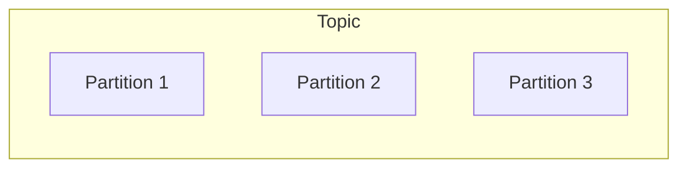
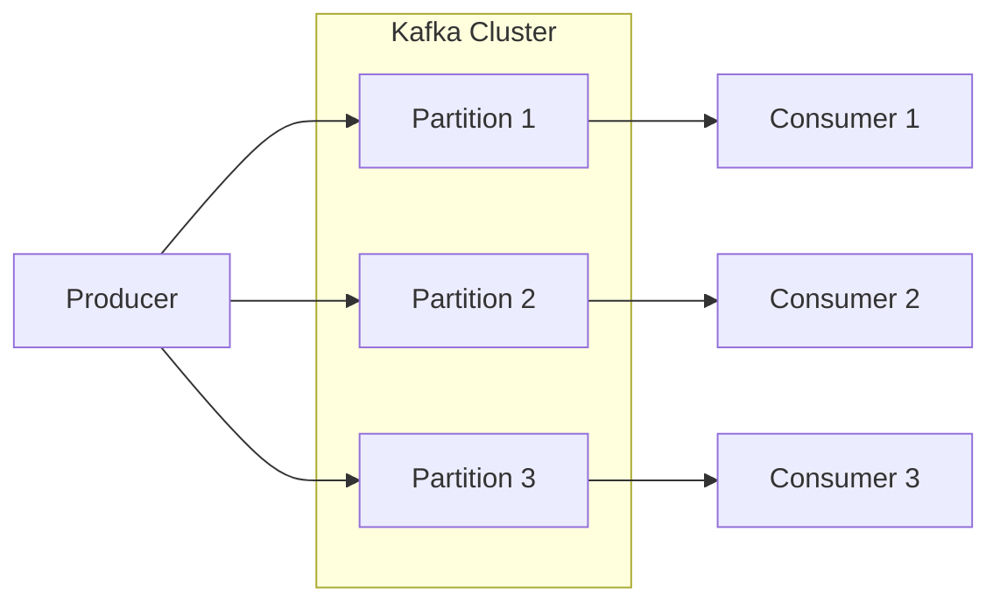
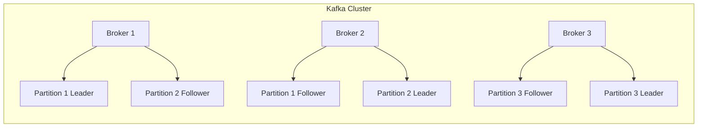
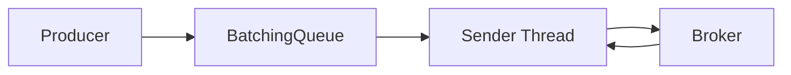
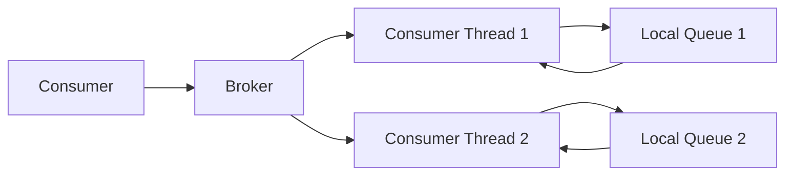

# Kafka原理与代码实例讲解

## 1.背景介绍

Apache Kafka是一个分布式流处理平台,最初由Linkedin公司开发,后来被顶级开源组织Apache软件基金会收购和维护。它是一个分布式、分区的、冗余的、容错的发布-订阅消息队列系统。Kafka被广泛应用于大数据领域,用于日志收集、消息系统、流处理等场景。

Kafka具有高吞吐量、低延迟、高伸缩性、持久化、容错性等优点,可以实时处理大量数据,并确保数据不丢失。它的设计理念是通过一个无环的、分布式、分区的、多副本的持久化日志服务,来处理海量数据。

### 1.1 Kafka的应用场景

- **消息系统**:Kafka可作为消息中间件,实现异步通信、解耦、削峰填谷等功能。
- **活动跟踪**:通过Kafka收集各种来源的数据,可以对用户活动信息进行处理和分析。
- **数据管道**:Kafka可以有序地从多个数据源获取数据,并将其传输到不同的系统中。
- **日志收集**:Kafka常被用作日志收集系统,收集分布在多个服务器上的日志。
- **流处理**:Kafka天生支持流处理,可以对数据流进行低延迟的实时计算。
- **事件源**:Kafka可用于构建事件驱动架构,作为事件源和事件流平台。

### 1.2 Kafka的基本架构

Kafka的架构由几个关键组件组成:

- **Producer(生产者)**: 发布消息到Kafka的客户端程序。
- **Consumer(消费者)**: 从Kafka订阅并消费消息的客户端程序。
- **Broker(代理)**: 一台Kafka服务器实例,存储消息数据。
- **Topic(主题)**: 消息的分类,生产者将消息发布到特定的主题。
- **Partition(分区)**: 每个主题又被分为多个分区,每个分区在物理上对应一个文件。
- **Replication(副本)**: 每个分区都有多个副本,以提供容错能力。

## 2.核心概念与联系

### 2.1 Topic和Partition

Topic是Kafka最基本的概念,可以理解为一个消息队列。为了实现高吞吐量和水平扩展,每个Topic又被分为多个Partition。

每个Partition是一个有序、不可变的消息队列,消息以追加的形式写入Partition。Partition中的每个消息都会被分配一个连续的Id(offset)。Kafka只需保证Partition内部的消息是有序的即可,不需要保证整个Topic内的消息有序。



### 2.2 Producer和Consumer

Producer负责向Topic发布消息,可以指定消息发送到哪个Partition。如果不指定,Kafka会自动选择一个Partition。

Consumer则从Kafka订阅并消费消息。Consumer不是从单个Partition消费数据,而是从一个Consumer Group中消费。一个Consumer Group可以包含多个Consumer实例,每个实例负责消费一个或多个Partition的数据。



### 2.3 Broker和Replication

Broker是Kafka集群中的一个节点实例。每个Broker可以存储一些Topic的部分Partition。

为了提供容错能力,Kafka会在多个Broker上保存Partition的多个副本(Replication)。其中一个副本是Leader,其他副本是Follower。所有的生产和消费操作都是通过Leader副本进行的,Follower副本只用于备份和故障转移。



## 3.核心算法原理具体操作步骤

### 3.1 Producer发送消息流程

1. Producer启动时初始化一个缓冲区(BatchingQueue)。
2. 当Producer发送消息时,消息首先被放入缓冲区。
3. Producer启动一个后台线程,将缓冲区中的消息批量发送到Broker。
4. Broker收到消息后,先将消息写入本地磁盘,然后返回一个ack给Producer。
5. Producer收到ack后,才认为消息发送成功。



### 3.2 Consumer消费消息流程

1. Consumer启动时向Broker发送一个订阅主题的请求。
2. Broker为Consumer分配该主题的一个或多个Partition。
3. Consumer启动一个或多个消费者线程,每个线程负责消费一个Partition的数据。
4. 消费者线程从Broker拉取消息,并将消息写入本地队列。
5. 消费者线程从本地队列中取出消息,进行消费处理。



## 4.数学模型和公式详细讲解举例说明

### 4.1 消息分配策略

Kafka采用分区(Partition)的设计,可以实现水平扩展和高吞吐量。但是如何将消息合理地分配到不同的Partition上,是一个需要考虑的问题。

常见的消息分配策略有:

1. **Round-Robin分配**

消息按照顺序轮流分配到不同的Partition上。这种策略简单,但无法保证相关消息被分配到同一个Partition。

2. **Key Hash分配**

根据消息的Key计算一个Hash值,然后根据Hash值将消息分配到不同的Partition上。这种策略可以保证具有相同Key的消息被分配到同一个Partition,从而保证消息的有序性。

假设有N个Partition,消息的Key为k,则可以使用以下公式计算Partition编号:

$$
Partition = hash(k) \% N
$$

其中hash()是一个哈希函数,可以使用murmur2、md5等。

3. **Key Range分配**

将Key的Hash值范围划分为多个区间,每个区间对应一个Partition。这种策略可以控制Partition的负载,但实现较为复杂。

假设Key的Hash值范围为[0, MAX),将其划分为N个区间,则每个区间的大小为:

$$
range = \frac{MAX}{N}
$$

消息的Key为k,则对应的Partition编号为:

$$
Partition = \lfloor \frac{hash(k)}{range} \rfloor
$$

### 4.2 Replication Leader选举

为了提供容错能力,Kafka为每个Partition维护多个副本(Replication)。其中一个副本是Leader,其他副本是Follower。所有的生产和消费操作都是通过Leader副本进行的。

当Leader副本出现故障时,就需要从Follower副本中选举出一个新的Leader。这个过程被称为Leader选举。

Leader选举算法采用的是Zab协议,基于Paxos算法的一种变种。具体步骤如下:

1. 所有Follower向Broker集群发送选举请求。
2. Broker收到选举请求后,对请求进行排序,取序号最小的那个作为新的Leader。
3. 新的Leader向所有Follower发送通知,进行数据同步。
4. 数据同步完成后,新的Leader开始对外提供服务。

Leader选举算法需要满足以下两个条件:

- **Termination(终止性)**: 在有限的时间内,必须能选举出一个新的Leader。
- **Non-trivial(非平凡性)**: 如果存在一个合法的Leader,那么新选举出的Leader必须是这个合法的Leader。

## 5.项目实践:代码实例和详细解释说明

### 5.1 Producer示例

以下是一个使用Java编写的Kafka Producer示例:

```java
Properties props = new Properties();
props.put("bootstrap.servers", "localhost:9092");
props.put("key.serializer", "org.apache.kafka.common.serialization.StringSerializer");
props.put("value.serializer", "org.apache.kafka.common.serialization.StringSerializer");

Producer<String, String> producer = new KafkaProducer<>(props);

String topic = "test-topic";
String key = "message-key";
String value = "Hello, Kafka!";

ProducerRecord<String, String> record = new ProducerRecord<>(topic, key, value);
producer.send(record);

producer.flush();
producer.close();
```

1. 首先创建一个`Properties`对象,设置Kafka Broker的地址和序列化器。
2. 使用`KafkaProducer`构造函数创建一个Producer实例。
3. 创建一个`ProducerRecord`对象,指定Topic、Key和Value。
4. 调用`producer.send()`方法发送消息。
5. 调用`producer.flush()`确保所有消息都被发送出去。
6. 最后调用`producer.close()`关闭Producer。

### 5.2 Consumer示例

以下是一个使用Java编写的Kafka Consumer示例:

```java
Properties props = new Properties();
props.put("bootstrap.servers", "localhost:9092");
props.put("group.id", "test-group");
props.put("key.deserializer", "org.apache.kafka.common.serialization.StringDeserializer");
props.put("value.deserializer", "org.apache.kafka.common.serialization.StringDeserializer");

KafkaConsumer<String, String> consumer = new KafkaConsumer<>(props);
consumer.subscribe(Collections.singletonList("test-topic"));

while (true) {
    ConsumerRecords<String, String> records = consumer.poll(Duration.ofMillis(100));
    for (ConsumerRecord<String, String> record : records) {
        System.out.printf("offset = %d, key = %s, value = %s%n", record.offset(), record.key(), record.value());
    }
}
```

1. 首先创建一个`Properties`对象,设置Kafka Broker的地址、消费者组ID和反序列化器。
2. 使用`KafkaConsumer`构造函数创建一个Consumer实例。
3. 调用`consumer.subscribe()`订阅Topic。
4. 使用一个无限循环,不断调用`consumer.poll()`从Broker拉取消息。
5. 遍历拉取到的消息,打印消息的offset、key和value。

## 6.实际应用场景

Kafka被广泛应用于以下场景:

1. **日志收集系统**: 将分布在多个服务器上的日志收集传输到Kafka集群,由Kafka进行日志的持久化存储和处理。
2. **消息系统**: Kafka可以作为异步通信的消息中间件,实现系统的解耦和削峰填谷。
3. **数据管道**: 将数据从各种来源源源不断地传输到Kafka集群,再由Kafka将数据传递到Hadoop、Spark等大数据系统进行离线分析。
4. **流处理平台**: Kafka天生支持流处理,可以对实时数据流进行低延迟的实时计算和处理。
5. **事件驱动架构**: Kafka可以作为事件源(Event Source),构建事件驱动架构(Event-Driven Architecture)。

## 7.工具和资源推荐

1. **Kafka Manager**: 一个基于Web的Kafka集群管理工具,可以方便地查看集群状态、Topic信息、消费者信息等。
2. **Kafka Tool**: 一个命令行工具,提供了创建Topic、删除Topic、修改分区数量、查看消费者组信息等功能。
3. **Kafka Stream**: Kafka内置的流处理库,提供了高级的流处理API,可以方便地进行流式数据处理。
4. **Kafka Connect**: Kafka提供的一个工具,用于将Kafka集群连接到其他系统,实现数据的导入和导出。
5. **Confluent Platform**: Confluent公司基于Kafka开发的一套商业产品,提供了更多的企业级功能和工具。

## 8.总结:未来发展趋势与挑战

Kafka作为一个分布式流处理平台,在大数据领域扮演着越来越重要的角色。