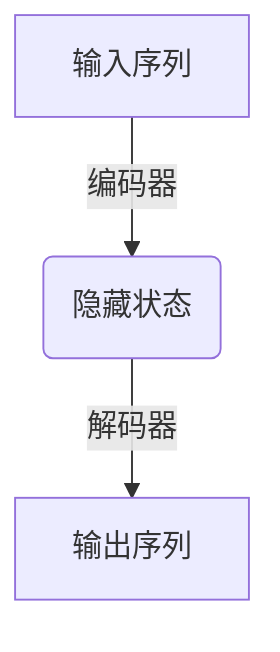
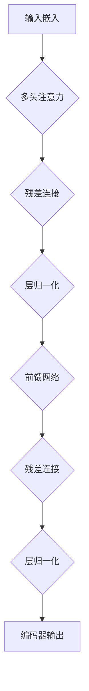

# Language Models 原理与代码实战案例讲解

## 1. 背景介绍

### 1.1 什么是语言模型?

语言模型(Language Model)是自然语言处理(Natural Language Processing, NLP)领域的一个核心概念和技术。它通过从大量文本数据中学习语言的统计规律,来预测给定上下文中下一个单词或词序列出现的概率。语言模型广泛应用于语音识别、机器翻译、文本生成、对话系统等多个领域。

### 1.2 语言模型的重要性

语言是人类交流和表达思想的重要工具,具有高度的复杂性和多样性。构建高质量的语言模型对于计算机系统理解和生成自然语言至关重要。随着深度学习技术的发展,基于神经网络的语言模型取得了突破性进展,在多个领域展现出卓越的性能。

### 1.3 语言模型的发展历程

语言模型最早基于统计方法,如N-gram模型。20世纪90年代,神经网络语言模型(Neural Network Language Model, NNLM)开始兴起。2013年,Word2Vec等词嵌入技术为语言模型注入新的活力。2017年,Transformer模型的提出极大推动了语言模型的发展。2018年以来,大型预训练语言模型(如BERT、GPT等)取得了突破性进展,在多个任务上展现出强大的能力。

## 2. 核心概念与联系

### 2.1 语言模型的核心任务

语言模型的核心任务是计算给定上下文下一个单词或词序列的概率,即:

$$P(w_1, w_2, ..., w_n) = \prod_{i=1}^{n}P(w_i|w_1, w_2, ..., w_{i-1})$$

其中$w_i$表示第i个单词。

### 2.2 语言模型的基本架构

现代神经网络语言模型通常采用编码器-解码器(Encoder-Decoder)架构或基于Transformer的架构。编码器将输入序列编码为隐藏状态,解码器根据隐藏状态生成输出序列。Transformer架构则完全基于注意力机制,不依赖循环或卷积结构。



### 2.3 语言模型评估指标

常用的语言模型评估指标包括:

- 困惑度(Perplexity):衡量模型预测的概率分布与真实分布的差异。
- 交叉熵(Cross Entropy):衡量模型预测的概率分布与真实标签的差异。
- BLEU分数(Bilingual Evaluation Understudy):机器翻译任务中常用的评估指标。

## 3. 核心算法原理具体操作步骤

### 3.1 N-gram语言模型

N-gram语言模型是最早期的统计语言模型,基于马尔可夫假设,即一个单词的概率只与前面N-1个单词相关。具体步骤如下:

1. 从训练语料中统计N-gram计数。
2. 使用加平滑技术(如Laplace平滑、Kneser-Ney平滑等)估计N-gram概率。
3. 在测试时,根据上下文计算目标单词的概率。

### 3.2 神经网络语言模型(NNLM)

神经网络语言模型使用神经网络来学习语言的统计规律,克服了N-gram模型的局限性。常见的NNLM包括前馈神经网络语言模型、循环神经网络语言模型等。

1. 将单词映射为词向量(Word Embedding)。
2. 使用神经网络(如前馈网络或RNN)对输入序列进行编码。
3. 对编码后的隐藏状态进行分类,得到下一个单词的概率分布。
4. 使用交叉熵损失函数进行训练。

### 3.3 Transformer语言模型

Transformer是一种全新的基于注意力机制的神经网络架构,广泛应用于语言模型和序列到序列任务。Transformer语言模型的核心步骤包括:

1. 将输入序列映射为词嵌入序列。
2. 通过多层编码器(Encoder)对输入序列进行编码,得到上下文表示。
3. 解码器(Decoder)基于编码器的输出和自回归机制生成输出序列。
4. 使用掩码语言模型(Masked Language Model)或下一句预测(Next Sentence Prediction)等任务进行预训练。
5. 在下游任务上进行微调(Fine-tuning)。

## 4. 数学模型和公式详细讲解举例说明

### 4.1 语言模型的数学表示

语言模型的核心目标是计算给定上下文下一个单词或词序列的概率,可以表示为:

$$P(w_1, w_2, ..., w_n) = \prod_{i=1}^{n}P(w_i|w_1, w_2, ..., w_{i-1})$$

其中$w_i$表示第i个单词。由于直接计算上式的复杂度很高,通常采用马尔可夫假设进行近似:

$$P(w_i|w_1, w_2, ..., w_{i-1}) \approx P(w_i|w_{i-n+1}, ..., w_{i-1})$$

这就是N-gram模型的基础。

### 4.2 softmax函数和交叉熵损失

在神经网络语言模型中,常使用softmax函数将神经网络的输出映射为概率分布:

$$P(y=j|x) = \frac{e^{x_j}}{\sum_{k=1}^{K}e^{x_k}}$$

其中$x$是神经网络的输出,$K$是输出维度(词表大小)。

交叉熵损失函数用于衡量模型预测的概率分布与真实标签的差异:

$$J(\theta) = -\frac{1}{N}\sum_{i=1}^{N}\sum_{j=1}^{K}y_{ij}\log p_{ij}$$

其中$\theta$是模型参数,$y_{ij}$是真实标签,$p_{ij}$是模型预测的概率。

### 4.3 注意力机制

注意力机制是Transformer等模型的核心,它允许模型在编码输入序列时,对不同位置的输入词元赋予不同的权重。

$$\text{Attention}(Q, K, V) = \text{softmax}(\frac{QK^T}{\sqrt{d_k}})V$$

其中$Q$、$K$、$V$分别是查询(Query)、键(Key)和值(Value)向量,$d_k$是缩放因子。

### 4.4 Transformer编码器

Transformer编码器由多个相同的层组成,每一层包括多头注意力子层和前馈神经网络子层。编码器的输出是输入序列的上下文表示。



## 5. 项目实践:代码实例和详细解释说明

### 5.1 N-gram语言模型实现

下面是使用Python和NLTK库实现N-gram语言模型的示例代码:

```python
import nltk
from nltk.util import ngrams
from collections import Counter

# 训练语料
corpus = ["this is a sentence", "this is another sentence"]

# 生成N-gram
N = 3
ngram_counts = Counter(ngrams(corpus, N))

# 计算N-gram概率
total_counts = sum(ngram_counts.values())
ngram_probs = {ng: count/total_counts for ng, count in ngram_counts.items()}

# 测试
test_sentence = "this is"
test_ngrams = ngrams(test_sentence.split(), N-1)
for ng in test_ngrams:
    print(f"P({ng}) = {ngram_probs[ng]}")
```

在上面的代码中,我们首先从语料中生成N-gram,然后统计每个N-gram的计数。接着,我们计算每个N-gram的概率,即其计数除以总计数。最后,我们测试一个新句子,计算其中每个(N-1)-gram的概率。

### 5.2 LSTM语言模型实现

下面是使用PyTorch实现基于LSTM的神经网络语言模型的示例代码:

```python
import torch
import torch.nn as nn

class LSTMLanguageModel(nn.Module):
    def __init__(self, vocab_size, embedding_dim, hidden_dim):
        super(LSTMLanguageModel, self).__init__()
        self.embeddings = nn.Embedding(vocab_size, embedding_dim)
        self.lstm = nn.LSTM(embedding_dim, hidden_dim)
        self.linear = nn.Linear(hidden_dim, vocab_size)

    def forward(self, inputs, hidden=None):
        embeds = self.embeddings(inputs)
        outputs, hidden = self.lstm(embeds, hidden)
        logits = self.linear(outputs)
        return logits, hidden

# 训练
model = LSTMLanguageModel(vocab_size, embedding_dim, hidden_dim)
criterion = nn.CrossEntropyLoss()
optimizer = torch.optim.Adam(model.parameters())

for epoch in range(num_epochs):
    hidden = None
    for inputs, targets in data_loader:
        optimizer.zero_grad()
        logits, hidden = model(inputs, hidden)
        loss = criterion(logits.view(-1, vocab_size), targets.view(-1))
        loss.backward()
        optimizer.step()
```

在上面的代码中,我们定义了一个基于LSTM的语言模型,包括词嵌入层、LSTM层和线性层。在训练过程中,我们将输入序列输入到模型中,得到每个时间步的输出logits,然后计算与目标序列的交叉熵损失,并使用反向传播算法更新模型参数。

### 5.3 Transformer语言模型实现

下面是使用PyTorch实现Transformer语言模型的示例代码:

```python
import torch
import torch.nn as nn
from transformers import TransformerEncoder, TransformerEncoderLayer

class TransformerLanguageModel(nn.Module):
    def __init__(self, vocab_size, d_model, nhead, num_layers):
        super(TransformerLanguageModel, self).__init__()
        self.embeddings = nn.Embedding(vocab_size, d_model)
        encoder_layer = TransformerEncoderLayer(d_model, nhead)
        self.transformer = TransformerEncoder(encoder_layer, num_layers)
        self.linear = nn.Linear(d_model, vocab_size)

    def forward(self, inputs):
        embeds = self.embeddings(inputs)
        outputs = self.transformer(embeds)
        logits = self.linear(outputs)
        return logits

# 训练
model = TransformerLanguageModel(vocab_size, d_model, nhead, num_layers)
criterion = nn.CrossEntropyLoss()
optimizer = torch.optim.Adam(model.parameters())

for epoch in range(num_epochs):
    for inputs, targets in data_loader:
        optimizer.zero_grad()
        logits = model(inputs)
        loss = criterion(logits.view(-1, vocab_size), targets.view(-1))
        loss.backward()
        optimizer.step()
```

在上面的代码中,我们定义了一个基于Transformer的语言模型,包括词嵌入层、Transformer编码器层和线性层。在训练过程中,我们将输入序列输入到模型中,得到每个时间步的输出logits,然后计算与目标序列的交叉熵损失,并使用反向传播算法更新模型参数。

## 6. 实际应用场景

语言模型在自然语言处理领域有着广泛的应用,包括但不限于以下场景:

### 6.1 机器翻译

在机器翻译系统中,语言模型用于评估翻译结果的流畅性和自然程度。通过计算目标语言句子的概率,可以选择最佳的翻译结果。

### 6.2 语音识别

语音识别系统需要将声学特征序列转换为文本序列。语言模型可以提供单词序列的概率,帮助系统选择最可能的文本输出。

### 6.3 对话系统

对话系统需要根据上下文生成自然的回复。语言模型可以为生成的回复序列赋予概率分数,从而选择最佳的回复。

### 6.4 文本生成

语言模型可以用于生成连贯、流畅的文本,如新闻摘要、故事续写、对话生成等。通过最大化生成序列的概率,可以得到高质量的文本输出。

### 6.5 拼写检查和文本纠错

语言模型可以用于检测文本中的拼写错误和语法错误。通过计算单词序列的概率,可以发现低概率的片段,从而进行纠正。

### 6.6 信息检索

在信息检索系统中,语言模型可以用于计算查询和文档之间的相关性分数,从而改进检索效果。

## 7. 工具和资源推荐

### 7.1 开源框架和库

- PyTorch和TensorFlow:两大主流深度学习框架,提