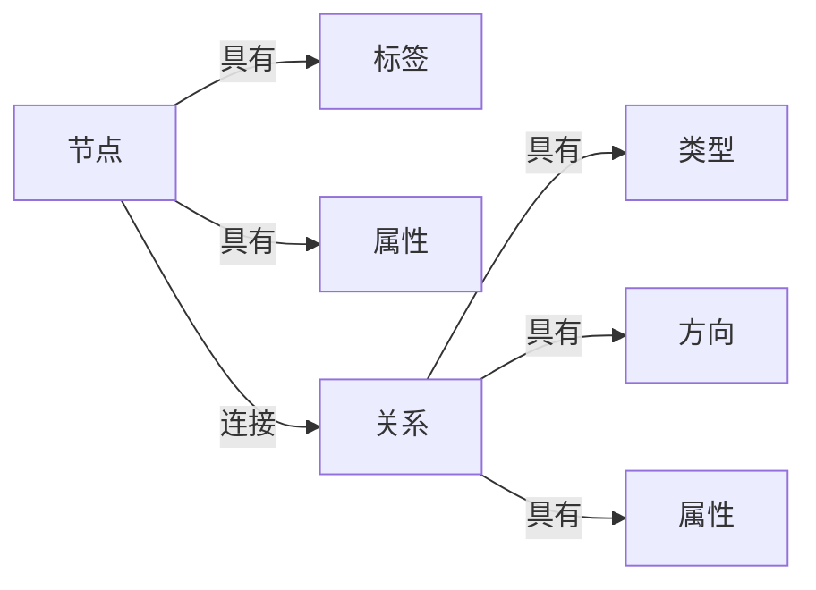
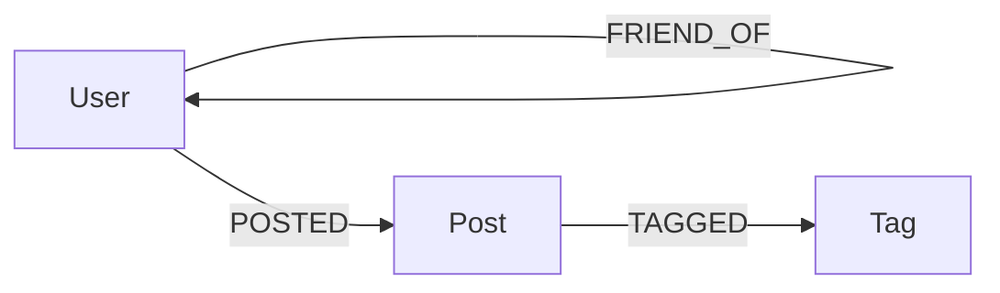

# Neo4j图数据库原理与Cypher代码实例讲解

## 1.背景介绍

在当今数据驱动的世界中,数据正以前所未有的速度和规模产生。传统的关系型数据库系统在处理高度互连的数据时存在一些限制,这导致了图数据库的兴起。图数据库是一种NoSQL数据库,它利用节点、关系和属性高效地存储和查询数据。Neo4j是目前最流行的图数据库之一,它提供了一种直观和高效的方式来表示和查询高度互连的数据。

## 2.核心概念与联系

### 2.1 节点(Nodes)

节点是图数据库中的基本单元,用于表示实体。每个节点都有一个唯一的标识符,可以具有一个或多个标签(Labels)和属性(Properties)。标签用于对节点进行分类,而属性则存储节点的元数据。

### 2.2 关系(Relationships)

关系用于连接两个节点,表示它们之间的关联。每个关系都有一个类型(Type)、一个方向(Direction)和可选的属性。关系的方向可以是单向或双向,这取决于数据模型的需求。

### 2.3 属性(Properties)

属性是键值对的形式,用于存储节点或关系的元数据。属性可以是各种数据类型,如字符串、数字、布尔值等。

### 2.4 Cypher查询语言

Cypher是Neo4j的查询语言,它提供了一种直观和声明式的方式来查询和操作图数据。Cypher查询语言的语法类似于SQL,但更加面向图数据模型。它使用ASCII艺术图形表示法来表达查询模式,使查询更加直观和易于理解。



## 3.核心算法原理具体操作步骤

Neo4j的核心算法原理基于图理论和图遍历算法。下面是一些常见的图算法及其在Neo4j中的具体操作步骤:

### 3.1 深度优先搜索(DFS)

深度优先搜索是一种用于图遍历的算法,它从一个节点开始,沿着一条路径尽可能深入,直到无法继续前进,然后回溯到上一个节点,尝试另一条路径。

在Cypher中,可以使用递归查询来实现DFS:

```cypher
MATCH (start:Node)
CALL apoc.path.expandConfig(start, {maxLevel: 10, relationshipFilter: 'RELATED_TO>', terminatorNodes: []})
YIELD path
RETURN path
```

这个查询从一个标签为`Node`的节点开始,沿着`RELATED_TO`关系进行深度优先搜索,最大深度为10级。`apoc.path.expandConfig`是Neo4j的一个过程,用于执行图遍历。

### 3.2 广度优先搜索(BFS)

广度优先搜索是另一种图遍历算法,它从一个节点开始,首先访问所有相邻的节点,然后访问这些节点的相邻节点,以此类推,直到访问完所有可达节点。

在Cypher中,可以使用嵌套查询来实现BFS:

```cypher
MATCH (start:Node)
WITH start
CALL apoc.path.expandConfig(start, {maxLevel: 10, relationshipFilter: 'RELATED_TO>', terminatorNodes: []})
YIELD path
WITH COLLECT(path) as paths
UNWIND paths as p
RETURN p
```

这个查询首先从一个标签为`Node`的节点开始,然后使用`apoc.path.expandConfig`过程进行广度优先搜索,最大深度为10级。`COLLECT`和`UNWIND`语句用于展平嵌套的路径结果,以便返回所有路径。

### 3.3 最短路径算法

最短路径算法用于查找两个节点之间的最短路径,这在许多场景中都很有用,如社交网络分析、路径规划等。Neo4j提供了多种最短路径算法,如Dijkstra算法、A*算法等。

在Cypher中,可以使用`shortestPath`函数来查找最短路径:

```cypher
MATCH (start:Node {name: 'Start'}), (end:Node {name: 'End'}),
      path = shortestPath((start)-[:RELATED_TO*]->(end))
RETURN path
```

这个查询查找从标签为`Node`且`name`属性为`'Start'`的节点到标签为`Node`且`name`属性为`'End'`的节点之间的最短路径,路径中的关系类型为`RELATED_TO`。

## 4.数学模型和公式详细讲解举例说明

图数据库中的许多算法都基于图理论和数学模型。下面是一些常见的数学模型和公式,以及它们在Neo4j中的应用:

### 4.1 邻接矩阵

邻接矩阵是一种表示图的数学模型,它使用一个二维矩阵来表示节点之间的连接关系。如果两个节点之间存在边,则对应的矩阵元素为1,否则为0。

在Neo4j中,可以使用Cypher查询生成邻接矩阵:

```cypher
MATCH (n)-[r]->(m)
WITH DISTINCT n, m
ORDER BY id(n), id(m)
WITH COLLECT(id(n)) as nodes, COLLECT(id(m)) as others
UNWIND others as other
RETURN nodes,
       [other IN others | ANY(x IN nodes WHERE other = x)] as adjacency
```

这个查询首先匹配所有节点对和它们之间的关系,然后使用`COLLECT`和`UNWIND`语句生成邻接矩阵。

邻接矩阵在图算法中有广泛的应用,如shortest

 路径算法、连通分量识别等。

### 4.2 PageRank算法

PageRank算法是一种用于计算网页重要性的算法,它被广泛应用于网页排名和社交网络分析。PageRank算法基于网页之间的链接结构,通过迭代计算每个网页的重要性分数。

在Neo4j中,可以使用APOC插件中的`apoc.algo.pageRank`过程来计算PageRank分数:

$$
PR(v_i) = \frac{1-d}{N} + d \sum_{v_j \in M(v_i)} \frac{PR(v_j)}{L(v_j)}
$$

其中:
- $PR(v_i)$是节点$v_i$的PageRank分数
- $N$是图中节点的总数
- $d$是阻尼系数,通常取值为0.85
- $M(v_i)$是指向节点$v_i$的所有节点集合
- $L(v_j)$是节点$v_j$的出度(指向其他节点的边数)

```cypher
CALL apoc.algo.pageRank('RELATED_TO', {iterations: 20, dampingFactor: 0.85})
YIELD node, score
RETURN node.name AS name, score
ORDER BY score DESC
```

这个查询使用PageRank算法计算图中每个节点的重要性分数,关系类型为`RELATED_TO`,迭代次数为20,阻尼系数为0.85。结果按分数降序排列。

### 4.3 社区发现算法

社区发现算法用于识别图中的紧密连接的节点集群,这在社交网络分析、生物信息学等领域有重要应用。常见的社区发现算法包括Louvain算法、Girvan-Newman算法等。

在Neo4j中,可以使用APOC插件中的`apoc.algo.community`过程来执行社区发现:

```cypher
CALL apoc.algo.community('RELATED_TO', {algo: 'louvain', iterations: 20})
YIELD node, community
RETURN node.name AS name, community
ORDER BY community
```

这个查询使用Louvain算法对图中的节点进行社区划分,关系类型为`RELATED_TO`,最大迭代次数为20。结果按社区编号排序。

## 5.项目实践:代码实例和详细解释说明

为了更好地理解Neo4j图数据库和Cypher查询语言,让我们通过一个实际项目来进行实践。我们将构建一个简单的社交网络应用程序,其中包括用户、朋友关系和用户发布的帖子。

### 5.1 数据模型

我们的数据模型包括三种节点类型:

- `User`节点表示用户
- `Post`节点表示用户发布的帖子
- `Tag`节点表示帖子的标签

它们之间通过以下关系类型连接:

- `FRIEND_OF`关系表示两个用户之间的朋友关系
- `POSTED`关系表示用户发布了一个帖子
- `TAGGED`关系表示帖子被标记了一个标签



### 5.2 创建节点和关系

首先,我们需要创建一些示例数据。以下Cypher查询将创建几个`User`节点、`Post`节点和`Tag`节点,并通过相应的关系将它们连接起来:

```cypher
// 创建用户节点
CREATE (:User {name: 'Alice'})
CREATE (:User {name: 'Bob'})
CREATE (:User {name: 'Charlie'})

// 创建朋友关系
MATCH (a:User {name: 'Alice'}), (b:User {name: 'Bob'})
CREATE (a)-[:FRIEND_OF]->(b)
MATCH (a:User {name: 'Alice'}), (c:User {name: 'Charlie'})
CREATE (a)-[:FRIEND_OF]->(c)

// 创建帖子节点
CREATE (:Post {content: 'Hello, world!'})<-[:POSTED]-(:User {name: 'Alice'})
CREATE (:Post {content: 'Neo4j is awesome!'})<-[:POSTED]-(:User {name: 'Bob'})
CREATE (:Post {content: 'Learning Cypher'})<-[:POSTED]-(:User {name: 'Charlie'})

// 创建标签节点并关联到帖子
MATCH (p:Post {content: 'Hello, world!'}), (t:Tag {name: 'greeting'})
CREATE (p)-[:TAGGED]->(t)
MATCH (p:Post {content: 'Neo4j is awesome!'}), (t:Tag {name: 'database'})
CREATE (p)-[:TAGGED]->(t)
MATCH (p:Post {content: 'Learning Cypher'}), (t:Tag {name: 'query'})
CREATE (p)-[:TAGGED]->(t)
```

### 5.3 查询数据

现在,我们可以使用Cypher查询来探索和操作这些数据。

#### 5.3.1 查找用户的朋友

```cypher
MATCH (u:User {name: 'Alice'})-[:FRIEND_OF]->(friend)
RETURN u.name, friend.name
```

这个查询将返回用户`Alice`的所有朋友。

#### 5.3.2 查找用户发布的帖子

```cypher
MATCH (u:User {name: 'Bob'})-[:POSTED]->(post)
RETURN u.name, post.content
```

这个查询将返回用户`Bob`发布的所有帖子。

#### 5.3.3 查找带有特定标签的帖子

```cypher
MATCH (post)-[:TAGGED]->(tag {name: 'database'})
RETURN post.content
```

这个查询将返回所有带有`database`标签的帖子。

#### 5.3.4 使用聚合函数统计数据

```cypher
MATCH (u:User)-[:POSTED]->(post)
RETURN u.name, COUNT(post) AS post_count
ORDER BY post_count DESC
```

这个查询将统计每个用户发布的帖子数量,并按降序排列。

### 5.4 更新和删除数据

除了查询数据,我们还可以使用Cypher来更新和删除数据。

#### 5.4.1 更新节点属性

```cypher
MATCH (p:Post {content: 'Hello, world!'})
SET p.content = 'Updated post content'
```

这个查询将更新内容为`'Hello, world!'`的帖子节点的`content`属性。

#### 5.4.2 删除节点和关系

```cypher
MATCH (p:Post {content: 'Updated post content'})-[r]->(t:Tag)
DETACH DELETE p, r, t
```

这个查询将删除内容为`'Updated post content'`的帖子节点,以及与它相关的`TAGGED`关系和`Tag`节点。

## 6.实际应用场景

图数据库在许多领域都有广泛的应用,包括但不限于:

### 6.1 社交网络分析

社交网络是一种典型的图结构,用户之间的关系可以用节点和边来表示。Neo4j可以高效地存储和查询这种复杂的关系数据,并执行诸如社区发现、影响力分析等任务。

### 6.2 推荐系统

推荐系统通常需要处理大量的关系数据,如用户之间的相似性、商品之间的关联等。Neo4j可以轻松地构建和查询这种数据模型,为推荐系统提供