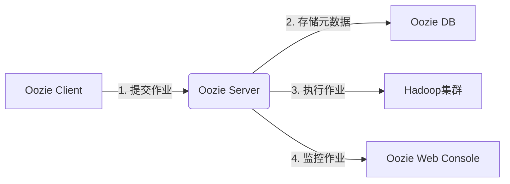
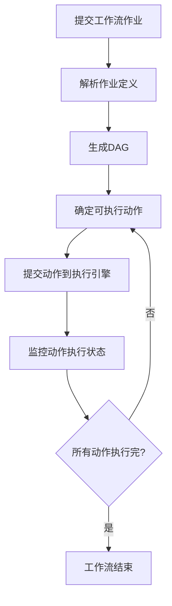
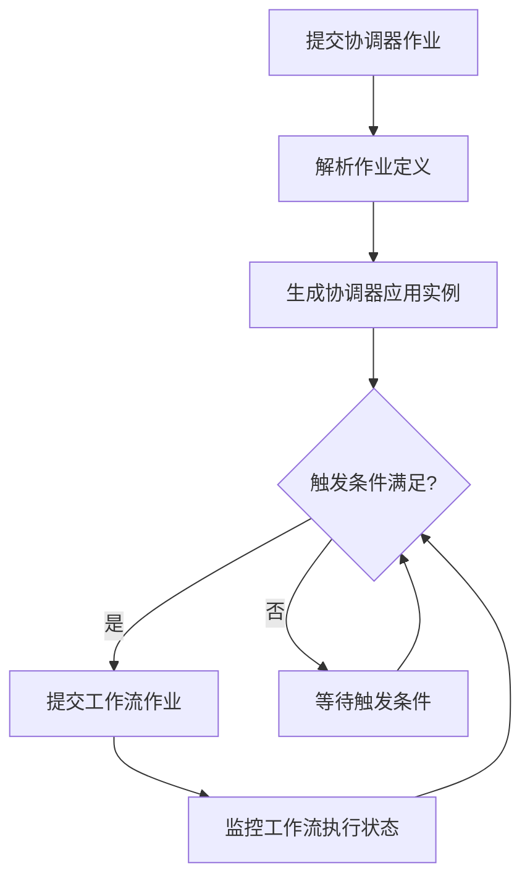
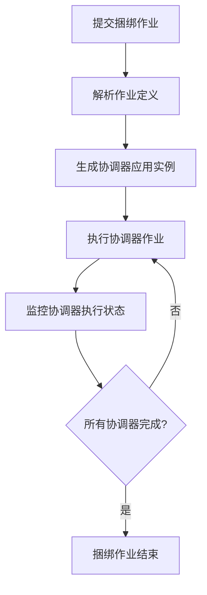

# Oozie原理与代码实例讲解

## 1.背景介绍

在大数据时代,数据处理任务变得越来越复杂,单一的MapReduce作业已经无法满足企业的需求。为了解决这个问题,Apache推出了Oozie工作流调度引擎。Oozie是一个用于管理Hadoop作业(如Java MapReduce、Pig作业、Hive查询和Shell脚本)的工作流调度系统。

Oozie可以将多个作业连接成一个逻辑上的工作流,并提供多种功能,如:

- 将多个作业组装成有向无环图(DAG)
- 支持作业之间的依赖关系
- 支持多种类型的作业(Java、Shell、Hive、Pig等)
- 参数化数据集
- 支持重复执行和重试
- 支持基于时间和数据的触发器
- 支持SLA监控和警报
- 支持递归处理数据集

Oozie工作流被设计为一个有向无环图,其中节点是动作(如MapReduce、Pig、Hive等),边代表控制依赖关系。

## 2.核心概念与联系

### 2.1 Oozie核心概念

Oozie中有几个核心概念需要理解:

1. **Workflow作业(WorkflowJob)**: 定义为有向无环图(DAG),由若干个动作组成,描述了各个动作之间的执行顺序和控制依赖关系。

2. **协调器作业(CoordinatorJob)**: 用于调度和执行工作流作业,通过时间和数据可用性触发器来控制工作流作业的执行。

3. **捆绑作业(BundleJob)**: 将多个协调器作业和工作流作业组合在一起,作为一个逻辑执行单元。

4. **动作节点(ActionNode)**: 工作流定义中的基本单元,代表一个任务,如MapReduce、Pig、Hive等。

### 2.2 Oozie体系架构

Oozie的核心组件包括:

1. **Oozie Client**: 提交和管理Oozie工作流、协调器和捆绑作业。

2. **Oozie Server**: 接收并执行工作流、协调器和捆绑作业。

3. **Oozie DB**: 存储Oozie作业的元数据、状态和配置信息。

4. **Oozie Web Console**: 基于Web的UI,用于查看和管理Oozie作业。



## 3.核心算法原理具体操作步骤

### 3.1 工作流作业执行流程

1. 客户端通过CLI或API提交工作流作业定义(XML或属性文件)给Oozie Server。
2. Oozie Server解析作业定义,生成有向无环图(DAG)。
3. 根据控制依赖关系,确定可执行的动作节点。
4. 将可执行动作提交给相应的执行引擎(MapReduce/Pig/Hive等)。
5. 监控动作执行状态,根据状态更新DAG。
6. 重复步骤3-5,直到所有动作执行完毕。



### 3.2 协调器作业执行流程

1. 客户端提交协调器作业定义给Oozie Server。
2. Oozie Server解析协调器作业定义,生成协调器应用实例。
3. 基于时间/数据触发器,确定是否需要执行工作流作业。
4. 如需执行,则提交相应的工作流作业。
5. 监控工作流作业执行状态。
6. 重复步骤3-5,直到协调器作业结束。



### 3.3 捆绑作业执行流程

1. 客户端提交捆绑作业定义给Oozie Server。
2. Oozie Server解析捆绑作业定义。
3. 为每个协调器作业生成协调器应用实例。
4. 执行协调器作业流程。
5. 监控所有协调器作业的执行状态。
6. 当所有协调器作业完成时,捆绑作业结束。



## 4.数学模型和公式详细讲解举例说明

在Oozie中,工作流作业被建模为有向无环图(DAG),用于表示动作节点之间的执行顺序和控制依赖关系。

DAG可以用数学模型表示为$G = (V, E)$,其中:

- $V$是顶点集合,表示工作流中的动作节点
- $E$是边集合,表示动作节点之间的控制依赖关系

每个动作节点$v_i \in V$可以有多个父节点$parent(v_i)$和子节点$children(v_i)$,它们分别表示$v_i$的控制依赖节点和被控制依赖节点。

对于任意节点$v_i$,如果$parent(v_i) = \emptyset$,则称$v_i$为起始节点;如果$children(v_i) = \emptyset$,则称$v_i$为终止节点。

工作流执行时,需要遍历DAG,找到所有可执行的动作节点集合$R$:

$$R = \{v_i | v_i \in V \land \forall v_j \in parent(v_i), v_j \text{ is completed}\}$$

也就是说,一个节点$v_i$可执行的条件是它的所有父节点都已经完成执行。

在执行过程中,随着动作节点的完成,$R$会不断更新,直到所有节点执行完毕,即$V = \emptyset$,工作流结束。

## 5.项目实践:代码实例和详细解释说明

### 5.1 定义工作流作业

工作流作业使用XML或属性文件定义,下面是一个简单的MapReduce作业示例(workflow.xml):

```xml
<workflow-app name="map-reduce-wf" xmlns="uri:oozie:workflow:0.5">
    <start to="mr-node"/>
    
    <action name="mr-node">
        <map-reduce>
            <job-tracker>${jobTracker}</job-tracker>
            <name-node>${nameNode}</name-node>
            <configuration>
                <property>
                    <name>mapred.mapper.class</name>
                    <value>org.apache.oozie.example.MapperClass</value>
                </property>
                <property>
                    <name>mapred.reducer.class</name>
                    <value>org.apache.oozie.example.ReducerClass</value>
                </property>
                <property>
                    <name>mapred.input.dir</name>
                    <value>/user/test/input</value>
                </property>
                <property>
                    <name>mapred.output.dir</name>
                    <value>/user/test/output</value>
                </property>
            </configuration>
        </map-reduce>
        <ok to="end"/>
        <error to="kill"/>
    </action>
    
    <kill name="kill">
        <message>MapReduce failed, error message[${wf:errorMessage(wf:lastErrorNode())}]</message>
    </kill>
    <end name="end"/>
</workflow-app>
```

这个工作流包含一个MapReduce动作节点,如果执行成功则结束,否则终止并输出错误信息。

### 5.2 提交和监控工作流作业

使用Oozie Client命令行工具提交和监控工作流作业:

```bash
# 提交工作流作业
oozie job -config job.properties -run

# 获取作业状态
oozie job -info $jobId

# 获取作业日志
oozie job -log $jobId
```

也可以使用Java API提交和控制作业:

```java
// 创建OozieClient实例
OozieClient ozClient = new OozieClient("http://oozie-server:11000/oozie");

// 获取工作流作业配置
Properties conf = ozClient.createConfiguration();
conf.setProperty(OozieClient.APP_PATH, "hdfs://namenode:9000/user/test/workflow.xml");

// 提交工作流作业
final String jobId = ozClient.run(conf);

// 获取作业状态
WorkflowJob wfJob = ozClient.getJobInfo(jobId);

// 获取作业日志
StreamingLogReader logReader = ozClient.getJobLogReader(jobId);
```

### 5.3 Oozie Web Console

Oozie提供了基于Web的控制台,用于查看和管理作业。在浏览器中访问`http://oozie-server:11000/oozie`即可使用。

控制台提供了作业列表、作业信息、作业定义、作业日志等功能,方便用户监控和管理Oozie作业。

## 6.实际应用场景

Oozie作为Hadoop生态系统中的工作流调度器,在许多大数据应用场景中发挥着重要作用:

1. **ETL数据处理**: 使用Oozie协调器定期执行Hive/Pig脚本,完成数据抽取、转换和加载的ETL过程。

2. **机器学习流水线**: 将数据预处理、特征工程、模型训练和评估等步骤组织为工作流,使用Oozie自动化执行。

3. **网站数据分析**: 定期运行MapReduce作业分析网站日志,生成报表,并通过Oozie捆绑作业调度。

4. **文件处理**: 对HDFS上的文件进行处理(如压缩、加密等),并通过Oozie协调器根据文件到达时间自动触发。

5. **混合工作流**: 结合不同类型的作业(Java、Shell、Hive、Spark等),构建复杂的数据处理流程。

6. **SLA监控**: 利用Oozie的SLA功能监控关键作业的执行时间,并发出警报。

## 7.工具和资源推荐

- **Oozie官方文档**: https://oozie.apache.org/
- **Oozie命令行工具**: 用于提交和管理Oozie作业
- **Oozie Java Client API**: 通过编程方式控制Oozie
- **Oozie Web Console**: 基于Web的UI,用于可视化管理作业
- **Hue Oozie Dashboard**: Hue提供的Oozie作业管理界面
- **OozieFlow**: 一个基于Web的Oozie工作流设计器
- **Azkaban**: Linkedin开源的工作流调度器,可作为Oozie替代方案

## 8.总结:未来发展趋势与挑战

Oozie作为Apache Hadoop生态系统中的关键组件,在工作流调度领域发挥着重要作用。然而,随着大数据场景的不断演进,Oozie也面临一些挑战和发展方向:

1. **云原生支持**: 适配Kubernetes等云原生环境,实现更好的资源管理和弹性伸缩。

2. **实时流处理**: 增强对实时流数据处理(如Spark Streaming、Flink)的支持。

3. **机器学习工作流**: 更好地支持机器学习流水线,如TFX等。

4. **可视化和低代码**: 提供更友好的可视化工具和低代码方式定义工作流。

5. **监控和告警增强**: 加强监控和告警功能,提高工作流的可观测性。

6. **安全性和权限控制**: 增强安全性,提供细粒度的权限控制。

7. **性能优化**: 持续优化性能和稳定性,提高大规模工作流的处理能力。

8. **社区活跃度**: 保持社区的活跃度,吸引更多贡献者参与Oozie的开发和维护。

总的来说,Oozie作为成熟的工作流调度器,将继续在大数据生态系统中扮演重要角色,并不断进化以适应新的需求和挑战。

## 9.附录:常见问题与解答

1. **Oo