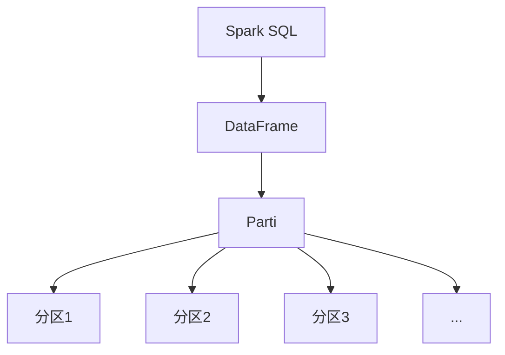

# Parti原理与代码实例讲解

## 1.背景介绍

在当今大数据时代,数据处理和分析已经成为各行业的核心需求之一。随着数据量的不断增长,传统的数据处理方式已经无法满足现代应用的需求。因此,分布式数据处理框架应运而生,其中Apache Spark作为一种快速、通用的大数据处理引擎,备受关注。

Parti是Spark SQL中的一个关键概念,它是Spark处理结构化数据的核心。Parti的引入极大地提高了Spark处理大规模数据集的效率和性能。本文将深入探讨Parti的原理、实现和应用,帮助读者更好地理解和运用这一强大的数据处理技术。

## 2.核心概念与联系

### 2.1 Spark SQL

Apache Spark SQL是Spark用于结构化数据处理的模块。它允许使用SQL查询语言或DataFrame API来查询数据。Spark SQL支持多种数据源,如Hive表、Parquet文件、JSON等。它还提供了优化器,可以高效地执行SQL查询。

### 2.2 DataFrame

DataFrame是Spark SQL中的核心数据结构,类似于关系数据库中的表。它是一种分布式数据集合,由命名列组成。DataFrame可以从各种数据源构建,并支持类似SQL的转换操作。

### 2.3 Parti

Parti是Spark SQL中用于表示分区的概念。它是一种物理执行单元,表示DataFrame的一个水平分区。Parti由多个分区组成,每个分区包含DataFrame的一部分数据。在执行查询时,Spark会根据分区对数据进行并行处理,从而提高性能。



## 3.核心算法原理具体操作步骤

Parti的核心算法原理是将数据集水平划分为多个分区,然后对每个分区并行执行计算操作。具体步骤如下:

1. **数据读取**:从数据源(如HDFS、Hive表等)读取数据,并将其加载到DataFrame中。

2. **分区规划**:根据数据的大小、分布情况以及集群资源,Spark会自动或者根据用户指定的分区策略,将DataFrame划分为多个Parti。

3. **任务调度**:Spark将每个Parti作为一个独立的任务,并将这些任务分发到不同的Executor上执行。

4. **本地计算**:每个Executor在本地对分配到的Parti进行计算,例如过滤、投影、聚合等操作。

5. **结果合并**:所有Executor完成本地计算后,Spark会将各个Parti的计算结果进行合并,生成最终结果。

该算法的核心思想是"分而治之",将大数据集拆分为多个小数据块,并行处理后再合并结果。这种方式可以充分利用集群资源,提高数据处理效率。

## 4.数学模型和公式详细讲解举例说明

在Parti的实现中,涉及到一些数学模型和公式,用于优化数据分区和任务调度。下面将详细讲解其中的一些关键模型和公式。

### 4.1 数据分区模型

Parti的数据分区模型旨在将数据集均匀地划分为多个分区,以实现良好的负载均衡和并行度。常用的分区策略包括:

- **Hash分区**:根据指定的列的哈希值将数据划分到不同的分区。适用于需要按某些列进行聚合或连接的场景。
- **Range分区**:根据指定列的值范围将数据划分到不同的分区。适用于需要按范围进行过滤或排序的场景。
- **随机分区**:随机将数据划分到不同的分区。适用于没有特殊分区需求的场景。

假设要将一个包含N条记录的数据集划分为M个分区,每个分区的期望记录数为$\frac{N}{M}$。我们可以使用以下公式计算每个分区的记录数范围:

$$
\begin{aligned}
&\text{min}_i = \left\lfloor\frac{N}{M}\right\rfloor \\
&\text{max}_i = \left\lceil\frac{N}{M}\right\rceil \\
&\text{range}_i = [\text{min}_i, \text{max}_i]
\end{aligned}
$$

其中,$\text{min}_i$和$\text{max}_i$分别表示第i个分区的最小和最大记录数,$\text{range}_i$表示第i个分区的记录数范围。

通过合理的分区策略和参数设置,可以使得每个分区的数据量尽可能均匀,从而提高并行处理的效率。

### 4.2 任务调度模型

Parti的任务调度模型旨在将分区任务合理地分配到不同的Executor上执行,以充分利用集群资源。常用的任务调度策略包括:

- **基于数据本地性的调度**:尽可能将任务分配到存储相应数据的节点上,以减少数据传输开销。
- **基于资源利用率的调度**:将任务分配到资源利用率较低的节点上,以实现更好的负载均衡。
- **基于特定约束的调度**:根据特定的约束条件(如内存、CPU等)将任务分配到满足条件的节点上。

假设有N个Executor节点,每个节点的可用资源为$R_i(i=1,2,...,N)$,第j个任务的资源需求为$r_j$。我们可以使用以下公式计算任务分配的优先级:

$$
\text{priority}_j = \sum_{i=1}^N \frac{r_j}{R_i}
$$

优先级$\text{priority}_j$越小,表示任务j分配到当前集群的资源利用率越高,应当优先分配该任务。

通过合理的任务调度策略,可以充分利用集群资源,提高整体的数据处理效率。

## 5.项目实践:代码实例和详细解释说明

下面通过一个实际项目案例,展示如何使用Parti进行数据处理。我们将使用Spark SQL处理一个包含用户浏览记录的大型数据集,统计每个用户的浏览量。

### 5.1 数据准备

假设我们有一个名为`user_visits`的Hive表,包含以下列:

- `user_id`: 用户ID
- `url`: 浏览的URL
- `timestamp`: 浏览时间戳

我们可以使用Spark SQL将Hive表加载为DataFrame:

```scala
val visits = spark.read
  .table("user_visits")
  .as[UserVisit]
```

其中,`UserVisit`是一个案例类,用于映射表的列。

### 5.2 数据处理

接下来,我们对DataFrame执行一系列转换操作,统计每个用户的浏览量:

```scala
val userVisitCounts = visits
  .repartition($"user_id") // 按user_id重新分区
  .groupByKey(_.user_id) // 按user_id分组
  .mapGroups { case (userId, iter) =>
    userId -> iter.length // 计算每个用户的浏览量
  }
  .cache() // 缓存中间结果
```

在这个例子中,我们首先使用`repartition`操作按`user_id`列对数据进行重新分区。这一步非常重要,因为它可以确保相同`user_id`的记录被分配到同一个分区,从而提高`groupByKey`操作的效率。

接下来,我们使用`groupByKey`操作按`user_id`对记录进行分组,并使用`mapGroups`操作计算每个用户的浏览量。最后,我们调用`cache`操作将中间结果缓存到内存中,以加速后续的操作。

### 5.3 结果输出

最后,我们可以将统计结果保存到不同的数据源,例如Hive表或Parquet文件:

```scala
userVisitCounts
  .write
  .mode(SaveMode.Overwrite)
  .parquet("hdfs://path/to/output")
```

或者,我们也可以直接在Spark Shell中查看结果:

```scala
userVisitCounts.show()
```

通过这个示例,我们可以看到Parti在实际项目中的应用。它不仅提供了高效的数据处理能力,而且还支持灵活的数据转换操作,使得开发者可以轻松地构建复杂的数据处理管道。

## 6.实际应用场景

Parti在实际应用中发挥着重要作用,下面列举了一些典型的应用场景:

1. **大数据分析**:在大数据分析领域,Parti可以高效地处理TB甚至PB级别的数据集,支持各种复杂的分析操作,如聚合、连接、窗口函数等。

2. **数据仓库**:Parti可以作为数据仓库的底层存储和计算引擎,支持快速的ETL(提取、转换、加载)操作和OLAP查询。

3. **机器学习**:Parti可以用于分布式机器学习算法的实现,如逻辑回归、决策树等。它可以高效地处理大规模训练数据,加速模型训练过程。

4. **流式处理**:Spark Streaming集成了Parti,可以实现低延迟、高吞吐量的流式数据处理,广泛应用于实时数据分析、在线日志处理等场景。

5. **交互式分析**:Parti支持交互式数据探索和分析,用户可以使用SQL或DataFrame API进行ad-hoc查询和数据可视化。

6. **数据湖**:Parti可以作为数据湖的核心计算引擎,支持从各种数据源高效地加载和处理数据,为上层应用提供统一的数据视图。

总之,Parti作为Spark SQL的核心组件,为各种大数据应用场景提供了高效、灵活的数据处理能力,是构建现代数据架构的重要基石。

## 7.工具和资源推荐

在使用Parti进行数据处理时,有一些工具和资源可以为您提供帮助:

1. **Apache Spark官方文档**:Spark官方文档(https://spark.apache.org/docs/latest/)提供了详细的概念介绍、API参考和最佳实践指南,是学习Parti的重要资源。

2. **Spark UI**:Spark UI是一个Web界面,可以实时监控Spark应用程序的执行情况,包括作业进度、任务分配、内存使用情况等。它对于调试和优化Parti应用程序非常有用。

3. **Apache Zeppelin**:Zeppelin是一个基于Web的交互式笔记本环境,支持Spark、Scala、Python等多种语言。它可以方便地进行数据探索和可视化,适合快速原型开发和数据分析。

4. **Spark性能优化指南**:Spark官方提供了一份性能优化指南(https://spark.apache.org/docs/latest/tuning.html),介绍了如何调整Parti相关的参数,以获得最佳性能。

5. **Spark书籍和在线课程**:市面上有许多优秀的Spark书籍和在线课程,如《Learning Spark》、Coursera上的Spark课程等,可以系统地学习Parti及相关概念。

6. **Spark社区**:Spark拥有一个活跃的开源社区,您可以在邮件列表、论坛和Stack Overflow上寻求帮助,分享经验。

7. **Parti可视化工具**:一些第三方工具,如Apache Zeppelin、Spark监控工具等,可以帮助您可视化和监控Parti的执行情况,提高开发效率。

利用这些工具和资源,您可以更好地掌握Parti的使用技巧,提高数据处理效率,并跟上Spark生态系统的最新发展。

## 8.总结:未来发展趋势与挑战

Parti作为Spark SQL的核心组件,在大数据处理领域发挥着重要作用。它提供了高效的数据分区和并行处理能力,支持各种复杂的数据转换操作,为构建现代数据架构奠定了坚实的基础。

未来,随着数据量的持续增长和计算需求的不断扩大,Parti将面临一些新的发展趋势和挑战:

1. **更高的并行度和可伸缩性**:为了处理更大规模的数据集,Parti需要支持更高的并行度和更好的可伸缩性,充分利用云环境和新硬件架构(如GPU、FPGA等)的计算能力。

2. **更智能的分区和任务调度**:随着数据分布和计算模式的复杂化,Parti需要采用更智能的分区和任务调度策略,以提高数据局部性和资源利用率。

3. **更好的交互式分析支持**:交互式数据探索和分析将成为重要需求,Parti需要提供更好的支