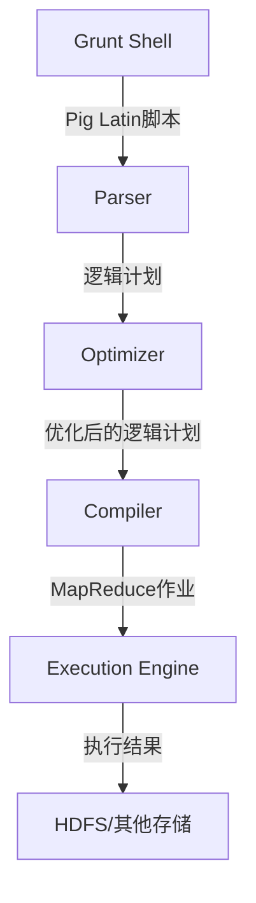
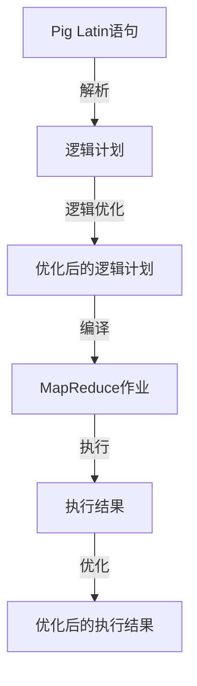

# Pig原理与代码实例讲解

## 1.背景介绍

在大数据时代,数据处理和分析成为了一项关键的任务。Apache Pig是一种用于并行计算的高级数据流语言和执行框架,旨在提供一种简单且富有成效的方式来分析大数据集。Pig最初是为了解决Yahoo!内部的数据分析问题而开发的,后来被Apache软件基金会收编并开源。

Pig的主要目标是允许研究人员专注于分析问题本身,而不是编写复杂的MapReduce程序。它提供了一种称为Pig Latin的高级语言,用于表达数据分析程序,并将其转换为一系列MapReduce作业。这种抽象使得数据分析工作变得更加容易,并且可以提高程序员的生产力。

Pig可以处理各种各样的数据源,包括结构化数据(如关系数据库)和半结构化数据(如日志文件)。它还支持多种存储系统,如Hadoop分布式文件系统(HDFS)、Amazon S3等。Pig的灵活性使其成为处理大数据的强大工具。

## 2.核心概念与联系

### 2.1 Pig Latin

Pig Latin是Pig的核心,它是一种用于表达数据分析程序的过程化语言。Pig Latin程序由一系列语句组成,这些语句对数据进行操作,如加载、过滤、连接、分组和转换。

Pig Latin语句的基本形式如下:

```
alias = operator(arguments)
```

其中,`alias`是操作结果的别名,`operator`是要执行的操作,`arguments`是操作的输入。

例如,以下语句从HDFS中加载一个文件:

```pig
records = LOAD 'data.txt' USING PigStorage(',') AS (id:int, name:chararray, age:int);
```

这条语句将文件`data.txt`加载到一个别名为`records`的关系中,并使用逗号作为字段分隔符。每个元组包含三个字段:`id`(整数)、`name`(字符串)和`age`(整数)。

### 2.2 Pig运行架构

Pig运行架构由以下几个主要组件组成:

- **Grunt Shell**: 一个交互式的命令行界面,用于执行Pig Latin脚本。
- **Parser**: 将Pig Latin语句解析为一个逻辑计划。
- **Optimizer**: 优化逻辑计划,以提高执行效率。
- **Compiler**: 将优化后的逻辑计划编译为一系列MapReduce作业。
- **Execution Engine**: 在Hadoop集群上执行MapReduce作业。

下图展示了Pig的运行架构:



## 3.核心算法原理具体操作步骤

Pig的核心算法原理是将Pig Latin语句转换为一系列MapReduce作业,并在Hadoop集群上执行这些作业。这个过程包括以下几个步骤:

1. **解析(Parsing)**: Pig Latin解析器将Pig Latin语句转换为一个逻辑计划,表示为一系列逻辑运算符。

2. **逻辑优化(Logical Optimization)**: 逻辑优化器对逻辑计划进行优化,以提高执行效率。优化包括投影剪枝(projection pruning)、过滤器推送(filter pushdown)、合并连接(join coalescing)等。

3. **编译(Compilation)**: 编译器将优化后的逻辑计划转换为一个或多个MapReduce作业。每个逻辑运算符都被映射到一个或多个MapReduce任务。

4. **执行(Execution)**: MapReduce作业在Hadoop集群上执行。每个作业由多个Map任务和Reduce任务组成,这些任务在集群中的不同节点上并行执行。

5. **优化(Optimization)**: 在执行过程中,Pig还会进行一些运行时优化,如合并小文件、压缩中间数据等。

下图展示了Pig将Pig Latin语句转换为MapReduce作业的过程:



## 4.数学模型和公式详细讲解举例说明

在Pig中,一些常见的数据处理操作可以用数学模型和公式来表示。以下是一些示例:

### 4.1 连接(Join)

连接操作用于将两个或多个关系合并为一个新的关系。在Pig中,连接操作可以使用以下公式表示:

$$
R \bowtie S = \{t_R \cup t_S | t_R \in R, t_S \in S, t_R[X] = t_S[Y]\}
$$

其中:

- $R$和$S$是要连接的两个关系
- $t_R$和$t_S$分别表示$R$和$S$中的元组
- $X$和$Y$是连接键,即用于匹配的字段
- $\bowtie$表示连接操作符

例如,假设有两个关系`students`和`grades`,分别存储学生信息和成绩信息。我们可以使用以下Pig Latin语句对它们进行内连接:

```pig
student_grades = JOIN students BY id, grades BY student_id;
```

这条语句将`students`和`grades`关系按照`id`和`student_id`字段进行内连接,生成一个新的关系`student_grades`。

### 4.2 分组(Group)

分组操作用于将一个关系中的元组按照某些字段值进行分组。在Pig中,分组操作可以使用以下公式表示:

$$
\gamma_{X}(R) = \{(x, \{t \in R | t[X] = x\}) | x \in \pi_X(R)\}
$$

其中:

- $R$是要分组的关系
- $X$是分组键,即用于分组的字段
- $\gamma$表示分组操作符
- $\pi_X(R)$表示关系$R$按照字段$X$的投影

例如,假设有一个关系`sales`存储销售记录,包含字段`product`、`quantity`和`price`。我们可以使用以下Pig Latin语句按照`product`字段进行分组:

```pig
grouped_sales = GROUP sales BY product;
```

这条语句将`sales`关系按照`product`字段进行分组,生成一个新的关系`grouped_sales`。每个组由一个`product`值和该产品的所有销售记录组成。

## 5.项目实践:代码实例和详细解释说明

在这一部分,我们将通过一个实际项目来演示如何使用Pig进行数据处理和分析。我们将使用一个包含用户评论数据的数据集,并执行以下任务:

1. 加载数据
2. 清理和转换数据
3. 计算每个产品的平均评分
4. 找出评分最高的产品

### 5.1 加载数据

首先,我们需要加载包含用户评论数据的文件。假设文件`reviews.txt`的格式如下:

```
product_id,user_id,review_text,rating
1,101,"Great product!",5
2,102,"Could be better",3
1,103,"I love it!",4
...
```

我们可以使用以下Pig Latin语句加载数据:

```pig
reviews = LOAD 'reviews.txt' USING PigStorage(',') AS (product_id:int, user_id:int, review_text:chararray, rating:int);
```

这条语句将`reviews.txt`文件加载到一个别名为`reviews`的关系中,并指定字段类型。

### 5.2 清理和转换数据

有时,原始数据可能包含一些无效或错误的记录。我们可以使用Pig Latin语句对数据进行清理和转换。例如,以下语句将删除评分为空或无效的记录:

```pig
valid_reviews = FILTER reviews BY rating IS NOT NULL AND rating >= 1 AND rating <= 5;
```

这条语句创建一个新的关系`valid_reviews`,只包含评分在1到5之间的有效记录。

### 5.3 计算每个产品的平均评分

要计算每个产品的平均评分,我们需要按照`product_id`字段进行分组,然后对每个组中的`rating`字段求平均值。以下是相应的Pig Latin语句:

```pig
grouped_reviews = GROUP valid_reviews BY product_id;
avg_ratings = FOREACH grouped_reviews GENERATE group AS product_id, AVG(valid_reviews.rating) AS avg_rating;
```

第一条语句按照`product_id`字段对`valid_reviews`关系进行分组,生成一个新的关系`grouped_reviews`。每个组由一个`product_id`值和该产品的所有评论记录组成。

第二条语句对每个组应用`AVG`函数,计算`rating`字段的平均值。`FOREACH ... GENERATE`语句创建一个新的关系`avg_ratings`,包含`product_id`和对应的`avg_rating`字段。

### 5.4 找出评分最高的产品

最后,我们可以使用`ORDER`语句按照`avg_rating`字段降序排列,并取前几条记录,以找出评分最高的产品:

```pig
top_products = ORDER avg_ratings BY avg_rating DESC;
top_3 = LIMIT top_products 3;
DUMP top_3;
```

第一条语句按照`avg_rating`字段降序排列`avg_ratings`关系,生成一个新的关系`top_products`。

第二条语句使用`LIMIT`操作符从`top_products`关系中取前3条记录,生成一个新的关系`top_3`。

最后一条语句将`top_3`关系的内容输出到控制台。

通过这个示例,我们演示了如何使用Pig Latin语句加载数据、清理和转换数据、执行聚合操作,以及输出结果。

## 6.实际应用场景

Pig被广泛应用于各种大数据处理和分析场景,包括但不限于:

1. **日志处理**: 从网站、应用程序和系统日志中提取有价值的信息,用于监控、故障排查和用户行为分析。

2. **数据集成**: 将来自不同源的数据集合并到一个统一的数据存储中,用于后续的分析和报告。

3. **数据转换**: 将原始数据转换为适合分析工具和算法处理的格式。

4. **机器学习和数据挖掘**: 作为数据预处理和特征工程的工具,为机器学习和数据挖掘算法准备数据。

5. **网络日志分析**: 分析网络流量日志,检测安全威胁和异常活动。

6. **推荐系统**: 处理用户行为数据,为用户推荐个性化的产品或内容。

7. **广告投放优化**: 分析用户数据和广告效果,优化广告投放策略。

8. **金融风险分析**: 处理金融交易数据,评估风险并检测欺诈行为。

9. **生物信息学**: 处理基因组数据,用于基因表达分析和疾病研究。

10. **社交网络分析**: 分析社交网络数据,发现用户关系和影响力模式。

Pig的简单性和可扩展性使其成为处理大数据的有力工具,在各个领域都有广泛的应用。

## 7.工具和资源推荐

在使用Pig进行大数据处理和分析时,以下工具和资源可能会很有用:

1. **Apache Pig官方网站**: https://pig.apache.org/
   - 包含Pig的文档、教程、示例和下载链接。

2. **Pig Book**: https://github.com/yadudoc/pig-book
   - 一本免费的在线书籍,全面介绍了Pig的概念和用法。

3. **Pig运行模式**:
   - **本地模式**: 适合于小规模数据处理和学习。
   - **MapReduce模式**: 在Hadoop集群上运行Pig作业,适合于大规模数据处理。
   - **Tez模式**: 使用Tez执行引擎,比MapReduce模式更高效。

4. **Pig UDF**: 用户可以编写自定义函数(UDF)来扩展Pig的功能。

5. **Pig与Hive集成**: Pig可以与Hive集成,利用Hive的元数据和优化功能。

6. **Pig与Spark集成**: 通过Pig on Spark,可以在Spark上运行Pig作业。

7. **Pig与Python集成**: 使用Python UDF,可以在Pig中使用Python代码。

8. **Pig与R集成**: 使用R UDF,可以在Pig中使用R代码进行统计分析。

9. **Pig IDE**: 如Pig Eclipse Plugin、Pig Desktop等,提供代码编辑、调试和可视化功能