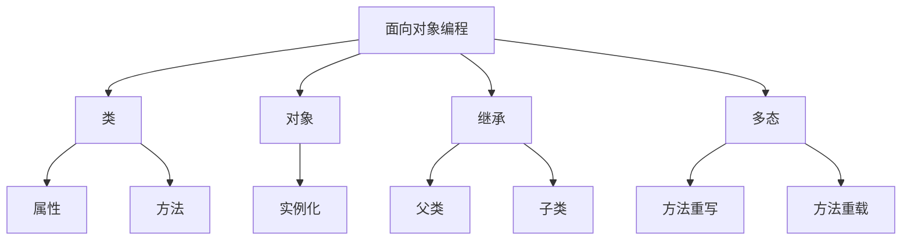

# Python面向对象编程(OOP)详解与实践

## 1.背景介绍

面向对象编程(Object-Oriented Programming, OOP)是一种编程范式,它将数据和操作数据的函数组合在一起,形成一个对象(Object)。OOP的核心思想是将复杂问题分解为多个对象,每个对象包含自己的数据和行为。通过对象之间的交互和协作,可以更好地模拟现实世界,提高代码的可重用性、可维护性和可扩展性。

Python作为一种多范式编程语言,全面支持面向对象编程。Python中的一切都是对象,它提供了许多面向对象的特性,如类(Class)、对象(Object)、继承(Inheritance)、多态(Polymorphism)等,使得开发人员能够更好地组织和管理代码。

## 2.核心概念与联系

### 2.1 类(Class)

类是创建对象的蓝图或模板。它定义了对象的属性(数据)和方法(行为)。在Python中,使用`class`关键字定义一个类,类名遵循大驼峰命名法。

```python
class Person:
    def __init__(self, name, age):
        self.name = name
        self.age = age

    def greet(self):
        print(f"Hello, my name is {self.name}")
```

### 2.2 对象(Object)

对象是类的实例化,通过类可以创建多个对象。每个对象都有自己的属性值,并可以调用类中定义的方法。

```python
person1 = Person("Alice", 25)
person2 = Person("Bob", 30)

person1.greet()  # Output: Hello, my name is Alice
person2.greet()  # Output: Hello, my name is Bob
```

### 2.3 继承(Inheritance)

继承允许一个类(子类)继承另一个类(父类)的属性和方法,实现代码的重用。子类可以添加新的属性和方法,也可以覆盖父类的方法。

```python
class Student(Person):
    def __init__(self, name, age, grade):
        super().__init__(name, age)
        self.grade = grade

    def study(self):
        print(f"{self.name} is studying")
```

### 2.4 多态(Polymorphism)

多态允许同一操作作用于不同类型的对象上,产生不同的行为和结果。Python通过方法重写和重载实现多态。

```python
class Dog:
    def speak(self):
        print("Woof!")

class Cat:
    def speak(self):
        print("Meow!")

def make_sound(animal):
    animal.speak()

dog = Dog()
cat = Cat()

make_sound(dog)   # Output: Woof!
make_sound(cat)   # Output: Meow!
```

### 2.5 核心概念关系图



## 3.核心算法原理具体操作步骤

Python中的面向对象编程涉及以下几个关键步骤:

1. **定义类(Class)**

使用`class`关键字定义一个类,类名遵循大驼峰命名法。在类中,可以定义属性(数据)和方法(行为)。

```python
class ClassName:
    # 属性
    attribute1 = value1
    attribute2 = value2

    # 构造函数
    def __init__(self, arg1, arg2):
        self.arg1 = arg1
        self.arg2 = arg2

    # 方法
    def method1(self, arg):
        # 方法体
        pass

    def method2(self):
        # 方法体
        pass
```

2. **创建对象(Object)**

使用类名并传递必要的参数来创建对象。

```python
obj = ClassName(arg1_value, arg2_value)
```

3. **访问属性和调用方法**

通过对象可以访问类中定义的属性和方法。

```python
# 访问属性
print(obj.attribute1)

# 调用方法
obj.method1(arg_value)
```

4. **继承(Inheritance)**

定义一个子类,并在子类定义中指定要继承的父类。子类可以访问父类的属性和方法,也可以添加新的属性和方法或覆盖父类的方法。

```python
class SubClassName(ParentClassName):
    # 子类属性和方法

    # 覆盖父类方法
    def method1(self, arg):
        # 方法体
        pass
```

5. **多态(Polymorphism)**

通过方法重写和重载实现多态。子类可以重写父类的方法,也可以定义与父类同名但参数不同的方法(重载)。

```python
# 方法重写
class SubClassName(ParentClassName):
    def method1(self, arg):
        # 方法体
        pass

# 方法重载
class ClassName:
    def method1(self, arg1):
        # 方法体
        pass

    def method1(self, arg1, arg2):
        # 方法体
        pass
```

## 4.数学模型和公式详细讲解举例说明

在面向对象编程中,数学模型和公式通常用于描述和分析对象之间的关系和行为。以下是一些常见的数学模型和公式:

### 4.1 关联关系

关联关系描述了对象之间的结构关系,包括组合(Composition)和聚合(Aggregation)。

**组合关系**可以用以下公式表示:

$$
\text{Whole} = \sum_{i=1}^{n} \text{Part}_i
$$

其中,`Whole`表示整体对象,`Part_i`表示第`i`个组成部分对象。组合关系强调整体对象对部分对象的完全所有权,部分对象的生命周期由整体对象决定。

**聚合关系**可以用以下公式表示:

$$
\text{Whole} \supset \{\ \text{Part}_1, \text{Part}_2, \ldots, \text{Part}_n\ \}
$$

聚合关系强调整体对象对部分对象的引用关系,而不是所有权关系。部分对象可以独立于整体对象存在。

例如,一个`Car`类可以与`Engine`类和`Wheel`类组合,而与`Driver`类聚合。

### 4.2 继承关系

继承关系描述了类与类之间的层次结构。可以使用集合论中的子集关系来表示:

$$
\text{SubClass} \subseteq \text{SuperClass}
$$

其中,`SubClass`表示子类,`SuperClass`表示父类或超类。子类继承了父类的所有属性和方法,同时可以添加新的属性和方法或覆盖父类的方法。

例如,`Student`类可以继承`Person`类,并添加新的属性和方法,如`grade`和`study()`方法。

### 4.3 多态

多态描述了同一操作作用于不同类型对象时的不同行为。可以使用函数符号来表示:

$$
f(x) = \begin{cases}
    f_1(x), & \text{if } x \in \text{Class1}\\
    f_2(x), & \text{if } x \in \text{Class2}\\
    \vdots & \vdots\\
    f_n(x), & \text{if } x \in \text{ClassN}
\end{cases}
$$

其中,`f(x)`表示同一个操作或方法,`f_i(x)`表示针对`Class_i`类型对象的具体实现。通过方法重写和重载,可以实现多态性。

例如,`speak()`方法可以在`Dog`类和`Cat`类中分别实现不同的行为,分别输出"Woof!"和"Meow!"。

## 5.项目实践:代码实例和详细解释说明

为了更好地理解Python面向对象编程的概念和实践,我们将通过一个简单的银行账户管理系统示例来演示。

### 5.1 定义账户类

首先,我们定义一个`BankAccount`类,表示银行账户。它包含账户持有人的姓名、账号、余额等属性,以及存款、取款和查询余额等方法。

```python
class BankAccount:
    def __init__(self, name, account_number, balance=0):
        self.name = name
        self.account_number = account_number
        self.balance = balance

    def deposit(self, amount):
        self.balance += amount
        print(f"Deposited {amount} into account {self.account_number}. New balance: {self.balance}")

    def withdraw(self, amount):
        if self.balance >= amount:
            self.balance -= amount
            print(f"Withdrew {amount} from account {self.account_number}. New balance: {self.balance}")
        else:
            print(f"Insufficient balance in account {self.account_number}.")

    def check_balance(self):
        print(f"Balance of account {self.account_number}: {self.balance}")
```

在`__init__`方法中,我们初始化了账户持有人的姓名、账号和初始余额。`deposit`方法用于存款,将指定金额加到账户余额中。`withdraw`方法用于取款,如果账户余额足够,则从余额中扣除指定金额。`check_balance`方法用于查询当前账户余额。

### 5.2 创建账户对象并进行操作

接下来,我们创建几个`BankAccount`对象,并对它们进行存款、取款和查询余额的操作。

```python
# 创建账户对象
account1 = BankAccount("Alice", "1234567890", 1000)
account2 = BankAccount("Bob", "0987654321")

# 存款操作
account1.deposit(500)
account2.deposit(2000)

# 取款操作
account1.withdraw(1200)  # 余额不足
account2.withdraw(1500)

# 查询余额
account1.check_balance()
account2.check_balance()
```

输出结果:

```
Deposited 500 into account 1234567890. New balance: 1500
Deposited 2000 into account 0987654321. New balance: 2000
Insufficient balance in account 1234567890.
Withdrew 1500 from account 0987654321. New balance: 500
Balance of account 1234567890: 1500
Balance of account 0987654321: 500
```

### 5.3 继承和多态

为了展示继承和多态的概念,我们定义一个`SavingsAccount`类,继承自`BankAccount`类,并添加一些新的属性和方法。

```python
class SavingsAccount(BankAccount):
    def __init__(self, name, account_number, balance=0, interest_rate=0.02):
        super().__init__(name, account_number, balance)
        self.interest_rate = interest_rate

    def calculate_interest(self):
        interest = self.balance * self.interest_rate
        self.deposit(interest)
        print(f"Interest of {interest} added to account {self.account_number}.")

    def withdraw(self, amount):
        if amount > self.balance:
            print(f"Withdrawal amount {amount} exceeds balance {self.balance}. Withdrawal failed.")
        else:
            super().withdraw(amount)
```

`SavingsAccount`类继承自`BankAccount`类,并添加了一个`interest_rate`属性和两个新方法:`calculate_interest`和重写的`withdraw`方法。`calculate_interest`方法计算利息并将其存入账户。重写的`withdraw`方法在取款金额超过余额时不允许取款操作。

现在,我们创建一个`SavingsAccount`对象,并演示多态行为。

```python
# 创建储蓄账户对象
savings_account = SavingsAccount("Charlie", "5555555555", 5000, 0.03)

# 存款和取款操作
savings_account.deposit(1000)
savings_account.withdraw(3000)
savings_account.withdraw(4000)  # 取款金额超过余额

# 计算利息
savings_account.calculate_interest()

# 查询余额
savings_account.check_balance()
```

输出结果:

```
Deposited 1000 into account 5555555555. New balance: 6000
Withdrew 3000 from account 5555555555. New balance: 3000
Withdrawal amount 4000 exceeds balance 3000. Withdrawal failed.
Interest of 90.0 added to account 5555555555.
Balance of account 5555555555: 3090.0
```

在这个示例中,我们可以看到`SavingsAccount`对象继承了`BankAccount`类的属性和方法,同时添加了新的功能,如计算利息。同时,`withdraw`方法在`SavingsAccount`类中被重写,以实现不同的行为。这展示了继承和多态的概念在实践中的应用。

## 6.实际应用场景

面向对象编程在各种领域都有广泛的应用,以下是一些常见的应用场景:

1. **图形用户界面(GUI)程序**:GUI程序通常由多个对象组成,如窗口、按钮、菜单等。每个对象都有自己的属性和行为,通过对象之间的交互实现复杂的界面功能。

2. **游戏开发**:游戏中的角色、敌人、道具等都可以抽象为对象,每个对象都有自己的属性和行为。通过对象之间的交互,实现游戏的逻辑和规则。

3. **Web开发**:Web应用程序中的用户、会话、