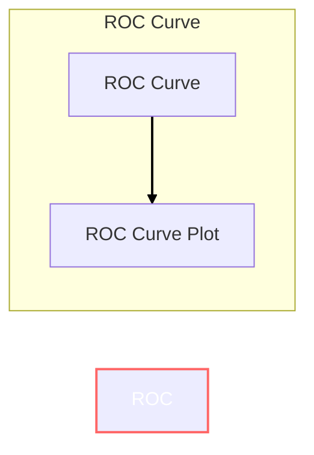

# ROC Curve 原理与代码实战案例讲解

## 1.背景介绍

在机器学习和数据挖掘领域中,评估模型的性能是一个关键环节。ROC(Receiver Operating Characteristic)曲线是衡量二分类模型性能的重要工具之一。它通过绘制真阳性率(TPR)和假阳性率(FPR)的关系曲线,直观地展示了模型在不同阈值下的分类效果。ROC曲线能够全面评估模型的优劣,是监督学习中广泛使用的评估指标。

## 2.核心概念与联系

### 2.1 二分类问题

在二分类问题中,我们需要将样本划分为正例(Positive)和负例(Negative)两类。例如,在垃圾邮件检测中,正例表示垃圾邮件,负例表示非垃圾邮件。

### 2.2 混淆矩阵

混淆矩阵(Confusion Matrix)是评估分类模型性能的基础工具。它记录了模型在测试集上的预测结果,包括以下四个指标:

- TP(真阳性,True Positive):将正例正确预测为正例
- FN(假阴性,False Negative):将正例错误预测为负例
- FP(假阳性,False Positive):将负例错误预测为正例
- TN(真阴性,True Negative):将负例正确预测为负例

```
          Actual
         Positive Negative
Predicted +-----------------+
Positive  |    TP   |   FP  |
          +-----------------+
Negative  |    FN   |   TN  |
          +-----------------+
```

### 2.3 ROC曲线

ROC曲线是基于混淆矩阵中的TP、FP、TN和FN构建的。它的横轴表示FPR(假阳性率),纵轴表示TPR(真阳性率)。

$$TPR = \frac{TP}{TP + FN}$$
$$FPR = \frac{FP}{FP + TN}$$

理想情况下,我们希望TPR=1且FPR=0,即将所有正例正确分类且没有误报。但在实际情况中,TPR和FPR是一对矛盾的指标,提高TPR通常会导致FPR升高,降低FPR则会使TPR下降。ROC曲线能够清晰地展示TPR和FPR之间的这种权衡关系。

### 2.4 AUC(Area Under Curve)

ROC曲线下的面积被称为AUC,是衡量分类模型性能的重要指标。AUC的取值范围在0到1之间,值越大表示模型性能越好。AUC=1表示模型是完美分类器,AUC=0.5表示模型的分类效果等同于随机猜测。

## 3.核心算法原理具体操作步骤

构建ROC曲线的核心步骤如下:

1. 对测试集进行预测,获取每个样本的预测概率值
2. 设置阈值的区间,如[0,1]
3. 对于每个阈值:
    - 计算TP、FP、TN、FN
    - 计算TPR和FPR
    - 将(FPR,TPR)作为一个点绘制在ROC空间
4. 将所有点连接起来即得到ROC曲线
5. 计算ROC曲线下的面积即为AUC值

下面用伪代码描述ROC曲线的构建过程:

```python
def roc_curve(y_true, y_score):
    thresholds = np.linspace(0, 1, 101)  # 设置阈值区间
    tprs, fprs = [], []
    
    for threshold in thresholds:
        y_pred = y_score >= threshold  # 根据阈值对样本进行二分类
        tn, fp, fn, tp = confusion_matrix(y_true, y_pred).ravel()
        tpr = tp / (tp + fn)  # 计算真阳性率
        fpr = fp / (fp + tn)  # 计算假阳性率
        tprs.append(tpr)
        fprs.append(fpr)
        
    auc_score = auc(fprs, tprs)  # 计算AUC
    return fprs, tprs, auc_score
```

## 4.数学模型和公式详细讲解举例说明

ROC曲线的数学模型可以用下面的公式表示:

$$TPR = P(X > t | Y = 1)$$
$$FPR = P(X > t | Y = 0)$$

其中:
- $X$表示模型输出的分数或概率
- $Y$表示真实标签(0或1)
- $t$表示阈值

当$t$从$-\infty$增加到$+\infty$时,TPR和FPR的值会从0变化到1,ROC曲线就是TPR对FPR的参数曲线。

我们可以用一个例子来更好地理解ROC曲线。假设有以下10个样本的预测概率和真实标签:

```
+---------------+---------------+
| Predicted Pro| True Label    |
+---------------+---------------+
|     0.9       |      1        |
|     0.8       |      1        |  
|     0.7       |      0        |
|     0.6       |      1        |
|     0.55      |      0        |
|     0.54      |      1        |
|     0.53      |      0        |
|     0.52      |      0        |
|     0.51      |      1        |
|     0.4       |      0        |
+---------------+---------------+
```

如果我们设置阈值为0.6,那么:

- TP = 3 (0.9, 0.8, 0.6)
- FN = 2 (0.54, 0.51)
- FP = 2 (0.7, 0.55)  
- TN = 3 (0.53, 0.52, 0.4)

则:

$$TPR = \frac{3}{3+2} = 0.6$$
$$FPR = \frac{2}{2+3} = 0.4$$

所以在ROC空间中,点(0.4, 0.6)就是对应阈值0.6的ROC点。通过改变阈值,我们可以获得更多的ROC点,并将它们连接起来形成ROC曲线。

## 5.项目实践:代码实例和详细解释说明

下面是使用Python中的scikit-learn库构建ROC曲线的代码示例:

```python
from sklearn.datasets import make_blobs
from sklearn.linear_model import LogisticRegression
from sklearn.metrics import roc_curve, auc
import matplotlib.pyplot as plt

# 生成模拟二分类数据
X, y = make_blobs(n_samples=1000, centers=2, n_features=2, random_state=1)

# 训练Logistic回归模型
model = LogisticRegression()
model.fit(X, y)

# 对测试集进行预测,获取预测概率
y_score = model.predict_proba(X)[:, 1]

# 计算ROC曲线和AUC
fpr, tpr, thresholds = roc_curve(y, y_score)
roc_auc = auc(fpr, tpr)

# 绘制ROC曲线
plt.figure()
lw = 2
plt.plot(fpr, tpr, color='darkorange', lw=lw, label='ROC curve (area = %0.2f)' % roc_auc)
plt.plot([0, 1], [0, 1], color='navy', lw=lw, linestyle='--')
plt.xlim([0.0, 1.0])
plt.ylim([0.0, 1.05])
plt.xlabel('False Positive Rate')
plt.ylabel('True Positive Rate')
plt.title('Receiver Operating Characteristic')
plt.legend(loc="lower right")
plt.show()
```

代码解释:

1. 首先使用`make_blobs`函数生成模拟的二分类数据集`X`和标签`y`。
2. 使用Logistic回归模型对数据集进行训练。
3. 对测试集`X`进行预测,获取每个样本的预测概率`y_score`。
4. 使用`roc_curve`函数计算ROC曲线的FPR、TPR和阈值。
5. 使用`auc`函数计算ROC曲线下的面积AUC。
6. 使用Matplotlib绘制ROC曲线,其中蓝色虚线表示随机猜测的ROC曲线。

运行上述代码,我们可以得到如下ROC曲线图:



从图中可以看出,模型的ROC曲线(橙色线)比随机猜测(蓝色虚线)的效果要好,AUC值为0.98,接近于1,表明模型的分类性能较好。

## 6.实际应用场景

ROC曲线和AUC指标在以下场景中有着广泛的应用:

- **信用卡欺诈检测**: 将欺诈交易识别为正例,非欺诈交易识别为负例,ROC曲线可以评估模型在不同阈值下的检测效果。
- **垃圾邮件过滤**: 将垃圾邮件识别为正例,非垃圾邮件识别为负例,ROC曲线可以衡量过滤模型的性能。
- **医疗诊断**: 将患病样本识别为正例,健康样本识别为负例,ROC曲线可以评估诊断模型的敏感性和特异性。
- **入侵检测系统**: 将恶意入侵行为识别为正例,正常行为识别为负例,ROC曲线可以评估检测系统的性能。

在这些应用场景中,我们通常需要在TPR和FPR之间进行权衡。例如在信用卡欺诈检测中,我们希望TPR尽可能高(检测出更多欺诈交易),但同时也要控制FPR(减少误报率)。ROC曲线能够清晰地展示这种权衡关系,帮助我们选择合适的阈值。

## 7.工具和资源推荐

以下是一些常用的计算ROC曲线和AUC的工具和资源:

- **Python**:
    - Scikit-learn: `roc_curve`和`auc`函数
    - TensorFlow: `tf.keras.metrics.AUC`
    - PyTorch: `torchmetrics.AUC`
- **R**:
    - ROCR包: `prediction`和`performance`函数
    - pROC包: `roc`函数
- **MATLAB**:
    - `perfcurve`函数
- **在线工具**:
    - [ROC Curve Visualization](http://www.navan.name/roc/)
    - [ROCAlphaApp](http://rocalphaapp.com/)

此外,还有一些优秀的教程和文章值得一读:

- [An Introduction to ROC Curve](https://developers.google.com/machine-learning/crash-course/classification/roc-and-auc)
- [Understanding AUC - ROC Curve](https://towardsdatascience.com/understanding-auc-roc-curve-68b2303cc9c5)
- [Drawing ROC Curves in Python](https://www.dataquest.io/blog/roc-curves-and-auc-explained/)

## 8.总结:未来发展趋势与挑战

ROC曲线和AUC指标在机器学习和数据挖掘领域扮演着重要的角色,它们能够全面评估二分类模型的性能。然而,在实际应用中,我们也面临一些挑战:

1. **类别不平衡问题**: 在许多现实数据集中,正负例的比例差异很大,这会影响ROC曲线和AUC的计算结果。我们需要采取一些策略(如过采样、欠采样等)来处理类别不平衡问题。

2. **多分类问题**: ROC曲线最初是为二分类问题设计的,在多分类问题中,我们需要采用其他评估指标,如平均AUC或者基于混淆矩阵的其他指标。

3. **成本敏感问题**: 在某些应用场景中,我们需要考虑不同类型错误的代价。例如在医疗诊断中,漏诊的代价比误报高。在这种情况下,我们需要根据成本矩阵调整模型的阈值。

4. **可解释性**: 虽然ROC曲线能够评估模型的整体性能,但它无法解释模型内部的决策过程。随着可解释AI的发展,我们需要更多可解释的评估方法来分析模型的行为。

5. **新兴任务**: 随着机器学习应用的不断扩展,我们需要针对不同任务(如排序、异常检测等)设计新的评估指标。

总的来说,ROC曲线和AUC是非常有用的评估工具,但我们也需要根据具体问题的需求,持续探索和发展新的评估方法。

## 9.附录:常见问题与解答

1. **ROC曲线和准确率之间有什么关系?**

准确率(Accuracy)是模型预测正确的比例,它无法区分正例和负例的预测质量。相比之下,ROC曲线能够同时考虑TP、FP、TN和FN,更全面地