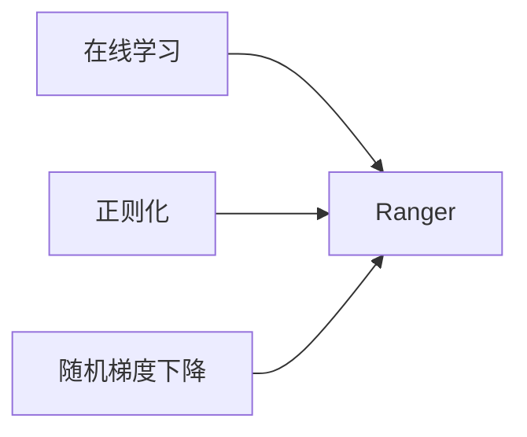
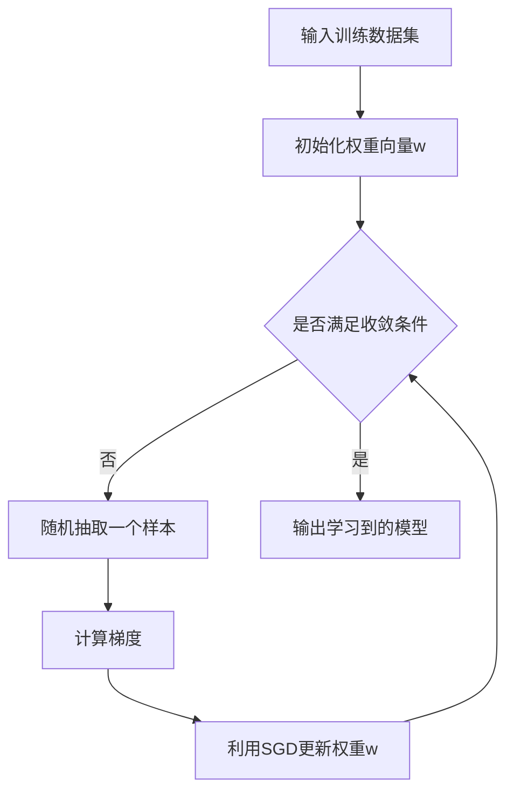

# Ranger原理与代码实例讲解

## 1.背景介绍
### 1.1 Ranger的起源与发展
Ranger最初由Facebook于2017年开源,旨在解决大规模推荐系统中的在线学习和特征选择问题。随后,Ranger在工业界和学术界得到了广泛应用和研究,成为推荐系统领域的重要算法之一。

### 1.2 Ranger的主要特点
Ranger的主要特点包括:
- 在线学习:可以实时处理海量的用户反馈数据,快速更新模型
- 特征选择:通过L1正则化自动筛选出重要特征,提高模型的泛化能力
- 分布式训练:支持参数服务器架构,可以方便地进行分布式训练
- 灵活性强:可以灵活选择不同的损失函数和正则项,适应不同的应用场景

### 1.3 Ranger的应用场景
Ranger主要应用于各类推荐系统中,例如:
- 电商平台的商品推荐
- 视频网站的视频推荐 
- 社交网络的好友推荐
- 广告系统的广告投放

## 2.核心概念与联系
### 2.1 在线学习
在线学习(Online Learning)是指模型可以实时处理样本数据,每接收到一个样本就即时更新模型参数。与离线学习相比,在线学习更适合处理海量动态数据。

### 2.2 正则化
正则化(Regularization)是机器学习中常用的降低过拟合风险的方法。通过在目标函数中引入正则项,可以限制模型参数的大小,从而提高模型的泛化能力。常见的正则化方法有L1正则化和L2正则化。

### 2.3 随机梯度下降
随机梯度下降(Stochastic Gradient Descent, SGD)是常用的优化算法,通过每次随机抽取小批量样本来更新模型参数。与批量梯度下降相比,SGD计算效率更高,更适合处理海量数据。

### 2.4 核心概念之间的联系
Ranger算法巧妙地结合了在线学习、正则化和随机梯度下降等技术,构建了一个高效实用的推荐算法框架:
- 利用在线学习快速处理海量用户反馈数据
- 通过L1正则化自动进行特征选择
- 使用随机梯度下降高效优化模型参数

下图展示了Ranger算法的核心概念之间的联系:



## 3.核心算法原理具体操作步骤
### 3.1 问题定义
考虑一个二分类问题,训练数据为$\{(x_i,y_i)\}_{i=1}^n$,其中$x_i \in \mathbb{R}^d$为d维特征向量,$y_i \in \{-1, +1\}$为对应的类别标签。我们希望学习一个线性分类器$f(x)=w^Tx$,使其能够最小化某个损失函数的经验风险。

### 3.2 Ranger的目标函数
Ranger采用logistic损失函数和L1正则化项,其目标函数为:

$$\min_w \sum_{i=1}^n \log(1+\exp(-y_iw^Tx_i)) + \lambda ||w||_1$$

其中$\lambda$为正则化系数。L1正则化项$||w||_1$可以使学习到的权重向量$w$是稀疏的,从而自动筛选出重要特征。

### 3.3 Online Learning过程
Ranger采用Online Learning的方式,每次随机抽取一个样本$(x_t,y_t)$,然后更新模型参数$w$。

1) 计算损失函数关于$w$的梯度:

$$g_t = -\frac{y_tx_t}{1+\exp(y_tw^Tx_t)} + \lambda \text{sgn}(w)$$

其中$\text{sgn}(w)$为$w$的符号函数。

2) 利用随机梯度下降更新$w$:

$$w \leftarrow w - \eta g_t$$

其中$\eta$为学习率。

3) 重复步骤1-2,直到满足收敛条件。

### 3.4 完整的Ranger算法流程



## 4.数学模型和公式详细讲解举例说明
### 4.1 Logistic损失函数
Logistic损失函数常用于二分类问题,其数学形式为:

$$L(z) = \log(1+\exp(-z))$$

其中$z=yw^Tx$,当类别标签$y$与模型预测值$w^Tx$的符号相同时,损失函数值较小;反之损失函数值较大。

举例说明:假设有一个正样本$(x,y=1)$,模型当前的预测值为$w^Tx=1$,则logistic损失为:

$$L = \log(1+\exp(-1*1)) = \log 2 \approx 0.693$$

可见,预测值与真实标签越接近,损失函数值越小。

### 4.2 L1正则化
L1正则化是指在目标函数中加入L1范数$||w||_1=\sum_{i=1}^d |w_i|$,其优点是可以使学习到的权重向量$w$是稀疏的,起到特征选择的作用。

举例说明:假设权重向量$w=(0.1,-0.2,0.05,0,0,0.8)$,则L1范数为:

$$||w||_1 = |0.1| + |-0.2| + |0.05| + |0| + |0| + |0.8| = 1.15$$

可见,L1范数是权重向量各个元素绝对值之和。加入L1正则化后,Ranger倾向于学习到稀疏的权重向量,很多元素被压缩为0,起到了特征选择的效果。

## 5.项目实践:代码实例和详细解释说明
下面给出Ranger算法的Python实现,并详细解释关键代码:

```python
import numpy as np

class Ranger:
    def __init__(self, lambda_=0.01, eta=0.01, max_iter=1000):
        self.lambda_ = lambda_  # 正则化系数
        self.eta = eta  # 学习率
        self.max_iter = max_iter  # 最大迭代次数
        self.w = None  # 权重向量
        
    def fit(self, X, y):
        """训练函数"""
        n_samples, n_features = X.shape
        self.w = np.zeros(n_features)  # 初始化权重向量为0
        
        for _ in range(self.max_iter):
            for i in range(n_samples):
                # 随机抽取一个样本
                x_i, y_i = X[i], y[i]
                
                # 计算梯度
                z_i = y_i * np.dot(self.w, x_i)
                grad = -y_i*x_i / (1 + np.exp(z_i)) + self.lambda_*np.sign(self.w)
                
                # 更新权重
                self.w -= self.eta * grad
    
    def predict(self, X):
        """预测函数"""
        return np.sign(np.dot(X, self.w))
        
# 测试代码
X = np.array([[1,2,3], [1,3,5], [2,4,2], [3,1,1], [4,2,2]])  
y = np.array([1, 1, -1, -1, 1])

model = Ranger()
model.fit(X, y)

print(model.w)  # 输出学习到的权重向量
print(model.predict(X))  # 输出预测结果
```

### 代码解释
1. `__init__`方法初始化了Ranger类,包括正则化系数`lambda_`、学习率`eta`、最大迭代次数`max_iter`等参数。
2. `fit`方法实现了Ranger的训练过程。首先初始化权重向量`w`为全0向量,然后进行`max_iter`次迭代。在每次迭代中,随机抽取一个样本,计算梯度,并利用SGD更新`w`。梯度计算公式即前面推导的结果。
3. `predict`方法实现了用学习到的模型进行预测。将测试样本与权重向量`w`点积,然后取符号函数,得到预测的类别标签。
4. 最后的测试代码展示了如何使用Ranger类。首先创建一个Ranger对象,然后用`fit`方法在训练集上学习模型参数,最后用`predict`方法在测试集上进行预测。

## 6.实际应用场景
Ranger算法在推荐系统领域有广泛的应用,下面列举几个具体场景:

### 6.1 电商平台的商品推荐
- 背景:电商平台希望根据用户的历史行为数据,向其推荐可能感兴趣的商品,提高用户的购买转化率。
- 应用:将用户特征(如人口统计学特征、历史购买记录等)和商品特征(如价格、类别等)输入到Ranger模型中,训练一个用户-商品匹配模型。当用户访问平台时,利用该模型实时预测用户对不同商品的兴趣度,选取Top-N推荐给用户。
- 优势:Ranger通过在线学习快速更新模型,使推荐结果与用户近期的兴趣变化保持同步;L1正则化自动筛选出重要的用户和商品特征,提高了推荐的准确性和泛化能力。

### 6.2 视频网站的视频推荐
- 背景:视频网站希望根据用户的观看历史和互动行为,向其推荐感兴趣的视频,延长用户在站内的停留时间。 
- 应用:将用户特征和视频特征输入Ranger模型,学习用户对不同视频的兴趣度评分。当用户请求推荐时,实时计算候选视频的兴趣度评分,返回Top-N作为推荐结果。
- 优势:Ranger每天处理海量的用户反馈数据,及时调整推荐策略;通过稀疏化选出的重要特征维度,降低了模型复杂度,加快了线上预测速度。

### 6.3 广告系统的广告投放
- 背景:广告系统希望将广告投放给最有可能产生点击或转化的用户,提升广告主的投资回报率。
- 应用:利用Ranger对用户点击/转化反馈数据进行在线学习,预测用户对不同广告的点击/转化率。当用户访问媒体网页时,实时检索该用户的特征,选取点击/转化率最高的广告展示。
- 优势:Ranger可以快速适应不同广告主的投放需求变化,对新上线的广告也能较好地进行效果预估;L1正则化使得最终投放策略依赖于少数重要特征,降低了过拟合风险。

## 7.工具和资源推荐
为了方便读者进一步学习和应用Ranger算法,这里推荐一些相关的工具和资源:

1. LibLinear工具包:LibLinear是台湾大学林智仁教授团队开发的一个大规模线性分类工具包,实现了带L1/L2正则化的Logistic回归等算法,在工业界广受欢迎。官网:https://www.csie.ntu.edu.tw/~cjlin/liblinear/

2. XGBoost工具包:XGBoost是华盛顿大学陈天奇博士开发的一个基于GBDT的分布式机器学习工具包,在Kaggle竞赛中大放异彩。XGBoost也支持带L1/L2正则化的线性模型。官网:https://xgboost.readthedocs.io/

3. Vowpal Wabbit工具包:Vowpal Wabbit是微软和雅虎联合开发的一个快速在线学习工具包,在搜索、推荐等领域得到了广泛应用。Vowpal Wabbit支持带L1正则化的在线学习。官网:https://vowpalwabbit.org/

4. 《Recommender Systems Handbook》:由Francesco Ricci等人编写的推荐系统领域经典手册,系统介绍了推荐系统的方方面面,是学习推荐算法的必读书目。

5. Kaggle比赛:Kaggle是一个著名的数据科学竞赛平台,提供了丰富的真实数据集和问题背景。通过参加Kaggle比赛,可以快速实践包括Ranger在内的各种机器学习算法。网址:https://www.kaggle.com/

## 8.总结:未来发展趋势与