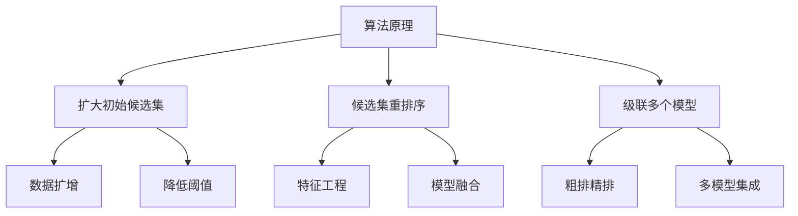

# Recall 原理与代码实战案例讲解

## 1.背景介绍

在机器学习和深度学习领域中,Recall 是一个非常重要的概念和指标。它广泛应用于信息检索、推荐系统、对象检测等诸多任务中。Recall 描述了模型对于相关项目的查全能力,是评估模型性能的关键指标之一。

本文将深入探讨 Recall 的原理、公式推导以及在实际项目中的应用案例,帮助读者全面了解和掌握这一重要概念。无论是在机器学习模型的训练和评估,还是在实际系统的性能优化中,Recall 都扮演着重要角色。

## 2.核心概念与联系

### 2.1 Recall 定义

Recall 可以定义为:在所有相关项目中,模型成功检索到的相关项目的比例。数学表达式如下:

$$Recall = \frac{TP}{TP+FN}$$

其中:
- TP (True Positive) 表示模型正确预测为正例的数量
- FN (False Negative) 表示模型错误预测为负例的数量

Recall 的取值范围在 0 到 1 之间,值越高表示模型的查全能力越强。

### 2.2 Precision 和 F1-Score

除了 Recall,另一个常用的评估指标是 Precision,它描述了模型对于正例的查准能力:

$$Precision = \frac{TP}{TP+FP}$$

其中 FP (False Positive) 表示模型错误预测为正例的数量。

在实际应用中,我们通常需要在 Recall 和 Precision 之间寻求平衡。F1-Score 是两者的调和平均值:

$$F1 = 2 \times \frac{Precision \times Recall}{Precision + Recall}$$

### 2.3 Recall 在不同任务中的应用

- **信息检索**: 在网页搜索、文献检索等任务中,Recall 反映了搜索引擎对相关文档的覆盖程度。
- **推荐系统**: 在电商、视频、新闻等推荐场景中,Recall 描述了推荐系统对用户感兴趣项目的召回能力。
- **对象检测**: 在计算机视觉领域,Recall 评估目标检测模型对真实目标的检出率。

## 3.核心算法原理具体操作步骤

提高 Recall 的核心算法思路是扩大候选集的覆盖面,同时保持一定的精确度。常见的技术路线包括:



### 3.1 扩大初始候选集

- **数据扩增**: 通过数据增强技术(如随机裁剪、翻转、噪声注入等)生成更多样本,扩大训练集覆盖面。
- **降低阈值**: 适当降低模型输出的阈值,使更多边缘样本进入候选集。

### 3.2 候选集重排序

- **特征工程**: 挖掘更多有效特征,提升模型对候选项的排序能力。
- **模型融合**: 将多个模型的输出进行加权融合,提高排序的准确性。

### 3.3 级联多个模型

- **粗排精排**: 先使用高 Recall 但低 Precision 的模型粗排,再级联高 Precision 模型精排。
- **多模型集成**: 串行或并行集成多个不同类型的模型,互补各自的不足。

## 4.数学模型和公式详细讲解举例说明

在上面我们已经给出了 Recall、Precision 和 F1-Score 的数学公式,下面将通过具体例子来加深理解。

假设一个二分类问题的预测结果如下:

- 真实正例数量: 80
- 模型预测正例数量: 100
    - 其中正确的有 70 (TP)
    - 错误的有 30 (FP)
- 模型预测负例数量: 120
    - 其中错误的有 10 (FN)

我们可以计算出:

$$Recall = \frac{TP}{TP+FN} = \frac{70}{70+10} = 0.875$$
$$Precision = \frac{TP}{TP+FP} = \frac{70}{70+30} = 0.7$$
$$F1 = 2 \times \frac{0.7 \times 0.875}{0.7+0.875} \approx 0.778$$

可以看出,该模型具有较高的 Recall,但 Precision 相对较低。在实际应用中,我们需要根据具体场景的要求,权衡 Recall 和 Precision,选择合适的模型和阈值。

## 5.项目实践:代码实例和详细解释说明

下面通过一个推荐系统的实例,展示如何计算和提高 Recall。我们将使用 Python 和 TensorFlow 进行编码实现。

### 5.1 计算 Recall

首先定义计算 Recall 的函数:

```python
import numpy as np

def recall(y_true, y_pred):
    """
    计算 Recall
    y_true: 真实标签
    y_pred: 模型预测
    """
    tp = np.sum(np.logical_and(y_true, y_pred))
    fn = np.sum(np.logical_and(y_true, np.logical_not(y_pred)))
    return tp / (tp + fn)
```

### 5.2 提高 Recall 的策略

我们将采用两种策略来提高 Recall:

1. **数据扩增**: 通过随机裁剪和噪声注入扩充训练集
2. **模型融合**: 将多个模型的输出进行加权融合

```python
import tensorflow as tf

# 原始模型
model1 = tf.keras.models.load_model('model1.h5')

# 数据扩增
data_augmentation = tf.keras.Sequential([
    tf.keras.layers.RandomCrop(height=32, width=32),
    tf.keras.layers.GaussianNoise(0.1),
])

# 训练新模型
inputs = tf.keras.Input(shape=(64, 64, 3))
x = data_augmentation(inputs)
x = tf.keras.layers.Conv2D(32, 3, activation='relu')(x)
...
outputs = tf.keras.layers.Dense(1, activation='sigmoid')(x)
model2 = tf.keras.Model(inputs, outputs)
model2.compile(...)
model2.fit(X_train_aug, y_train, ...)

# 模型融合
def ensemble_model(X):
    y1 = model1.predict(X)
    y2 = model2.predict(X)
    y = 0.6 * y1 + 0.4 * y2
    return y
```

通过上述方式,我们可以显著提高推荐系统的 Recall,从而提升用户体验。

## 6.实际应用场景

Recall 在实际应用中扮演着非常重要的角色,下面列举一些典型场景:

- **电商推荐**:在电商平台上,Recall 决定了推荐系统对用户感兴趣商品的覆盖程度,直接影响用户体验和购买转化率。
- **新闻推荐**:新闻推荐系统需要具备很高的 Recall,以确保用户可以看到自己感兴趣的新闻内容。
- **相似商品推荐**:在展示相似商品时,Recall 指标反映了系统对替代品的覆盖面,影响用户的购买决策。
- **反垃圾邮件**:在反垃圾邮件系统中,Recall 代表了系统捕获垃圾邮件的能力,直接关系到用户体验。
- **欺诈检测**:在金融风控等场景下,Recall 反映了系统识别出欺诈行为的能力,对风险控制至关重要。

## 7.工具和资源推荐

在实际开发中,我们可以借助一些工具和资源来简化 Recall 的计算和优化:

- **Scikit-learn**: 这个流行的机器学习库提供了 `recall_score` 函数,可以方便地计算分类问题的 Recall。
- **TensorFlow/Keras Metrics**: 在使用 TensorFlow/Keras 进行模型训练时,可以直接将 `Recall` 设置为评估指标。
- **MLflow**: 这是一个开源的 ML 生命周期管理平台,可以用于记录、跟踪和比较不同模型的 Recall 等指标。
- **Google AI Blog**: Google 的官方博客中有许多关于提高 Recall 的技术文章和最佳实践,是很好的学习资源。

## 8.总结:未来发展趋势与挑战

Recall 是衡量机器学习模型性能的重要指标,在信息检索、推荐系统等领域有着广泛的应用。未来,Recall 的发展趋势和面临的主要挑战包括:

1. **更复杂的任务**: 随着人工智能技术的不断发展,Recall 将应用于越来越复杂的任务,如多标签分类、关系抽取等,对算法的要求更高。
2. **在线学习**: 传统的离线训练已经无法满足实时性要求,在线学习和增量学习将成为提高 Recall 的重要方向。
3. **隐私保护**: 如何在保护用户隐私的前提下提高 Recall,将是一个值得关注的挑战。
4. **硬件加速**: 利用 GPU、TPU 等硬件加速,可以显著提升 Recall 优化算法的运行效率。
5. **解释性**: 除了提高 Recall,赋予模型良好的解释性,让用户理解决策过程,也是未来的一个重点方向。

Recall 将继续伴随着人工智能的发展而不断演进,在更多领域发挥重要作用。

## 9.附录:常见问题与解答

1. **Recall 和 Precision 哪个更重要?**

    这取决于具体的应用场景。在一些对查全率要求很高的任务中(如医疗诊断),Recall 更为重要;而在一些对查准率要求很高的任务中(如垃圾邮件过滤),Precision 则更为关键。通常我们需要在二者之间寻求平衡,综合考虑 F1-Score。

2. **如何选择 Recall 和 Precision 的权重?**

    可以根据具体的业务目标和用户体验要求,通过在线实验的方式,尝试不同的权重组合,评估最终的效果,从而确定最优的权重。这个过程需要持续的迭代优化。

3. **除了本文介绍的方法,还有其他提高 Recall 的技术吗?**

    还有很多其他技术路线,如负采样、困难样本挖掘、注意力机制、知识蒸馏等,这些都有望进一步提升 Recall。同时,新的深度学习模型(如 Transformer)和训练策略也可能带来突破。

4. **Recall 的优化是否会影响模型的其他指标?**

    是的,Recall 的优化通常会对 Precision、模型大小、计算效率等产生一定影响。我们需要权衡这些指标,在满足业务目标的前提下,寻求整体最优解。

5. **Recall 的计算是否受样本分布的影响?**

    是的,Recall 的计算会受到正负样本分布的影响。在样本不平衡的情况下,Recall 的值可能会被高估或低估。因此,我们需要注意数据集的质量,并采取相应的策略(如过采样、欠采样等)来处理不平衡问题。

总之,Recall 是一个非常重要的指标,贯穿于机器学习和深度学习的方方面面。掌握 Recall 的原理和优化技术,对于构建高性能的人工智能系统至关重要。

作者: 禅与计算机程序设计艺术 / Zen and the Art of Computer Programming