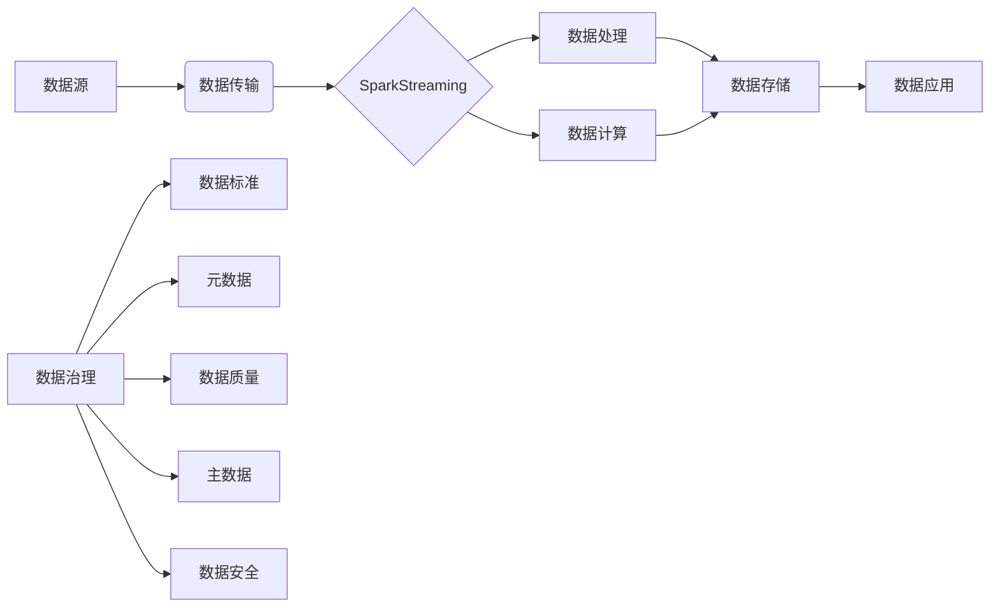

# SparkStreaming的数据治理与数据治理平台的跨界合作

## 1.背景介绍
### 1.1 大数据时代的数据治理挑战
在大数据时代,企业面临着海量、高速、多样化的数据,传统的数据治理方式已经难以应对。数据的质量、安全、隐私等问题日益突出,亟需建立全面、系统的数据治理体系。而流式计算作为大数据处理的重要方式之一,如何在流式数据处理过程中实现有效的数据治理,是一个值得深入探讨的课题。

### 1.2 SparkStreaming 的优势
SparkStreaming 作为 Apache Spark 生态系统中流式计算的核心组件,凭借其高吞吐、低延迟、容错性强等特点,在流式大数据处理领域占据重要地位。SparkStreaming 能够对多种数据源进行实时处理,并与 Spark 其他组件无缝集成,为流式数据治理提供了良好的基础。

### 1.3 数据治理平台的作用
数据治理平台是企业进行数据管理、质量控制、安全审计等数据治理工作的重要工具。一个成熟的数据治理平台,能够提供数据标准管理、元数据管理、数据质量管理、主数据管理等多方面功能,帮助企业构建可信的数据资产。

### 1.4 跨界合作的意义
SparkStreaming 作为流式计算框架,专注于数据处理和计算层面;而数据治理平台则聚焦数据管理和数据资产。二者在数据治理领域各有所长,通过跨界合作,可以实现优势互补,构建端到端的流式数据治理方案,为企业数字化转型提供有力支撑。

## 2.核心概念与联系
### 2.1 数据治理的核心概念
- 数据标准:定义数据采集、存储、交换等各环节的规范和标准,保障数据的一致性和可比性。
- 元数据管理:对数据的描述性信息进行管理,包括数据的业务含义、技术属性、质量标准等。
- 数据质量:评估和改进数据的完整性、准确性、及时性等特征,提高数据可信度。
- 主数据管理:对企业核心业务实体(如客户、产品等)的关键属性进行一致性维护。
- 数据安全与隐私:制定数据分级分类、访问控制、脱敏等策略,保护敏感数据。

### 2.2 SparkStreaming 的核心概念
- DStream(Discretized Stream):SparkStreaming 的基本抽象,代表持续性的数据流和经过各种 Spark 算子操作后的结果数据流。
- Receiver:用于接收各种数据源的实时数据流,并将数据推送给 Spark。
- 数据源:SparkStreaming 可接入包括 Kafka、Flume、Kinesis、TCP Socket等在内的多种数据源。
- 容错机制:SparkStreaming 基于 Spark 的 RDD 模型实现高效容错,具有记录数据来源、checkpoint 等容错能力。

### 2.3 数据治理与流式计算的关系

数据治理贯穿于流式计算的整个过程。在数据采集环节,需要依据数据标准规范数据格式;在数据处理和计算环节,需要进行数据质量校验、数据脱敏等;在数据存储环节,需要建立元数据、主数据等管理机制;在数据应用环节,需要对数据访问进行安全控制。

## 3.核心算法原理具体操作步骤
### 3.1 SparkStreaming 的工作原理
1. SparkStreaming 接收实时输入数据流,并将数据拆分为多个 batch。
2. 对每个 batch 的数据通过 Spark Engine 进行处理,形成 RDD。
3. 对 RDD 进行算子变换操作,如 map、filter、reduce 等。
4. 处理结果以 batch 的形式输出到外部系统。
5. 整个过程源源不断,形成连续的数据流处理。

### 3.2 数据治理的关键步骤
1. 制定数据标准:根据业务需求,定义数据元素、编码、格式等标准规范。
2. 构建元数据:采集数据资产的描述性信息,形成元数据仓库。
3. 进行数据质量管理:制定数据质量检查规则,评估和监控数据质量状况。
4. 建立主数据:识别业务实体,建立主数据模型,实现主数据同步和集成。
5. 实施数据安全策略:对敏感数据进行分级分类,制定隐私保护和脱敏规则。
6. 开展数据治理流程:将数据治理嵌入到数据生命周期各环节,形成持续改进机制。

## 4.数学模型和公式详细讲解举例说明
### 4.1 数据质量评估模型
数据质量可用多维度模型进行评估,常见的维度包括:
- 完整性:数据记录的完整程度,可用缺失值率 $Miss$ 衡量。
$$Miss = \frac{N_{miss}}{N} \times 100\%$$
其中 $N_{miss}$ 为缺失值的数量,$N$ 为总记录数。
- 准确性:数据与真实世界的符合程度,可用准确率 $Acc$ 衡量。
$$Acc = \frac{N_{acc}}{N} \times 100\%$$
其中 $N_{acc}$ 为准确值的数量,$N$ 为总记录数。
- 及时性:数据更新的及时程度,可用时效性 $Time$ 衡量。
$$Time = \frac{T_{update} - T_{real}}{T_{freq}} \times 100\%$$
其中 $T_{update}$ 为数据更新时间,$T_{real}$ 为真实世界变化时间,$T_{freq}$ 为更新频率。

例如,某系统每天更新一次数据,当前时间为 2023-06-03 10:00:00,最新数据时间为 2023-06-02 08:00:00,则时效性为:
$$Time = \frac{2023-06-02 08:00:00 - 2023-06-03 10:00:00}{1 day} \times 100\% = -160\%$$
说明该系统数据已经严重滞后。

### 4.2 数据安全风险评估模型
数据安全风险可用风险矩阵进行评估,通过数据安全事件的发生概率 $P$ 和影响程度 $I$ 来确定风险等级。

| 影响程度 | 发生概率 | 风险等级 |
| -------- | -------- | -------- |
| 高       | 高       | 极高     |
| 高       | 中       | 高       |
| 高       | 低       | 中       |
| 中       | 高       | 高       |
| 中       | 中       | 中       |
| 中       | 低       | 低       |
| 低       | 高       | 中       |
| 低       | 中       | 低       |
| 低       | 低       | 极低     |

例如,某系统存在数据泄露隐患,发生概率为中,影响程度为高,则风险等级为"高"。需要优先采取加密、脱敏等措施降低风险。

## 5.项目实践：代码实例和详细解释说明
下面以 Scala 语言为例,演示 SparkStreaming 如何与 Kafka 集成实现数据实时处理,并进行数据质量校验。

```scala
import org.apache.spark.SparkConf
import org.apache.spark.streaming.kafka010.ConsumerStrategies.Subscribe
import org.apache.spark.streaming.kafka010.LocationStrategies.PreferConsistent
import org.apache.spark.streaming.kafka010._
import org.apache.spark.streaming.{Seconds, StreamingContext}

object KafkaStreamingExample {
  def main(args: Array[String]): Unit = {
    // 创建 SparkConf 对象
    val sparkConf = new SparkConf().setAppName("KafkaStreamingExample").setMaster("local[2]")
    
    // 创建 StreamingContext 对象
    val ssc = new StreamingContext(sparkConf, Seconds(5))
    
    // Kafka 配置参数
    val kafkaParams = Map[String, Object](
      "bootstrap.servers" -> "localhost:9092",
      "key.deserializer" -> classOf[StringDeserializer],
      "value.deserializer" -> classOf[StringDeserializer],
      "group.id" -> "spark-streaming-group",
      "auto.offset.reset" -> "latest",
      "enable.auto.commit" -> (false: java.lang.Boolean)
    )
    
    // 订阅 Kafka Topic
    val topics = Array("spark-streaming-topic")
    val stream = KafkaUtils.createDirectStream[String, String](
      ssc,
      PreferConsistent,
      Subscribe[String, String](topics, kafkaParams)
    )
    
    // 对 Kafka 数据进行处理
    val lines = stream.map(record => record.value)
    val words = lines.flatMap(_.split(" "))
    val wordCounts = words.map(word => (word, 1)).reduceByKey(_ + _)
    
    // 数据质量校验
    val filteredLines = lines.filter(_.nonEmpty)
    val emptyLineCount = lines.count() - filteredLines.count()
    println(s"Empty line count: $emptyLineCount")
    
    // 打印处理结果
    wordCounts.print()
    
    // 启动 Streaming 程序
    ssc.start()
    ssc.awaitTermination()
  }
}
```

代码说明:
1. 首先创建 SparkConf 对象,设置应用名称和运行模式。
2. 创建 StreamingContext 对象,传入 SparkConf 和批处理时间间隔(这里设置为5秒)。
3. 配置 Kafka 参数,包括服务器地址、序列化方式、消费者组等。
4. 使用 KafkaUtils.createDirectStream 方法订阅 Kafka Topic,创建 DStream。
5. 对 DStream 进行 Transformation 操作,如 map、flatMap、reduceByKey 等,实现词频统计。
6. 进行数据质量校验,这里简单统计空行数量。可以根据需求添加更复杂的数据质量规则。
7. 打印处理结果。
8. 启动 Streaming 程序,并等待终止。

通过以上步骤,就可以实现从 Kafka 实时读取数据,并进行流式处理和数据质量监控。可以在此基础上集成数据治理平台的其他功能,如数据标准校验、元数据同步、数据脱敏等,形成完整的流式数据治理方案。

## 6.实际应用场景
SparkStreaming 与数据治理平台的跨界合作,可以应用于以下典型场景:

### 6.1 实时数仓
传统数仓使用 T+1 甚至 T+N 的方式进行数据处理和分析,难以满足实时业务需求。而借助 SparkStreaming,可以将源源不断的业务数据实时接入,经过清洗、转换、聚合等处理后,实时更新数仓模型。再通过数据治理平台对接入的数据进行标准化管理,确保数据口径一致,数据血缘清晰,为实时数仓提供高质量的数据。

### 6.2 风控反欺诈
金融行业对风险控制和反欺诈有很高的实时性要求。SparkStreaming 可以对交易数据、行为数据等进行实时特征工程,再使用机器学习算法进行实时预测和异常检测。数据治理平台则可以管理风控模型使用的各类数据资产,确保数据权限可控,对敏感数据进行脱敏处理,提升系统的安全性。

### 6.3 智慧运维
在工业互联网、物联网等领域,设备运行会产生海量的日志、监控等数据。SparkStreaming 可以对这些数据进行实时处理,进行故障诊断、异常报警等。通过数据治理平台,可以将设备主数据、监控指标元数据等集中管理,并将数据质量问题及时反馈,形成闭环。

### 6.4 个性化推荐
在电商、直播、资讯等场景,用户行为数据呈现爆发式增长。SparkStreaming 可以捕捉用户的实时行为,进行实时用户画像和个性化推荐。数据治理平台则对用户数据进行统一视图管理,对标签数据质量把关,并确保用户隐私得到有效保护。

## 7.工具和资源