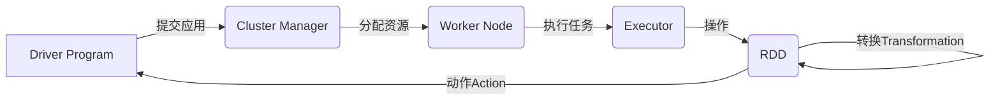

# Spark原理与代码实例讲解

## 1. 背景介绍
### 1.1 大数据处理的挑战
随着数据量的爆炸式增长,传统的数据处理方式已经无法满足实时性、海量数据处理等方面的需求。在这样的背景下,Apache Spark应运而生,成为了大数据处理领域炙手可热的明星项目。
### 1.2 Spark的诞生与发展
Spark最初由加州大学伯克利分校AMPLab开发,后被捐赠给Apache软件基金会,目前已成为Apache的顶级项目。Spark凭借其快速、通用、易用等特点,在众多大数据处理引擎中脱颖而出,被广泛应用于各行各业。
### 1.3 Spark生态系统概览
Spark不仅仅是一个单一的数据处理框架,而是一个庞大的生态系统,包括Spark Core、Spark SQL、Spark Streaming、MLlib、GraphX等组件,能够满足批处理、交互式查询、流处理、机器学习、图计算等多种场景的需求。

## 2. 核心概念与联系
### 2.1 RDD
RDD(Resilient Distributed Dataset)是Spark的核心概念和基础数据结构,它是一个分布式的、不可变的、可并行操作的数据集合。RDD支持两种操作:转换(Transformation)和动作(Action)。
### 2.2 DAG
Spark使用有向无环图(DAG)来表示RDD之间的依赖关系和转换操作。当执行一个Action操作时,Spark会根据DAG构建物理执行计划,并在集群上并行执行。
### 2.3 Spark运行架构
Spark采用主从(Master-Slave)架构,由Driver Program、Cluster Manager和Worker Node三部分组成。Driver Program负责任务的调度和管理,Cluster Manager负责资源的分配和管理,Worker Node负责具体任务的执行。
### 2.4 核心概念之间的联系
下图展示了Spark核心概念之间的联系:



## 3. 核心算法原理具体操作步骤
### 3.1 RDD的创建
RDD可以通过两种方式创建:并行化集合和引用外部存储系统中的数据集。
#### 3.1.1 并行化集合
```scala
val data = Array(1, 2, 3, 4, 5)
val rdd = sc.parallelize(data)
```
#### 3.1.2 引用外部存储系统
```scala
val rdd = sc.textFile("hdfs://path/to/file")
```
### 3.2 RDD的转换操作
常见的RDD转换操作包括map、filter、flatMap、groupByKey、reduceByKey等。
#### 3.2.1 map
```scala
val rdd = sc.parallelize(1 to 5)
val mappedRDD = rdd.map(_ * 2)
```
#### 3.2.2 filter
```scala
val rdd = sc.parallelize(1 to 5)
val filteredRDD = rdd.filter(_ % 2 == 0)
```
### 3.3 RDD的动作操作
常见的RDD动作操作包括reduce、collect、count、first、take等。
#### 3.3.1 reduce
```scala
val rdd = sc.parallelize(1 to 5)
val sum = rdd.reduce(_ + _)
```
#### 3.3.2 collect
```scala
val rdd = sc.parallelize(1 to 5)
val array = rdd.collect()
```

## 4. 数学模型和公式详细讲解举例说明
### 4.1 线性回归
Spark MLlib提供了线性回归算法,用于解决回归问题。给定一组训练样本 $\{(x_i, y_i)\}_{i=1}^n$,其中 $x_i \in \mathbb{R}^d$ 为特征向量, $y_i \in \mathbb{R}$ 为目标值,线性回归的目标是找到一个线性模型:

$$
h_{\theta}(x) = \theta^T x = \theta_0 + \theta_1 x_1 + \theta_2 x_2 + \cdots + \theta_d x_d
$$

使得预测值 $h_{\theta}(x_i)$ 与真实值 $y_i$ 之间的平方误差最小化:

$$
J(\theta) = \frac{1}{2n} \sum_{i=1}^n (h_{\theta}(x_i) - y_i)^2
$$

通过最小化损失函数 $J(\theta)$,可以求解出最优的模型参数 $\theta$。
### 4.2 K-均值聚类
K-均值聚类是一种常用的无监督学习算法,用于将数据集划分为 $K$ 个簇。给定一组数据点 $\{x_i\}_{i=1}^n$,其中 $x_i \in \mathbb{R}^d$,K-均值聚类的目标是找到 $K$ 个簇中心 $\{\mu_k\}_{k=1}^K$,使得每个数据点到其所属簇中心的距离平方和最小:

$$
J = \sum_{i=1}^n \sum_{k=1}^K w_{ik} \|x_i - \mu_k\|^2
$$

其中, $w_{ik} \in \{0, 1\}$ 表示数据点 $x_i$ 是否属于第 $k$ 个簇。K-均值聚类通过迭代优化的方式求解簇中心和数据点的簇分配,直到收敛。

## 5. 项目实践:代码实例和详细解释说明
### 5.1 词频统计
下面的代码示例演示了如何使用Spark RDD API进行文本文件的词频统计:

```scala
val textFile = sc.textFile("hdfs://path/to/file")
val counts = textFile
  .flatMap(line => line.split(" "))
  .map(word => (word, 1))
  .reduceByKey(_ + _)
counts.saveAsTextFile("hdfs://path/to/output")
```

代码解释:
1. 使用 `textFile` 方法读取文本文件,创建一个RDD。
2. 使用 `flatMap` 操作将每一行文本拆分成单词,生成一个新的RDD。
3. 使用 `map` 操作将每个单词映射为 (word, 1) 的形式。
4. 使用 `reduceByKey` 操作对相同的单词进行计数,得到每个单词的频率。
5. 使用 `saveAsTextFile` 方法将结果保存到HDFS。

### 5.2 PageRank算法
下面的代码示例演示了如何使用Spark GraphX API实现PageRank算法:

```scala
val links = sc.parallelize(Seq(
  (1L, 2L), (1L, 3L), (2L, 3L), (3L, 1L), (3L, 2L)
)).map { case (from, to) => Edge(from, to, 1.0) }

val vertices = sc.parallelize(Seq(
  (1L, "A"), (2L, "B"), (3L, "C")
)).map { case (id, name) => (id, (name, 1.0)) }

val graph = Graph(vertices, links)
val ranks = graph.pageRank(0.0001).vertices
ranks.collect().foreach(println)
```

代码解释:
1. 使用 `parallelize` 方法创建边和顶点的RDD。
2. 使用 `map` 操作将边和顶点转换为GraphX中的Edge和VertexRDD。
3. 使用 `Graph` 构造函数创建一个图。
4. 调用 `pageRank` 方法计算PageRank值,指定收敛阈值为0.0001。
5. 使用 `collect` 方法将结果收集到Driver Program,并打印输出。

## 6. 实际应用场景
### 6.1 推荐系统
Spark MLlib提供了协同过滤算法,可以用于构建推荐系统。通过分析用户的历史行为数据,可以发现用户的兴趣偏好,从而为用户推荐感兴趣的商品或内容。
### 6.2 欺诈检测
Spark可以用于构建实时欺诈检测系统。通过分析交易数据的模式和异常情况,可以实时识别出潜在的欺诈行为,及时采取措施防范风险。
### 6.3 社交网络分析
Spark GraphX可以用于分析社交网络数据,发现社区结构、影响力等特征。通过分析用户之间的交互和关系,可以洞察社交网络的结构和演化规律。

## 7. 工具和资源推荐
### 7.1 Spark官方文档
Spark官方文档(https://spark.apache.org/docs/)提供了全面的用户指南、API参考、示例代码等资源,是学习和使用Spark的权威参考。
### 7.2 Spark GitHub仓库
Spark的GitHub仓库(https://github.com/apache/spark)包含了Spark的源代码、示例项目、问题跟踪等资源,可以深入了解Spark的内部实现。
### 7.3 Spark社区
Spark社区(https://spark.apache.org/community.html)是Spark开发者和用户交流、学习、讨论的平台,可以在这里寻求帮助、分享经验、了解最新动态。

## 8. 总结:未来发展趋势与挑战
### 8.1 Spark的未来发展趋势
Spark将继续在大数据处理领域扮演重要角色,未来的发展趋势包括:
- 与云计算平台的深度集成,提供更灵活、弹性的数据处理服务。
- 支持更多的数据源和计算引擎,扩展Spark的应用范围。
- 优化Spark的性能和资源利用率,提高数据处理的效率。
- 增强机器学习和人工智能功能,助力数据驱动的智能应用。

### 8.2 Spark面临的挑战
尽管Spark已经取得了巨大的成功,但仍然面临一些挑战:
- 数据安全和隐私保护问题,需要提供更完善的数据安全机制。
- 复杂的调优和优化,需要专业的技能和经验来发挥Spark的最佳性能。
- 与其他大数据工具的集成和互操作,需要建立标准化的接口和协议。
- 应对数据规模和计算需求的持续增长,需要不断创新和演进Spark技术。

## 9. 附录:常见问题与解答
### 9.1 Spark和Hadoop的区别是什么?
Hadoop是一个分布式存储和计算框架,包括HDFS和MapReduce两个核心组件。Spark是一个基于内存的分布式计算引擎,提供了比MapReduce更高效、更灵活的数据处理模型。Spark可以与Hadoop集成,利用HDFS存储数据,但也支持其他数据源。
### 9.2 Spark的缓存机制是如何工作的?
Spark提供了多种缓存(持久化)策略,可以将RDD缓存在内存或磁盘上。当一个RDD被缓存时,其计算结果会被保留在集群的内存或磁盘中,供后续的操作重用,避免了重复计算。Spark会根据缓存策略和资源情况自动管理缓存的数据。
### 9.3 Spark如何实现容错?
Spark通过RDD的血统(Lineage)信息实现容错。每个RDD都记录了其父RDD和转换操作,当一个RDD的分区数据丢失或损坏时,Spark可以根据血统信息重新计算该分区,保证数据的完整性和一致性。Spark还支持检查点(Checkpoint)机制,将RDD的数据持久化到可靠的存储系统中,以避免长时间的血统重建。

作者:禅与计算机程序设计艺术 / Zen and the Art of Computer Programming