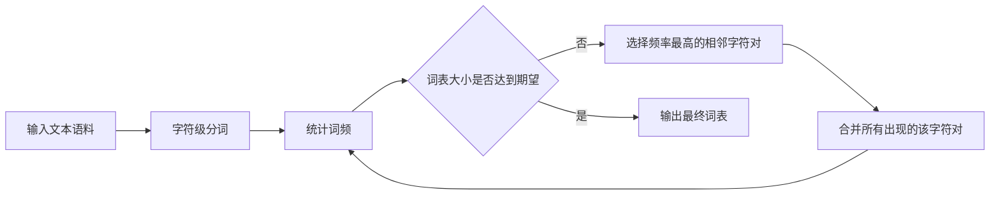

# Transformer大模型实战 使用字节级字节对编码作为子词词元化算法

## 1. 背景介绍

近年来,随着深度学习技术的飞速发展,自然语言处理(NLP)领域取得了突破性的进展。其中,Transformer模型[1]的提出是一个里程碑式的事件,它摆脱了传统的RNN和CNN等序列模型的限制,通过自注意力机制(Self-Attention)和前馈神经网络实现了并行计算,大大提高了模型的训练效率和性能。基于Transformer架构,各种大规模预训练语言模型如BERT[2]、GPT[3]、T5[4]等相继问世,在多个NLP任务上取得了SOTA的效果。

然而,训练这些大模型需要海量的文本语料,而人类语言中存在大量低频和未登录词(OOV),直接以词为单位进行建模会导致词表过大,增加模型参数规模和训练难度。因此,如何对文本进行有效的分词和词元化(Tokenization)处理,成为了训练大模型的关键问题之一。本文将重点介绍一种简单高效的子词词元化算法——字节级字节对编码(Byte Pair Encoding, BPE)[5],并基于PyTorch和HuggingFace Transformers库[6]展示如何将其应用于Transformer模型的训练实践中。

## 2. 核心概念与联系
### 2.1 子词(Subword)
子词是介于字符(Character)和词(Word)之间的一种文本表示单元。传统的基于词的表示方式存在OOV问题,而基于字符的表示虽然能够覆盖所有词汇,但会丢失词内部的结构信息。子词则是在这二者之间寻求一个平衡,通过将高频词保留为完整词元,低频词切分为更小粒度的词块,在有限的词表规模下最大限度地保留语义信息。常见的子词词元化算法有BPE、WordPiece[7]、Unigram Language Model[8]等。

### 2.2 字节对编码(BPE)
BPE最初是一种数据压缩算法,核心思想是迭代地合并频率最高的相邻字节对,直到达到期望的词表大小。Sennrich等人[5]首次将其引入到NLP领域,并做了一些改进:
1. 在字符级别而非字节级别执行合并操作
2. 在每次合并后保留原始的分隔符
3. 不对未登录词做特殊处理

这使得BPE能够有效地平衡词表规模和OOV率,并在机器翻译任务上取得了很好的效果。后来,GPT-2[9]等模型进一步将BPE扩展到了字节级别,使其能够处理任意Unicode字符。

### 2.3 Transformer架构
Transformer[1]是一种基于自注意力机制的Seq2Seq模型,抛弃了传统的RNN/CNN等序列模型,转而使用堆叠的Self-Attention和前馈网络。其编码器和解码器都由若干相同的Layer组成,每个Layer包含两个子层:
1. Multi-Head Self-Attention:
   - 将输入序列线性投影到多个不同的子空间
   - 在每个子空间独立地计算点积注意力权重
   - 将不同头的输出拼接并线性变换
2. Position-wise Feed-Forward Network:
   - 两层带ReLU激活的全连接前馈网络
   - 在序列的每个位置独立地应用

此外,Transformer还引入了位置编码(Positional Encoding)来捕捉序列的顺序信息,以及残差连接(Residual Connection)和层标准化(Layer Normalization)来加速训练收敛。

## 3. 核心算法原理与具体操作步骤
本节将详细介绍BPE算法的原理和实现步骤。以下是BPE的主要流程:


具体操作步骤如下:
1. 对输入语料进行字符级分词,得到初始词表。例如,"low"、"lower"、"newest"、"wider"分词后变为:
   ```
   l o w </w>
   l o w e r </w>
   n e w e s t </w>
   w i d e r </w>
   ```
2. 统计词表中每个连续字符对的出现频率。例如:
   ```  
   (l, o): 2
   (o, w): 2
   (w, </w>): 2
   (e, r): 2
   ...
   ```
3. 选择出现频率最高的字符对,将其合并成一个新的词元。例如,(l, o)和(o, w)出现频率最高,合并后得到:
   ```
   lo w </w>
   lo w e r </w>
   n e w e s t </w>
   w i d e r </w>  
   ```
4. 重复步骤2-3,直到达到期望的词表大小或最小频率阈值。例如,再合并(lo, w)后得到:
   ```
   low </w>
   low e r </w>
   n e w e s t </w>
   w i d e r </w>
   ```
5. 输出最终的BPE词表。

## 4. 数学模型和公式详细讲解举例说明
BPE可以看作是一个贪心的层次聚类过程,目标是最小化编码长度,即用尽可能少的词元来表示语料。具体地,令$V$表示字符集, $V^*$表示所有可能的字符序列(初始词表), $V_{\textrm{BPE}}$表示最终的BPE词表,则优化目标可以表示为:

$$\min_{V_{\textrm{BPE}} \subseteq V^*} \sum_{i=1}^{|D|} \textrm{len}(\textrm{BPE}(x_i))$$

其中$D$为输入语料,$x_i$为第$i$个句子,$\textrm{len}(\cdot)$为词元序列的长度,$\textrm{BPE}(\cdot)$为BPE分词函数。

在每一步迭代中,BPE选择出现频率最高的相邻词元对$(x,y)$进行合并:

$$(x, y) = \arg\max_{(x',y') \in V_{\textrm{BPE}}^2} \textrm{freq}(x',y')$$

其中$\textrm{freq}(\cdot)$为词元对在语料中的出现次数。合并后,词表更新为:

$$V_{\textrm{BPE}} \leftarrow (V_{\textrm{BPE}} \setminus \{x, y\}) \cup \{xy\}$$

直到$|V_{\textrm{BPE}}|$达到预设的词表大小$K$或最小词频阈值$\theta$。

举个例子,假设输入语料为:
```
low low low
lower lower
newest
wider wider
```

初始词表为:
```
V = {l, o, w, e, r, n, s, t, i, d}
V_BPE = {l, o, w, </w>, e, r, n, s, t, i, d}
```

第一轮迭代,统计相邻词元对频率:
```
(l, o): 5
(o, w): 4 
(w, </w>): 4
(e, r): 4
...
```

选择频率最高的(l, o)合并:
```
V_BPE = {lo, w, </w>, e, r, n, s, t, i, d}
```

第二轮迭代,重新统计频率:
```
(lo, w): 4
(w, </w>): 4
(e, r): 4
...  
```

选择(lo, w)合并:
```
V_BPE = {low, </w>, e, r, n, s, t, i, d}
```

如此迭代下去,直到达到期望的词表大小。最终得到的BPE词表可能如下:
```
V_BPE = {low, lower, newest, wider, ...}
```

## 5. 项目实践:代码实例和详细解释说明
下面我们使用PyTorch和HuggingFace Transformers库来实现基于BPE的Transformer模型训练。

首先,安装必要的依赖包:
```bash
pip install torch transformers datasets
```

然后,定义BPE分词器和Transformer模型:

```python
from transformers import AutoTokenizer, AutoModelForCausalLM

# 加载基于BPE的GPT-2分词器
tokenizer = AutoTokenizer.from_pretrained("gpt2")

# 加载预训练的GPT-2模型
model = AutoModelForCausalLM.from_pretrained("gpt2")
```

接着,准备训练数据集:

```python
from datasets import load_dataset

# 加载Wikitext-2数据集 
dataset = load_dataset("wikitext", "wikitext-2-raw-v1")

# 将文本编码为BPE词元序列
def encode(examples):
    return tokenizer(examples["text"])

dataset = dataset.map(encode, batched=True, remove_columns=["text"])
dataset.set_format("torch")
```

最后,定义训练参数并启动微调:

```python
from transformers import TrainingArguments, Trainer

# 定义训练参数
training_args = TrainingArguments(
    output_dir="output",
    per_device_train_batch_size=4,
    per_device_eval_batch_size=4,
    evaluation_strategy="steps",
    eval_steps=500,
    logging_steps=500,
    gradient_accumulation_steps=8,
    num_train_epochs=1,
    weight_decay=0.01,
    warmup_steps=1000,
    lr_scheduler_type="cosine",
    learning_rate=5e-4,
    save_steps=500,
    fp16=True,
)

# 定义Trainer 
trainer = Trainer(
    model=model,
    tokenizer=tokenizer,
    args=training_args,
    train_dataset=dataset["train"],
    eval_dataset=dataset["validation"],
)

# 开始训练
trainer.train()
```

以上代码的主要步骤为:
1. 加载预训练的基于BPE的GPT-2分词器和模型
2. 加载Wikitext-2文本数据集
3. 定义编码函数,将文本样本转换为BPE词元序列
4. 定义训练参数,包括batch size、学习率、优化器等
5. 定义Trainer,传入模型、分词器、参数、数据集等
6. 调用trainer.train()开始微调GPT-2

## 6. 实际应用场景
基于BPE的Transformer模型已经在各种NLP任务中得到了广泛应用,例如:
- 语言模型预训练:GPT系列[3,9]、BERT[2]、RoBERTa[10]等大规模语言模型都使用了BPE或其变体
- 机器翻译:Transformer首次在机器翻译任务上实现了BPE[1],后来的BART[11]、mBART[12]等也都沿用了这一方案
- 文本摘要:ProphetNet[13]、PEGASUS[14]等摘要模型使用BPE进行预训练和微调
- 对话生成:DialoGPT[15]、Meena[16]、BlenderBot[17]等对话模型同样基于BPE构建
- 其他任务:如命名实体识别[18]、语义解析[19]、文本分类[20]等,BPE也被证明是一种有效的文本表示方法

## 7. 工具和资源推荐
- HuggingFace Transformers[6]:最流行的Transformer模型库,提供了众多预训练模型和相应的分词器,支持PyTorch和TensorFlow
- FastBPE[21]:C++实现的高效BPE编码工具,HuggingFace Tokenizers库[22]基于此开发
- SentencePiece[23]:Google开源的多语言分词工具,支持BPE、Unigram等多种算法
- YouTokenToMe[24]:基于Python的通用分词工具包,支持BPE、WordPiece、Unigram等
- OpenNMT[25]:专注于神经机器翻译的工具包,最早集成了BPE算法
- Fairseq[26]:Facebook AI开源的Seq2Seq工具包,提供了多种数据预处理和模型训练的脚本

## 8. 总结:未来发展趋势与挑战
BPE作为一种简洁高效的子词分词算法,极大地推动了NLP领域的发展。展望未来,以下几个方向值得关注:
1. 更大规模的多语言预训练模型。目前像mT5[27]、XLM-R[28]这样支持100多种语言的模型已经出现,未来有望突破1000种语言。BPE在其中扮演着至关重要的角色。
2. 更长文本的生成任务。随着计算资源的增长,生成超长文本摘要、小说、剧本等任务开始受到关注。如何在BPE词表有限的情况下保证生成的连贯性和多样性,