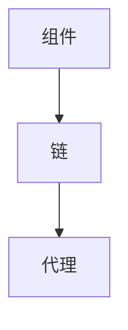

# 【LangChain编程：从入门到实践】管理工具安装

## 1.背景介绍
### 1.1 LangChain的兴起
在人工智能和自然语言处理领域，LangChain是一个新兴的开源框架，旨在简化和加速语言模型应用的开发。它提供了一套灵活的工具和组件，帮助开发者快速构建基于语言模型的应用，如聊天机器人、问答系统、文本生成等。

### 1.2 LangChain的优势
LangChain的优势在于其模块化设计和易用性。它将复杂的自然语言处理任务抽象为简单的组件，开发者可以通过组合这些组件来构建强大的应用。LangChain还提供了与各种语言模型的集成，包括OpenAI的GPT系列模型、Hugging Face的Transformers等，使得开发者可以轻松利用这些先进的语言模型。

### 1.3 LangChain的应用场景
LangChain适用于各种需要处理和生成自然语言的场景，如客户服务、内容生成、数据分析等。通过LangChain，开发者可以快速构建智能助手、文本摘要工具、知识问答系统等应用，提高生产力和用户体验。

## 2.核心概念与联系
### 2.1 组件(Components)
LangChain的核心概念之一是组件。组件是构建语言模型应用的基本单元，包括文本处理、特征提取、模型调用等功能。LangChain提供了丰富的预定义组件，同时也支持自定义组件，使得开发者可以灵活地组合和扩展功能。

### 2.2 链(Chains)
链是由多个组件按照特定顺序连接而成的处理流程。通过将组件组合成链，可以实现复杂的自然语言处理任务。LangChain提供了多种预定义的链，如问答链、摘要链等，同时也支持自定义链的创建。

### 2.3 代理(Agents)
代理是一种高级抽象，它将多个链组合在一起，形成一个智能的对话系统。代理可以根据用户的输入，动态选择合适的链来处理请求，并生成相应的响应。LangChain提供了灵活的代理构建工具，使得开发者可以快速创建智能对话系统。

### 2.4 Mermaid流程图
下面是LangChain核心概念之间的关系图，使用Mermaid流程图表示：



## 3.核心算法原理具体操作步骤
### 3.1 组件的创建和使用
1. 选择合适的组件类型，如文本处理组件、特征提取组件等。
2. 配置组件的参数，如模型路径、超参数等。
3. 实例化组件对象，并将其添加到管道中。
4. 调用组件的处理方法，传入输入数据，获取输出结果。

### 3.2 链的构建和执行
1. 选择需要使用的组件，并按照处理顺序将其连接成链。
2. 配置链的参数，如输入输出格式、中间结果处理等。
3. 实例化链对象，并将其添加到管道中。
4. 调用链的执行方法，传入输入数据，获取输出结果。

### 3.3 代理的创建和交互
1. 定义代理的任务和目标，如问答、对话等。
2. 选择合适的链作为代理的处理逻辑，并配置相关参数。
3. 实例化代理对象，并将其添加到管道中。
4. 调用代理的交互方法，传入用户输入，获取生成的响应。

## 4.数学模型和公式详细讲解举例说明
### 4.1 文本嵌入模型
文本嵌入是将文本转换为数值向量表示的过程。LangChain支持各种文本嵌入模型，如Word2Vec、GloVe等。这些模型基于词频统计和神经网络训练，将词映射到低维空间中。

例如，使用Word2Vec模型，可以将词表示为n维向量：

$v_w = (x_1, x_2, ..., x_n)$

其中，$v_w$表示词$w$的向量表示，$x_i$表示向量的第$i$个维度的值。

### 4.2 注意力机制
注意力机制是一种用于聚焦关键信息的技术，广泛应用于自然语言处理任务中。LangChain中的许多组件和模型都采用了注意力机制。

注意力分数的计算公式如下：

$a_i = \frac{exp(score(h_i, q))}{\sum_{j=1}^n exp(score(h_j, q))}$

其中，$a_i$表示第$i$个输入的注意力分数，$h_i$表示第$i$个输入的隐藏状态，$q$表示查询向量，$score$函数用于计算输入和查询之间的相关性。

## 5.项目实践：代码实例和详细解释说明
下面是一个使用LangChain构建问答系统的示例代码：

```python
from langchain.chains import RetrievalQA
from langchain.indexes import VectorstoreIndexCreator
from langchain.text_splitter import CharacterTextSplitter
from langchain.embeddings import OpenAIEmbeddings
from langchain.vectorstores import Chroma
from langchain.document_loaders import TextLoader

# 加载文本数据
loader = TextLoader("data.txt")
documents = loader.load()

# 将文本拆分为块
text_splitter = CharacterTextSplitter(chunk_size=1000, chunk_overlap=0)
texts = text_splitter.split_documents(documents)

# 创建嵌入和向量存储
embeddings = OpenAIEmbeddings()
vectorstore = Chroma.from_documents(texts, embeddings)

# 创建问答链
qa = RetrievalQA.from_chain_type(llm=OpenAI(), chain_type="stuff", retriever=vectorstore.as_retriever())

# 执行问答
query = "What is the capital of France?"
result = qa.run(query)
print(result)
```

代码解释：
1. 首先，我们加载文本数据，并使用`CharacterTextSplitter`将文本拆分为块。
2. 然后，我们创建嵌入和向量存储，使用`OpenAIEmbeddings`作为嵌入模型，`Chroma`作为向量存储。
3. 接下来，我们创建问答链，使用`RetrievalQA`类，指定使用OpenAI语言模型和`stuff`链类型，并将向量存储作为检索器。
4. 最后，我们执行问答，传入查询问题，获取答案结果并打印输出。

这个示例展示了如何使用LangChain快速构建一个基于文本检索的问答系统。通过组合不同的组件和链，可以实现更复杂的功能。

## 6.实际应用场景
### 6.1 客户服务聊天机器人
LangChain可以用于构建智能客户服务聊天机器人。通过训练语言模型并结合知识库，聊天机器人可以理解用户的问题，并给出相关的答复。LangChain提供了灵活的工具来处理用户输入、检索知识库、生成回复等任务，使得开发者可以快速构建功能强大的聊天机器人。

### 6.2 文本摘要生成
LangChain可以应用于文本摘要生成任务。通过使用文本处理组件和摘要生成模型，可以自动提取文本的关键信息，生成简洁的摘要。这在处理大量文本数据时非常有用，如新闻文章、研究报告等。LangChain提供了各种文本处理和摘要生成的组件，使得开发者可以轻松实现文本摘要功能。

### 6.3 知识问答系统
LangChain可以用于构建知识问答系统。通过将结构化或非结构化的数据组织成知识库，并使用语言模型进行查询和推理，可以实现智能的问答功能。LangChain提供了知识库构建、问题解析、答案生成等组件，使得开发者可以快速搭建知识问答系统，为用户提供准确和相关的答案。

## 7.工具和资源推荐
### 7.1 官方文档
LangChain的官方文档是学习和使用该框架的重要资源。文档提供了详细的API参考、使用指南、示例代码等，帮助开发者快速上手和深入理解LangChain的功能和用法。

官方文档地址：https://docs.langchain.com/

### 7.2 示例项目
LangChain的GitHub仓库中包含了多个示例项目，展示了如何使用LangChain构建各种应用。这些示例项目涵盖了聊天机器人、问答系统、文本生成等不同场景，提供了实际的代码实现和说明，是学习和参考的好资源。

示例项目地址：https://github.com/hwchase17/langchain/tree/master/examples

### 7.3 社区支持
LangChain拥有活跃的社区，开发者可以通过社区渠道获得支持和交流。GitHub的Issue和讨论区是提问和讨论的好地方，开发者可以在这里寻求帮助、分享经验、提出建议等。此外，LangChain的Discord社区也是一个很好的交流平台，开发者可以加入不同的频道，与其他开发者实时交流。

GitHub Issue：https://github.com/hwchase17/langchain/issues
Discord社区：https://discord.gg/6adMQxSpJS

## 8.总结：未来发展趋势与挑战
### 8.1 语言模型的进步
LangChain的发展与语言模型的进步密切相关。随着语言模型的不断改进和新模型的出现，LangChain将能够支持更强大、更智能的自然语言处理应用。未来，LangChain有望与更先进的语言模型集成，如GPT-4、GPT-5等，为开发者提供更多可能性。

### 8.2 多模态支持
目前，LangChain主要专注于文本数据的处理。然而，未来LangChain可能会扩展到多模态数据的支持，如语音、图像、视频等。通过集成多模态数据处理的组件和模型，LangChain将能够构建更全面、更自然的人机交互应用。

### 8.3 可解释性和可控性
随着LangChain应用的复杂度不断增加，可解释性和可控性将成为重要的挑战。开发者需要深入理解语言模型的行为和决策过程，以确保应用的可解释性和可控性。LangChain可能会引入新的工具和技术，如可视化、调试工具等，帮助开发者更好地理解和控制语言模型的行为。

### 8.4 性能优化
随着LangChain应用的规模和复杂度不断增长，性能优化将成为一个重要的挑战。如何在保证应用质量的同时提高处理效率，将是LangChain需要解决的问题。未来，LangChain可能会引入新的优化技术，如模型压缩、并行计算等，以提升应用的性能和可扩展性。

## 9.附录：常见问题与解答
### 9.1 LangChain支持哪些语言模型？
LangChain支持多种主流的语言模型，包括OpenAI的GPT系列模型、Hugging Face的Transformers模型等。开发者可以根据需求选择合适的语言模型，也可以自定义和集成其他语言模型。

### 9.2 LangChain是否支持多语言？
目前，LangChain主要专注于英文的自然语言处理。但是，LangChain的架构设计是语言无关的，理论上可以支持其他语言。开发者可以通过使用适合特定语言的语言模型和数据，来构建多语言的应用。

### 9.3 LangChain的性能如何？
LangChain的性能取决于多个因素，如所使用的语言模型、数据规模、硬件配置等。LangChain提供了各种优化技术，如向量存储、缓存机制等，以提高处理效率。开发者可以根据具体的应用场景和需求，选择合适的组件和配置，以达到最佳的性能表现。

### 9.4 如何贡献代码到LangChain？
LangChain是一个开源项目，欢迎开发者参与贡献。如果你想为LangChain贡献代码，可以在GitHub上Fork项目仓库，创建新的分支，进行修改和改进，然后提交Pull Request。项目维护者会审查你的贡献，并给出反馈和建议。贡献代码前，建议先阅读项目的贡献指南和代码规范。

### 9.5 如何获得LangChain的商业支持？
如