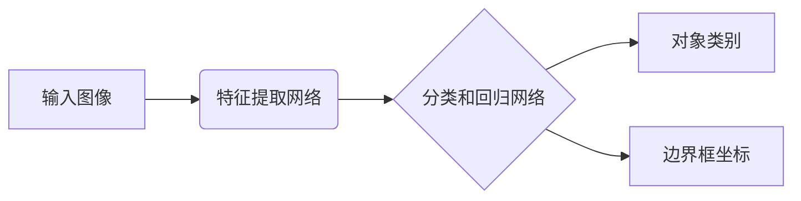
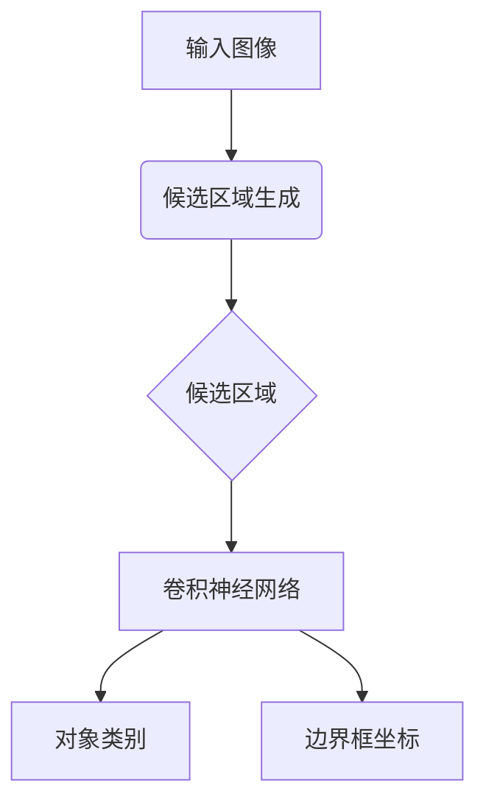
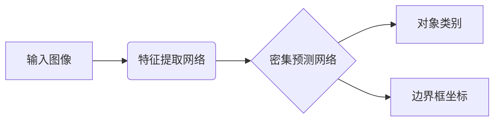

# 一切皆是映射：基于深度学习的对象检测技术

## 1.背景介绍

在当今世界,图像和视频数据的爆炸式增长使得对象检测技术变得越来越重要。对象检测是计算机视觉领域的核心任务之一,旨在从图像或视频中识别出感兴趣的对象并精确定位它们的位置。它广泛应用于安全监控、自动驾驶、机器人视觉等诸多领域。

随着深度学习技术的不断发展,基于深度神经网络的对象检测算法取得了巨大的进步,大大提高了检测的准确性和鲁棒性。这些算法能够自动从大量标注数据中学习出对象的特征模式,从而实现准确高效的对象检测。

## 2.核心概念与联系  

对象检测任务可以概括为两个关键步骤:

1. **分类(Classification)**:确定图像中存在哪些对象类别。
2. **定位(Localization)**:找出每个对象在图像中的精确位置和大小。

深度学习对象检测算法通过端到端的训练,将这两个步骤统一到一个神经网络模型中完成。该模型的输入是原始图像,输出是对象类别以及对应的边界框(bounding box)坐标。

核心思想是将对象检测问题转化为一个**映射问题**:将输入图像映射到对应的对象类别和位置输出。这个映射过程由深度神经网络自动学习完成,无需人工设计复杂的特征提取和分类规则。



## 3.核心算法原理具体操作步骤

目前主流的对象检测算法可分为两大类:

### 3.1 基于候选区域的算法

这类算法分两步走:

1. **候选区域生成**:首先利用选择性搜索或区域候选生成网络(RPN)等算法,从图像中生成一组可能包含对象的候选区域。
2. **区域分类**:将每个候选区域输入到卷积神经网络中,对其进行分类和精细化边界框回归。

经典算法有R-CNN、Fast R-CNN、Faster R-CNN等。



### 3.2 基于密集预测的算法  

这类算法不需要先生成候选区域,而是对输入图像的每个位置(或密集的滑动窗口)进行预测,直接输出对象类别和边界框坐标。

典型算法有YOLO、SSD等,它们的检测速度更快,但精度略低于基于候选区域的方法。



## 4.数学模型和公式详细讲解举例说明

对于基于深度学习的对象检测算法,核心是设计一个高效的损失函数(Loss Function),使得训练时能够同时最小化分类误差和边界框回归误差。

常用的多任务损失函数形式为:

$$
L(\{p_i\},\{t_i\}) = \frac{1}{N_{cls}}\sum_{i}L_{cls}(p_i, p_i^*) + \lambda\frac{1}{N_{reg}}\sum_{i}p_i^*L_{reg}(t_i, t_i^*)
$$

其中:

- $p_i$是预测的对象概率分数
- $t_i$是预测的边界框坐标
- $p_i^*$和$t_i^*$分别是真实的类别标签和边界框坐标
- $L_{cls}$是分类损失(如交叉熵损失)
- $L_{reg}$是回归损失(如平滑L1损失)
- $N_{cls}$和$N_{reg}$是归一化项
- $\lambda$是平衡两个任务的权重系数

以YOLO算法为例,其损失函数包括三部分:

$$
\begin{aligned}
L &= \lambda_\text{coord}\sum_{i=0}^{S^2}\sum_{j=0}^B\mathbb{1}_{ij}^\text{obj}\Big[\sum_{m=0}^2(x_i^m-\hat{x}_i^m)^2 + \sum_{m=0}^2(y_i^m-\hat{y}_i^m)^2\Big] \\
&+ \lambda_\text{coord}\sum_{i=0}^{S^2}\sum_{j=0}^B\mathbb{1}_{ij}^\text{obj}\Big[\sum_{m=0}^2(\sqrt{w_i^m}-\sqrt{\hat{w}_i^m})^2 + \sum_{m=0}^2(\sqrt{h_i^m}-\sqrt{\hat{h}_i^m})^2\Big] \\
&+ \sum_{i=0}^{S^2}\sum_{j=0}^B\mathbb{1}_{ij}^\text{obj}\sum_{c\in\text{classes}}(p_i(c)-\hat{p}_i(c))^2 \\
&+ \lambda_\text{noobj}\sum_{i=0}^{S^2}\sum_{j=0}^B\mathbb{1}_{ij}^\text{noobj}(p_i(c)-\hat{p}_i(c))^2
\end{aligned}
$$

其中:

- 第一项是中心坐标的均方误差
- 第二项是宽高的均方根误差
- 第三项是对象分数的均方误差
- 第四项是无对象时的置信度损失

通过优化该损失函数,模型可以同时学习对象类别和精确边界框。

## 5.项目实践:代码实例和详细解释说明

以下是使用PyTorch实现YOLO v3对象检测算法的简化代码示例:

```python
import torch
import torch.nn as nn

# 定义YOLO网络
class YOLOv3(nn.Module):
    def __init__(self, num_classes=80):
        super().__init__()
        # backbone网络
        self.backbone = ... 
        # 检测头
        self.detection_head = ...

    def forward(self, x):
        # 提取特征
        feat_maps = self.backbone(x)
        # 对象检测
        outputs = self.detection_head(feat_maps)
        return outputs

# 损失函数
def yolov3_loss(predictions, targets):
    # 计算不同部分的损失
    xy_loss = ...
    wh_loss = ...
    conf_loss = ...
    prob_loss = ...
    
    # 合并总损失
    total_loss = xy_loss + wh_loss + conf_loss + prob_loss
    return total_loss

# 训练
model = YOLOv3(num_classes=20)
optimizer = torch.optim.SGD(model.parameters(), lr=0.001)

for epoch in range(100):
    for imgs, labels in train_loader:
        preds = model(imgs)
        loss = yolov3_loss(preds, labels)
        
        optimizer.zero_grad()
        loss.backward()
        optimizer.step()

# 测试
model.eval()
for img in test_loader:
    preds = model(img)
    # 后处理获取检测结果
    boxes, classes, scores = ...
    # 可视化结果
    plot_detections(img, boxes, classes, scores)
```

上述代码首先定义了YOLOv3网络模型,包含一个backbone网络用于特征提取,以及一个检测头用于预测对象类别和边界框。

在训练阶段,模型输出的预测结果与真实标签计算损失,使用优化器如SGD进行反向传播训练。

在测试阶段,模型对输入图像进行前向传播得到预测结果,然后进行后处理(如非极大值抑制)获取最终检测框,并可视化结果。

## 6.实际应用场景

对象检测技术在现实世界中有着广泛的应用,包括但不限于:

1. **安全监控**: 在视频监控系统中,对象检测可用于识别和跟踪可疑人员、车辆等目标。

2. **自动驾驶**: 自动驾驶汽车需要精准检测道路上的行人、车辆、障碍物等,以保证行车安全。

3. **机器人视觉**: 对象检测赋予机器人识别和定位周围物体的能力,在工业自动化、服务机器人等领域有重要应用。

4. **人机交互**: 通过检测人体关键点,可实现手势识别、动作捕捉等人机交互功能。

5. **无人机航拍**: 无人机可利用对象检测技术识别目标物体,用于测绘、巡逻、搜救等任务。

6. **智能视频分析**: 对视频中的人物、车辆、文字等目标进行检测和识别,可实现智能监控、行为分析等功能。

7. **医疗影像分析**: 在医学影像如CT、MRI等图像中检测病灶、器官等目标,辅助医生诊断。

总的来说,对象检测是实现智能系统对视觉世界理解的关键一环,在各个领域都有广阔的应用前景。

## 7.工具和资源推荐

对于想要学习和实践对象检测技术的开发者,以下是一些推荐的工具和资源:

1. **开源框架**:
    - PyTorch: https://pytorch.org/
    - TensorFlow: https://www.tensorflow.org/
    - Keras: https://keras.io/
    - OpenCV: https://opencv.org/

2. **预训练模型**:
    - YOLO: https://pjreddie.com/darknet/yolo/
    - Faster R-CNN: https://github.com/rbgirshick/py-faster-rcnn
    - SSD: https://github.com/weiliu89/caffe/tree/ssd

3. **数据集**:
    - COCO: http://cocodataset.org
    - Pascal VOC: http://host.robots.ox.ac.uk/pascal/VOC/
    - OpenImages: https://opensource.google/projects/open-images-dataset

4. **在线课程**:
    - 吴恩达深度学习课程: https://www.coursera.org/specializations/deep-learning
    - PyTorch官方教程: https://pytorch.org/tutorials/
    - TensorFlow官方教程: https://www.tensorflow.org/tutorials

5. **书籍**:
    - 《深度学习实战》 - Aurelien Geron
    - 《Python计算机视觉编程》 - Jan Erik Solem
    - 《深度学习与计算机视觉》 - 李沐

6. **论文**:
    - YOLO: https://arxiv.org/abs/1506.02640
    - Faster R-CNN: https://arxiv.org/abs/1506.01497
    - SSD: https://arxiv.org/abs/1512.02325

利用这些优秀的开源工具和资源,结合理论知识和实践经验,相信大家一定能在对象检测领域有所建树。

## 8.总结:未来发展趋势与挑战

对象检测技术正在快速发展,但仍面临一些挑战和发展方向:

1. **实时性和高效性**: 追求更高的检测速度和更低的计算开销,以满足实时系统和嵌入式设备的需求。

2. **小数据集训练**: 减少对大规模标注数据的依赖,通过少量数据、半监督学习等方式训练出高质量的检测模型。

3. **鲁棒性和泛化性**: 提高模型对遮挡、视角变化、光照变化等困难情况的适应能力,增强泛化性。

4. **多目标跟踪**: 将对象检测与目标跟踪相结合,实现对视频序列中目标的持续检测和跟踪。

5. **3D对象检测**: 从2D图像扩展到3D空间,对三维环境中的物体进行精确检测和定位。

6. **弱监督和无监督学习**: 减少对标注数据的依赖,利用无标签或弱标签数据训练对象检测模型。

7. **模型压缩和加速**: 通过模型压缩、量化等技术,在保证精度的同时降低模型大小和计算复杂度。

8. **解释性和可信赖性**: 提高深度学习模型的可解释性和可信赖性,确保其在关键任务中的安全可靠。

未来,对象检测技术必将与其他人工智能技术相结合,在更多领域发挥重要作用,为人类社会创造更大价值。

## 9.附录:常见问题与解答

1. **什么是对象检测?**

   对象检测是计算机视觉的一个核心任务,旨在从图像或视频中找出感兴趣对象的位置和类别。它包括两个关键步骤:分类(确定对象类别)和定位(找出对象位置和大小)。

2. **对象检