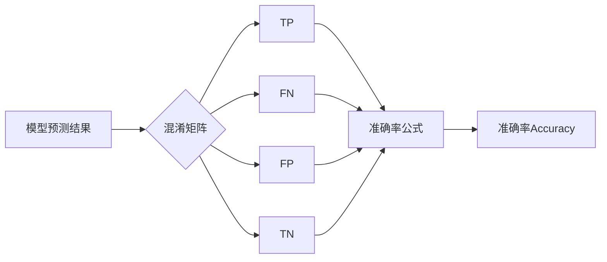

# 准确率Accuracy原理与代码实例讲解

## 1. 背景介绍

在机器学习和深度学习领域,准确率(Accuracy)是一个非常重要的评估指标,用于衡量模型在给定数据集上的分类性能。准确率表示模型预测正确的样本数占总样本数的比例。对于二分类问题,准确率可以直观地反映模型的整体表现。而在多分类问题中,准确率则体现了模型在各个类别上的平均表现。

### 1.1 准确率的重要性

- 直观易懂:准确率是一个直观易懂的指标,易于向非技术背景的人解释模型性能。
- 适用广泛:准确率适用于各种分类问题,包括二分类和多分类。  
- 便于比较:使用准确率可以方便地比较不同模型之间的性能差异。

### 1.2 准确率的局限性

- 类别不平衡:当数据集类别分布不平衡时,准确率可能会产生误导。
- 无法反映错误类型:准确率无法区分假阳性和假阴性错误。
- 不适用于回归问题:准确率只适用于分类问题,无法用于回归问题的评估。

## 2. 核心概念与联系

要深入理解准确率,需要先了解以下几个核心概念:

### 2.1 混淆矩阵(Confusion Matrix)

混淆矩阵是一个用于总结分类模型性能的矩阵。对于二分类问题,混淆矩阵如下:

|              | 预测为正例 | 预测为负例 |
|--------------|----------|----------|
| 实际为正例   | TP(真阳性) | FN(假阴性) |
| 实际为负例   | FP(假阳性) | TN(真阴性) |

- TP(True Positive):实际为正例,预测也为正例。
- FN(False Negative):实际为正例,预测为负例。
- FP(False Positive):实际为负例,预测为正例。
- TN(True Negative):实际为负例,预测也为负例。

### 2.2 准确率与混淆矩阵的关系

准确率可以通过混淆矩阵中的元素计算得到:

$$Accuracy = \frac{TP+TN}{TP+FN+FP+TN}$$

即正确预测的样本数(TP+TN)占总样本数的比例。

### 2.3 其他评估指标

除了准确率,还有其他常用的评估指标:

- 精确率(Precision):$Precision=\frac{TP}{TP+FP}$
- 召回率(Recall):$Recall=\frac{TP}{TP+FN}$  
- F1分数(F1-score):$F1=2\cdot\frac{Precision \cdot Recall}{Precision+Recall}$

这些指标与准确率互为补充,可以更全面地评估模型性能。

## 3. 核心算法原理具体操作步骤

计算准确率的具体步骤如下:

1. 获取模型在测试集上的预测结果。
2. 将预测结果与真实标签进行比较,计算TP、FN、FP、TN的数量。
3. 根据公式 $Accuracy = \frac{TP+TN}{TP+FN+FP+TN}$ 计算准确率。

对于多分类问题,可以先计算每个类别的准确率,然后取平均值得到整体准确率。

## 4. 数学模型和公式详细讲解举例说明

假设有一个二分类问题,测试集包含100个样本,其中60个正例,40个负例。模型在测试集上的预测结果如下:

- TP = 50
- FN = 10
- FP = 5
- TN = 35

根据准确率公式:

$$Accuracy = \frac{TP+TN}{TP+FN+FP+TN} = \frac{50+35}{50+10+5+35} = 0.85$$

即模型在该测试集上的准确率为85%。

## 5. 项目实践:代码实例和详细解释说明

以下是使用Python和Scikit-learn库计算准确率的代码示例:

```python
from sklearn.metrics import accuracy_score

# 假设y_true为真实标签,y_pred为预测标签
y_true = [1, 0, 1, 1, 0, 1, 0, 0, 1, 1]
y_pred = [1, 0, 1, 0, 0, 1, 1, 0, 1, 1]

accuracy = accuracy_score(y_true, y_pred)
print(f"Accuracy: {accuracy:.2f}")
```

输出结果:

```
Accuracy: 0.80
```

代码解释:

1. 导入`accuracy_score`函数从`sklearn.metrics`模块。
2. 定义`y_true`和`y_pred`分别为真实标签和预测标签。
3. 调用`accuracy_score`函数计算准确率,将结果保存在`accuracy`变量中。
4. 打印准确率,保留两位小数。

## 6. 实际应用场景

准确率在各种分类问题中都有广泛应用,例如:

- 垃圾邮件检测:根据邮件内容将邮件分为垃圾邮件和正常邮件。
- 医疗诊断:根据患者症状和检查结果预测疾病类型。
- 人脸识别:根据人脸图像识别不同的人。
- 情感分析:根据文本内容判断情感倾向(积极、消极、中性)。

在这些应用场景中,准确率可以作为评估模型性能的重要指标之一。

## 7. 工具和资源推荐

- Scikit-learn:Python机器学习库,提供了准确率等评估指标的实现。
- TensorFlow和Keras:流行的深度学习框架,内置了准确率的计算函数。
- PyTorch:另一个流行的深度学习框架,也提供了准确率的计算功能。
- Confusion Matrix Visualization:在线绘制混淆矩阵的工具,直观展示分类模型的性能。

## 8. 总结:未来发展趋势与挑战

准确率作为一个简单有效的评估指标,在机器学习和深度学习领域有着广泛的应用。然而,准确率也存在一些局限性,如对类别不平衡问题的敏感性。未来,研究者和工程师将继续探索更加全面和鲁棒的评估指标,以应对实际应用中的挑战。

此外,随着深度学习模型的不断发展,如何在海量数据和复杂模型中高效计算准确率也将成为一个挑战。并行计算、近似计算等技术可能会在提高准确率计算效率方面发挥重要作用。

## 9. 附录:常见问题与解答

### 9.1 准确率与错误率是否互为补数?

是的,准确率与错误率之和为1。错误率=1-准确率。

### 9.2 如何处理类别不平衡问题?

可以考虑使用以下方法:

- 过采样(Over-sampling):增加少数类样本的数量。
- 欠采样(Under-sampling):减少多数类样本的数量。
- 使用其他评估指标,如精确率、召回率、F1分数等。

### 9.3 准确率是否适用于多标签分类问题?

不直接适用。对于多标签分类问题,可以考虑使用以下指标:

- Hamming Loss:预测标签与真实标签不一致的比例。
- Subset Accuracy:预测标签集合与真实标签集合完全一致的样本比例。
- F1-score:对每个标签计算F1分数,然后取平均值。



作者:禅与计算机程序设计艺术 / Zen and the Art of Computer Programming