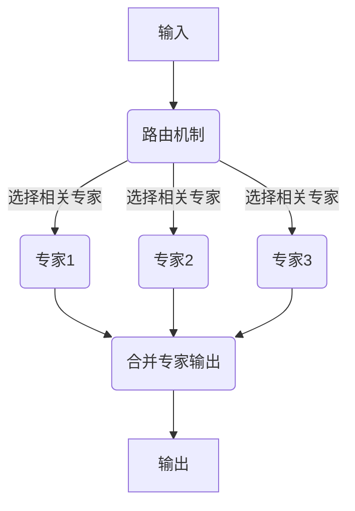

# 大语言模型原理基础与前沿 通过稀疏MoE扩展视觉语言模型

## 1. 背景介绍

### 1.1 大语言模型的兴起

近年来,大型语言模型(Large Language Models, LLMs)在自然语言处理领域取得了令人瞩目的成就。这些模型通过在海量文本数据上进行预训练,学习了丰富的语言知识和上下文信息,展现出惊人的泛化能力。著名的LLMs包括GPT-3、PaLM、ChatGPT等,它们可以在广泛的下游任务中发挥作用,如文本生成、问答、文本摘要等。

### 1.2 视觉语言模型的重要性

尽管LLMs在纯文本领域取得了巨大成功,但将其扩展到涉及图像和视觉信息的领域仍然是一个挑战。视觉语言模型(Visual Language Models, VLMs)旨在同时理解和生成图像和文本数据,在多模态任务中发挥关键作用,如视觉问答、图像描述生成、视觉对话等。

### 1.3 模型规模与计算复杂度

然而,训练大规模的VLMs面临着巨大的计算和内存挑战。随着模型规模的增长,计算和内存需求也呈指数级增长,这对硬件资源提出了极高的要求。因此,如何在保持模型性能的同时,降低计算复杂度和内存占用,成为了一个亟待解决的问题。

## 2. 核心概念与联系

### 2.1 Transformer架构

Transformer是LLMs和VLMs的核心架构,它通过自注意力机制捕获长距离依赖关系,展现出卓越的性能。然而,标准的Transformer架构在计算自注意力时需要对每个查询向量与所有键向量进行点积运算,导致计算复杂度为O(n^2),这在大规模模型中变得不可行。

### 2.2 稀疏专家模型(Sparse Mixture of Experts, MoE)

为了解决上述问题,MoE被提出作为一种有效的解决方案。MoE将整个模型分解为多个专家(Expert)子模块,每个输入仅与少数相关专家进行计算,从而大幅降低了计算复杂度。MoE引入了一个路由机制,用于动态选择与当前输入最相关的专家子模块。



### 2.3 稀疏MoE在VLMs中的应用

将稀疏MoE应用于VLMs,可以有效降低模型计算复杂度,从而支持训练更大规模的视觉语言模型。通过将视觉和语言模态分别编码为不同的专家子模块,并在路由机制的指导下选择相关专家进行计算,可以大幅节省计算资源,同时保持模型的性能。

## 3. 核心算法原理具体操作步骤

### 3.1 Transformer编码器

Transformer编码器是VLM的基础组件,用于编码输入的图像和文本信息。对于图像输入,通常使用卷积神经网络(CNN)提取视觉特征,然后将其投影到Transformer编码器的输入空间。对于文本输入,将单词嵌入序列输入到Transformer编码器中。

### 3.2 MoE路由机制

MoE路由机制的关键是学习一个门控函数(Gating Function),用于为每个输入向量分配相关的专家子模块。常用的门控函数包括简单的softmax函数或基于注意力的门控函数。

给定输入向量$\mathbf{x}$,门控函数计算每个专家$e_i$的相关性分数$g_i$:

$$g_i = \text{GatingFunction}(\mathbf{x}, \mathbf{W}_i)$$

其中$\mathbf{W}_i$是专家$e_i$的权重矩阵。然后,通过softmax函数将相关性分数归一化为概率分布$\mathbf{p}$:

$$p_i = \frac{\exp(g_i)}{\sum_j \exp(g_j)}$$

### 3.3 专家计算

对于每个输入向量$\mathbf{x}$,仅选择概率最高的$k$个专家进行计算,其中$k$是一个预定义的超参数,控制计算量和模型容量之间的权衡。选定的专家将输入向量$\mathbf{x}$转换为输出向量$\mathbf{y}_i$:

$$\mathbf{y}_i = e_i(\mathbf{x})$$

### 3.4 专家输出合并

最后,将选定专家的输出按照概率$\mathbf{p}$进行加权求和,得到最终输出$\mathbf{y}$:

$$\mathbf{y} = \sum_i p_i \mathbf{y}_i$$

通过这种方式,MoE可以在保持模型性能的同时,大幅降低计算复杂度,从O(n^2)降低到O(kn),其中k是选择的专家数量,通常远小于总专家数。

## 4. 数学模型和公式详细讲解举例说明

### 4.1 注意力机制

注意力机制是Transformer架构的核心,它允许模型动态地聚焦于输入序列的不同部分,捕获长距离依赖关系。给定查询向量$\mathbf{q}$、键向量$\mathbf{K}$和值向量$\mathbf{V}$,注意力计算如下:

$$\text{Attention}(\mathbf{q}, \mathbf{K}, \mathbf{V}) = \text{softmax}\left(\frac{\mathbf{q}\mathbf{K}^\top}{\sqrt{d_k}}\right)\mathbf{V}$$

其中$d_k$是缩放因子,用于防止内积过大导致softmax函数的梯度较小。

在Transformer中,注意力机制被应用于查询向量$\mathbf{Q}$、键矩阵$\mathbf{K}$和值矩阵$\mathbf{V}$,计算如下:

$$\text{MultiHead}(\mathbf{Q}, \mathbf{K}, \mathbf{V}) = \text{Concat}(\text{head}_1, \dots, \text{head}_h)\mathbf{W}^O$$
$$\text{where } \text{head}_i = \text{Attention}(\mathbf{Q}\mathbf{W}_i^Q, \mathbf{K}\mathbf{W}_i^K, \mathbf{V}\mathbf{W}_i^V)$$

这种多头注意力机制允许模型从不同的子空间捕获不同的关系,提高了模型的表示能力。

### 4.2 MoE路由机制示例

假设我们有一个输入向量$\mathbf{x} = [0.2, 0.5, -0.1]$,并且有三个专家$e_1$、$e_2$和$e_3$,它们的权重矩阵分别为$\mathbf{W}_1 = [1, 2, 3]$、$\mathbf{W}_2 = [-1, 1, 0]$和$\mathbf{W}_3 = [0, -2, 1]$。我们使用简单的内积作为门控函数,计算每个专家的相关性分数:

$$\begin{align*}
g_1 &= \mathbf{x}^\top\mathbf{W}_1 = 0.2 \times 1 + 0.5 \times 2 + (-0.1) \times 3 = 1.1\\
g_2 &= \mathbf{x}^\top\mathbf{W}_2 = 0.2 \times (-1) + 0.5 \times 1 + (-0.1) \times 0 = 0.3\\
g_3 &= \mathbf{x}^\top\mathbf{W}_3 = 0.2 \times 0 + 0.5 \times (-2) + (-0.1) \times 1 = -1.1
\end{align*}$$

将相关性分数通过softmax函数归一化为概率分布:

$$\begin{align*}
p_1 &= \frac{\exp(1.1)}{\exp(1.1) + \exp(0.3) + \exp(-1.1)} \approx 0.61\\
p_2 &= \frac{\exp(0.3)}{\exp(1.1) + \exp(0.3) + \exp(-1.1)} \approx 0.35\\
p_3 &= \frac{\exp(-1.1)}{\exp(1.1) + \exp(0.3) + \exp(-1.1)} \approx 0.04
\end{align*}$$

假设我们选择概率最高的两个专家进行计算,即$e_1$和$e_2$。它们的输出分别为$\mathbf{y}_1 = [0.1, 0.2, 0.3]$和$\mathbf{y}_2 = [-0.2, 0.1, -0.1]$。最终输出为:

$$\mathbf{y} = p_1\mathbf{y}_1 + p_2\mathbf{y}_2 \approx 0.61 \times [0.1, 0.2, 0.3] + 0.35 \times [-0.2, 0.1, -0.1] = [-0.03, 0.17, 0.21]$$

通过这个示例,我们可以看到MoE路由机制如何动态选择相关的专家子模块进行计算,从而降低了计算复杂度。

## 5. 项目实践:代码实例和详细解释说明

在这一部分,我们将提供一个基于PyTorch实现的MoE示例代码,并详细解释每个组件的作用。

```python
import torch
import torch.nn as nn
import torch.nn.functional as F

# 定义专家模块
class Expert(nn.Module):
    def __init__(self, in_dim, out_dim):
        super(Expert, self).__init__()
        self.fc = nn.Linear(in_dim, out_dim)

    def forward(self, x):
        return self.fc(x)

# 定义MoE模块
class MoE(nn.Module):
    def __init__(self, in_dim, out_dim, num_experts, k):
        super(MoE, self).__init__()
        self.experts = nn.ModuleList([Expert(in_dim, out_dim) for _ in range(num_experts)])
        self.gating = nn.Linear(in_dim, num_experts)
        self.k = k

    def forward(self, x):
        # 计算门控函数输出
        gate_outputs = self.gating(x)
        
        # 选择top-k专家
        topk_gate_values, topk_indices = torch.topk(gate_outputs, self.k, dim=1)
        topk_gate_values = F.softmax(topk_gate_values, dim=1)

        # 计算专家输出
        expert_outputs = [self.experts[i](x) for i in range(self.num_experts)]
        expert_outputs = torch.stack(expert_outputs, dim=2)
        
        # 合并专家输出
        selected_experts = expert_outputs.scatter(2, topk_indices.unsqueeze(2).expand(-1, -1, self.k), topk_gate_values.unsqueeze(2))
        output = selected_experts.sum(dim=2)

        return output
```

在这个示例中,我们定义了两个模块:`Expert`和`MoE`。

- `Expert`模块是一个简单的全连接层,用于实现专家子模块的功能。
- `MoE`模块包含以下几个主要组件:
  - `experts`: 一个`nn.ModuleList`,包含了所有的专家子模块。
  - `gating`: 一个全连接层,用于计算门控函数输出,即每个专家的相关性分数。
  - `k`: 一个超参数,控制选择的专家数量。

在`MoE`模块的`forward`函数中,我们执行以下步骤:

1. 计算门控函数输出`gate_outputs`。
2. 选择概率最高的`k`个专家,获取它们的索引`topk_indices`和归一化的概率`topk_gate_values`。
3. 计算所有专家的输出`expert_outputs`。
4. 使用`scatter`操作,根据`topk_indices`和`topk_gate_values`选择相关专家的输出,并按照概率进行加权求和,得到最终输出`output`。

通过这个示例代码,你可以看到如何在PyTorch中实现MoE模块,并将其集成到更大的模型架构中,如Transformer或视觉语言模型。

## 6. 实际应用场景

稀疏MoE在扩展大规模视觉语言模型方面具有广泛的应用前景,包括但不限于以下场景:

### 6.1 视觉问答(Visual Question Answering, VQA)

VQA任务旨在根据给定的图像和自然语言问题,生成相应的答案。通过将稀疏MoE集成到VLM中,可以支持训练更大规模的模型,提