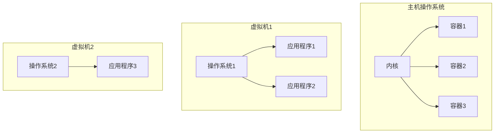

# 容器 原理与代码实例讲解

## 1.背景介绍

### 1.1 什么是容器

容器是一种操作系统级别的虚拟化技术,它可以将应用程序及其依赖项打包在一个可移植的环境中,使其可以在任何Linux系统上一致地运行。与传统的虚拟机不同,容器不需要包含整个操作系统,因此它们更加轻量级、高效且易于部署。

容器技术的兴起源于 2008 年 Linux 内核引入的名为 "cgroups" 的功能,它允许限制一个进程组对各种资源(如 CPU、内存等)的使用。随后在 2013 年,Docker 公司发布了 Docker 引擎,将 cgroups 与其他一些 Linux 内核功能(如命名空间)相结合,从而实现了容器的全面封装和轻量级虚拟化。

### 1.2 为什么需要容器

传统的应用程序部署方式存在诸多挑战:

1. **环境依赖**:应用程序在开发和生产环境之间迁移时,常常会遇到"在我的机器上可以运行"的问题,这是由于不同环境之间的操作系统、库版本等差异导致的。

2. **资源浪费**:为了隔离应用程序,通常需要为每个应用程序分配一个完整的虚拟机,这会导致大量资源浪费。

3. **可移植性差**:应用程序与底层基础设施紧密耦合,难以实现跨云迁移。

4. **缺乏一致性**:不同的开发人员构建的应用程序环境可能存在差异,导致行为不一致。

容器技术正是为了解决这些问题而诞生的。它可以确保应用程序在不同环境中的一致性,提高资源利用率,增强可移植性,并简化应用程序的交付和部署。

## 2.核心概念与联系

### 2.1 容器与虚拟机

虚拟机是在主机操作系统之上构建了一个完整的虚拟化操作系统,而容器则直接共享主机操作系统的内核,因此容器比虚拟机更加轻量级。



### 2.2 容器的核心技术

容器技术主要依赖于以下几个 Linux 内核功能:

1. **Cgroups (Control Groups)**: 用于限制和隔离进程对各种资源(如 CPU、内存等)的使用。

2. **Namespace**: 用于对进程的视图进行隔离,例如进程 ID、网络、文件系统等。

3. **Union File System**: 通过层叠多个文件系统,实现写时复制(Copy-on-Write),从而实现高效的文件系统共享。

4. **容器引擎**:如 Docker、Containerd 等,用于构建、分发和运行容器化应用程序。

### 2.3 容器生命周期

容器的生命周期包括以下几个阶段:

1. **构建镜像**: 使用 Dockerfile 定义容器的文件系统层次结构。

2. **分发镜像**: 将构建好的镜像推送到镜像仓库中进行存储和分发。

3. **运行容器**: 从镜像创建容器实例,并对其进行配置和管理。

4. **暂停容器**: 将容器的状态保存下来,以便将来继续运行。

5. **停止容器**: 终止容器的运行,并清理占用的资源。

## 3.核心算法原理具体操作步骤

### 3.1 容器镜像构建

容器镜像是一个只读的文件系统层次结构,它包含了运行应用程序所需的所有依赖项。Docker 使用 Dockerfile 来定义镜像的构建过程。

以下是一个简单的 Dockerfile 示例:

```dockerfile
# 基础镜像
FROM ubuntu:18.04

# 安装依赖
RUN apt-get update && apt-get install -y python3 python3-pip

# 设置工作目录
WORKDIR /app

# 复制应用代码
COPY . /app

# 安装 Python 依赖
RUN pip3 install -r requirements.txt

# 设置容器启动命令
CMD ["python3", "app.py"]
```

构建镜像的步骤如下:

1. 从基础镜像开始,创建一个新的可写层。

2. 执行 `RUN` 指令,在可写层中安装所需的软件包。

3. 执行 `COPY` 指令,将应用代码复制到可写层中。

4. 执行其他指令,如安装依赖项等。

5. 在最后一层,设置容器启动命令。

6. 对可写层进行压缩和哈希计算,生成新的只读镜像层。

### 3.2 容器运行

从镜像创建容器实例的过程如下:

1. 首先,Docker 会为容器创建一个可写层,称为容器层。

2. 然后,Docker 会从镜像中的只读层创建一个新的只读层,称为初始层。

3. 初始层和容器层结合,形成了容器的文件系统视图。

4. Docker 会为容器创建一个独立的命名空间和控制组,以实现资源隔离。

5. 最后,Docker 会在容器内部启动一个进程,该进程就是容器中运行的应用程序。

```mermaid
graph BT
    subgraph 容器
        容器层[容器层(可写)]
        初始层[初始层(只读)]
        应用程序[应用程序进程]
        命名空间[命名空间]
        控制组[控制组]
        容器层 --> 初始层
        初始层 --> 应用程序
        命名空间 --> 应用程序
        控制组 --> 应用程序
    end
    subgraph 镜像
        镜像层1[镜像层1(只读)]
        镜像层2[镜像层2(只读)]
        镜像层3[镜像层3(只读)]
        镜像层1 --> 镜像层2
        镜像层2 --> 镜像层3
        镜像层3 --> 初始层
    end
```

## 4.数学模型和公式详细讲解举例说明

在容器资源限制和调度领域,常常需要使用一些数学模型和公式来描述和优化资源分配。

### 4.1 CPU 资源模型

容器的 CPU 资源通常使用 CPU shares 或 CPU quota 来限制。CPU shares 是一种相对的资源分配方式,而 CPU quota 则是一种绝对的资源限制。

假设有 $n$ 个容器在同一台主机上运行,每个容器 $i$ 被分配了 $s_i$ 个 CPU shares。则容器 $i$ 可以获得的 CPU 时间比例 $p_i$ 可以用下面的公式计算:

$$
p_i = \frac{s_i}{\sum_{j=1}^{n} s_j}
$$

如果使用 CPU quota,则容器 $i$ 在一个周期内可以获得的 CPU 时间为:

$$
t_i = \frac{q_i}{\sum_{j=1}^{n} q_j} \times T
$$

其中 $q_i$ 是容器 $i$ 的 CPU quota 值,而 $T$ 是该周期的总 CPU 时间。

### 4.2 内存资源模型

容器的内存资源通常使用内存限制(Memory Limit)和内存保留(Memory Reservation)来管理。

内存限制是容器可以使用的最大内存量,而内存保留则是为容器预留的最小内存量。如果主机上的可用内存不足以满足所有容器的内存保留,则会触发内存回收机制,例如终止某些容器或使用内存交换(Swap)。

假设主机上有 $M$ 字节的可用内存,有 $n$ 个容器,每个容器 $i$ 的内存限制为 $l_i$,内存保留为 $r_i$。则主机上的剩余可用内存 $M_\text{free}$ 可以计算如下:

$$
M_\text{free} = M - \sum_{i=1}^{n} r_i
$$

如果 $M_\text{free} < 0$,则需要触发内存回收机制。

## 5.项目实践:代码实例和详细解释说明

在本节中,我们将通过一个简单的 Python Web 应用程序示例,演示如何构建和运行容器。

### 5.1 应用程序代码

我们的 Web 应用程序使用 Flask 框架,它会在根路径 `/` 上返回一个问候语。代码如下:

```python
# app.py
from flask import Flask

app = Flask(__name__)

@app.route('/')
def hello():
    return 'Hello from a containerized Flask app!'

if __name__ == '__main__':
    app.run(host='0.0.0.0', port=5000)
```

### 5.2 Dockerfile

为了将应用程序容器化,我们需要创建一个 Dockerfile:

```dockerfile
# 使用 Python 3.9 作为基础镜像
FROM python:3.9

# 设置工作目录
WORKDIR /app

# 复制应用程序代码
COPY . /app

# 安装依赖
RUN pip install flask

# 设置容器启动命令
CMD ["python", "app.py"]
```

### 5.3 构建镜像

在项目目录下,运行以下命令构建镜像:

```bash
docker build -t my-flask-app .
```

### 5.4 运行容器

使用以下命令从镜像创建并运行一个容器:

```bash
docker run -p 5000:5000 my-flask-app
```

该命令将容器的 5000 端口映射到主机的 5000 端口,以便我们可以在主机上访问应用程序。

### 5.5 访问应用程序

在浏览器中访问 `http://localhost:5000`,你应该能看到应用程序返回的问候语。

## 6.实际应用场景

容器技术在现代软件开发和部署中扮演着重要角色,它被广泛应用于以下场景:

1. **微服务架构**: 容器非常适合构建和部署微服务,因为它们提供了轻量级的隔离环境,并且易于扩展和管理。

2. **持续集成和持续交付(CI/CD)**: 容器可以确保应用程序在不同环境中的一致性,从而简化了 CI/CD 流程。

3. **云原生应用程序**: 容器是构建云原生应用程序的核心技术之一,它与 Kubernetes 等容器编排系统紧密结合,实现了应用程序的自动化部署和管理。

4. **开发和测试环境**: 容器可以提供一致的开发和测试环境,消除了"在我的机器上可以运行"的问题。

5. **基础设施即代码(IaC)**: 容器可以作为 IaC 实践的一部分,通过定义容器镜像和编排文件来自动化基础设施的构建和部署。

6. **边缘计算和物联网**: 容器的轻量级特性使其非常适合在资源受限的边缘设备上运行。

## 7.工具和资源推荐

以下是一些与容器技术相关的流行工具和资源:

1. **Docker**: 最广为人知的容器引擎,提供了构建、分发和运行容器的功能。

2. **Kubernetes**: 一个开源的容器编排系统,用于自动化容器化应用程序的部署、扩展和管理。

3. **Containerd**: 一个符合 OCI 标准的核心容器运行时,被 Docker 和 Kubernetes 等项目所使用。

4. **Helm**: Kubernetes 的包管理器,用于查找、共享和使用预先配置好的 Kubernetes 资源。

5. **Docker Hub**: Docker 官方的公共镜像仓库,提供了大量预构建的镜像供使用。

6. **Rancher**: 一个开源的容器管理平台,提供了一个统一的用户界面来管理 Kubernetes 集群。

7. **Portainer**: 一个轻量级的容器管理用户界面,支持管理 Docker 和 Kubernetes。

8. **Docker 官方文档**: Docker 的官方文档,提供了全面的指南和参考资料。

9. **Kubernetes 官方文档**: Kubernetes 的官方文档,涵盖了 Kubernetes 的概念、架构和使用指南。

## 8.总结:未来发展趋势与挑战

容器技术正在快速发展,未来还有许多趋势和挑战值得关注:

1. **安全性增强**: 随着容器在生产环境中的广泛采用,确保容器的安全性将变得越