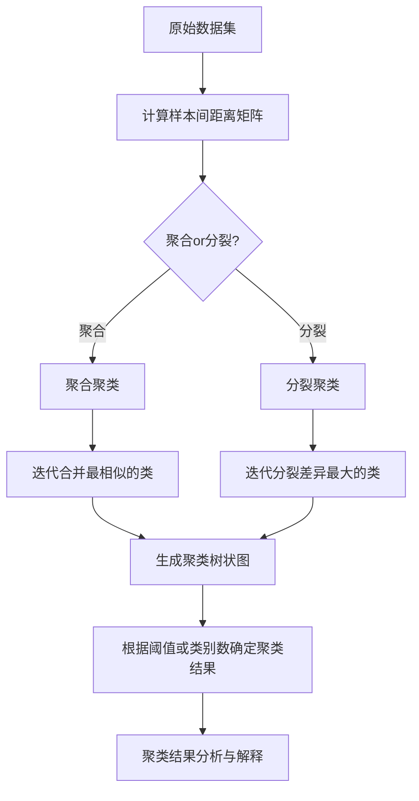

# 层次聚类(Hierarchical Clustering) - 原理与代码实例讲解

## 1. 背景介绍
### 1.1 聚类分析概述
### 1.2 层次聚类在数据挖掘中的重要性
### 1.3 层次聚类的应用场景

## 2. 核心概念与联系
### 2.1 聚类的定义与目标
### 2.2 层次聚类的基本思想
#### 2.2.1 自下而上的聚合策略
#### 2.2.2 自上而下的分裂策略  
### 2.3 层次聚类与其他聚类方法的区别
#### 2.3.1 与K-means聚类的比较
#### 2.3.2 与DBSCAN聚类的比较

## 3. 核心算法原理具体操作步骤
### 3.1 层次聚类的基本步骤
#### 3.1.1 计算样本之间的距离矩阵
#### 3.1.2 根据距离矩阵进行聚类合并或分裂
#### 3.1.3 生成聚类树状图(Dendrogram)
### 3.2 聚合聚类(Agglomerative Clustering)详解
#### 3.2.1 单链接(Single Linkage) 
#### 3.2.2 全链接(Complete Linkage)
#### 3.2.3 平均链接(Average Linkage)
#### 3.2.4 Ward方法(Ward's Method)
### 3.3 分裂聚类(Divisive Clustering)详解

## 4. 数学模型和公式详细讲解举例说明
### 4.1 距离度量方式
#### 4.1.1 欧氏距离(Euclidean Distance)
$$d(x,y) = \sqrt{\sum_{i=1}^n(x_i-y_i)^2}$$
#### 4.1.2 曼哈顿距离(Manhattan Distance) 
$$d(x,y) = \sum_{i=1}^n|x_i-y_i|$$
#### 4.1.3 余弦相似度(Cosine Similarity)
$similarity(x,y) = \frac{x \cdot y}{||x||_2 ||y||_2} = \frac{\sum_{i=1}^n x_i y_i}{\sqrt{\sum_{i=1}^n x_i^2} \sqrt{\sum_{i=1}^n y_i^2}}$
### 4.2 类间距离计算方法
#### 4.2.1 最短距离(Single Linkage)
$D(C_i,C_j) = \min_{x \in C_i, y \in C_j} d(x,y)$  
#### 4.2.2 最长距离(Complete Linkage)
$D(C_i,C_j) = \max_{x \in C_i, y \in C_j} d(x,y)$
#### 4.2.3 平均距离(Average Linkage) 
$D(C_i,C_j) = \frac{1}{|C_i||C_j|}\sum_{x \in C_i}\sum_{y \in C_j}d(x,y)$
#### 4.2.4 Ward距离(Ward's Method)
$D(C_i,C_j) = \sqrt{\frac{2|C_i||C_j|}{|C_i|+|C_j|}}||\bar{C_i}-\bar{C_j}||_2$

## 5. 项目实践：代码实例和详细解释说明
### 5.1 使用Scikit-learn进行层次聚类
#### 5.1.1 生成示例数据
#### 5.1.2 数据预处理与标准化
#### 5.1.3 计算距离矩阵
#### 5.1.4 进行层次聚类
#### 5.1.5 绘制聚类树状图
#### 5.1.6 根据聚类结果对数据分组
### 5.2 使用SciPy进行层次聚类
#### 5.2.1 生成示例数据
#### 5.2.2 计算距离矩阵
#### 5.2.3 进行层次聚类
#### 5.2.4 绘制聚类树状图
#### 5.2.5 根据聚类结果对数据分组
### 5.3 代码示例详解
#### 5.3.1 关键函数与参数说明
#### 5.3.2 聚类结果可视化技巧

## 6. 实际应用场景
### 6.1 客户细分与市场划分
### 6.2 基因表达数据分析
### 6.3 社交网络社团发现
### 6.4 文本聚类与主题发现

## 7. 工具和资源推荐
### 7.1 Python库推荐
#### 7.1.1 Scikit-learn
#### 7.1.2 SciPy
#### 7.1.3 Matplotlib
### 7.2 R语言工具包推荐
#### 7.2.1 stats包
#### 7.2.2 cluster包
### 7.3 相关学习资源
#### 7.3.1 在线课程
#### 7.3.2 经典书籍
#### 7.3.3 研究论文

## 8. 总结：未来发展趋势与挑战
### 8.1 层次聚类的优缺点总结
### 8.2 层次聚类的改进与拓展方向
### 8.3 大数据时代下层次聚类面临的挑战
### 8.4 层次聚类与深度学习的结合

## 9. 附录：常见问题与解答
### 9.1 如何选择合适的距离度量方式？
### 9.2 如何确定最佳的聚类数目？
### 9.3 层次聚类的时间复杂度如何？
### 9.4 如何处理高维数据的层次聚类？
### 9.5 层次聚类对噪声和异常值的敏感性如何？



层次聚类是一种经典的聚类分析方法,通过计算样本之间的距离矩阵,然后迭代地合并相似的类或分裂差异较大的类,最终生成一个层次化的聚类树状图(Dendrogram)。层次聚类可以分为聚合聚类(Agglomerative Clustering)和分裂聚类(Divisive Clustering)两大类。

聚合聚类采用自下而上的策略,初始时将每个样本视为一个独立的类,然后迭代地合并距离最近的两个类,直到所有样本都属于同一个类或达到预设的类别数。常见的类间距离计算方法有单链接(Single Linkage)、全链接(Complete Linkage)、平均链接(Average Linkage)和Ward方法等。

分裂聚类则采用自上而下的策略,初始时将所有样本视为一个类,然后迭代地选择差异最大的类进行分裂,直到每个样本都成为一个独立的类或达到预设的类别数。

以下是使用Python的Scikit-learn库进行层次聚类的示例代码:

```python
from sklearn.datasets import make_blobs
from sklearn.cluster import AgglomerativeClustering
from sklearn.preprocessing import StandardScaler
import matplotlib.pyplot as plt

# 生成示例数据
X, y = make_blobs(n_samples=100, centers=3, random_state=42)

# 数据标准化
scaler = StandardScaler()
X_scaled = scaler.fit_transform(X)

# 进行层次聚类
agg = AgglomerativeClustering(n_clusters=3, linkage='ward')
agg.fit(X_scaled)

# 绘制聚类结果
plt.figure(figsize=(8, 6))
plt.scatter(X_scaled[:, 0], X_scaled[:, 1], c=agg.labels_, cmap='viridis')
plt.xlabel('Feature 1')
plt.ylabel('Feature 2') 
plt.title('Hierarchical Clustering Result')
plt.show()
```

上述代码首先使用`make_blobs`函数生成了一个包含3个簇的示例数据集,然后对数据进行标准化处理。接着使用`AgglomerativeClustering`类进行层次聚类,设置聚类数为3,链接方式为Ward方法。最后使用`matplotlib`绘制聚类结果的散点图。

层次聚类的一个重要优点是无需预先指定聚类数,可以通过分析聚类树状图来确定最佳的聚类数。但层次聚类的计算复杂度较高,对大规模数据集的处理效率较低。此外,层次聚类对噪声和异常值比较敏感,容易受到极端值的影响。

未来层次聚类的研究方向包括改进算法效率、处理高维数据、结合深度学习等。如何在保证聚类质量的同时提高算法的可扩展性,是大数据时代下层次聚类面临的主要挑战。

总之,层次聚类是一种直观、灵活的聚类分析方法,在客户细分、基因表达分析、社交网络分析等领域有广泛应用。深入理解层次聚类的原理,并结合实际数据和场景选择合适的距离度量和链接方式,有助于挖掘数据中蕴含的层次结构和模式。

作者：禅与计算机程序设计艺术 / Zen and the Art of Computer Programming