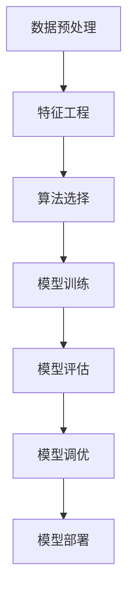

# 机器学习 原理与代码实例讲解

## 1. 背景介绍

机器学习是人工智能领域的一个重要分支,旨在赋予计算机系统自主学习和改进的能力。随着大数据时代的到来,海量数据的出现为机器学习提供了广阔的应用空间。机器学习已广泛应用于图像识别、自然语言处理、推荐系统、金融预测等诸多领域,极大地提高了人类的生产力和生活质量。

## 2. 核心概念与联系

机器学习的核心思想是利用算法从数据中学习,捕捉数据背后的规律和模式。常见的机器学习任务包括监督学习、非监督学习和强化学习。

### 2.1 监督学习

监督学习是机器学习中最常见的一种形式。在监督学习中,算法从标记好的训练数据集中学习,建立输入和输出之间的映射关系。常见的监督学习算法包括线性回归、逻辑回归、决策树、支持向量机等。

### 2.2 非监督学习

非监督学习则是从未标记的数据中寻找内在的结构和模式。常见的非监督学习算法包括聚类算法(如K-Means)和关联规则挖掘算法(如Apriori)。

### 2.3 强化学习

强化学习是一种基于奖惩机制的学习方式。智能体通过与环境交互,根据获得的奖励或惩罚来调整其行为策略,最终达到最优化目标。强化学习广泛应用于游戏、机器人控制等领域。

### 2.4 核心概念联系

这三种学习范式相互关联,共同构建了机器学习的理论基础。监督学习为算法提供了从标记数据中学习的能力,非监督学习则能发现数据的内在结构,而强化学习则赋予了算法自主优化的能力。

## 3. 核心算法原理具体操作步骤

机器学习算法的核心原理和操作步骤因算法而异,但大致可分为以下几个步骤:



### 3.1 数据预处理

数据预处理是机器学习的基础步骤,包括数据清洗、标准化、归一化等操作,以确保数据的质量和一致性。

### 3.2 特征工程

特征工程是从原始数据中提取有效特征的过程,对于机器学习算法的性能至关重要。常见的特征工程技术包括特征选择、特征提取和特征构造等。

### 3.3 算法选择

根据具体的任务和数据特点,选择合适的机器学习算法。不同的算法适用于不同的场景,需要根据实际情况进行权衡。

### 3.4 模型训练

使用训练数据集训练选定的机器学习模型,通过优化算法调整模型参数,使模型能够很好地拟合训练数据。

### 3.5 模型评估

在测试数据集上评估模型的性能,常用的评估指标包括准确率、精确率、召回率、F1分数等。

### 3.6 模型调优

根据模型评估结果,通过调整算法超参数、特征选择等方式优化模型性能。

### 3.7 模型部署

将优化后的模型部署到实际的生产环境中,为用户提供服务。

## 4. 数学模型和公式详细讲解举例说明

机器学习算法的数学基础主要来自于概率论、统计学、线性代数和优化理论等领域。下面将以线性回归和逻辑回归为例,介绍其数学模型和公式。

### 4.1 线性回归

线性回归是一种常见的监督学习算法,用于建立连续型目标变量和一个或多个特征之间的线性关系。

给定一个包含 $n$ 个样本的数据集 $\mathcal{D} = \{(x_i, y_i)\}_{i=1}^n$,其中 $x_i \in \mathbb{R}^m$ 表示第 $i$ 个样本的特征向量, $y_i \in \mathbb{R}$ 表示对应的目标值。线性回归的目标是找到一个假设函数 $h(x)$,使得对于任意的输入 $x$,都有 $h(x) \approx y$。

线性回归的假设函数定义为:

$$h(x) = w^Tx + b$$

其中 $w \in \mathbb{R}^m$ 为权重向量, $b \in \mathbb{R}$ 为偏置项。

为了找到最优的 $w$ 和 $b$,通常采用最小二乘法,即最小化如下目标函数:

$$J(w, b) = \frac{1}{2n}\sum_{i=1}^n(h(x_i) - y_i)^2$$

通过梯度下降法等优化算法,可以求解出最优的 $w$ 和 $b$。

### 4.2 逻辑回归

逻辑回归是一种常见的分类算法,用于解决二分类问题。

给定一个包含 $n$ 个样本的数据集 $\mathcal{D} = \{(x_i, y_i)\}_{i=1}^n$,其中 $x_i \in \mathbb{R}^m$ 表示第 $i$ 个样本的特征向量, $y_i \in \{0, 1\}$ 表示对应的二分类标签。

逻辑回归的假设函数定义为:

$$h(x) = g(w^Tx + b)$$

其中 $g(z)$ 为sigmoid函数,定义为:

$$g(z) = \frac{1}{1 + e^{-z}}$$

sigmoid函数的作用是将线性函数的输出映射到 $(0, 1)$ 区间,从而可以将其解释为样本属于正类的概率。

为了找到最优的 $w$ 和 $b$,通常采用最大似然估计的方法,即最大化如下对数似然函数:

$$l(w, b) = \sum_{i=1}^n[y_i\log h(x_i) + (1 - y_i)\log(1 - h(x_i))]$$

同样可以通过梯度下降法等优化算法求解最优的 $w$ 和 $b$。

## 5. 项目实践: 代码实例和详细解释说明

为了加深对机器学习原理的理解,我们将通过一个实际项目案例,展示如何使用Python中的scikit-learn库实现线性回归和逻辑回归算法。

### 5.1 线性回归实例

```python
import numpy as np
from sklearn.linear_model import LinearRegression
from sklearn.datasets import make_regression
from sklearn.model_selection import train_test_split

# 生成模拟数据
X, y = make_regression(n_samples=1000, n_features=5, noise=0.1, random_state=42)

# 划分训练集和测试集
X_train, X_test, y_train, y_test = train_test_split(X, y, test_size=0.2, random_state=42)

# 创建线性回归模型
model = LinearRegression()

# 训练模型
model.fit(X_train, y_train)

# 在测试集上评估模型
score = model.score(X_test, y_test)
print(f"Linear Regression Model Score: {score:.2f}")
```

在这个示例中,我们首先使用 `make_regression` 函数生成了一个模拟的线性回归数据集。然后,我们将数据集划分为训练集和测试集。接下来,我们创建了一个 `LinearRegression` 对象,并使用 `fit` 方法在训练集上训练模型。最后,我们在测试集上评估模型的性能,使用 `score` 方法计算模型的决定系数 $R^2$。

### 5.2 逻辑回归实例

```python
import numpy as np
from sklearn.linear_model import LogisticRegression
from sklearn.datasets import make_blobs
from sklearn.model_selection import train_test_split
from sklearn.metrics import accuracy_score

# 生成模拟数据
X, y = make_blobs(n_samples=1000, centers=2, n_features=5, random_state=42)

# 划分训练集和测试集
X_train, X_test, y_train, y_test = train_test_split(X, y, test_size=0.2, random_state=42)

# 创建逻辑回归模型
model = LogisticRegression()

# 训练模型
model.fit(X_train, y_train)

# 在测试集上评估模型
y_pred = model.predict(X_test)
accuracy = accuracy_score(y_test, y_pred)
print(f"Logistic Regression Model Accuracy: {accuracy:.2f}")
```

在这个示例中,我们使用 `make_blobs` 函数生成了一个模拟的二分类数据集。同样,我们将数据集划分为训练集和测试集。然后,我们创建了一个 `LogisticRegression` 对象,并使用 `fit` 方法在训练集上训练模型。最后,我们在测试集上评估模型的性能,使用 `predict` 方法进行预测,并计算预测结果与真实标签的准确率。

## 6. 实际应用场景

机器学习已广泛应用于各个领域,下面列举了一些典型的应用场景:

1. **图像识别**: 通过监督学习算法,可以训练出能够识别图像中物体、人脸等内容的模型,应用于安防、自动驾驶等领域。

2. **自然语言处理**: 利用监督学习和深度学习技术,可以实现机器翻译、语音识别、文本分类等任务。

3. **推荐系统**: 基于协同过滤等非监督学习算法,可以为用户推荐感兴趣的商品、新闻、视频等内容。

4. **金融预测**: 通过时间序列分析、回归等算法,可以对股票、外汇等金融数据进行预测和分析。

5. **医疗诊断**: 利用机器学习算法分析医学影像数据、电子病历等,可以辅助医生进行疾病诊断和治疗方案制定。

6. **网络安全**: 通过异常检测、分类等算法,可以识别网络入侵行为、垃圾邮件等,提高网络安全性。

7. **游戏AI**: 运用强化学习等技术,可以训练出具有自主学习和决策能力的游戏AI代理。

## 7. 工具和资源推荐

学习和实践机器学习需要一定的工具和资源支持,下面是一些推荐的工具和资源:

1. **Python**: Python是机器学习领域最流行的编程语言之一,具有丰富的机器学习库和社区支持。

2. **scikit-learn**: 一个强大且易于使用的Python机器学习库,包含了众多经典的机器学习算法。

3. **TensorFlow**: 谷歌开源的端到端机器学习平台,支持深度学习和大规模分布式训练。

4. **PyTorch**: 一个基于Python的深度学习库,具有动态计算图和高效的GPU加速能力。

5. **Kaggle**: 一个面向数据科学家和机器学习从业者的在线社区,提供了大量的数据集和竞赛项目。

6. **机器学习课程和教材**: 包括吴恩达的"机器学习"课程、《机器学习导论》、《模式识别与机器学习》等经典教材和课程。

7. **机器学习博客和论坛**: 包括Google AI Blog、OpenAI Blog、Reddit机器学习社区等,可以了解最新的机器学习研究和应用动态。

## 8. 总结: 未来发展趋势与挑战

机器学习是一个蓬勃发展的领域,未来仍将面临诸多挑战和机遇:

1. **深度学习的持续发展**: 深度学习在图像、语音、自然语言处理等领域取得了巨大成功,未来将继续推动机器学习的发展。

2. **强化学习的广泛应用**: 强化学习在游戏AI、机器人控制等领域已展现出巨大潜力,未来将在更多领域得到应用。

3. **可解释性和可信赖性**: 提高机器学习模型的可解释性和可信赖性,是未来需要解决的重要挑战。

4. **隐私保护和安全性**: 如何在保护个人隐私的同时利用大数据进行机器学习,是一个需要权衡的问题。

5. **算力和效率的提升**: 随着模型规模和数据量的不断增长,提高算力和训练效率将成为关键。

6. **人工智能伦理**: 人工智能系统的伦理和公平性问题需要得到重