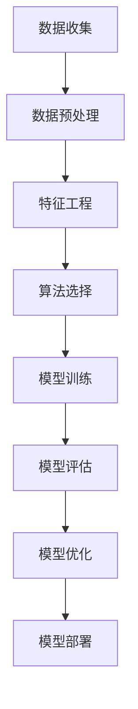

# 机器学习算法：智能技术的基石

## 1. 背景介绍

在当今时代,数据无处不在,从社交媒体到金融交易,从医疗记录到天气预报,海量数据的积累为机器学习算法的应用奠定了坚实的基础。机器学习作为人工智能的核心技术之一,旨在从数据中提取有价值的信息,并对未来做出预测和决策。

机器学习算法的发展可以追溯到上世纪20年代,当时统计学家开始探索如何从数据中学习模型。随着计算能力的不断提高和大数据时代的到来,机器学习算法得以广泛应用于各个领域,包括计算机视觉、自然语言处理、推荐系统等。

作为智能技术的基石,机器学习算法为我们提供了强大的工具,能够自动化地从复杂的数据中发现隐藏的模式和规律。无论是图像识别、语音识别,还是预测分析和决策优化,机器学习算法都扮演着关键角色。

## 2. 核心概念与联系

机器学习算法的核心概念包括:

### 2.1 监督学习

监督学习是机器学习中最常见的一种范式。在这种情况下,算法会从已标记的训练数据中学习,并尝试找到输入和输出之间的映射关系。监督学习可以分为回归(预测连续值输出)和分类(预测离散值输出)两种类型。

常见的监督学习算法包括线性回归、逻辑回归、决策树、支持向量机等。

### 2.2 无监督学习

无监督学习则是从未标记的数据中寻找内在的结构和模式。这种算法不需要预先定义输出,而是自动发现数据的隐藏特征和规律。

常见的无监督学习算法包括聚类算法(如K-Means)和降维算法(如主成分分析)。

### 2.3 强化学习

强化学习是另一种重要的机器学习范式,它模拟了人类通过试错和奖惩来学习的过程。在这种情况下,算法会与环境进行交互,根据采取的行动和获得的回报来调整策略,最终达到最优化目标。

强化学习广泛应用于游戏、机器人控制和决策系统等领域。

### 2.4 深度学习

深度学习是机器学习的一个重要分支,它利用深层神经网络来模拟人脑的工作原理,从而实现对复杂数据的高效处理。深度学习在计算机视觉、自然语言处理等领域取得了突破性的成就。

常见的深度学习模型包括卷积神经网络(CNN)、循环神经网络(RNN)和transformer等。

这些核心概念相互关联,构成了机器学习算法的理论基础。它们共同推动着智能技术的发展,为各个领域带来了革命性的变革。

## 3. 核心算法原理具体操作步骤

机器学习算法的工作流程通常包括以下几个步骤:



### 3.1 数据收集

首先需要收集相关的数据,这些数据可能来自各种来源,如数据库、传感器、网络爬虫等。确保数据的质量和数量都足以支持机器学习任务。

### 3.2 数据预处理

由于现实世界的数据往往存在噪声、缺失值和异常值等问题,因此需要进行数据清洗和规范化处理。常见的预处理技术包括缺失值填充、异常值处理、标准化等。

### 3.3 特征工程

特征工程是机器学习中一个关键步骤,它旨在从原始数据中提取有意义的特征,以供算法训练使用。常见的特征工程技术包括特征选择、特征提取、特征构造等。

### 3.4 算法选择

根据具体的任务和数据特征,选择合适的机器学习算法。不同的算法适用于不同的场景,需要根据算法的优缺点进行权衡。

### 3.5 模型训练

将数据输入到选定的算法中,通过优化算法的参数,使模型在训练数据上达到最佳性能。常见的优化方法包括梯度下降、随机梯度下降等。

### 3.6 模型评估

在独立的测试数据集上评估模型的性能,常用的评估指标包括准确率、精确率、召回率、F1分数等。根据评估结果判断模型是否满足要求。

### 3.7 模型优化

如果模型性能不佳,可以尝试调整算法参数、特征工程或增加训练数据等方式来优化模型。也可以尝试集成学习等高级技术来提升性能。

### 3.8 模型部署

一旦模型达到预期性能,就可以将其部署到实际的生产环境中,为各种应用程序提供智能服务。

这个过程是迭代的,需要根据实际情况不断优化和调整。机器学习是一个循环的过程,需要不断地收集新数据、重新训练模型,以适应不断变化的环境和需求。

## 4. 数学模型和公式详细讲解举例说明

机器学习算法背后蕴含着丰富的数学理论和模型,这些数学基础为算法提供了坚实的理论支撑。下面我们将详细介绍一些核心的数学模型和公式。

### 4.1 线性回归

线性回归是最简单也是最常用的监督学习算法之一。它试图找到一条最佳拟合直线,使得数据点到直线的距离之和最小。

线性回归的数学模型可以表示为:

$$y = \theta_0 + \theta_1x_1 + \theta_2x_2 + ... + \theta_nx_n$$

其中$y$是预测值,$x_i$是特征值,$\theta_i$是需要学习的参数。

通过最小二乘法,我们可以找到使损失函数$J(\theta)$最小的参数值:

$$J(\theta) = \frac{1}{2m}\sum_{i=1}^m(h_\theta(x^{(i)}) - y^{(i)})^2$$

其中$m$是训练样本数量,$h_\theta(x)$是线性回归模型的预测值。

### 4.2 逻辑回归

逻辑回归是一种常用的分类算法,它可以将输入映射到0或1的离散输出。

逻辑回归的数学模型如下:

$$h_\theta(x) = \frac{1}{1 + e^{-\theta^Tx}}$$

其中$h_\theta(x)$是样本$x$属于正类的概率,$\theta$是需要学习的参数向量。

我们可以使用最大似然估计来求解参数$\theta$,目标函数为:

$$J(\theta) = -\frac{1}{m}\sum_{i=1}^m[y^{(i)}\log h_\theta(x^{(i)}) + (1 - y^{(i)})\log(1 - h_\theta(x^{(i)}))]$$

### 4.3 支持向量机

支持向量机(SVM)是一种强大的监督学习模型,它可以用于分类和回归任务。SVM的核心思想是找到一个最大间隔超平面,将不同类别的数据点分开。

对于线性可分的情况,SVM的数学模型为:

$$\min_{\theta,b} \frac{1}{2}\|\theta\|^2$$
$$\text{subject to } y^{(i)}(\theta^Tx^{(i)} + b) \geq 1, i = 1, 2, ..., m$$

其中$\theta$是超平面的法向量,$b$是偏移量,$m$是训练样本数量。

对于非线性情况,我们可以引入核函数$K(x_i, x_j)$,将数据映射到高维空间,从而使用线性分类器进行分类。

### 4.4 K-Means聚类

K-Means是一种常用的无监督学习算法,它将数据划分为K个簇,使得簇内数据点之间的距离尽可能小,簇间数据点之间的距离尽可能大。

K-Means算法的目标函数为:

$$J(c^{(1)}, c^{(2)}, ..., c^{(K)}) = \sum_{i=1}^m\sum_{k=1}^K\mathbb{1}\{c^{(k)} = i\}\|x^{(i)} - \mu_k\|^2$$

其中$c^{(k)}$表示第$k$个簇的索引,$\mu_k$是第$k$个簇的质心,$\mathbb{1}\{\cdot\}$是指示函数。

算法通过迭代优化簇的分配和质心的位置,最终达到局部最优解。

这些数学模型和公式揭示了机器学习算法的本质,为我们提供了深入理解和优化算法的基础。通过掌握这些数学知识,我们可以更好地应用和发展机器学习技术。

## 5. 项目实践:代码实例和详细解释说明

为了更好地理解机器学习算法的实现,我们将通过一个实际的代码示例来演示线性回归算法的应用。

在这个示例中,我们将使用Python和scikit-learn库来构建一个线性回归模型,预测波士顿房价。

### 5.1 导入必要的库

```python
import numpy as np
import pandas as pd
from sklearn.datasets import load_boston
from sklearn.model_selection import train_test_split
from sklearn.linear_model import LinearRegression
from sklearn.metrics import mean_squared_error, r2_score
```

### 5.2 加载数据集

```python
# 加载波士顿房价数据集
boston = load_boston()
data = pd.DataFrame(boston.data, columns=boston.feature_names)
data['PRICE'] = boston.target
```

### 5.3 数据预处理

```python
# 将数据集分为训练集和测试集
X = data.drop('PRICE', axis=1)
y = data['PRICE']
X_train, X_test, y_train, y_test = train_test_split(X, y, test_size=0.2, random_state=42)
```

### 5.4 模型训练

```python
# 创建线性回归模型
model = LinearRegression()

# 训练模型
model.fit(X_train, y_train)
```

### 5.5 模型评估

```python
# 对测试集进行预测
y_pred = model.predict(X_test)

# 计算均方根误差
mse = mean_squared_error(y_test, y_pred)
rmse = np.sqrt(mse)
print(f"均方根误差 (RMSE): {rmse:.2f}")

# 计算决定系数
r2 = r2_score(y_test, y_pred)
print(f"决定系数 (R^2): {r2:.2f}")
```

### 5.6 代码解释

1. 我们首先导入了必要的库,包括NumPy、Pandas和scikit-learn。
2. 然后加载了波士顿房价数据集,并将其转换为Pandas DataFrame格式。
3. 接下来,我们将数据集分为训练集和测试集,以便后续的模型训练和评估。
4. 创建了一个线性回归模型实例,并使用`fit`方法在训练集上训练模型。
5. 在测试集上进行预测,并计算了均方根误差(RMSE)和决定系数($R^2$)等评估指标。

通过这个示例,我们可以清楚地看到如何使用Python和scikit-learn库来实现机器学习算法。代码简洁易懂,同时也展示了机器学习项目的典型流程,包括数据预处理、模型训练和模型评估等步骤。

## 6. 实际应用场景

机器学习算法在现实世界中有着广泛的应用,它们为各个领域带来了革命性的变革。以下是一些典型的应用场景:

### 6.1 计算机视觉

机器学习算法在计算机视觉领域发挥着关键作用,包括图像分类、目标检测、语义分割等任务。深度学习模型如卷积神经网络(CNN)在图像识别方面取得了突破性的成就,为自动驾驶、医疗影像诊断等领域提供了强大的支持。

### 6.2 自然语言处理

自然语言处理(NLP)是另一个机器学习算法大显身手的领域。通过深度学习模型如循环神经网络(RNN)和Transformer,我们可以实现文本分类、机器翻译、问答系统等功能。这些技术正在推动着智能助手、聊天机器人等应用的发展。

### 6.3