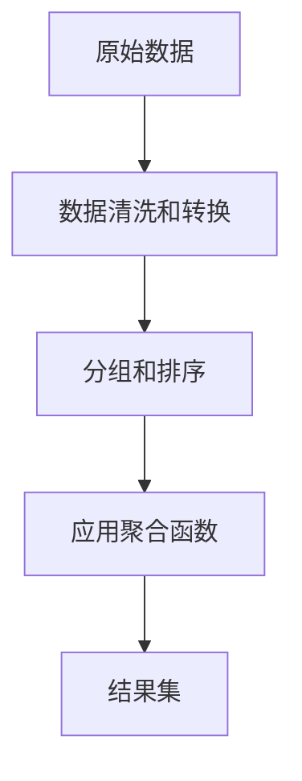

# 聚合分析 原理与代码实例讲解

## 1.背景介绍

在当今数据时代,海量的数据被广泛应用于各个领域。然而,原始数据通常是无序和分散的,需要进行聚合和分析才能发现其中隐藏的模式和洞察。聚合分析作为一种强大的数据处理技术,可以帮助我们从庞大的数据集中提取有价值的信息,为数据驱动的决策提供支持。

聚合分析的概念源于数据库领域,最初用于对关系数据进行统计和汇总。随着大数据时代的到来,聚合分析的应用范围不断扩展,已经成为数据科学、商业智能、机器学习等领域不可或缺的工具。无论是分析用户行为、优化业务流程,还是构建预测模型,聚合分析都扮演着关键角色。

## 2.核心概念与联系

### 2.1 聚合函数

聚合函数是聚合分析的核心,它可以对一组值执行计算并返回单个值。常见的聚合函数包括:

- **COUNT:** 计算记录的数量
- **SUM:** 计算数值字段的总和
- **AVG:** 计算数值字段的平均值
- **MAX:** 返回最大值
- **MIN:** 返回最小值

### 2.2 分组

分组是聚合分析的另一个关键概念。它允许我们根据一个或多个字段对记录进行分组,然后对每个组执行聚合操作。例如,我们可以按照产品类别对销售记录进行分组,然后计算每个类别的总销售额。

### 2.3 窗口函数

窗口函数是一种特殊的聚合函数,它可以对分区数据进行计算。与常规聚合函数不同,窗口函数不会跨分区计算,而是在每个分区内进行计算。这使得窗口函数在处理序列数据和分析数据趋势时非常有用。

### 2.4 数据透视表

数据透视表是一种交互式的数据汇总工具,它可以根据用户的需求动态地对数据进行聚合和展示。数据透视表通常由行、列和值组成,用户可以拖拽字段到不同的区域,快速生成所需的聚合视图。

## 3.核心算法原理具体操作步骤

聚合分析的核心算法原理可以概括为以下几个步骤:



1. **数据清洗和转换:** 首先需要对原始数据进行清洗和转换,包括处理缺失值、去除重复数据、标准化数据格式等,以确保数据的质量和一致性。

2. **分组和排序:** 根据分析需求,对数据进行分组和排序。分组可以基于一个或多个字段,而排序则决定了聚合操作的执行顺序。

3. **应用聚合函数:** 在每个分组上应用适当的聚合函数,如SUM、AVG、COUNT等,以计算所需的统计量。

4. **生成结果集:** 最后,将聚合结果组织成结果集,供后续分析和可视化使用。

需要注意的是,在实际应用中,聚合分析通常伴随着其他数据处理步骤,如数据采样、特征工程等,以满足特定的分析需求。

## 4.数学模型和公式详细讲解举例说明

在聚合分析中,常见的数学模型和公式包括:

### 4.1 计数模型

计数模型用于统计记录的数量,公式如下:

$$
COUNT(x) = \sum_{i=1}^{n} \begin{cases}
1, & \text{if } x_i \text{ is not null} \\
0, & \text{if } x_i \text{ is null}
\end{cases}
$$

其中,x是待统计的字段,n是记录的总数。如果x的值不为空,则计数加1,否则计数为0。

**示例:**
假设有一个订单表,我们想统计总订单数量,可以使用COUNT(*)函数:

```sql
SELECT COUNT(*) AS total_orders
FROM orders;
```

### 4.2 求和模型

求和模型用于计算数值字段的总和,公式如下:

$$
SUM(x) = \sum_{i=1}^{n} x_i
$$

其中,x是待求和的数值字段,n是记录的总数。

**示例:**
假设有一个销售记录表,我们想计算总销售额,可以使用SUM函数:

```sql
SELECT SUM(sales_amount) AS total_sales
FROM sales_records;
```

### 4.3 平均值模型

平均值模型用于计算数值字段的平均值,公式如下:

$$
AVG(x) = \frac{\sum_{i=1}^{n} x_i}{COUNT(x)}
$$

其中,x是待求平均值的数值字段,n是记录的总数。

**示例:**
假设有一个员工表,我们想计算员工的平均工资,可以使用AVG函数:

```sql
SELECT AVG(salary) AS avg_salary
FROM employees;
```

### 4.4 极值模型

极值模型用于找出数值字段的最大值或最小值,公式如下:

$$
MAX(x) = \max\limits_{1 \leq i \leq n} x_i \\
MIN(x) = \min\limits_{1 \leq i \leq n} x_i
$$

其中,x是待求极值的数值字段,n是记录的总数。

**示例:**
假设有一个产品表,我们想找出最高价格和最低价格的产品,可以使用MAX和MIN函数:

```sql
SELECT MAX(price) AS max_price, MIN(price) AS min_price
FROM products;
```

## 5.项目实践：代码实例和详细解释说明

为了更好地理解聚合分析的实际应用,我们将使用Python和SQL分别实现一个简单的销售数据分析项目。

### 5.1 Python实例

假设我们有一个包含销售记录的CSV文件`sales.csv`,其中包含以下字段:

- `product_id`: 产品ID
- `category`: 产品类别
- `sales_amount`: 销售金额
- `order_date`: 订单日期

我们的目标是计算每个产品类别的总销售额和平均销售额。

```python
import pandas as pd

# 读取数据
sales_data = pd.read_csv('sales.csv')

# 按产品类别分组并聚合
grouped = sales_data.groupby('category')['sales_amount'].agg(['sum', 'mean'])

# 重命名列
grouped.columns = ['total_sales', 'avg_sales']

# 输出结果
print(grouped)
```

在这个示例中,我们首先使用Pandas库读取CSV文件。然后,我们使用`groupby`函数按照`category`字段对数据进行分组。接下来,我们在每个组上应用`sum`和`mean`聚合函数,分别计算总销售额和平均销售额。最后,我们重命名结果列并输出结果。

### 5.2 SQL实例

假设我们有一个名为`sales`的数据库表,其结构与上面的CSV文件相同。我们可以使用SQL语句执行相同的聚合分析:

```sql
SELECT
    category,
    SUM(sales_amount) AS total_sales,
    AVG(sales_amount) AS avg_sales
FROM
    sales
GROUP BY
    category;
```

在这个SQL查询中,我们使用`GROUP BY`子句按照`category`字段对记录进行分组。然后,在每个组上应用`SUM`和`AVG`聚合函数,分别计算总销售额和平均销售额。最后,我们使用`SELECT`语句选择所需的字段,包括`category`、`total_sales`和`avg_sales`。

## 6.实际应用场景

聚合分析在各个领域都有广泛的应用,以下是一些典型的应用场景:

### 6.1 商业智能和数据分析

在商业领域,聚合分析被广泛用于构建商业智能系统和数据分析仪表板。通过对销售数据、客户数据、财务数据等进行聚合和分析,企业可以洞察业务运营状况,发现潜在的问题和机遇,从而做出更好的决策。

### 6.2 网络和系统监控

在IT领域,聚合分析常被用于监控网络和系统的性能。通过聚合日志数据、网络流量数据等,可以计算各种指标,如错误率、吞吐量、延迟等,从而及时发现和解决潜在的问题。

### 6.3 用户行为分析

在互联网和移动应用领域,聚合分析是分析用户行为的关键工具。通过聚合用户的浏览记录、点击流、购买历史等数据,可以洞察用户的偏好和习惯,为个性化推荐、广告投放等提供支持。

### 6.4 机器学习和数据挖掘

在机器学习和数据挖掘领域,聚合分析常被用于数据预处理和特征工程。通过对原始数据进行聚合和转换,可以生成更有意义的特征,从而提高模型的准确性和泛化能力。

### 6.5 科学研究和统计分析

在科学研究和统计分析领域,聚合分析是处理和分析实验数据的重要手段。通过对实验结果进行聚合和统计,研究人员可以发现数据中的模式和规律,验证假设,并得出有价值的结论。

## 7.工具和资源推荐

为了更高效地进行聚合分析,我们可以利用一些优秀的工具和资源:

### 7.1 数据库管理系统

- **SQL Server**: Microsoft的关系数据库管理系统,提供了丰富的聚合函数和窗口函数。
- **PostgreSQL**: 一款开源的对象-关系数据库管理系统,支持高级的聚合和窗口函数。
- **MySQL**: 广泛使用的开源关系数据库管理系统,提供了基本的聚合函数。

### 7.2 数据分析工具

- **Python**: 通过Pandas、NumPy等库,Python提供了强大的数据分析和聚合能力。
- **R**: 一种专门用于统计计算和数据分析的编程语言,拥有丰富的数据操作和聚合函数。
- **Excel**: 微软的电子表格软件,内置了数据透视表功能,可以方便地进行聚合分析。

### 7.3 可视化工具

- **Tableau**: 一款领先的商业智能和数据可视化工具,提供了强大的聚合和数据透视功能。
- **Power BI**: Microsoft的商业智能解决方案,集成了数据建模、聚合和可视化功能。
- **Matplotlib**: Python的绘图库,可以与Pandas等库结合,实现数据聚合和可视化。

### 7.4 在线资源

- **Stack Overflow**: 一个著名的技术问答社区,可以查找和解决聚合分析相关的问题。
- **GitHub**: 一个开源代码托管平台,可以找到各种聚合分析相关的开源项目和代码示例。
- **Kaggle**: 一个面向数据科学家和机器学习爱好者的在线社区,提供了大量的数据集和竞赛,可以练习聚合分析技能。

## 8.总结:未来发展趋势与挑战

聚合分析在过去几十年中发挥了重要作用,并将在未来继续扮演关键角色。随着数据量的不断增长和分析需求的不断提高,聚合分析也面临着一些新的发展趋势和挑战:

### 8.1 大数据和分布式计算

随着大数据时代的到来,单机计算已经无法满足海量数据的聚合分析需求。分布式计算框架如Apache Spark、Hadoop等,为大规模数据的聚合分析提供了解决方案。未来,分布式计算将成为聚合分析的主流方式。

### 8.2 实时数据处理

传统的聚合分析通常是基于历史数据进行的,但在许多场景下,我们需要对实时数据进行聚合和分析,以支持实时决策和响应。流式计算和实时数据处理技术将成为聚合分析的重点发展方向。

### 8.3 机器学习和人工智能

随着机器学习和人工智能技术的发展,聚合分析也将与这些技术深度融合。一方面,聚合分析可以为机器学习模型提供高质量的特征;另一方面,机器学习算法也可以应用于聚合分析,以发现更复杂的模式和洞察。

### 8.4 可解释性和隐私保护

随着聚合分析在越来越多的领域得到应用,可解释性和隐私保护也成为了