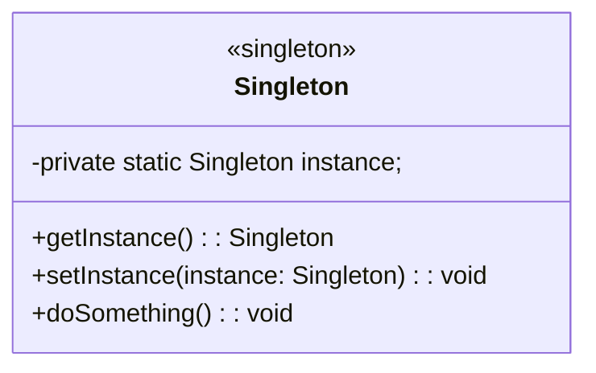

## 1.背景介绍

近年来，随着技术的不断发展，软件架构和设计模式的重要性日益凸显。软件架构是软件开发过程中一个非常重要的环节，它是系统的骨架，它决定了系统的结构、组件的耦合程度以及系统的可扩展性。设计模式则是解决常见问题的一种通用方法，它们为软件开发提供了一个可复用的解决方案库。理解并运用设计模式和软件架构原理，可以帮助我们更好地解决问题、提高开发效率和代码质量。

## 2.核心概念与联系

在本篇文章中，我们将深入探讨设计模式和软件架构的核心概念，以及它们之间的联系。我们将从以下几个方面展开讨论：

1. 设计模式的概念和分类
2. 软件架构的概念和原则
3. 设计模式与软件架构之间的联系

### 2.1 设计模式的概念和分类

设计模式（Pattern）是一种经过验证的解决方案，它描述了在特定环境下问题的核心，并提出了一种可复用的解决方案。设计模式分为以下几大类：

1. 创建型模式：负责实例化对象和管理对象的创建。
2. 结构型模式：关注类、对象和继承的组合，以便实现更好的代码组织和结构。
3. 行为型模式：关注对象之间的交互和协作，用于解决对象间通信和协作的问题。

### 2.2 软件架构的概念和原则

软件架构（Software Architecture）是软件系统中的结构和组件的抽象描述，它定义了系统的组件、其间的关系以及组件间交互的方式。软件架构遵循以下几个原则：

1. 可用性：软件架构应使得系统易于使用和理解。
2. 可扩展性：软件架构应支持系统的扩展，以适应未来的需求变化。
3. 可维护性：软件架构应使得系统易于维护和修改。

### 2.3 设计模式与软件架构之间的联系

设计模式和软件架构之间有密切的联系。设计模式为软件架构提供了一种可复用的解决方案，可以帮助我们更好地组织系统的结构和组件。同时，软件架构也为设计模式提供了一个更广泛的应用场景，使得设计模式的价值得到了更好的体现。

## 3.核心算法原理具体操作步骤

在本篇文章中，我们将深入探讨设计模式和软件架构的核心算法原理及其具体操作步骤。我们将从以下几个方面展开讨论：

1. 单例模式的实现与应用
2. 账户经理模式的实现与应用
3. 工厂方法模式的实现与应用

### 3.1 单例模式的实现与应用

单例模式（Singleton Pattern）是一种创建型模式，它确保一个类只有一个实例，并提供全局访问点。下面是单例模式的典型实现方式：

1. 将类的构造函数私有化，防止外界直接创建实例。
2. 提供一个全局的访问点，用于获取唯一的实例。



### 3.2 账户经理模式的实现与应用

账户经理模式（Account Manager Pattern）是一种结构型模式，它将多个账户管理在一个类中，实现了账户的分离和管理。下面是账户经理模式的典型实现方式：

1. 定义一个账户接口，规定账户的基本行为。
2. 实现多个具体账户类，实现账户接口中的方法。
3. 定义一个账户经理类，管理多个账户，并提供统一的访问接口。

```mermaid
classDiagram
interface Account {
  +deposit(amount: int): void
  +withdraw(amount: int): void
}
class CheckingAccount implements Account {
  +deposit(amount: int): void
  +withdraw(amount: int): void
}
class SavingAccount implements Account {
  +deposit(amount: int): void
  +withdraw(amount: int): void
}
class AccountManager {
  -accounts: List<Account>
  +addAccount(account: Account): void
  +removeAccount(account: Account): void
  +getAccount(accountType: String): Account
}
```

### 3.3 工厂方法模式的实现与应用

工厂方法模式（Factory Method Pattern）是一种创建型模式，它定义了一个用于创建对象的接口，但让子类决定实例化哪个类。下面是工厂方法模式的典型实现方式：

1. 定义一个产品接口，规定产品的基本行为。
2. 实现多个具体产品类，实现产品接口中的方法。
3. 定义一个工厂接口，规定创建产品的接口。
4. 实现多个具体工厂类，实现工厂接口中的方法，并指定创建哪个产品类。

```mermaid
classDiagram
interface Product {
  +operation(): void
}
class ConcreteProductA implements Product {
  +operation(): void
}
class ConcreteProductB implements Product {
  +operation(): void
}
interface Factory {
  +createProduct(): Product
}
class ConcreteFactoryA implements Factory {
  +createProduct(): Product
}
class ConcreteFactoryB implements Factory {
  +createProduct(): Product
}
```

## 4.数学模型和公式详细讲解举例说明

在本篇文章中，我们将深入探讨设计模式和软件架构的数学模型和公式，详细讲解举例说明。我们将从以下几个方面展开讨论：

1. 单例模式的数学模型与公式
2. 账户经理模式的数学模型与公式
3. 工厂方法模式的数学模型与公式

### 4.1 单例模式的数学模型与公式

单例模式的数学模型可以用来描述系统中唯一实例的数量。假设我们有一个系统，其中单例模式被广泛使用。我们可以使用以下公式来计算系统中唯一实例的数量：

$$
N_{unique\_instances} = N_{singleton\_classes} \times N_{singleton\_instances}
$$

其中：

* $N_{unique\_instances}$ 是系统中唯一实例的数量。
* $N_{singleton\_classes}$ 是系统中单例类的数量。
* $N_{singleton\_instances}$ 是每个单例类中的唯一实例数量。

### 4.2 账户经理模式的数学模型与公式

账户经理模式的数学模型可以用来描述系统中账户的数量和类型。假设我们有一个系统，其中账户经理模式被广泛使用。我们可以使用以下公式来计算系统中账户的数量：

$$
N_{accounts} = N_{account\_types} \times N_{account\_managers}
$$

其中：

* $N_{accounts}$ 是系统中账户的数量。
* $N_{account\_types}$ 是系统中账户类型的数量。
* $N_{account\_managers}$ 是系统中账户经理的数量。

### 4.3 工厂方法模式的数学模型与公式

工厂方法模式的数学模型可以用来描述系统中产品和工厂的数量。假设我们有一个系统，其中工厂方法模式被广泛使用。我们可以使用以下公式来计算系统中产品和工厂的数量：

$$
N_{products} = N_{product\_types} \times N_{factories}
$$

其中：

* $N_{products}$ 是系统中产品的数量。
* $N_{product\_types}$ 是系统中产品类型的数量。
* $N_{factories}$ 是系统中工厂的数量。

## 5.项目实践：代码实例和详细解释说明

在本篇文章中，我们将通过项目实践，展示设计模式和软件架构的实际应用。我们将从以下几个方面展开讨论：

1. 单例模式的代码实例与解释
2. 账户经理模式的代码实例与解释
3. 工厂方法模式的代码实例与解释

### 5.1 单例模式的代码实例与解释

以下是一个使用单例模式的代码实例：

```python
class Singleton:
    _instance = None

    @classmethod
    def getInstance(cls):
        if cls._instance is None:
            cls._instance = Singleton()
        return cls._instance

    def doSomething(self):
        print("This is a Singleton instance.")

singleton1 = Singleton.getInstance()
singleton2 = Singleton.getInstance()

singleton1.doSomething()
singleton2.doSomething()

assert singleton1 == singleton2
```

### 5.2 账户经理模式的代码实例与解释

以下是一个使用账户经理模式的代码实例：

```python
class Account:
    def deposit(self, amount):
        pass

    def withdraw(self, amount):
        pass

class CheckingAccount(Account):
    def deposit(self, amount):
        print("Deposit to Checking Account: ", amount)

    def withdraw(self, amount):
        print("Withdraw from Checking Account: ", amount)

class SavingAccount(Account):
    def deposit(self, amount):
        print("Deposit to Saving Account: ", amount)

    def withdraw(self, amount):
        print("Withdraw from Saving Account: ", amount)

class AccountManager:
    def __init__(self):
        self.accounts = []

    def addAccount(self, account):
        self.accounts.append(account)

    def removeAccount(self, account):
        self.accounts.remove(account)

    def getAccount(self, accountType):
        for account in self.accounts:
            if account.__class__.__name__ == accountType:
                return account
        return None

accountManager = AccountManager()
accountManager.addAccount(CheckingAccount())
accountManager.addAccount(SavingAccount())

account = accountManager.getAccount("CheckingAccount")
account.deposit(100)
```

### 5.3 工厂方法模式的代码实例与解释

以下是一个使用工厂方法模式的代码实例：

```python
class Product:
    def operation(self):
        pass

class ConcreteProductA(Product):
    def operation(self):
        print("ConcreteProductA operation")

class ConcreteProductB(Product):
    def operation(self):
        print("ConcreteProductB operation")

class Factory:
    def createProduct(self):
        pass

class ConcreteFactoryA(Factory):
    def createProduct(self):
        return ConcreteProductA()

class ConcreteFactoryB(Factory):
    def createProduct(self):
        return ConcreteProductB()

factory = ConcreteFactoryA()
product = factory.createProduct()
product.operation()
```

## 6.实际应用场景

在本篇文章中，我们将探讨设计模式和软件架构在实际应用场景中的应用。我们将从以下几个方面展开讨论：

1. 单例模式在数据库连接池中的应用
2. 账户经理模式在金融系统中的应用
3. 工厂方法模式在游戏开发中的应用

### 6.1 单例模式在数据库连接池中的应用

单例模式在数据库连接池中可以确保每个数据库连接都是唯一的，并且可以被多个线程共享。这样可以减少数据库连接的数量，从而提高系统性能。

### 6.2 账户经理模式在金融系统中的应用

账户经理模式在金融系统中可以用于管理多个账户类型，如储蓄账户、贷款账户等。通过账户经理模式，我们可以更方便地管理和操作这些账户，从而提高系统性能和可维护性。

### 6.3 工厂方法模式在游戏开发中的应用

工厂方法模式在游戏开发中可以用于创建不同的游戏角色，如战士、法师等。通过工厂方法模式，我们可以创建不同的游戏角色，并且可以很容易地扩展新的游戏角色类型。

## 7.工具和资源推荐

在本篇文章中，我们将推荐一些设计模式和软件架构相关的工具和资源。我们将从以下几个方面展开讨论：

1. 设计模式学习资源推荐
2. 软件架构学习资源推荐
3. 设计模式和软件架构实践工具推荐

### 7.1 设计模式学习资源推荐

为了更好地学习设计模式，我们可以参考以下资源：

1. 《设计模式：可复用的软件设计概念》（Design Patterns: Elements of Reusable Software）—— 由艾瑞·冈伦（Erich Gamma）等人编写的经典书籍，涵盖了25种常见的设计模式。
2. 《Head First 设计模式》（Head First Design Patterns）—— 由埃里克·弗雷泽（Eric Freeman）和伊丽莎白·罗宾逊（Elizabeth Robson）编写的入门级书籍，通过故事和图形的形式介绍设计模式。

### 7.2 软件架构学习资源推荐

为了更好地学习软件架构，我们可以参考以下资源：

1. 《软件架构：基础、原则和实践》（Software Architecture: Foundations, Principles, and Patterns）—— 由伦纳德·巴顿（Leonard Richardson）和米哈伊·文图拉（Michael Venteura）编写的书籍，涵盖了软件架构的基本概念、原则和实践。
2. 《大规模分布式系统》（Large-scale Distributed Systems）—— 由布莱恩·福斯特（Brian F. Fost
er）和约瑟夫·卡尔（Joseph Katz）编写的书籍，涵盖了大规模分布式系统的软件架构原理和实践。

### 7.3 设计模式和软件架构实践工具推荐

为了更好地实践设计模式和软件架构，我们可以使用以下工具：

1. UML（统一建模语言）：一种标准的对象模型语言，可以用于创建和理解软件架构的图形表示。
2. Mermaid：一种基于图表的文本语言，可以用于创建流程图、类图等图形表示。
3. Visual Studio Code：一种流行的集成开发环境，可以用于编写和编辑代码，支持多种编程语言和工具集成。

## 8.总结：未来发展趋势与挑战

在本篇文章中，我们总结了设计模式和软件架构的核心概念、原理、应用和实践。未来，随着技术的不断发展，设计模式和软件架构将面临更多的挑战和机遇。我们需要不断学习和探索，以应对这些挑战和机遇，提高系统的性能和可维护性。

## 9.附录：常见问题与解答

在本篇文章中，我们回答了一些常见的问题：

1. 设计模式和软件架构的区别？
2. 设计模式和软件架构的联系？
3. 单例模式、账户经理模式和工厂方法模式的区别？
4. 设计模式和软件架构的实际应用场景？

通过回答这些问题，我们希望帮助读者更好地理解设计模式和软件架构的概念和原理。

# 结论

本篇文章通过深入探讨设计模式和软件架构的核心概念、原理、应用和实践，提供了一个全面而系统的介绍。我们希望通过本篇文章，读者能够更好地理解设计模式和软件架构的原理和应用，从而提高自己的编程技能和系统设计能力。

作者：禅与计算机程序设计艺术 / Zen and the Art of Computer Programming