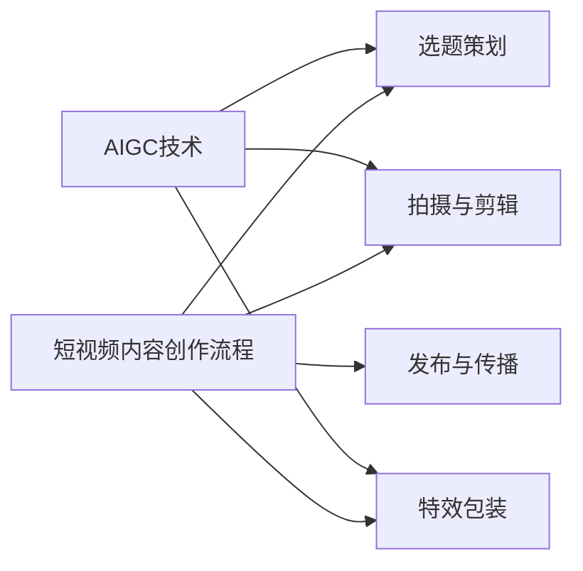

# AIGC从入门到实战：让 AI 辅助短视频创作，掌握了流量密码，再也不怕石沉大海

## 1. 背景介绍
### 1.1 短视频的兴起与发展
#### 1.1.1 短视频的定义与特点
#### 1.1.2 短视频平台的发展历程
#### 1.1.3 短视频的市场规模与用户规模

### 1.2 短视频创作的机遇与挑战  
#### 1.2.1 短视频创作的低门槛
#### 1.2.2 短视频创作的高竞争
#### 1.2.3 如何在短视频红海中突围

### 1.3 AIGC技术概述
#### 1.3.1 什么是AIGC
#### 1.3.2 AIGC的发展现状
#### 1.3.3 AIGC在内容创作领域的应用前景

## 2. 核心概念与联系
### 2.1 短视频内容创作流程
#### 2.1.1 选题策划
#### 2.1.2 拍摄与剪辑
#### 2.1.3 特效包装
#### 2.1.4 发布与传播

### 2.2 AIGC在短视频创作中的应用
#### 2.2.1 AI辅助选题与策划
#### 2.2.2 AI辅助视频拍摄
#### 2.2.3 AI辅助视频剪辑
#### 2.2.4 AI辅助特效制作

### 2.3 AIGC与短视频创作的融合

## 3. 核心算法原理具体操作步骤
### 3.1 基于深度学习的视频内容理解
#### 3.1.1 视频帧分割与关键帧提取
#### 3.1.2 视频内容标注与语义理解
#### 3.1.3 视频主题与情感分析

### 3.2 基于GAN的视频生成与优化
#### 3.2.1 GAN的基本原理
#### 3.2.2 基于GAN的视频补帧技术
#### 3.2.3 基于GAN的视频超分辨率重建
#### 3.2.4 基于GAN的视频风格迁移

### 3.3 基于强化学习的视频剪辑
#### 3.3.1 MDP模型构建
#### 3.3.2 价值网络与策略网络设计
#### 3.3.3 奖励函数设计
#### 3.3.4 训练与推理过程

## 4. 数学模型和公式详细讲解举例说明
### 4.1 深度学习中的数学基础
#### 4.1.1 神经网络的数学表示
$$ h_i = \sigma(\sum_{j=1}^{n}w_{ij}x_j + b_i) $$
#### 4.1.2 损失函数与优化算法
$$ J(\theta) = -\frac{1}{m} \sum_{i=1}^{m}y^{(i)}\log(h_\theta(x^{(i)}))+(1-y^{(i)})\log(1-h_\theta(x^{(i)}))$$
#### 4.1.3 反向传播算法推导

### 4.2 GAN的数学原理
#### 4.2.1 生成器与判别器的博弈过程
$$\min_G \max_D V(D,G) = \mathbb{E}_{x\sim p_{data}(x)}[\log D(x)] + \mathbb{E}_{z\sim p_z(z)}[\log (1-D(G(z)))]$$
#### 4.2.2 GAN的收敛性分析
#### 4.2.3 WGAN、LSGAN等改进

### 4.3 强化学习的数学建模
#### 4.3.1 MDP的数学定义
$$\langle S, A, P, R, \gamma \rangle$$
#### 4.3.2 值函数与贝尔曼方程
$$V^\pi(s)=\sum_{a\in A}\pi(a|s)\sum_{s'\in S}P(s'|s,a)[R(s,a,s')+\gamma V^\pi(s')]$$
#### 4.3.3 策略梯度定理
$$\nabla_\theta J(\theta) = \mathbb{E}_{\tau \sim \pi_\theta}[\sum_{t=0}^{T}\nabla_\theta \log \pi_\theta(a_t|s_t)Q^{\pi_\theta}(s_t,a_t)]$$

## 5. 项目实践：代码实例和详细解释说明
### 5.1 视频内容理解模块
#### 5.1.1 视频帧提取的Python实现
#### 5.1.2 视频内容标注的TensorFlow实现
#### 5.1.3 视频主题分类的PyTorch实现

### 5.2 视频生成与优化模块 
#### 5.2.1 DCGAN在视频补帧中的应用
#### 5.2.2 CycleGAN在视频风格迁移中的应用
#### 5.2.3 ESRGAN在视频超分辨率中的应用

### 5.3 视频剪辑模块
#### 5.3.1 基于DQN的视频剪辑决策
#### 5.3.2 基于PPO的视频剪辑优化
#### 5.3.3 视频剪辑效果评估与对比

## 6. 实际应用场景
### 6.1 Vlog创作中的应用
#### 6.1.1 个人Vlog选题与内容生成
#### 6.1.2 Vlog素材的智能筛选与组织
#### 6.1.3 Vlog剪辑与特效的AI辅助

### 6.2 广告营销视频制作中的应用 
#### 6.2.1 广告创意的AI辅助生成
#### 6.2.2 广告视频的智能拍摄与剪辑
#### 6.2.3 广告视频的个性化定制

### 6.3 直播带货中的应用
#### 6.3.1 直播选品的AI辅助
#### 6.3.2 直播画面的实时优化
#### 6.3.3 弹幕互动的智能响应

## 7. 工具和资源推荐
### 7.1 视频内容理解工具
#### 7.1.1 商业工具：旷视、商汤等
#### 7.1.2 开源工具：MMAction2、TSN等

### 7.2 视频生成与优化工具
#### 7.2.1 商业工具：RunwayML、Synthesia等
#### 7.2.2 开源工具：Vid2Vid、Few-Shot-Vid2Vid等

### 7.3 视频剪辑工具
#### 7.3.1 商业工具：剪映、创客贴等
#### 7.3.2 开源工具：PySceneDetect、Jumpcutter等

### 7.4 学习资源推荐
#### 7.4.1 相关课程：CS231n、CS294等
#### 7.4.2 论文合集：CVPR、ICCV、ECCV等
#### 7.4.3 开源项目：Awesome-AIGC、Awesome-GAN等

## 8. 总结：未来发展趋势与挑战
### 8.1 AIGC技术的发展趋势
#### 8.1.1 多模态内容生成
#### 8.1.2 知识引导的内容生成
#### 8.1.3 人机协作内容创作

### 8.2 AIGC在短视频领域面临的挑战
#### 8.2.1 版权与内容审核问题
#### 8.2.2 创作者的角色定位问题
#### 8.2.3 技术门槛与成本问题

### 8.3 AIGC赋能短视频创作的展望
#### 8.3.1 降低创作门槛，激发更多创造力
#### 8.3.2 提升内容质量，创造更多价值
#### 8.3.3 拓展应用场景，开启创作新纪元

## 9. 附录：常见问题与解答
### 9.1 AIGC会取代人工创作吗？
### 9.2 AIGC生成的视频是否有版权？
### 9.3 普通创作者如何学习使用AIGC？
### 9.4 AIGC生成的视频质量如何保证？
### 9.5 如何权衡AIGC创作的效率和成本？

作者：禅与计算机程序设计艺术 / Zen and the Art of Computer Programming