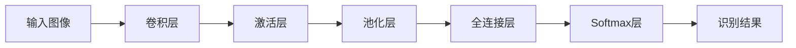

# 一切皆是映射：神经网络在图像识别中的应用案例

## 1. 背景介绍
### 1.1 图像识别的重要性
### 1.2 传统图像识别方法的局限性
### 1.3 神经网络在图像识别中的优势

## 2. 核心概念与联系
### 2.1 神经网络基础
#### 2.1.1 神经元模型
#### 2.1.2 激活函数
#### 2.1.3 网络结构
### 2.2 卷积神经网络(CNN)
#### 2.2.1 卷积层
#### 2.2.2 池化层  
#### 2.2.3 全连接层
### 2.3 图像识别中的关键概念
#### 2.3.1 特征提取
#### 2.3.2 分类器
#### 2.3.3 损失函数与优化器

## 3. 核心算法原理具体操作步骤
### 3.1 数据预处理
#### 3.1.1 图像归一化
#### 3.1.2 数据增强
### 3.2 CNN架构设计
#### 3.2.1 经典CNN模型
#### 3.2.2 残差网络(ResNet)  
#### 3.2.3 注意力机制(Attention)
### 3.3 训练过程
#### 3.3.1 前向传播
#### 3.3.2 反向传播
#### 3.3.3 参数更新

## 4. 数学模型和公式详细讲解举例说明
### 4.1 卷积运算
### 4.2 池化运算
### 4.3 Softmax分类器
### 4.4 交叉熵损失函数

## 5. 项目实践：代码实例和详细解释说明
### 5.1 开发环境搭建
### 5.2 数据集准备
### 5.3 模型构建与训练
### 5.4 模型评估与优化

## 6. 实际应用场景
### 6.1 人脸识别
### 6.2 车辆识别
### 6.3 医学影像分析
### 6.4 遥感图像分类

## 7. 工具和资源推荐 
### 7.1 深度学习框架
#### 7.1.1 TensorFlow
#### 7.1.2 PyTorch
#### 7.1.3 Keras
### 7.2 数据集资源
#### 7.2.1 ImageNet
#### 7.2.2 COCO
#### 7.2.3 Pascal VOC
### 7.3 预训练模型
#### 7.3.1 VGG
#### 7.3.2 Inception
#### 7.3.3 MobileNet

## 8. 总结：未来发展趋势与挑战
### 8.1 轻量化模型
### 8.2 无监督/自监督学习
### 8.3 跨模态学习
### 8.4 数据隐私与安全

## 9. 附录：常见问题与解答
### 9.1 如何选择合适的CNN模型？
### 9.2 如何处理过拟合问题？
### 9.3 如何加速模型训练？
### 9.4 如何进行模型部署？

图像识别是计算机视觉领域的一个核心问题,其目标是让计算机能够像人一样"看"到并理解图像内容。传统的图像识别方法主要依赖于手工设计的特征提取算法,如SIFT、HOG等,然而这些方法在面对复杂场景时往往表现不佳。近年来,以深度学习为代表的人工智能技术取得了长足进步,尤其是卷积神经网络(CNN)在图像识别任务上展现出了卓越的性能,成为该领域的主流方法。

CNN的核心思想是通过局部连接和权值共享,利用卷积核对图像进行特征提取,再经过池化操作实现特征选择和降维,最后通过全连接层完成分类预测。这种端到端的学习方式克服了手工特征的局限性,能够自动学习到图像的层次化特征表示。从数学本质上看,CNN实现了一种特征空间到标签空间的非线性映射,即将高维图像数据映射到低维类别标签。

为了更好地理解CNN的工作原理,我们首先需要了解其基本组成部分。卷积层是CNN的核心模块,它通过滑动窗口对图像进行局部感受野扫描,提取不同尺度和抽象层次的特征。卷积运算可以表示为:

$$
\mathbf{Y} = \mathbf{W} * \mathbf{X} + \mathbf{b}
$$

其中$\mathbf{X}$为输入特征图,$\mathbf{W}$为卷积核参数,$\mathbf{b}$为偏置项,$*$表示卷积操作。卷积结果经过激活函数(如ReLU)处理后得到输出特征图$\mathbf{Y}$。池化层通过对局部区域进行下采样,实现特征压缩和旋转平移不变性。常见的池化操作包括最大池化和平均池化。全连接层将提取到的高层特征"拉平"并映射到类别标签空间,起到"分类器"的作用。

除了经典的CNN架构(如LeNet、AlexNet)外,研究者们还提出了许多改进模型,如VGGNet、GoogLeNet、ResNet等,不断刷新着图像识别的性能记录。这些模型通过加深网络层数、引入新的连接方式(如残差连接)、设计更高效的卷积模块(如Inception)等策略,进一步提升了CNN的特征表示和分类能力。

下面我们通过一个案例来演示如何使用CNN进行图像识别。以手写数字识别为例,我们采用经典的MNIST数据集,其中包含60000张训练图像和10000张测试图像,每张图像大小为28x28。我们使用Keras框架来构建和训练CNN模型,主要步骤如下:

1. 数据预处理:将图像像素值归一化到[0,1]区间,并进行维度变换以适配CNN输入。

```python
(x_train, y_train), (x_test, y_test) = mnist.load_data()
x_train = x_train.reshape((60000, 28, 28, 1)) / 255.0
x_test = x_test.reshape((10000, 28, 28, 1)) / 255.0
```

2. 构建CNN模型:定义卷积层、池化层和全连接层,并指定激活函数和优化器。

```python
model = Sequential()
model.add(Conv2D(32, (3, 3), activation='relu', input_shape=(28, 28, 1))) 
model.add(MaxPooling2D((2, 2)))
model.add(Conv2D(64, (3, 3), activation='relu')) 
model.add(MaxPooling2D((2, 2)))
model.add(Conv2D(64, (3, 3), activation='relu'))
model.add(Flatten())
model.add(Dense(64, activation='relu'))
model.add(Dense(10, activation='softmax'))

model.compile(optimizer='adam',
              loss='sparse_categorical_crossentropy',
              metrics=['accuracy'])
```

3. 训练模型:指定训练轮数和批量大小,并使用早停法避免过拟合。

```python
model.fit(x_train, y_train, epochs=5, batch_size=64, 
          validation_data=(x_test, y_test),
          callbacks=[EarlyStopping(patience=2)])
```

4. 评估模型:在测试集上评估模型性能,输出分类准确率。

```python
test_loss, test_acc = model.evaluate(x_test, y_test)
print('Test accuracy:', test_acc)
```

通过短短几十行代码,我们就构建了一个能够识别手写数字的CNN模型。该模型在测试集上的准确率可达99%以上,展现了CNN强大的图像识别能力。

在实际应用中,CNN已经被广泛用于人脸识别、车辆检测、医学影像分析等领域,极大地推动了人工智能在图像理解方面的进步。以人脸识别为例,通过在海量人脸数据上训练CNN模型,我们可以构建高效的人脸特征提取器和比对引擎,应用于安防监控、身份认证等场景。



上图展示了一个典型的CNN人脸识别流程。输入的人脸图像首先经过多个卷积层和池化层,提取出鲁棒性良好的人脸特征表示,然后通过全连接层映射到一个特定维度的特征向量空间,最后使用Softmax分类器输出不同身份的概率分布。整个过程可以看作是一个"编码-解码"的映射过程,卷积层负责对人脸进行特征编码,全连接层负责对身份进行解码预测。

当然,图像识别领域的发展仍然面临诸多挑战:

1. 如何进一步提高模型的泛化能力和鲁棒性,特别是在应对光照、姿态、遮挡等复杂变化时。

2. 如何降低模型的计算开销和存储开销,实现实时高效的推理。

3. 如何利用无监督/自监督学习等范式,突破有标注数据的瓶颈。

4. 如何实现跨模态的特征融合和知识迁移,提升模型的语义理解能力。

5. 如何保护数据隐私和模型安全,防止隐私泄露和对抗攻击。

展望未来,图像识别技术还将不断突破,向着更加智能、高效、安全、普适的方向发展。一方面,我们需要设计更加精巧的CNN模型架构,探索新的特征表示和学习范式。另一方面,我们需要加强算法与硬件的协同设计,针对不同应用场景进行模型裁剪和压缩。同时,我们还需要重视模型的可解释性和隐私保护,赋予图像识别系统更好的透明性和安全性。

总之,CNN为图像识别这一具有挑战性的任务提供了一种优雅而高效的解决方案。它以端到端的学习方式,实现了图像特征到类别标签的映射,展现了深度学习在计算机视觉领域的巨大潜力。CNN所倡导的"一切皆是映射"的思想,也为我们理解和探索人工智能的奥秘提供了新的视角。站在时代的潮头,让我们携手共进,开启图像识别的新篇章。

作者：禅与计算机程序设计艺术 / Zen and the Art of Computer Programming