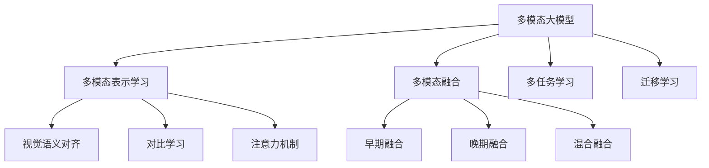

# 多模态大模型：技术原理与实战 多模态大模型在教育培训领域的应用

## 1. 背景介绍

### 1.1 人工智能的发展历程
人工智能(Artificial Intelligence, AI)是当代科技发展的核心驱动力之一。自20世纪50年代诞生以来,AI经历了几个重要的发展阶段:

- 早期专家系统时代(1950s-1970s)
- 知识库和规则引擎时代(1980s-1990s)
- 统计机器学习时代(1990s-2010s)
- 深度学习时代(2010s-至今)

### 1.2 大模型的兴起
近年来,随着算力、数据和模型规模的不断增长,大模型(Large Model)成为人工智能发展的新趋势。大模型通过预训练海量数据,获得了强大的泛化能力和语义理解能力。代表性的大模型包括:

- GPT-3(2020)
- PaLM(2022)
- ChatGPT(2022)

### 1.3 多模态大模型的重要性
传统的大模型主要关注单一模态(如文本)的处理,而多模态大模型(Multimodal Large Model)则可以同时处理多种模态数据,如文本、图像、视频、音频等。多模态大模型的优势在于:

- 更贴近真实世界的多模态数据
- 不同模态之间的相互增强和协同处理
- 更广阔的应用场景,如教育培训、辅助诊断等

## 2. 核心概念与联系

### 2.1 多模态表示学习
多模态表示学习(Multimodal Representation Learning)是多模态大模型的核心技术,旨在从不同模态的输入数据中学习统一的表示空间。常见的方法包括:

- 早期的特征级融合和决策级融合
- 基于注意力机制的跨模态交互
- 视觉语义对齐和对比学习

### 2.2 多模态融合
多模态融合(Multimodal Fusion)是将不同模态的特征进行融合的过程,可分为:

- 早期融合(Early Fusion):在特征提取阶段进行融合
- 晚期融合(Late Fusion):在决策阶段进行融合
- 混合融合(Hybrid Fusion):结合早期和晚期融合

### 2.3 多任务学习
多任务学习(Multi-Task Learning)是指在同一个模型中同时学习多个相关任务,以提高模型的泛化能力和效率。在多模态大模型中,多任务学习可以帮助模型从不同模态和任务中获取共享知识。

### 2.4 迁移学习
迁移学习(Transfer Learning)是指将在一个领域或任务中学习到的知识迁移到另一个领域或任务中。对于多模态大模型,迁移学习可以帮助模型在有限的数据和计算资源下实现更好的性能。

### 2.5 概念关系图



## 3. 核心算法原理具体操作步骤

### 3.1 视觉语义对齐
视觉语义对齐(Visual-Semantic Alignment)是多模态表示学习的关键技术之一,旨在将视觉和语义信息映射到同一个表示空间中。常见的方法包括:

1. 构建视觉-文本对数据集
2. 使用双编码器(双塔)结构,分别编码图像和文本
3. 最小化图像和文本表示之间的对比损失(Contrastive Loss)
4. 在相似的图像-文本对之间最大化相似度,在不相似对之间最小化相似度

### 3.2 对比学习
对比学习(Contrastive Learning)是无监督表示学习的一种范式,通过最大化相似样本之间的相似度,最小化不相似样本之间的相似度,来学习数据的潜在表示。在多模态大模型中,对比学习可以用于:

1. 单模态表示学习(如图像、文本)
2. 跨模态对齐(如图像-文本对齐)
3. 模态不变性建模(如同一概念在不同模态下的一致性)

### 3.3 注意力机制
注意力机制(Attention Mechanism)是深度学习中的一种关键技术,可以自适应地捕获输入数据中不同部分的重要性。在多模态大模型中,注意力机制被广泛用于:

1. 自注意力(Self-Attention):捕获单个模态内部的长程依赖关系
2. 跨模态注意力(Cross-Modal Attention):建立不同模态之间的相互关系
3. 多头注意力(Multi-Head Attention):从不同子空间捕获不同的注意力模式

### 3.4 多模态融合
多模态融合是将不同模态的特征进行融合的过程,常见的融合方式包括:

1. 特征级融合(Feature-Level Fusion):
   - 将不同模态的特征拼接或加权求和
   - 常用于早期融合和混合融合
2. 模态级融合(Modality-Level Fusion):
   - 使用门控机制动态调节不同模态的重要性
   - 常用于晚期融合和混合融合

### 3.5 多任务学习
多任务学习可以通过以下步骤在多模态大模型中实现:

1. 定义多个相关任务(如图像分类、文本生成等)
2. 构建共享编码器,用于从不同模态中提取通用特征
3. 为每个任务构建特定的解码器头(Task-Specific Decoder Head)
4. 在训练过程中,交替优化不同任务的损失函数

### 3.6 迁移学习
在多模态大模型中,迁移学习可以通过以下步骤实现:

1. 在源域(Source Domain)上预训练模型
2. 在目标域(Target Domain)上进行微调(Fine-Tuning)
   - 冻结部分层的权重
   - 只微调部分层的权重
3. 使用正则化技术(如L1/L2正则化、Dropout等)防止过拟合
4. 探索不同的微调策略和超参数设置

## 4. 数学模型和公式详细讲解举例说明

### 4.1 视觉语义对齐损失函数
视觉语义对齐常使用对比损失函数(Contrastive Loss)来优化,其中一种常见形式为:

$$
\mathcal{L}_\text{contrast} = -\mathbb{E}_{\substack{(i,j) \sim P_\text{pos} \\ (i,k) \sim P_\text{neg}}} \left[ \log \frac{\exp(\text{sim}(z_i, z_j) / \tau)}{\exp(\text{sim}(z_i, z_j) / \tau) + \sum_{k \neq i} \exp(\text{sim}(z_i, z_k) / \tau)} \right]
$$

其中:

- $z_i$和$z_j$分别表示图像和文本的表示向量
- $P_\text{pos}$和$P_\text{neg}$分别表示正样本对和负样本对的分布
- $\text{sim}(\cdot, \cdot)$是相似度函数,如点积相似度或余弦相似度
- $\tau$是温度超参数,用于控制相似度分布的平滑程度

目标是最大化正样本对的相似度,最小化负样本对的相似度。

### 4.2 注意力机制
注意力机制的核心思想是为每个输入元素分配一个权重,表示其对输出的重要性。常见的注意力机制包括:

1. 加性注意力(Additive Attention):
   $$
   \alpha_{i,j} = \frac{\exp(e_{i,j})}{\sum_k \exp(e_{i,k})}, \quad e_{i,j} = v^\top \tanh(W_q q_i + W_k k_j)
   $$

2. 缩放点积注意力(Scaled Dot-Product Attention):
   $$
   \text{Attention}(Q, K, V) = \text{softmax}\left(\frac{QK^\top}{\sqrt{d_k}}\right)V
   $$

其中$Q$、$K$、$V$分别表示查询(Query)、键(Key)和值(Value)。

### 4.3 多任务学习损失函数
在多任务学习中,常使用加权损失函数来联合优化多个任务:

$$
\mathcal{L}_\text{total} = \sum_{t=1}^T \lambda_t \mathcal{L}_t
$$

其中:

- $T$是任务数量
- $\mathcal{L}_t$是第$t$个任务的损失函数
- $\lambda_t$是第$t$个任务的权重,可以是预定义的常数或者根据任务重要性动态调整

通过权衡不同任务的重要性,可以实现更好的性能权衡。

### 4.4 迁移学习正则化
在迁移学习过程中,常使用正则化技术来防止过拟合,如L1/L2正则化:

$$
\mathcal{L}_\text{reg} = \mathcal{L}_\text{task} + \lambda \| \theta \|_p
$$

其中:

- $\mathcal{L}_\text{task}$是任务损失函数
- $\| \theta \|_p$是模型参数的$L_p$范数,如$L_1$范数($p=1$)或$L_2$范数($p=2$)
- $\lambda$是正则化强度的超参数

正则化可以约束模型参数的大小,从而提高模型的泛化能力。

## 5. 项目实践: 代码实例和详细解释说明

以下是一个基于PyTorch实现的多模态融合示例:

```python
import torch
import torch.nn as nn

# 定义图像编码器
class ImageEncoder(nn.Module):
    def __init__(self):
        super().__init__()
        self.conv = nn.Conv2d(3, 64, kernel_size=3, padding=1)
        self.pool = nn.MaxPool2d(2, 2)
        self.fc = nn.Linear(64 * 14 * 14, 512)

    def forward(self, x):
        x = self.pool(torch.relu(self.conv(x)))
        x = torch.flatten(x, 1)
        x = torch.relu(self.fc(x))
        return x

# 定义文本编码器
class TextEncoder(nn.Module):
    def __init__(self, vocab_size, embedding_dim):
        super().__init__()
        self.embedding = nn.Embedding(vocab_size, embedding_dim)
        self.lstm = nn.LSTM(embedding_dim, 512, batch_first=True)

    def forward(self, x):
        x = self.embedding(x)
        _, (h, _) = self.lstm(x)
        return h.squeeze(0)

# 定义多模态融合模块
class MultimodalFusion(nn.Module):
    def __init__(self, image_encoder, text_encoder):
        super().__init__()
        self.image_encoder = image_encoder
        self.text_encoder = text_encoder
        self.fusion = nn.Linear(1024, 512)

    def forward(self, image, text):
        image_feat = self.image_encoder(image)
        text_feat = self.text_encoder(text)
        fused_feat = torch.cat((image_feat, text_feat), dim=1)
        fused_feat = torch.relu(self.fusion(fused_feat))
        return fused_feat
```

在这个示例中:

1. `ImageEncoder`和`TextEncoder`分别对图像和文本进行编码,获得对应的特征向量。
2. `MultimodalFusion`模块将图像和文本特征进行拼接,然后使用全连接层进行融合。
3. 融合后的特征向量可以用于下游任务,如分类、回归等。

该示例展示了如何在PyTorch中实现简单的多模态融合。在实际应用中,您可以根据具体需求调整编码器和融合模块的结构。

## 6. 实际应用场景

### 6.1 教育培训领域
多模态大模型在教育培训领域具有广阔的应用前景:

1. **智能教学助手**
   - 利用多模态大模型构建智能教学助手,可以同时处理课件(文本、图像、视频等)和学生提问(文本、语音等)
   - 为学生提供个性化的学习体验和及时的反馈

2. **在线课程优化**
   - 分析在线课程中的多模态数据(如讲师视频、课件、学生互动等)
   - 优化课程内容和教学方式,提高学习效果

3. **教育资源智能检索**
   - 构建多模态教育资源库(如课件、视频、练习等)
   - 基于多模态大模型实现智能检索和推荐