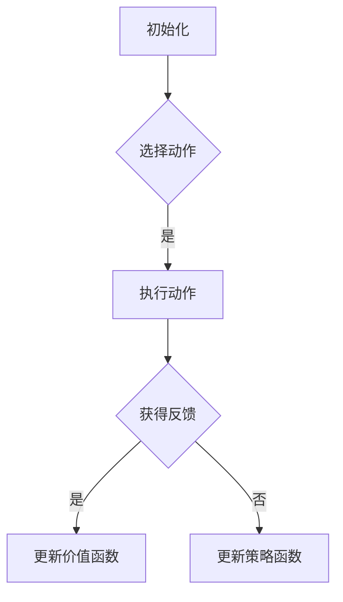

## 背景介绍

强化学习（Reinforcement Learning，RL）是机器学习的一个分支，研究如何让智能体通过与环境的交互学习，逐步优化其行为，以实现一定的目标。强化学习的核心思想是通过探索和利用策略来学习与环境交互的最佳方法。强化学习在人工智能、机器学习、计算机视觉等领域有着广泛的应用前景。

## 核心概念与联系

强化学习的基本组件有：智能体（Agent）、环境（Environment）和动作（Action）。智能体与环境之间进行交互，通过执行动作来影响环境，并根据环境的反馈来调整策略。强化学习的目标是找到一种策略，使得智能体在任何给定状态下都可以选择最佳的动作，从而实现最优的累积奖励（Cumulative Reward）。

强化学习的主要挑战是探索和利用策略之间的平衡。过多的探索可能导致智能体的行为不稳定，而过多的利用可能导致智能体陷入局部最优。强化学习的主要策略包括价值函数（Value Function）、策略函数（Policy Function）和Q学习（Q-Learning）等。

## 核心算法原理具体操作步骤

强化学习算法的核心原理是通过迭代地更新智能体的策略来实现学习。以下是一个简化的强化学习算法流程图：



1. 初始化：智能体在一个初始状态下开始与环境交互。
2. 选择动作：智能体根据当前状态和策略函数选择一个动作。
3. 执行动作：智能体执行选定的动作，并得到环境的反馈。
4. 获得反馈：智能体根据环境的反馈更新价值函数和策略函数。
5. 更新价值函数：根据当前状态和奖励函数更新价值函数。
6. 更新策略函数：根据当前状态和价值函数更新策略函数。

## 数学模型和公式详细讲解举例说明

强化学习的数学模型通常包括状态空间（State Space）、动作空间（Action Space）、奖励函数（Reward Function）和策略函数（Policy Function）等。以下是一个简单的强化学习模型示例：

1. 状态空间：$S$，表示环境中所有可能的状态。
2. 动作空间：$A$，表示环境中所有可能的动作。
3. 奖励函数：$R(s, a)$，表示在状态$s$下执行动作$a$所获得的奖励。
4. 策略函数：$π(s)$，表示在状态$s$下选择动作$a$的概率。

强化学习的目标是找到一种策略，使得智能体在任何给定状态下都可以选择最佳的动作。例如，Q学习（Q-Learning）是一种常见的强化学习算法，它使用一个Q表来存储每个状态动作对的价值。Q学习的更新公式如下：

$$Q(s, a) \leftarrow Q(s, a) + α[R(s, a) + γmax_{a'} Q(s', a') - Q(s, a)]$$

其中，$α$是学习率，$γ$是折扣因子。

## 项目实践：代码实例和详细解释说明

以下是一个简单的强化学习项目实例，使用Python和OpenAI Gym库实现一个Q学习算法来学习玩Flappy Bird游戏。

1. 安装OpenAI Gym库：

```bash
pip install gym
```

2. 下载Flappy Bird游戏环境：

```bash
pip install gym[atari]
```

3. 实现Q学习算法：

```python
import gym
import numpy as np

# 创建Flappy Bird游戏环境
env = gym.make('FlappyBird-v0')
env.reset()

# 初始化Q表
Q = np.zeros((env.observation_space.n, env.action_space.n))

# 设置学习率和折扣因子
alpha = 0.1
gamma = 0.99

# 定义一个训练循环
for episode in range(1000):
    state = env.reset()
    done = False
    
    while not done:
        # 选择动作
        if np.random.uniform(0, 1) < epsilon:
            action = env.action_space.sample()
        else:
            action = np.argmax(Q[state, :])
        
        # 执行动作
        next_state, reward, done, info = env.step(action)
        
        # 更新Q表
        Q[state, action] = Q[state, action] + alpha * (reward + gamma * np.max(Q[next_state, :]) - Q[state, action])
        
        # 更新状态
        state = next_state
```

## 实际应用场景

强化学习在很多实际应用场景中都有广泛的应用，例如：

1. 机器人学习：强化学习可以帮助机器人学习如何在复杂的环境中移动和避免障碍物。
2. 金融投资：强化学习可以帮助投资者学习如何在股票市场中选择最佳投资策略。
3. 游戏开发：强化学习可以帮助开发者设计更智能的游戏角色。

## 工具和资源推荐

强化学习领域有很多优秀的工具和资源，以下是一些建议：

1. OpenAI Gym：是一个广泛使用的机器学习框架，提供了许多预先训练好的强化学习环境。
2. TensorFlow：一个流行的深度学习框架，可以用来实现强化学习算法。
3. Sutton & Barto：《强化学习原理与算法》（Reinforcement Learning: An Introduction）是一本经典的强化学习教材。

## 总结：未来发展趋势与挑战

强化学习是一项 rapidly evolving 技术，随着深度学习和计算能力的不断提高，强化学习在各个领域的应用空间也在不断扩大。然而，强化学习也面临着一些挑战，例如非确定性、局部最优化等。未来，强化学习将会在更多领域发挥重要作用，成为未来人工智能的重要组成部分。

## 附录：常见问题与解答

1. 强化学习和监督学习的区别是什么？
强化学习与监督学习是两种不同的机器学习方法。监督学习需要标记的训练数据，而强化学习则需要智能体与环境的交互来学习。监督学习通常用于分类和回归任务，而强化学习通常用于控制和决策任务。
2. Q学习和深度Q学习的区别是什么？
Q学习是一种经典的强化学习算法，它使用一个Q表来存储状态动作对的价值。深度Q学习（Deep Q-Learning）是一种使用深度神经网络实现的Q学习算法，它可以处理大规模的状态空间和动作空间。