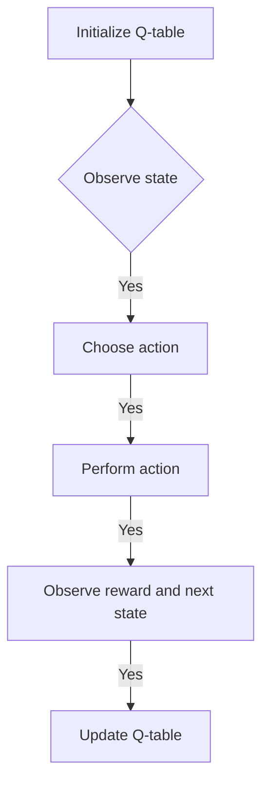
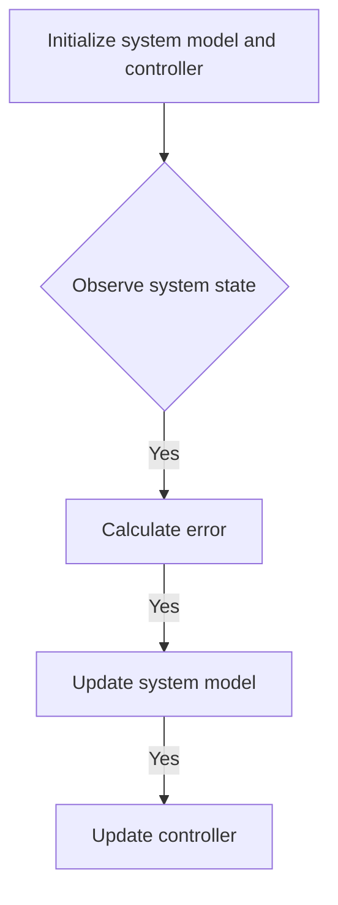

## 背景介绍

强化学习（Reinforcement Learning, RL）和自适应控制（Adaptive Control）是计算机科学和控制工程领域中两个重要的研究方向。强化学习是一种机器学习方法，通过与环境的交互来学习最佳行动策略；而自适应控制则是一种动态系统控制方法，能够根据系统的状态调整控制策略。两者都在机器人、自动驾驶、游戏、金融等领域中得到了广泛的应用。

本文旨在深入探讨强化学习与自适应控制的原理、算法、数学模型以及实际应用案例。通过分析、解释和实例说明，我们希望帮助读者深入理解这些领域的核心概念和技术。

## 核心概念与联系

### 1.1 强化学习基本概念

强化学习是一种通过与环境交互来学习行为策略的方法。其核心概念包括：状态、动作、奖励和策略。状态（State）是环境中的一个特定时刻的描述，动作（Action）是agent（智能体）可以执行的操作，奖励（Reward）是agent通过执行动作获得的反馈信息，策略（Policy）是agent根据状态选择动作的规则。

### 1.2 自适应控制基本概念

自适应控制是一种能够根据系统状态调整控制策略的方法。其核心概念包括：系统模型、控制策略和适应性机制。系统模型（System Model）描述了系统的行为规律，控制策略（Control Policy）是agent根据系统模型选择操作的规则，适应性机制（Adaptivity Mechanism）是agent根据系统状态调整控制策略的方法。

## 核心算法原理具体操作步骤

### 2.1 强化学习算法原理

强化学习算法的核心原理是通过与环境的交互来学习最佳策略。常见的强化学习算法包括Q-learning、Deep Q Network (DQN)和Policy Gradient。以下是一个简化的Q-learning算法流程图：



### 2.2 自适应控制算法原理

自适应控制算法的核心原理是根据系统状态调整控制策略。常见的自适应控制方法包括Model Reference Adaptive Control (MRAC)和Adaptive PID Control。以下是一个简化的MRAC算法流程图：



## 数学模型和公式详细讲解举例说明

### 3.1 强化学习数学模型

强化学习的数学模型通常包括状态价值函数、动作价值函数和策略。状态价值函数（State-Value Function）描述了从某个状态开始执行某个策略所获得的累计奖励的期望；动作价值函数（Action-Value Function）描述了从某个状态执行某个动作所获得的奖励的期望；策略（Policy）是状态到动作的映射。以下是一个简化的Q-learning数学模型：

$$Q(s, a) \leftarrow Q(s, a) + \alpha[r + \gamma \max_{a'} Q(s', a') - Q(s, a)]$$

其中，$Q(s, a)$是状态价值函数，$r$是奖励,$\alpha$是学习率，$\gamma$是折扣因子。

### 3.2 自适应控制数学模型

自适应控制的数学模型通常包括系统模型、控制律和适应性机制。系统模型描述了系统的行为规律，控制律是agent根据系统模型选择操作的规则，适应性机制是agent根据系统状态调整控制策略的方法。以下是一个简化的MRAC数学模型：

$$\dot{x} = Ax + Bu + f(x)$$

其中，$x$是系统状态,$A$是系统矩阵，$B$是控制矩阵，$u$是控制输入，$f(x)$是非线性扰动。

## 项目实践：代码实例和详细解释说明

### 4.1 强化学习项目实践

本例将介绍如何使用Python和OpenAI Gym库实现一个强化学习的Q-learning算法。首先，安装OpenAI Gym库：

```bash
pip install gym
```

然后，编写一个Q-learning算法：

```python
import gym
import numpy as np

# 创建环境
env = gym.make('CartPole-v1')

# 初始化Q表
Q = np.zeros([env.observation_space.shape[0], env.action_space.n])

# 学习参数
alpha = 0.1
gamma = 0.99
epsilon = 0.1

# 训练循环
for episode in range(1000):
    state = env.reset()
    done = False
    
    while not done:
        # 探索-利用策略
        if np.random.uniform(0, 1) < epsilon:
            action = env.action_space.sample()
        else:
            action = np.argmax(Q[state])
        
        # 执行动作
        next_state, reward, done, info = env.step(action)
        
        # 更新Q表
        Q[state, action] = Q[state, action] + alpha * (reward + gamma * np.max(Q[next_state]) - Q[state, action])
        
        # 更新状态
        state = next_state
```

### 4.2 自适应控制项目实践

本例将介绍如何使用Python和SciPy库实现一个自适应控制的MRAC算法。首先，安装SciPy库：

```bash
pip install scipy
```

然后，编写一个MRAC算法：

```python
import numpy as np
from scipy.integrate import odeint

# 系统模型
def f(x, t, A, B):
    return A * x + B * u(t)

# 控制律
def u(t, y, r):
    return r * np.sign(y)

# MRAC算法
def mrac(A, B, y, yd, N):
    # 适应性更新
    A = A + N * (yd - A * y)
    B = B + N * (yd - B * y)
    
    # 控制输入
    u = u(t, y, A / B)
    
    return A, B, u

# 参数初始化
A = np.array([0, 0])
B = np.array([1])
N = 0.1
y = np.array([0])
yd = np.array([1])
t = np.linspace(0, 10, 100)

# MRAC求解
A, B, u = odeint(mrac, [A, B], t, args=(y, yd, N))

# 控制输入
u = np.interp(t, np.arange(len(u)), u)
```

## 实际应用场景

强化学习和自适应控制在许多实际应用场景中得到了广泛应用，例如：

1. 机器人控制：强化学习可以用于训练机器人在复杂环境中执行任务，如行走、抓取和导航。自适应控制则可以根据机器人的状态调整控制策略，以提高控制性能。
2. 自动驾驶：强化学习可以用于训练自动驾驶系统在道路环境中进行决策和控制。自适应控制则可以根据车辆状态调整控制策略，以提高交通流动效率。
3. 游戏：强化学习和自适应控制在游戏中有广泛的应用，如训练游戏角色在不同场景中进行决策和行动。
4. 金融：强化学习可以用于金融市场中的投资决策和风险管理。自适应控制则可以根据市场状态调整投资策略，以优化投资收益。

## 工具和资源推荐

强化学习和自适应控制的研究和实践需要使用各种工具和资源。以下是一些建议：

1. OpenAI Gym（[https://gym.openai.com/）：](https://gym.openai.com/%EF%BC%89%EF%BC%9A)一个开源的机器学习库，提供了许多预训练的环境，可以用于强化学习研究和实践。
2. Python（[https://www.python.org/）：](https://www.python.org/%EF%BC%89%EF%BC%9A)一种流行的编程语言，广泛用于机器学习和数据科学。
3. SciPy（[https://www.scipy.org/）：](https://www.scipy.org/%EF%BC%89%EF%BC%9A)一个开源的Python库，提供了许多数学、科学和工程工具。
4. "强化学习"（[https://book.douban.com/subject/26202078/）：](https://book.douban.com/subject/26202078/%EF%BC%89%EF%BC%9A)一本介绍强化学习原理和算法的经典书籍。

## 总结：未来发展趋势与挑战

强化学习和自适应控制在未来将继续发展和进化。以下是一些建议：

1. 更深入的研究：未来，将有更多的研究关注强化学习和自适应控制的深度学习和神经网络方法，以解决更复杂的问题。
2. 更广泛的应用：强化学习和自适应控制将在越来越多的领域得到应用，如医疗、教育和社会科学等。
3. 更高效的算法：未来，将有更多的研究关注提高强化学习和自适应控制算法的效率和性能，以适应更大规模和更复杂的系统。

## 附录：常见问题与解答

以下是一些建议常见问题和解答：

1. Q-learning和DQN的区别是什么？Q-learning是一种基于表的强化学习算法，而DQN是一种基于神经网络的强化学习算法。DQN可以处理状态空间和动作空间非常大的问题，而Q-learning则可能遇到过拟合问题。
2. MRAC和PID控制的区别是什么？MRAC是一种基于模型参考的自适应控制方法，而PID控制是一种常见的非自适应控制方法。MRAC能够根据系统状态自动调整控制参数，而PID控制需要手动设置控制参数。
3. 强化学习和自适应控制的区别是什么？强化学习是一种通过与环境交互来学习行为策略的方法，而自适应控制是一种根据系统状态调整控制策略的方法。强化学习通常需要更长时间来学习最佳策略，而自适应控制可以在较短时间内调整控制策略。