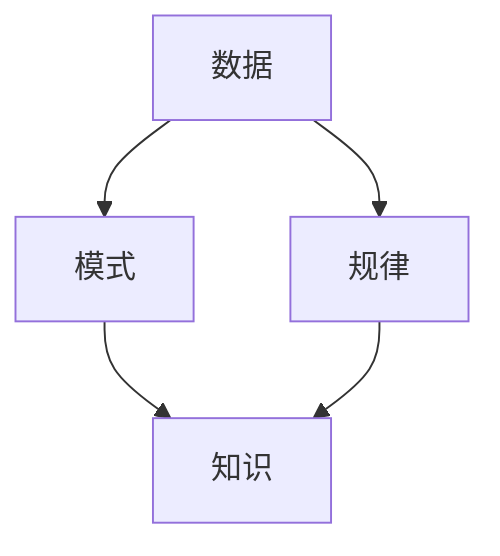

数据挖掘是一种用于发现数据中隐藏知识和规律的技术。它可以帮助我们从大量数据中抽取有价值的信息，从而做出更明智的决策。数据挖掘的过程包括数据收集、数据清洗、数据分析和数据可视化等多个步骤。在这个博客文章中，我们将详细讨论数据挖掘的原理和代码实例。

## 1. 背景介绍

数据挖掘是一门跨学科的技术，它融合了计算机科学、统计学、数据挖掘和机器学习等多个领域。数据挖掘的目标是通过对数据的挖掘和分析，发现数据中隐藏的模式、规律和知识，从而帮助企业做出更明智的决策。

数据挖掘的过程可以分为以下几个阶段：

1. 数据收集：收集并整合数据来源于各种渠道，如网站、社交媒体、数据库等。
2. 数据清洗：对收集到的数据进行预处理和清洗，以消除噪声、填充缺失值、去除重复数据等。
3. 数据分析：对清洗后的数据进行探索性分析、描述性分析和预测性分析，以发现数据中隐藏的模式和规律。
4. 数据可视化：将数据分析结果以图表、图形等形式展现出来，以便更好地理解和传达数据挖掘结果。

## 2. 核心概念与联系

数据挖掘的核心概念包括数据、模式、规律和知识。数据是数据挖掘的基础，没有数据就没有数据挖掘。模式和规律是数据挖掘的目标，是我们希望从数据中发现的隐藏信息。知识是数据挖掘的最终产物，是我们希望通过数据挖掘获得的洞察和理解。

数据挖掘的核心概念与联系可以用以下流程图来表示：



## 3. 核心算法原理具体操作步骤

数据挖掘的核心算法原理主要包括聚类算法、关联规则算法、分类算法和回归算法等。以下是这些算法的具体操作步骤：

1. 聚类算法：将数据按照相似性进行分组。常见的聚类算法有K-means、DBSCAN等。聚类算法的操作步骤包括：选择聚类方法、初始化聚类中心、计算距离度量、分配数据点到聚类中心、更新聚类中心、判断聚类终止条件等。
2. 关联规则算法：发现数据中存在的关联关系。常见的关见规则算法有Apriori、Eclat、FP-growth等。关联规则算法的操作步骤包括：选择支持度阈值、生成频繁项集、生成关联规则、评估关联规则等。
3. 分类算法：将数据按照其类别进行分组。常见的分类算法有决策树、随机森林、支持向量机等。分类算法的操作步骤包括：选择分类方法、训练分类模型、预测数据类别等。
4. 回归算法：预测连续性目标变量的值。常见的回归算法有线性回归、多项式回归、神经网络等。回归算法的操作步骤包括：选择回归方法、训练回归模型、预测目标变量值等。

## 4. 数学模型和公式详细讲解举例说明

在数据挖掘中，我们常常需要使用数学模型来表示和描述数据挖掘问题。以下是一些常见的数学模型和公式：

1. K-means聚类算法的公式：

$$
c_i = \frac{\sum_{j=1}^{n}u_{ij}x_j}{\sum_{j=1}^{n}u_{ij}^2}
$$

其中，$c_i$表示第i个聚类中心，$x_j$表示第j个数据点，$u_{ij}$表示第j个数据点属于第i个聚类中心的概率。

1. 支持向量机分类算法的公式：

$$
W = \sum_{i=1}^{l}y_i\alpha_iK(x_i,x) + b
$$

其中，$W$表示分类超平面,$\alpha_i$表示拉格朗日乘子,$y_i$表示数据点的类别标签,$K(x_i,x)$表示核函数，$b$表示偏置项。

## 5. 项目实践：代码实例和详细解释说明

在这个部分，我们将通过一个实际项目实践来讲解数据挖掘的过程。我们将使用Python的Scikit-learn库来实现一个简单的数据挖掘任务，即对在线购物数据进行分类。

首先，我们需要导入所需的库：

```python
import numpy as np
import pandas as pd
from sklearn.model_selection import train_test_split
from sklearn.preprocessing import StandardScaler
from sklearn.cluster import KMeans
from sklearn.metrics import accuracy_score
```

然后，我们需要加载并预处理数据：

```python
data = pd.read_csv("online_shopping.csv")
X = data.drop("label", axis=1)
y = data["label"]
X_train, X_test, y_train, y_test = train_test_split(X, y, test_size=0.2, random_state=42)
scaler = StandardScaler()
X_train = scaler.fit_transform(X_train)
X_test = scaler.transform(X_test)
```

接下来，我们可以使用K-means聚类算法来对数据进行分类：

```python
kmeans = KMeans(n_clusters=2, random_state=42)
kmeans.fit(X_train)
y_pred = kmeans.predict(X_test)
accuracy = accuracy_score(y_test, y_pred)
print("Accuracy:", accuracy)
```

通过以上代码，我们可以看到数据挖掘过程中的各个步骤，从数据加载和预处理，到模型训练和评估。

## 6. 实际应用场景

数据挖掘在实际应用中有很多场景，如金融领域的风险管理、医疗领域的病症诊断、零售领域的商品推荐等。数据挖掘可以帮助企业发现隐藏的模式和规律，从而做出更明智的决策。

## 7. 工具和资源推荐

数据挖掘的工具和资源很多，以下是一些常用的工具和资源：

1. Python：Python是一种广泛使用的编程语言，也是数据挖掘的常用工具。Python的数据挖掘库有Pandas、Scikit-learn、NumPy等。
2. R：R是一种统计计算的编程语言，也广泛用于数据挖掘。R的数据挖掘包有caret、e1071、randomForest等。
3. SQL：SQL是结构化查询语言，用于处理和查询关系型数据库。SQL在数据挖掘过程中有着重要的作用。
4. 数据挖掘书籍：数据挖掘领域有很多优秀的书籍，如《数据挖掘之美》、《数据挖掘：概念与技术》等。

## 8. 总结：未来发展趋势与挑战

数据挖掘是一门不断发展的技术，未来将有更多的应用场景和创新方法。然而，数据挖掘也面临着一些挑战，如数据质量问题、算法选择问题、计算资源限制等。未来，数据挖掘技术需要不断创新和发展，以应对这些挑战。

## 9. 附录：常见问题与解答

数据挖掘领域有很多常见的问题，如数据清洗、模型选择、评估方法等。以下是一些常见问题的解答：

1. 数据清洗：数据清洗是数据挖掘过程中的一个重要步骤，用于处理和修复数据中的错误和缺失。数据清洗的方法有多种，如填充缺失值、去除重复数据、消除噪声等。
2. 模型选择：模型选择是数据挖掘过程中的一个重要决策，需要根据具体问题和数据特点选择合适的算法。常见的数据挖掘模型有聚类、关联规则、分类、回归等。
3. 评估方法：数据挖掘模型的评估是判断模型性能的重要手段，需要选择合适的评估指标。常见的数据挖掘评估指标有准确率、召回率、F1分数、AUC-ROC等。

以上就是我们关于数据挖掘原理与代码实例的讲解。希望这篇博客文章能够帮助读者更好地理解数据挖掘技术，并在实际工作中应用这些知识。