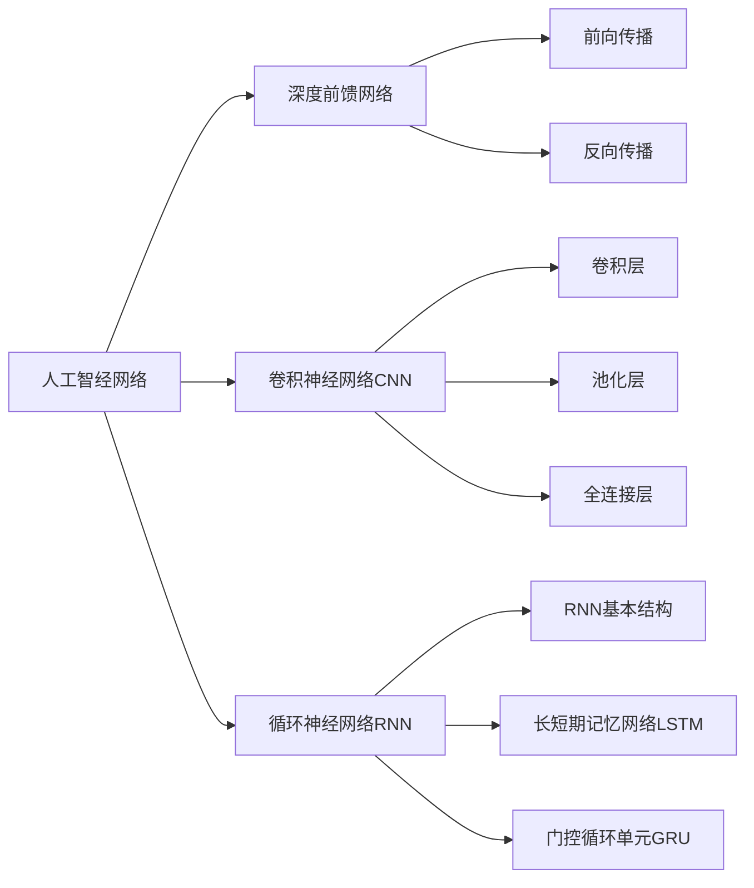

# 深度学习(Deep Learning)原理与代码实战案例讲解

## 1. 背景介绍

### 1.1 人工智能与机器学习的发展历程
#### 1.1.1 人工智能的起源与发展
#### 1.1.2 机器学习的兴起
#### 1.1.3 深度学习的崛起

### 1.2 深度学习的重要性与应用前景
#### 1.2.1 深度学习在计算机视觉领域的应用
#### 1.2.2 深度学习在自然语言处理领域的应用  
#### 1.2.3 深度学习在其他领域的应用

## 2. 核心概念与联系

### 2.1 人工神经网络
#### 2.1.1 生物神经元与人工神经元
#### 2.1.2 感知机
#### 2.1.3 多层感知机(MLP)

### 2.2 深度前馈网络
#### 2.2.1 网络结构
#### 2.2.2 前向传播
#### 2.2.3 反向传播

### 2.3 卷积神经网络(CNN)
#### 2.3.1 卷积层
#### 2.3.2 池化层
#### 2.3.3 全连接层

### 2.4 循环神经网络(RNN) 
#### 2.4.1 RNN基本结构
#### 2.4.2 长短期记忆网络(LSTM)
#### 2.4.3 门控循环单元(GRU)

### 2.5 深度学习中的关键概念
#### 2.5.1 损失函数
#### 2.5.2 优化算法
#### 2.5.3 正则化技术



## 3. 核心算法原理具体操作步骤

### 3.1 反向传播算法
#### 3.1.1 链式法则
#### 3.1.2 计算图
#### 3.1.3 反向传播算法步骤

### 3.2 梯度下降优化算法
#### 3.2.1 批量梯度下降(BGD)
#### 3.2.2 随机梯度下降(SGD) 
#### 3.2.3 小批量梯度下降(MBGD)

### 3.3 自适应学习率优化算法
#### 3.3.1 AdaGrad
#### 3.3.2 RMSProp
#### 3.3.3 Adam

### 3.4 正则化技术
#### 3.4.1 L1正则化
#### 3.4.2 L2正则化
#### 3.4.3 Dropout

## 4. 数学模型和公式详细讲解举例说明

### 4.1 感知机模型
感知机是一种二分类的线性分类模型，其输入为实例的特征向量，输出为实例的类别。给定训练集 $D=\{(\boldsymbol{x}_1,y_1),(\boldsymbol{x}_2,y_2),...,(\boldsymbol{x}_N,y_N)\}$，其中 $\boldsymbol{x}_i\in \mathbb{R}^n$ 为第 $i$ 个实例的特征向量，$y_i\in \{-1, +1\}$ 为 $\boldsymbol{x}_i$ 的类别标记。感知机的目标是学习得到一个超平面 $\boldsymbol{w}^T\boldsymbol{x}+b=0$，能将不同类别的实例分开。

感知机模型可以表示为：

$$
f(\boldsymbol{x})=\text{sign}(\boldsymbol{w}^T\boldsymbol{x}+b)
$$

其中，$\boldsymbol{w}=(w_1;w_2;...;w_n)$ 为权重向量，$b$ 为偏置项，$\text{sign}$ 为符号函数，定义为：

$$
\text{sign}(x)=\begin{cases}
+1, & x\geq 0 \\
-1, & x<0
\end{cases}
$$

### 4.2 反向传播算法推导
考虑一个 $L$ 层的深度神经网络，第 $l$ 层的第 $j$ 个神经元的加权输入为：

$$
z_j^{(l)}=\sum_{i=1}^{n_{l-1}}w_{ji}^{(l)}a_i^{(l-1)}+b_j^{(l)}
$$

其中，$w_{ji}^{(l)}$ 表示第 $l-1$ 层的第 $i$ 个神经元到第 $l$ 层的第 $j$ 个神经元的权重，$b_j^{(l)}$ 表示第 $l$ 层的第 $j$ 个神经元的偏置项，$a_i^{(l-1)}$ 表示第 $l-1$ 层的第 $i$ 个神经元的输出。

第 $l$ 层的第 $j$ 个神经元的输出为：

$$
a_j^{(l)}=\sigma(z_j^{(l)})
$$

其中，$\sigma$ 为激活函数。

定义第 $l$ 层的第 $j$ 个神经元的误差项 $\delta_j^{(l)}$ 为：

$$
\delta_j^{(l)}=\frac{\partial C}{\partial z_j^{(l)}}
$$

其中，$C$ 为损失函数。根据链式法则，可以推导出：

$$
\delta_j^{(l)}=\frac{\partial C}{\partial a_j^{(l)}}\frac{\partial a_j^{(l)}}{\partial z_j^{(l)}}=\frac{\partial C}{\partial a_j^{(l)}}\sigma'(z_j^{(l)})
$$

对于输出层第 $L$ 层，有：

$$
\delta_j^{(L)}=\frac{\partial C}{\partial a_j^{(L)}}\sigma'(z_j^{(L)})
$$

对于隐藏层第 $l$ 层，有：

$$
\delta_j^{(l)}=\sum_{k=1}^{n_{l+1}}\delta_k^{(l+1)}w_{kj}^{(l+1)}\sigma'(z_j^{(l)})
$$

最后，权重和偏置的更新公式为：

$$
w_{ji}^{(l)}:=w_{ji}^{(l)}-\alpha\delta_j^{(l)}a_i^{(l-1)}
$$

$$
b_j^{(l)}:=b_j^{(l)}-\alpha\delta_j^{(l)}
$$

其中，$\alpha$ 为学习率。

## 5. 项目实践：代码实例和详细解释说明

### 5.1 使用Keras实现手写数字识别

```python
from keras.datasets import mnist
from keras.models import Sequential
from keras.layers import Dense, Dropout, Flatten
from keras.layers import Conv2D, MaxPooling2D
from keras import backend as K

# 数据加载与预处理
(x_train, y_train), (x_test, y_test) = mnist.load_data()
x_train = x_train.reshape(x_train.shape[0], 28, 28, 1)
x_test = x_test.reshape(x_test.shape[0], 28, 28, 1)
input_shape = (28, 28, 1)
x_train = x_train.astype('float32') / 255
x_test = x_test.astype('float32') / 255
y_train = keras.utils.to_categorical(y_train, 10)
y_test = keras.utils.to_categorical(y_test, 10)

# 构建模型
model = Sequential()
model.add(Conv2D(32, kernel_size=(3, 3), activation='relu', input_shape=input_shape))
model.add(Conv2D(64, (3, 3), activation='relu'))
model.add(MaxPooling2D(pool_size=(2, 2)))
model.add(Dropout(0.25))
model.add(Flatten())
model.add(Dense(128, activation='relu'))
model.add(Dropout(0.5))
model.add(Dense(10, activation='softmax'))

# 编译模型
model.compile(loss=keras.losses.categorical_crossentropy,
              optimizer=keras.optimizers.Adadelta(),
              metrics=['accuracy'])

# 训练模型
model.fit(x_train, y_train,
          batch_size=128,
          epochs=12,
          verbose=1,
          validation_data=(x_test, y_test))

# 评估模型
score = model.evaluate(x_test, y_test, verbose=0)
print('Test loss:', score[0])
print('Test accuracy:', score[1])
```

上述代码使用Keras实现了一个简单的卷积神经网络用于手写数字识别。主要步骤包括：

1. 加载MNIST数据集，并对数据进行预处理，包括归一化、one-hot编码等。
2. 构建卷积神经网络模型，包括卷积层、池化层、全连接层等。
3. 编译模型，指定损失函数、优化器和评估指标。
4. 训练模型，指定批量大小、训练轮数等超参数。
5. 在测试集上评估模型性能。

### 5.2 使用PyTorch实现语言模型

```python
import torch
import torch.nn as nn
import torch.nn.functional as F

class LanguageModel(nn.Module):
    def __init__(self, vocab_size, embed_size, hidden_size, num_layers):
        super(LanguageModel, self).__init__()
        self.embed = nn.Embedding(vocab_size, embed_size)
        self.lstm = nn.LSTM(embed_size, hidden_size, num_layers, batch_first=True)
        self.linear = nn.Linear(hidden_size, vocab_size)
        
    def forward(self, x, h):
        x = self.embed(x)
        out, (h, c) = self.lstm(x, h)
        out = out.reshape(out.size(0)*out.size(1), out.size(2))
        out = self.linear(out)
        return out, (h, c)
    
model = LanguageModel(vocab_size, embed_size, hidden_size, num_layers)
criterion = nn.CrossEntropyLoss()
optimizer = torch.optim.Adam(model.parameters(), lr=learning_rate)

for epoch in range(num_epochs):
    for i, (inputs, targets) in enumerate(train_loader):
        h = torch.zeros(num_layers, inputs.size(0), hidden_size)
        c = torch.zeros(num_layers, inputs.size(0), hidden_size)
        
        outputs, (h, c) = model(inputs, (h, c))
        loss = criterion(outputs, targets.view(-1))
        
        optimizer.zero_grad()
        loss.backward()
        optimizer.step()
```

上述代码使用PyTorch实现了一个简单的语言模型。主要步骤包括：

1. 定义语言模型类，包括词嵌入层、LSTM层和全连接层。
2. 实现前向传播过程，将输入序列转换为词嵌入，然后通过LSTM层和全连接层得到输出。
3. 定义损失函数和优化器。
4. 进行训练，在每个批次中，将输入序列传入模型，计算损失并更新参数。

## 6. 实际应用场景

### 6.1 计算机视觉
- 图像分类
- 目标检测
- 语义分割
- 人脸识别

### 6.2 自然语言处理
- 文本分类
- 情感分析
- 命名实体识别
- 机器翻译
- 语言模型

### 6.3 语音识别
- 声学模型
- 语言模型
- 端到端语音识别

### 6.4 推荐系统
- 协同过滤
- 基于内容的推荐
- 组合推荐

## 7. 工具和资源推荐

### 7.1 深度学习框架
- TensorFlow
- PyTorch
- Keras
- Caffe
- MXNet

### 7.2 数据集
- MNIST
- CIFAR-10/CIFAR-100
- ImageNet
- Penn Treebank
- WikiText

### 7.3 预训练模型
- VGG
- ResNet
- Inception
- BERT
- GPT

### 7.4 学习资源
- 《深度学习》（花书）
- 《动手学深度学习》
- CS231n课程
- fast.ai课程

## 8. 总结：未来发展趋势与挑战

### 8.1 模型的可解释性和可信性
- 可解释性的重要性
- 当前面临的挑战
- 潜在的解决方案

### 8.2 数据和标注的瓶颈
- 数据和标注的重要性
- 当前面临的挑战
- 数据增强和半监督学习

### 8.3 模型的鲁棒性和安全性
- 对抗样本攻击
- 隐私保护
- 公平性和无偏性

### 8.4 深度学习的democratization
- AutoML和Neural Architecture Search
- 模型压缩和加速
- 移动端和边缘计算中的深度学习

## 9. 附录：常见问题与解答

### 9.1 如何选择合适的深度学习框架？
- 考虑因素：社区支持、文档完善程度、是否支持所需功能等