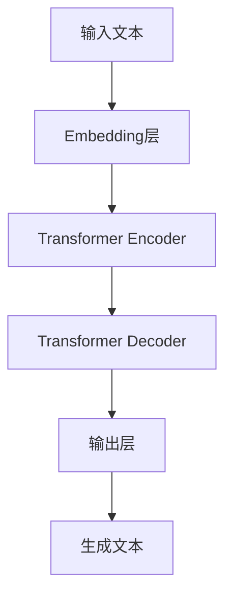

# AI Agent: AI的下一个风口 AutoGen：下一代LLM应用的启动器

## 1. 背景介绍

### 1.1 人工智能的发展历程

人工智能(Artificial Intelligence, AI)是当代科技发展的核心驱动力之一。自20世纪50年代AI概念被正式提出以来,经历了几个重要的发展阶段:

- 1950-1970年代,AI研究主要集中在基础理论和算法探索上,如专家系统、机器学习等。
- 1980-1990年代,AI开始应用于实际问题,如自然语言处理、计算机视觉等领域。
- 21世纪初,随着大数据和算力的飞速发展,AI进入了深度学习的新时代,取得了令人瞩目的成就。

### 1.2 大语言模型(LLM)的崛起

近年来,大语言模型(Large Language Model, LLM)成为AI领域的一股新兴力量。LLM通过从海量文本数据中学习,能够生成看似人类水平的自然语言输出,在自然语言处理、内容生成等领域展现出巨大潜力。

代表性的LLM模型包括:

- GPT系列(OpenAI)
- LaMDA(Google)
- ChatGPT(OpenAI)
- ...

这些模型不仅在学术界引起广泛关注,也逐渐在商业领域得到应用。

## 2. 核心概念与联系

### 2.1 LLM的核心概念

LLM的核心思想是通过自监督学习,从海量文本数据中捕捉语言的内在规律和知识,并能够生成连贯、流畅的自然语言输出。

LLM的主要特点包括:

- 大规模参数(通常超过10亿个参数)
- 自回归语言建模
- 注意力机制
- 文本生成能力

### 2.2 LLM与其他AI技术的关系

LLM与AI领域的其他核心技术密切相关:

- 机器学习: LLM本质上是一种基于深度学习的机器学习模型。
- 自然语言处理(NLP): LLM是NLP领域的重要突破,极大提升了语言理解和生成能力。
- 知识图谱: LLM可以与知识图谱相结合,形成知识增强型语言模型。
- 多模态AI: LLM可与视觉、语音等其他模态相融合,实现多模态智能系统。

## 3. 核心算法原理具体操作步骤

### 3.1 LLM的基本架构

典型的LLM架构由以下几个核心部分组成:



1. **Embedding层**: 将输入文本转换为向量表示。
2. **Transformer Encoder**: 捕捉输入序列的上下文信息。
3. **Transformer Decoder**: 根据上下文生成目标序列。
4. **输出层**: 将向量输出转换为文本。

### 3.2 Transformer架构

Transformer是LLM的核心部件,由编码器(Encoder)和解码器(Decoder)组成。

**Encoder**的工作流程:

1. 输入embedding
2. 位置编码(Positional Encoding)
3. 多头注意力机制(Multi-Head Attention)
4. 前馈神经网络(Feed-Forward NN)
5. 输出编码向量

**Decoder**的工作流程:

1. 输入embedding和Encoder输出
2. 掩码多头注意力(Masked Multi-Head Attention)
3. 编码器-解码器注意力(Encoder-Decoder Attention)
4. 前馈神经网络(Feed-Forward NN)  
5. 输出解码向量

### 3.3 注意力机制(Attention Mechanism)

注意力机制是Transformer的核心创新,使其能够有效捕捉长距离依赖关系。

$$\text{Attention}(Q, K, V) = \text{softmax}(\frac{QK^T}{\sqrt{d_k}})V$$

其中:
- $Q$是查询向量(Query)
- $K$是键向量(Key) 
- $V$是值向量(Value)
- $d_k$是缩放因子

多头注意力机制通过并行计算多个注意力头,进一步提升模型性能。

### 3.4 LLM预训练

LLM需要在大规模文本语料库上进行预训练,以捕捉语言的内在规律。常用的预训练目标包括:

- 蒙版语言建模(Masked Language Modeling)
- 下一句预测(Next Sentence Prediction)
- 序列到序列建模(Sequence-to-Sequence Modeling)

预训练后的LLM可以通过微调(Fine-tuning)或提示(Prompting)等方式,应用于下游任务。

## 4. 数学模型和公式详细讲解举例说明  

### 4.1 Transformer模型数学表示

Transformer的核心思想是使用自注意力机制来捕捉输入序列中的长程依赖关系。我们可以将Transformer的Encoder和Decoder数学表示为:

**Encoder**:
$$
\begin{aligned}
\mathbf{z}_0 &= \mathbf{x} + \mathbf{P}_\mathrm{enc} \\
\mathbf{z}_l' &= \mathrm{AttentionLayer}(\mathbf{z}_{l-1}) \\
\mathbf{z}_l &= \mathrm{FeedForward}(\mathbf{z}_l') + \mathbf{z}_{l-1}
\end{aligned}
$$

其中:
- $\mathbf{x}$是输入序列
- $\mathbf{P}_\mathrm{enc}$是位置编码
- $\mathrm{AttentionLayer}$是多头自注意力层
- $\mathrm{FeedForward}$是前馈神经网络层

**Decoder**:
$$
\begin{aligned}
\mathbf{y}_0 &= \mathbf{z} + \mathbf{P}_\mathrm{dec} \\
\mathbf{y}_l' &= \mathrm{AttentionLayer}(\mathbf{y}_{l-1}, \mathbf{y}_{l-1}, \mathbf{y}_{l-1}) \\
\mathbf{y}_l'' &= \mathrm{AttentionLayer}(\mathbf{y}_l', \mathbf{z}_L, \mathbf{z}_L) \\
\mathbf{y}_l &= \mathrm{FeedForward}(\mathbf{y}_l'') + \mathbf{y}_{l-1}
\end{aligned}
$$

其中:
- $\mathbf{z}$是Encoder的输出
- $\mathbf{P}_\mathrm{dec}$是解码器位置编码
- 第一个$\mathrm{AttentionLayer}$是掩码多头自注意力层
- 第二个$\mathrm{AttentionLayer}$是编码器-解码器注意力层

### 4.2 注意力计算示例

假设我们有一个查询向量$\mathbf{q}$,键向量$\mathbf{K}$和值向量$\mathbf{V}$,其中:

$$
\begin{aligned}
\mathbf{q} &= \begin{bmatrix} 0.1 \\ 0.2 \\ 0.3 \end{bmatrix} \\
\mathbf{K} &= \begin{bmatrix} 0.4 & 0.5 \\ 0.6 & 0.7 \\ 0.8 & 0.9 \end{bmatrix} \\
\mathbf{V} &= \begin{bmatrix} 1.0 & 2.0 \\ 3.0 & 4.0 \\ 5.0 & 6.0 \end{bmatrix}
\end{aligned}
$$

我们可以计算注意力权重$\alpha$和加权和$\mathbf{c}$如下:

$$
\begin{aligned}
e &= \mathbf{q}^\top \mathbf{K} = \begin{bmatrix} 0.1 & 0.2 & 0.3 \end{bmatrix} \begin{bmatrix} 0.4 & 0.5 \\ 0.6 & 0.7 \\ 0.8 & 0.9 \end{bmatrix} \\
&= \begin{bmatrix} 0.74 & 0.91 \end{bmatrix} \\
\alpha &= \mathrm{softmax}(e) = \begin{bmatrix} 0.34 & 0.66 \end{bmatrix} \\
\mathbf{c} &= \alpha \mathbf{V} = \begin{bmatrix} 0.34 & 0.66 \end{bmatrix} \begin{bmatrix} 1.0 & 2.0 \\ 3.0 & 4.0 \\ 5.0 & 6.0 \end{bmatrix} \\
&= \begin{bmatrix} 3.68 & 4.68 \end{bmatrix}
\end{aligned}
$$

因此,对于给定的查询$\mathbf{q}$,注意力机制会将更多权重分配给第二个键值对,产生加权和$\mathbf{c}$作为输出。

## 5. 项目实践: 代码实例和详细解释说明

以下是一个使用PyTorch实现的简单Transformer模型示例,用于机器翻译任务。

```python
import torch
import torch.nn as nn

class TransformerEncoder(nn.Module):
    def __init__(self, input_dim, hid_dim, n_heads, dropout):
        super().__init__()
        self.layer_norm = nn.LayerNorm(input_dim)
        self.self_attn = nn.MultiheadAttention(input_dim, n_heads, dropout=dropout)
        self.feed_forward = nn.Sequential(
            nn.Linear(input_dim, hid_dim),
            nn.ReLU(),
            nn.Dropout(dropout),
            nn.Linear(hid_dim, input_dim),
            nn.Dropout(dropout)
        )
        
    def forward(self, src):
        src = self.layer_norm(src)
        src2 = self.self_attn(src, src, src)[0]
        src = src + src2
        src2 = self.feed_forward(src)
        src = src + src2
        return src

class TransformerDecoder(nn.Module):
    def __init__(self, output_dim, hid_dim, n_heads, dropout):
        super().__init__()
        self.layer_norm = nn.LayerNorm(output_dim)
        self.self_attn = nn.MultiheadAttention(output_dim, n_heads, dropout=dropout)
        self.enc_attn = nn.MultiheadAttention(output_dim, n_heads, dropout=dropout)
        self.feed_forward = nn.Sequential(
            nn.Linear(output_dim, hid_dim),
            nn.ReLU(),
            nn.Dropout(dropout),
            nn.Linear(hid_dim, output_dim),
            nn.Dropout(dropout)
        )
        
    def forward(self, tgt, memory):
        tgt = self.layer_norm(tgt)
        tgt2 = self.self_attn(tgt, tgt, tgt)[0]
        tgt = tgt + tgt2
        tgt2 = self.enc_attn(tgt, memory, memory)[0]
        tgt = tgt + tgt2
        tgt2 = self.feed_forward(tgt)
        tgt = tgt + tgt2
        return tgt

class Transformer(nn.Module):
    def __init__(self, src_vocab_size, tgt_vocab_size, input_dim, hid_dim, n_heads, dropout):
        super().__init__()
        self.encoder = TransformerEncoder(input_dim, hid_dim, n_heads, dropout)
        self.decoder = TransformerDecoder(input_dim, hid_dim, n_heads, dropout)
        self.src_embedding = nn.Embedding(src_vocab_size, input_dim)
        self.tgt_embedding = nn.Embedding(tgt_vocab_size, input_dim)
        self.out = nn.Linear(input_dim, tgt_vocab_size)
        
    def forward(self, src, tgt):
        src = self.src_embedding(src)
        tgt = self.tgt_embedding(tgt)
        enc_src = self.encoder(src)
        output = self.decoder(tgt, enc_src)
        output = self.out(output)
        return output
```

这个示例实现了一个基本的Transformer模型,包括Encoder、Decoder和Embedding层。

- `TransformerEncoder`类实现了Transformer的编码器部分,包括多头自注意力层和前馈神经网络层。
- `TransformerDecoder`类实现了Transformer的解码器部分,包括掩码多头自注意力层、编码器-解码器注意力层和前馈神经网络层。
- `Transformer`类将编码器、解码器和Embedding层组合在一起,构成完整的Transformer模型。

在使用时,我们需要先初始化模型,然后将源语言序列`src`和目标语言序列`tgt`输入模型,模型会输出预测的目标序列概率分布。通过对输出进行解码,我们可以获得翻译后的文本序列。

需要注意的是,这只是一个简化版本的Transformer实现,在实际应用中还需要添加位置编码、掩码等机制,并根据具体任务进行优化和调整。

## 6. 实际应用场景

LLM在诸多领域展现出广阔的应用前景,包括但不限于:

### 6.1 自然语言处理

- 机