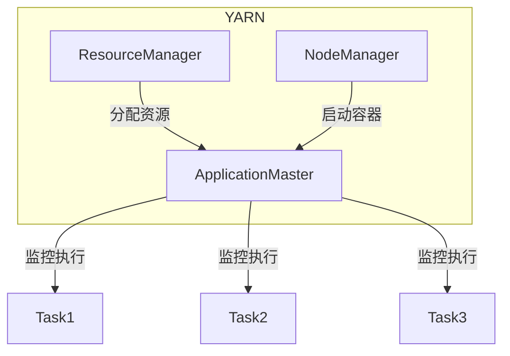

# ApplicationMaster的代码实践与最佳实践

## 1.背景介绍

Apache Hadoop YARN(Yet Another Resource Negotiator)是Hadoop的资源管理和任务调度框架,负责集群资源管理和作业监控。YARN中的ApplicationMaster(AM)是每个应用程序的实例,负责与资源管理器(ResourceManager)协商获取资源,并监控应用程序的执行。

ApplicationMaster扮演着非常重要的角色,它是应用程序与YARN集群之间的桥梁。它负责申请资源、启动应用程序的任务、监控任务的执行状态、处理任务失败等。因此,编写高质量、高可靠性的ApplicationMaster代码对于应用程序的稳定运行至关重要。

## 2.核心概念与联系

### 2.1 ApplicationMaster生命周期

ApplicationMaster的生命周期包括以下几个阶段:

1. **启动阶段**: ApplicationMaster进程启动,向ResourceManager注册并申请资源。
2. **执行阶段**: 根据申请到的资源启动应用程序的任务,监控任务执行状态。
3. **完成阶段**: 所有任务完成后,ApplicationMaster向YARN发送成功/失败信号并退出。

### 2.2 ApplicationMaster与YARN组件交互

ApplicationMaster与以下YARN组件交互:

- **ResourceManager**: 负责分配资源和监控ApplicationMaster。
- **NodeManager**: 负责启动和监控容器(Container),ApplicationMaster需要通过NodeManager启动任务。
- **ApplicationMaster**: 负责应用程序的执行和监控。



## 3.核心算法原理具体操作步骤  

ApplicationMaster的核心算法包括资源申请、任务调度和容错处理等。

### 3.1 资源申请算法

ApplicationMaster需要根据应用程序的需求向ResourceManager申请资源。常用的资源申请算法包括:

1. **容量调度器(Capacity Scheduler)**:根据队列的容量比例分配资源。
2. **公平调度器(Fair Scheduler)**:根据作业运行时间的公平性分配资源。

ApplicationMaster需要根据应用程序的特点选择合适的资源调度算法,并实现相应的资源申请逻辑。

### 3.2 任务调度算法

ApplicationMaster需要根据申请到的资源合理地调度任务,常用的任务调度算法包括:

1. **先来先服务(FIFO)**:按照任务提交的先后顺序执行。
2. **优先级调度**:根据任务的优先级高低执行。
3. **本地化调度**:尽可能将任务调度到数据所在的节点,减少数据传输。

ApplicationMaster可以根据应用程序的特点选择合适的任务调度算法,并实现相应的调度逻辑。

### 3.3 容错处理算法

ApplicationMaster需要处理任务执行过程中可能出现的各种异常情况,如任务失败、节点失败等。常用的容错处理算法包括:

1. **任务重试**:对失败的任务进行重新尝试。
2. **节点故障转移**:将失败节点上的任务迁移到其他节点执行。
3. **应用程序重启**:在无法恢复的情况下,重新启动应用程序。

ApplicationMaster需要实现合理的容错处理逻辑,确保应用程序的高可用性。

## 4.数学模型和公式详细讲解举例说明

在资源申请和任务调度过程中,ApplicationMaster可能需要使用一些数学模型和公式进行决策。以下是一些常见的数学模型和公式:

### 4.1 资源估算模型

为了合理地申请资源,ApplicationMaster需要估算应用程序的资源需求。常用的资源估算模型包括:

1. **基于历史数据的估算**:根据应用程序之前运行的资源使用情况进行估算。

$$ R_{est} = \frac{\sum_{i=1}^{n}R_i}{n} $$

其中,$R_{est}$表示估算的资源需求,$R_i$表示第$i$次运行的实际资源使用量,$n$表示运行次数。

2. **基于性能模型的估算**:根据应用程序的性能模型估算资源需求。

$$ R_{est} = f(D, P) $$

其中,$R_{est}$表示估算的资源需求,$D$表示输入数据,$P$表示应用程序的性能模型。

### 4.2 任务调度模型

ApplicationMaster需要根据一定的目标函数(如最小化作业完成时间、最大化集群利用率等)进行任务调度。常用的任务调度模型包括:

1. **最小化作业完成时间**:

$$ \min \sum_{i=1}^{n}C_i $$

其中,$C_i$表示第$i$个任务的完成时间,$n$表示总任务数。

2. **最大化集群利用率**:

$$ \max \frac{\sum_{i=1}^{n}R_i}{R_{total}} $$

其中,$R_i$表示第$i$个任务的资源使用量,$R_{total}$表示集群总资源,$n$表示总任务数。

ApplicationMaster可以根据具体场景选择合适的数学模型,并将其应用到资源估算和任务调度过程中。

## 5.项目实践:代码实例和详细解释说明

以下是一个简单的ApplicationMaster示例代码,展示了ApplicationMaster的基本结构和功能。

```java
import org.apache.hadoop.yarn.client.api.AMRMClient;
import org.apache.hadoop.yarn.client.api.async.AMRMClientAsync;

public class MyApplicationMaster {
    private AMRMClientAsync amRMClient;
    private NMCallbackHandler containerListener;
    private volatile boolean completed = false;

    public static void main(String[] args) {
        MyApplicationMaster applicationMaster = new MyApplicationMaster();
        applicationMaster.run();
    }

    public void run() {
        // 1. 初始化AMRMClient
        amRMClient = AMRMClientAsync.createAMRMClientAsync(1000, false);
        amRMClient.init(new AMRMClientAsync.AbstractCallbackHandler());
        amRMClient.start();

        // 2. 向ResourceManager注册ApplicationMaster
        amRMClient.registerApplicationMaster("", 0, "");

        // 3. 申请资源
        for (int i = 0; i < totalContainers; i++) {
            amRMClient.addContainerRequest(containerRequest);
        }

        // 4. 启动容器监听器
        containerListener = new NMCallbackHandler(this);
        amRMClient.addContainerListener(containerListener);

        // 5. 监控任务执行状态
        monitorTasks();

        // 6. 完成ApplicationMaster
        amRMClient.unregisterApplicationMaster(finalStatus, "", "");
    }

    private void monitorTasks() {
        while (!completed) {
            // 监控任务执行状态
            // 处理任务失败情况
            // ...
        }
    }

    private class NMCallbackHandler implements AMRMClientAsync.CallbackHandler {
        @Override
        public void onContainersCompleted(List<ContainerStatus> containerStatuses) {
            // 处理容器完成事件
        }

        @Override
        public void onContainersAllocated(List<Container> containers) {
            // 处理容器分配事件,启动任务
        }

        @Override
        public void onShutdownRequest() {
            // 处理关闭请求
        }

        @Override
        public void onNodesUpdated(List<NodeReport> updatedNodes) {
            // 处理节点更新事件
        }

        // ...
    }
}
```

上述代码展示了ApplicationMaster的基本流程:

1. 初始化AMRMClient,用于与ResourceManager通信。
2. 向ResourceManager注册ApplicationMaster。
3. 申请所需的资源(容器)。
4. 启动容器监听器,监听容器分配和完成事件。
5. 监控任务执行状态,处理任务失败等异常情况。
6. 所有任务完成后,向ResourceManager发送完成信号,退出ApplicationMaster。

在实际项目中,ApplicationMaster代码会更加复杂,需要实现更多的功能,如任务调度、容错处理、日志记录等。但基本流程和结构是类似的。

## 6.实际应用场景

ApplicationMaster在许多大数据应用场景中发挥着重要作用,如:

1. **大数据批处理**:Apache Spark、Apache Hive等批处理框架都使用ApplicationMaster管理和监控作业执行。
2. **大数据流处理**:Apache Flink、Apache Kafka Streams等流处理框架也使用ApplicationMaster管理流式应用程序。
3. **机器学习**:Apache Spark MLlib、TensorFlow on YARN等机器学习框架使用ApplicationMaster管理分布式训练任务。
4. **数据仓库**:Apache Hive、Apache Impala等数据仓库系统使用ApplicationMaster管理查询执行。

ApplicationMaster的优势在于能够有效管理分布式应用程序的资源和执行,提高了应用程序的可靠性和可扩展性。

## 7.工具和资源推荐

以下是一些与ApplicationMaster相关的工具和资源:

1. **Apache Hadoop YARN**:ApplicationMaster所在的资源管理和任务调度框架。
2. **Apache Slider**:一个用于在YARN上运行长期服务的框架,可以方便地启动和管理ApplicationMaster。
3. **Apache Twill**:一个用于构建分布式应用程序的抽象层,提供了ApplicationMaster的高级API。
4. **Apache Submarine**:一个用于在YARN上运行机器学习工作负载的框架,提供了机器学习任务的ApplicationMaster实现。
5. **YARN Web UI**:YARN提供的Web界面,可以查看ApplicationMaster的运行状态和日志。
6. **YARN官方文档**:Apache Hadoop YARN的官方文档,包含了ApplicationMaster的详细信息和最佳实践。

利用这些工具和资源,可以更好地开发、部署和监控ApplicationMaster应用程序。

## 8.总结:未来发展趋势与挑战

随着大数据和分布式计算的不断发展,ApplicationMaster在资源管理和任务调度领域扮演着越来越重要的角色。未来,ApplicationMaster可能会面临以下发展趋势和挑战:

1. **更智能的资源调度**:ApplicationMaster需要采用更加智能的资源调度算法,如机器学习驱动的资源调度,以提高资源利用效率。
2. **更好的容错能力**:ApplicationMaster需要具备更强大的容错能力,能够自动检测和恢复各种故障,确保应用程序的高可用性。
3. **更好的可观测性**:ApplicationMaster需要提供更好的可观测性,如指标监控、日志记录等,以便更好地诊断和优化应用程序。
4. **更好的安全性**:ApplicationMaster需要考虑安全性问题,如身份验证、授权等,以确保应用程序的安全运行。
5. **更好的可扩展性**:ApplicationMaster需要能够支持大规模集群和大量应用程序,提高可扩展性。
6. **更好的异构集群支持**:ApplicationMaster需要能够支持异构集群,如CPU、GPU、FPGA等不同硬件资源的协同调度。

总的来说,ApplicationMaster在未来将会变得更加智能、可靠、可观测、安全、可扩展和异构,以满足不断增长的大数据和分布式计算需求。

## 9.附录:常见问题与解答

1. **ApplicationMaster是如何与ResourceManager通信的?**

ApplicationMaster通过AMRMClient与ResourceManager进行通信,申请资源、报告状态等。AMRMClient提供了异步和同步两种通信模式。

2. **ApplicationMaster如何启动容器?**

ApplicationMaster通过与NodeManager通信,在申请到的节点上启动容器。容器启动后,ApplicationMaster需要在容器中启动具体的任务进程。

3. **ApplicationMaster如何处理任务失败?**

ApplicationMaster需要监控任务执行状态,一旦发现任务失败,可以采取重试、迁移或重启应用程序等策略进行容错处理。

4. **ApplicationMaster如何实现高可用性?**

ApplicationMaster可以通过状态持久化、检查点机制、主备切换等方式实现高可用性,确保应用程序不会因为ApplicationMaster失败而中断。

5. **ApplicationMaster如何与其他大数据框架集成?**

许多大数据框架(如Apache Spark、Apache Flink等)都提供了自定义ApplicationMaster的接口,允许开发者编写自己的ApplicationMaster逻辑,与框架无缝集成。

6. **ApplicationMaster如何进行资源估算?**

ApplicationMaster可以根据历史数据、性能模型等方法估算应用程序的资源需求,并据此向ResourceManager申请合适的资源。

7. **ApplicationMaster如何实现任务本地化?**

ApplicationMaster可以通过获取数据位置信息,尽可能将任务调