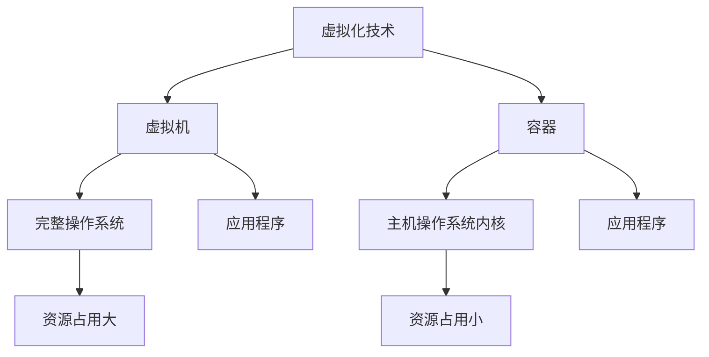
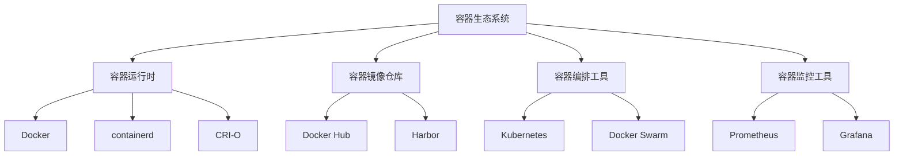
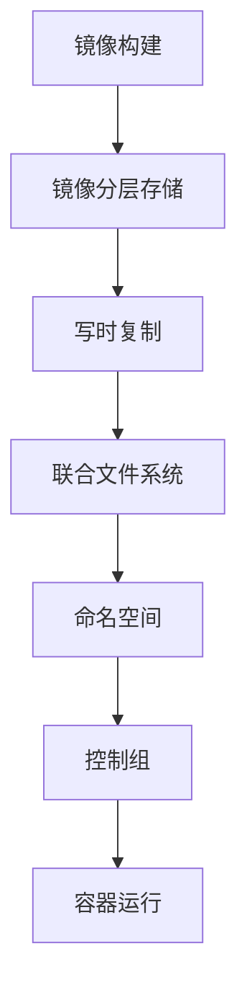

# Docker与容器化技术的历史回顾

## 1.背景介绍

### 1.1 传统部署模式的挑战

在容器化技术出现之前,应用程序通常是直接部署在物理服务器或虚拟机上的。这种传统部署模式存在以下几个主要挑战:

- **环境依赖**:不同的应用程序可能依赖于不同版本的库文件、运行环境等,很容易导致环境冲突。
- **可移植性差**:应用程序与运行环境绑定,移植到其他环境时需要重新配置,效率低下。
- **资源利用率低**:每个应用程序都需要在操作系统层面运行,资源开销大。
- **扩展性差**:手动配置服务器、安装应用程序的过程繁琐,扩展性能受限。

### 1.2 虚拟化技术的兴起

为了解决上述挑战,虚拟化技术应运而生。虚拟化技术允许在单个物理服务器上运行多个虚拟机,每个虚拟机都拥有独立的操作系统、库文件等运行环境。虚拟化技术一定程度上解决了环境依赖和资源利用率的问题,但也带来了新的挑战:

- **资源开销大**:每个虚拟机都需要运行完整的操作系统,资源占用较高。
- **启动慢**:启动虚拟机需要较长时间。
- **扩展性依旧有限**:手动配置和管理虚拟机的过程仍然繁琐。

## 2.核心概念与联系

### 2.1 容器化技术的核心理念

容器化技术的核心理念是将应用程序及其依赖打包到一个可移植的容器中,使其可以在任何环境中一致运行。容器直接运行在主机操作系统内核之上,共享主机的操作系统资源,因此比虚拟机更加轻量级。

容器化技术解决了传统部署模式和虚拟化技术存在的诸多挑战,主要优势包括:

- **环境一致性**:容器包含应用程序所需的全部依赖,确保了运行环境的一致性。
- **高效利用资源**:容器直接运行在主机操作系统内核之上,无需运行完整的操作系统,资源占用小。
- **快速启动**:容器启动时间通常在秒级别,比虚拟机快得多。
- **高度可移植性**:容器可以在任何支持容器运行时的环境中运行,实现了真正的"一次构建,到处运行"。
- **高扩展性**:容器化应用程序可以快速、自动地进行水平扩展和负载均衡。

### 2.2 容器与虚拟机的区别

容器和虚拟机都是一种虚拟化技术,但它们在实现方式和资源占用上存在显著差异:



- **虚拟机**在主机操作系统之上运行完整的操作系统,包括应用程序、库文件、二进制文件等,因此资源占用较大。
- **容器**直接运行在主机操作系统内核之上,共享主机的操作系统资源,只包含应用程序及其依赖,因此资源占用较小。

### 2.3 容器生态系统

随着容器化技术的不断发展,围绕容器技术形成了一个庞大的生态系统,包括容器运行时、容器镜像仓库、容器编排工具、容器监控工具等。其中,Docker 是最著名的容器运行时之一,它提供了一套完整的容器生命周期管理工具。



## 3.核心算法原理具体操作步骤

### 3.1 容器的工作原理

容器的工作原理可以概括为以下几个步骤:

1. **镜像构建**:使用 Dockerfile 定义容器镜像,包括基础操作系统、应用程序代码、依赖库等。
2. **镜像分层存储**:容器镜像采用分层存储机制,每一层都是只读的,可以共享底层。
3. **写时复制(Copy-on-Write)**:容器启动时,会基于镜像创建一个可写层,对文件系统的修改只会影响该可写层。
4. **联合文件系统(Union File System)**:容器运行时将镜像的只读层和可写层通过联合文件系统技术合并为一个统一的文件系统视图。
5. **命名空间(Namespace)**:容器使用命名空间技术实现资源隔离,如进程隔离、网络隔离等。
6. **控制组(Control Groups)**:容器使用控制组技术限制和审计容器对系统资源的使用。



### 3.2 Docker 容器生命周期管理

Docker 提供了一套完整的容器生命周期管理工具,包括以下主要命令:

1. **docker build**: 从 Dockerfile 构建容器镜像。
2. **docker pull**: 从镜像仓库拉取容器镜像。
3. **docker run**: 创建并启动一个新的容器实例。
4. **docker start/stop/restart**: 启动、停止或重启一个已存在的容器。
5. **docker rm**: 删除一个或多个容器。
6. **docker rmi**: 删除一个或多个镜像。
7. **docker ps**: 列出当前正在运行的容器。
8. **docker logs**: 查看容器的日志输出。
9. **docker exec**: 在运行的容器中执行命令。

## 4.数学模型和公式详细讲解举例说明

容器技术中涉及到的数学模型主要包括:

### 4.1 资源分配和限制模型

容器技术通过控制组(Control Groups)实现对容器资源使用的限制和审计。控制组使用一些算法模型来分配和限制资源,如 CPU 份额、内存限制等。

#### 4.1.1 CPU 份额模型

Docker 使用 CPU 份额(CPU share)来分配 CPU 资源。每个容器都会被分配一个相对的 CPU 份额值,CPU 周期将按照这个比例分配给容器。

假设有两个容器 A 和 B,分别被分配 CPU 份额 1024 和 512。那么在 CPU 周期分配时,A 将获得 $\frac{1024}{1024+512}=\frac{2}{3}$ 的 CPU 时间,而 B 将获得 $\frac{512}{1024+512}=\frac{1}{3}$ 的 CPU 时间。

$$
\begin{aligned}
CPU\_share\_ratio_A &= \frac{CPU\_share_A}{CPU\_share_A + CPU\_share_B} \\
&= \frac{1024}{1024 + 512} \\
&= \frac{2}{3}
\end{aligned}
$$

#### 4.1.2 内存限制模型

Docker 可以为每个容器设置内存限制,防止某个容器占用过多内存资源。当容器试图使用超过限制的内存时,内核将终止该容器或导致 OOM(Out-of-Memory)错误。

假设主机总内存为 $M$ GB,容器 A 的内存限制为 $m_A$ GB,容器 B 的内存限制为 $m_B$ GB,则它们可使用的最大内存分别为:

$$
\begin{aligned}
Memory\_limit_A &= \min(m_A, M - \sum_{i \neq A} m_i) \\
Memory\_limit_B &= \min(m_B, M - \sum_{i \neq B} m_i)
\end{aligned}
$$

### 4.2 镜像分层存储模型

Docker 镜像采用分层存储机制,每一层都是只读的,可以共享底层。这种分层存储模型可以有效减小镜像的存储空间,提高传输效率。

假设一个镜像由 $n$ 层组成,第 $i$ 层的大小为 $s_i$,则该镜像的总大小为:

$$
Image\_size = \sum_{i=1}^{n} s_i
$$

如果多个镜像共享底层,则它们的存储空间将被重复利用。假设有 $m$ 个镜像共享前 $k$ 层,则总存储空间为:

$$
Total\_storage = \sum_{i=1}^{k} s_i + \sum_{j=1}^{m} \sum_{i=k+1}^{n_j} s_{ji}
$$

其中 $n_j$ 表示第 $j$ 个镜像的层数。

## 5.项目实践:代码实例和详细解释说明

以下是一个简单的 Node.js 应用程序的 Dockerfile 示例,用于构建容器镜像:

```dockerfile
# 基础镜像
FROM node:14-alpine

# 创建工作目录
WORKDIR /app

# 复制应用程序代码
COPY . .

# 安装依赖
RUN npm install

# 暴露端口
EXPOSE 3000

# 启动命令
CMD ["npm", "start"]
```

下面是使用该 Dockerfile 构建和运行容器的步骤:

1. 在项目根目录下创建 Dockerfile 文件,内容如上所示。
2. 构建容器镜像:

```bash
docker build -t my-node-app .
```

3. 运行容器:

```bash
docker run -p 3000:3000 my-node-app
```

该命令将在主机的 3000 端口上映射容器的 3000 端口,允许从主机访问容器中运行的应用程序。

4. 访问应用程序:在浏览器中打开 `http://localhost:3000` 即可访问容器中运行的 Node.js 应用程序。

5. 停止并删除容器:

```bash
# 查看正在运行的容器
docker ps

# 停止容器
docker stop <container_id>

# 删除容器
docker rm <container_id>
```

## 6.实际应用场景

容器化技术在实际应用中有广泛的应用场景,包括但不限于:

### 6.1 微服务架构

在微服务架构中,应用程序被拆分为多个小型、独立的服务。每个服务都可以打包为一个容器,从而实现服务之间的解耦和独立部署。容器化技术为微服务架构提供了理想的运行环境。

### 6.2 持续集成/持续交付(CI/CD)

在 CI/CD 流程中,容器化技术可以用于构建、测试和部署应用程序。每次代码更新都可以自动构建新的容器镜像,并部署到测试或生产环境中,实现快速迭代。

### 6.3 云原生应用

云原生应用程序通常是基于微服务架构构建的,并利用了容器化、服务网格、不可变基础设施等技术。容器化技术是云原生应用程序的核心组件之一。

### 6.4 物联网(IoT)和边缘计算

在物联网和边缘计算领域,容器化技术可以用于在资源受限的设备上部署和运行应用程序。由于容器的轻量级特性,它们可以在具有有限计算能力和存储空间的边缘设备上高效运行。

### 6.5 数据科学和机器学习

在数据科学和机器学习领域,容器化技术可以用于封装和共享数据处理管道、模型训练环境和模型服务。这样可以确保不同环境之间的一致性,并促进了协作和复现性。

## 7.工具和资源推荐

### 7.1 容器运行时

- **Docker**: 最著名的容器运行时,提供了完整的容器生命周期管理工具。
- **containerd**: 由 Docker 公司开源的行业标准容器运行时,被广泛使用。
- **CRI-O**: Kubernetes 原生的容器运行时,专注于与 Kubernetes 的集成。

### 7.2 容器镜像仓库

- **Docker Hub**: Docker 官方的公共镜像仓库,包含大量预构建