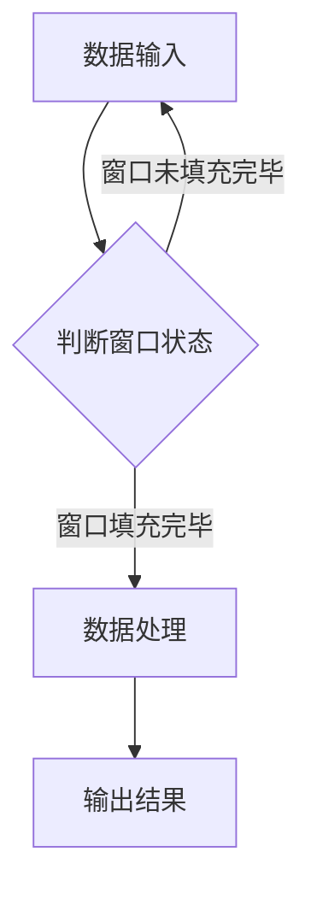
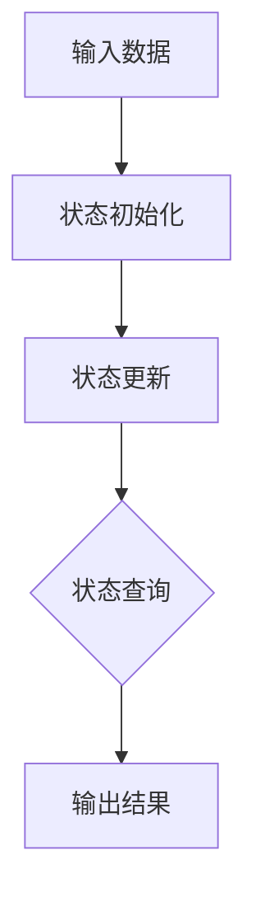

# Flink 原理与代码实例讲解

## 1. 背景介绍

Apache Flink 是一个开源流处理框架，用于处理有状态的计算。Flink 可以在所有常见集群环境中运行，包括单机、集群以及云环境。它旨在提供一种统一的数据处理解决方案，适用于批处理和流处理，同时保持计算逻辑的统一性。

随着大数据时代的到来，数据量呈指数级增长，传统的批处理系统在实时数据处理方面逐渐显露出其不足。Flink 以其高效的性能、可伸缩性和容错性，成为了大数据处理领域的重要选择。

## 2. 核心概念与联系

### 2.1 Stream API

Flink 提供了 Stream API，用于定义流处理程序。Stream API 允许开发者以声明式的方式定义数据的处理流程，使得编写实时数据处理程序变得简单。

### 2.2 微批处理（Micro-batch）

Flink 引入了微批处理的概念，将流数据划分成较小的批次进行处理。这种处理方式既保证了实时性，又提高了处理效率。

### 2.3 有状态计算（Stateful Computation）

Flink 支持有状态计算，允许处理程序存储和更新状态信息。这使得 Flink 可以处理复杂的数据流处理任务，如复杂事件处理和实时分析。

## 3. 核心算法原理具体操作步骤

### 3.1 时间窗口

Flink 支持多种时间窗口，如滑动窗口、固定窗口、会话窗口等。下面以滑动窗口为例，介绍其操作步骤：

1. 定义窗口大小和滑动步长。
2. 将数据划分成窗口。
3. 对每个窗口内的数据进行处理。

### 3.2 滑动窗口 Mermaid 流程图



### 3.3 状态更新

Flink 中的状态更新包括：

1. 状态初始化：创建状态时，为其分配初始值。
2. 状态更新：根据输入数据，更新状态。
3. 状态查询：根据需要查询状态信息。

### 3.4 状态更新 Mermaid 流程图



## 4. 数学模型和公式详细讲解举例说明

### 4.1 时间窗口算法

时间窗口算法根据数据的时间戳将数据划分成窗口。下面以滑动窗口为例，介绍其数学模型：

$$
\\text{窗口大小} = \\text{start\\_time} + \\text{size} - \\text{end\\_time}
$$

其中，start_time 和 end_time 分别表示窗口的起始和结束时间。

### 4.2 状态更新算法

状态更新算法根据输入数据更新状态信息。下面以计数器为例，介绍其数学模型：

$$
\\text{计数器值} = \\text{当前计数器值} + 1
$$

## 5. 项目实践：代码实例和详细解释说明

### 5.1 实时词频统计

下面是一个实时词频统计的 Flink 代码实例：

```java
public class WordCount {
    public static void main(String[] args) throws Exception {
        // 设置流处理环境
        StreamExecutionEnvironment env = StreamExecutionEnvironment.getExecutionEnvironment();

        // 读取数据源
        DataStream<String> textStream = env.readTextFile(\"hdfs://path/to/input/data.txt\");

        // 处理数据
        DataStream<String> wordStream = textStream
            .flatMap(new Tokenizer())
            .map(new RichMapFunction<String, Tuple2<String, Integer>>() {
                private transient ValueState<Integer> wordCountState;

                @Override
                public void open(Configuration parameters) throws Exception {
                    StateDescriptor<Integer, Integer> stateDesc = new StateDescriptor<>(
                        \"word-count-state\", Integer.class);
                    wordCountState = getRuntimeContext().getState(stateDesc);
                }

                @Override
                public Tuple2<String, Integer> map(String value) throws Exception {
                    String[] words = value.split(\" \");
                    for (String word : words) {
                        Integer count = wordCountState.value();
                        if (count == null) {
                            count = 1;
                        } else {
                            count++;
                        }
                        wordCountState.update(count);
                        collect(Tuple2.of(word, count));
                    }
                    return null;
                }
            });

        // 打印结果
        wordStream.print();

        // 执行任务
        env.execute(\"Flink Word Count Example\");
    }
}
```

该实例展示了如何使用 Flink 进行实时词频统计。首先，从 HDFS 读取文本文件；然后，将文本数据分解成单词；接着，使用 RichMapFunction 对每个单词进行计数，并更新状态；最后，打印统计结果。

## 6. 实际应用场景

Flink 在以下场景中具有广泛的应用：

- 实时数据监控
- 实时推荐系统
- 实时广告系统
- 实时数据分析
- 实时日志处理
- 实时交易处理

## 7. 工具和资源推荐

- [Flink 官方文档](https://flink.apache.org/zh/docs/)
- [Flink 官方社区](https://cwiki.apache.org/confluence/display/FLINK/Community)
- [Flink 官方教程](https://flink.apache.org/zh/docs/getting_started/tutorial/)
- [Flink GitHub 仓库](https://github.com/apache/flink)

## 8. 总结：未来发展趋势与挑战

随着大数据时代的不断发展，Flink 作为一款优秀的实时数据处理框架，将在以下方面取得突破：

- 性能优化：进一步降低延迟，提高吞吐量。
- 模式支持：支持更多数据处理模式，如图处理、机器学习等。
- 易用性提升：简化开发流程，降低学习门槛。

然而，Flink 也面临以下挑战：

- 社区生态：加强社区生态建设，提高用户活跃度。
- 兼容性：与其他大数据技术的兼容性，如 Hadoop、Spark 等。
- 安全性：加强安全性防护，确保数据安全。

## 9. 附录：常见问题与解答

### 9.1 Q：Flink 和 Spark 有何区别？

A：Flink 和 Spark 都是大数据处理框架，但它们在架构和设计理念上有所不同。Flink 以流处理为核心，适用于低延迟、高吞吐量的数据处理任务；Spark 以批处理为核心，适用于批处理和流处理任务。具体区别如下：

- 架构：Flink 采用数据流模型，Spark 采用弹性分布式数据集（RDD）模型。
- 性能：Flink 在低延迟、高吞吐量方面更具优势；Spark 在批处理任务中表现较好。
- 社区：Flink 和 Spark 都拥有庞大的社区，但 Flink 社区相对较小。

### 9.2 Q：Flink 的状态如何存储？

A：Flink 支持多种状态存储方式，如内存、RocksDB、HDFS 等。在 Flink 中，状态可以通过 StateDescriptor 进行配置。具体存储方式如下：

- 内存：适用于小规模状态，但易受内存限制。
- RocksDB：适用于中到大规模状态，具有高性能和容错性。
- HDFS：适用于大规模状态，具有高可靠性和持久性。

作者：禅与计算机程序设计艺术 / Zen and the Art of Computer Programming