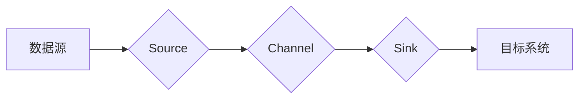

# Flume原理与代码实例讲解

## 1. 背景介绍

随着大数据时代的到来，数据采集、传输和处理成为数据工程中的重要环节。Apache Flume作为一款开源的分布式数据收集系统，被广泛应用于日志收集、监控数据传输等领域。本文将深入浅出地讲解Flume的原理，并通过实际代码实例进行演示。

## 2. 核心概念与联系

Flume的核心概念包括Agent、Source、Channel、Sink。它们之间的联系如下：

- **Agent**：Flume的工作单元，负责配置和运行Flume组件。
- **Source**：负责从数据源收集数据。
- **Channel**：作为缓冲区，存储从Source收集的数据，直至数据被Sink消费。
- **Sink**：负责将数据从Channel传输到目标系统。

## 3. 核心算法原理具体操作步骤

Flume的工作原理可概括为以下步骤：

1. Source从数据源收集数据。
2. 数据被存储到Channel中。
3. Sink将数据从Channel传输到目标系统。

以下是Flume的核心算法原理流程图：



## 4. 数学模型和公式详细讲解举例说明

Flume的数学模型主要涉及数据传输速率和容量。以下以Flume的Channel为例进行讲解：

- **数据传输速率（R**）：指单位时间内从Channel传输的数据量。
- **容量（C**）：指Channel能够存储的数据量。

以下为Channel的数学模型：

$$
R = \\frac{C}{T}
$$

其中，T为Channel的传输时间。

举例说明：

假设Channel的容量为100MB，传输时间为1秒，则数据传输速率为：

$$
R = \\frac{100MB}{1s} = 100MB/s
$$

## 5. 项目实践：代码实例和详细解释说明

以下是一个简单的Flume实例，用于收集系统日志：

```java
// 定义Agent
Agent agent = AgentConfiguration.createAgent(\"agent\", new AgentConfiguration.Builder()
        .withAgentName(\"agent\")
        .withChannel(\"memoryChannel\", new MemoryChannelBuilder()
                .withCapacity(1000)
                .withType(\"memory\")
                .build())
        .withSources(new SourcesBuilder()
                .with Sources(\"syslogSource\", new SyslogSourceBuilder()
                        .withPort(9999)
                        .build())
                .build())
        .withSinks(new SinksBuilder()
                .withSinks(\"syslogSink\", new HdfsSinkBuilder()
                        .withPath(\"/path/to/log\")
                        .build())
                .build())
        .build());

// 启动Agent
agent.start();

// 等待Agent运行
Thread.sleep(Long.MAX_VALUE);
```

代码解释：

1. 定义Agent：创建一个名为\"agent\"的Agent，配置Channel为MemoryChannel，容量为1000。
2. 定义Source：创建一个名为\"syslogSource\"的SyslogSource，端口为9999。
3. 定义Sink：创建一个名为\"syslogSink\"的HdfsSink，目标路径为\"/path/to/log\"。
4. 启动Agent。

## 6. 实际应用场景

Flume在实际应用场景中，可应用于以下方面：

- 日志收集：收集系统日志、网络日志等，用于后续分析。
- 监控数据传输：将监控数据传输到数据仓库，便于分析和可视化。
- 数据集成：将不同系统的数据进行整合，便于统一管理和分析。

## 7. 工具和资源推荐

以下为Flume相关的工具和资源推荐：

- 官方文档：[Apache Flume官方文档](https://flume.apache.org/)
- 社区论坛：[Apache Flume社区论坛](https://flumeforum.apache.org/)
- 示例代码：[Apache Flume示例代码](https://github.com/apache/flume)

## 8. 总结：未来发展趋势与挑战

随着大数据技术的不断发展，Flume在未来将面临以下挑战：

- 适应更复杂的数据源和目标系统。
- 提高数据传输速率和可靠性。
- 优化资源利用，降低系统复杂度。

同时，Flume也将迎来以下发展趋势：

- 与其他大数据技术深度融合，如Hadoop、Spark等。
- 提供更加丰富的源和Sink类型。
- 支持更灵活的配置和扩展。

## 9. 附录：常见问题与解答

**Q1：Flume与Kafka的区别是什么？**

A1：Flume和Kafka都是用于数据采集和传输的工具，但它们在应用场景、数据格式和性能等方面有所不同。Flume适用于数据量较大、实时性要求不高的场景，而Kafka适用于高并发、低延迟的场景。

**Q2：如何提高Flume的数据传输速率？**

A2：提高Flume的数据传输速率可以通过以下方法实现：

- 增加Channel的容量。
- 选择合适的Channel类型，如MemoryChannel、JmsChannel等。
- 调整Agent的配置参数，如Buffer Size、Batch Size等。

作者：禅与计算机程序设计艺术 / Zen and the Art of Computer Programming