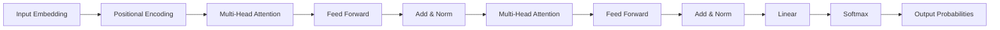

# GPT：生成式自回归模型

## 1. 背景介绍

### 1.1 自然语言处理的发展历程

自然语言处理(Natural Language Processing, NLP)是人工智能领域的一个重要分支,旨在让计算机能够理解、处理和生成人类语言。NLP技术的发展经历了几个重要阶段:

- 1950年代:机器翻译的探索
- 1960-1970年代:基于规则的方法
- 1980-1990年代:统计学习方法的兴起
- 2000年代至今:深度学习的崛起

### 1.2 深度学习在NLP中的应用

近年来,深度学习技术在NLP领域取得了巨大突破。一些重要的里程碑包括:

- 2013年:word2vec词嵌入模型
- 2014年:序列到序列(Seq2Seq)模型
- 2015年:注意力机制(Attention Mechanism) 
- 2017年:Transformer模型
- 2018年:BERT(Bidirectional Encoder Representations from Transformers)模型

### 1.3 GPT模型的诞生

GPT(Generative Pre-trained Transformer)是OpenAI在2018年提出的一种基于Transformer架构的大规模语言模型。它在大规模无标注文本数据上进行预训练,可以在各种NLP任务上进行微调(fine-tuning),展现出强大的语言理解和生成能力。

## 2. 核心概念与联系

### 2.1 语言模型

语言模型是一种对语言概率分布进行建模的方法。给定一个单词序列 $w_1, w_2, ..., w_n$,语言模型的目标是估计这个序列出现的概率:

$$P(w_1, w_2, ..., w_n) = \prod_{i=1}^n P(w_i | w_1, ..., w_{i-1})$$

传统的n-gram语言模型受限于平滑和数据稀疏问题。神经网络语言模型(Neural Network Language Model, NNLM)使用神经网络来学习单词的分布式表示,克服了这些局限性。

### 2.2 Transformer架构

Transformer是一种基于自注意力机制(Self-Attention)的神经网络架构,最初应用于机器翻译任务。与传统的循环神经网络(RNN)和卷积神经网络(CNN)不同,Transformer完全依赖于注意力机制来建模序列之间的依赖关系。

Transformer的核心组件包括:

- 多头自注意力(Multi-Head Self-Attention):允许模型在不同的表示子空间中捕捉输入序列的不同方面。
- 前馈神经网络(Feed-Forward Neural Network):对自注意力的输出进行非线性变换。
- 残差连接(Residual Connection)和层归一化(Layer Normalization):促进梯度流动和模型收敛。

Transformer的编码器-解码器架构如下图所示:



### 2.3 预训练和微调

预训练(Pre-training)是在大规模无标注数据上训练通用语言表示的过程。通过设计合适的预训练任务(如语言建模、去噪自编码等),模型可以学习到丰富的语言知识和上下文信息。

微调(Fine-tuning)是在特定任务的标注数据上对预训练模型进行进一步训练的过程。通过微调,预训练模型可以快速适应下游任务,实现更好的性能。

## 3. 核心算法原理具体操作步骤

GPT模型的训练过程分为两个阶段:无监督预训练和有监督微调。

### 3.1 无监督预训练

GPT采用自回归语言建模(Auto-Regressive Language Modeling)作为预训练任务。给定一个文本序列 $x=(x_1,x_2,...,x_n)$,语言建模的目标是最大化下一个单词的条件概率:

$$L_1(X)=\sum_{i=1}^n \log P(x_i|x_{<i};\theta)$$

其中 $\theta$ 表示模型参数。

具体的预训练步骤如下:

1. 对输入序列进行词元化(Tokenization),将每个单词映射为对应的词元(Token)。
2. 将词元序列输入到GPT模型中,经过多层Transformer编码器的处理。
3. 在每个位置上,使用线性层和Softmax函数计算下一个词元的概率分布。
4. 使用交叉熵损失函数计算预测概率与真实标签之间的差异,并进行梯度反向传播和参数更新。

### 3.2 有监督微调

对于特定的下游任务(如文本分类、问答等),可以在预训练的GPT模型基础上进行微调。微调过程中,我们在预训练模型的顶部添加一个特定于任务的输出层,并使用标注数据对整个模型进行端到端的训练。

以文本分类任务为例,微调步骤如下:

1. 在预训练的GPT模型顶部添加一个线性分类层,将最后一个词元的隐藏状态映射到类别标签的概率分布。
2. 使用标注数据对模型进行训练,最小化交叉熵损失函数:

$$L_2(X,y)=-\sum_{i=1}^N \log P(y_i|x_i;\theta)$$

其中 $y_i$ 是第 $i$ 个样本的真实类别标签。

3. 对整个模型(包括预训练的GPT部分和新增的分类层)进行梯度反向传播和参数更新。

通过微调,GPT模型可以快速适应特定任务,并在少量标注数据的情况下取得良好性能。

## 4. 数学模型和公式详细讲解举例说明

### 4.1 自注意力机制

自注意力机制是Transformer和GPT模型的核心组件。对于一个输入序列 $X=(x_1,x_2,...,x_n)$,自注意力的计算过程如下:

1. 将输入序列 $X$ 通过三个线性变换得到查询(Query)、键(Key)和值(Value)矩阵:

$$Q=XW^Q, K=XW^K, V=XW^V$$

其中 $W^Q, W^K, W^V$ 是可学习的参数矩阵。

2. 计算查询和键之间的注意力权重:

$$A=\text{softmax}(\frac{QK^T}{\sqrt{d_k}})$$

其中 $d_k$ 是键向量的维度,用于缩放点积结果。

3. 将注意力权重应用于值矩阵,得到自注意力的输出:

$$\text{Attention}(Q,K,V)=AV$$

多头自注意力通过并行计算多个自注意力,然后将结果拼接起来,以捕捉输入序列在不同子空间中的信息。

### 4.2 位置编码

由于Transformer和GPT模型不包含循环或卷积结构,为了引入序列的位置信息,我们需要在输入嵌入中加入位置编码(Positional Encoding)。位置编码可以使用不同的函数,如正弦函数:

$$\begin{aligned}
PE_{(pos,2i)} &= \sin(pos/10000^{2i/d_{model}}) \\
PE_{(pos,2i+1)} &= \cos(pos/10000^{2i/d_{model}})
\end{aligned}$$

其中 $pos$ 是位置索引,$i$ 是维度索引,$d_{model}$ 是嵌入维度。

位置编码与输入嵌入相加,得到最终的输入表示:

$$X_{input} = X_{embedding} + PE$$

### 4.3 层归一化

层归一化(Layer Normalization)是一种在神经网络中稳定训练过程的技术。对于一个输入 $x$,层归一化的计算过程如下:

$$\begin{aligned}
\mu &= \frac{1}{H}\sum_{i=1}^H x_i \\
\sigma^2 &= \frac{1}{H}\sum_{i=1}^H (x_i - \mu)^2 \\
\hat{x}_i &= \frac{x_i - \mu}{\sqrt{\sigma^2 + \epsilon}} \\
y_i &= \gamma \hat{x}_i + \beta
\end{aligned}$$

其中 $H$ 是隐藏状态的维度,$\epsilon$ 是一个小常数,用于防止分母为零,$\gamma$ 和 $\beta$ 是可学习的缩放和偏移参数。

层归一化可以加速模型收敛,并提高泛化性能。

## 5. 项目实践：代码实例和详细解释说明

下面是一个使用PyTorch实现GPT模型的简化版代码示例:

```python
import torch
import torch.nn as nn

class SelfAttention(nn.Module):
    def __init__(self, embed_size, num_heads):
        super().__init__()
        self.embed_size = embed_size
        self.num_heads = num_heads
        self.head_dim = embed_size // num_heads

        self.query = nn.Linear(embed_size, embed_size)
        self.key = nn.Linear(embed_size, embed_size)
        self.value = nn.Linear(embed_size, embed_size)
        self.fc = nn.Linear(embed_size, embed_size)

    def forward(self, x):
        batch_size, seq_len, _ = x.shape
        q = self.query(x).view(batch_size, seq_len, self.num_heads, self.head_dim).transpose(1, 2)
        k = self.key(x).view(batch_size, seq_len, self.num_heads, self.head_dim).transpose(1, 2)
        v = self.value(x).view(batch_size, seq_len, self.num_heads, self.head_dim).transpose(1, 2)

        attn_scores = torch.matmul(q, k.transpose(-2, -1)) / (self.head_dim ** 0.5)
        attn_probs = torch.softmax(attn_scores, dim=-1)
        attn_output = torch.matmul(attn_probs, v)

        attn_output = attn_output.transpose(1, 2).contiguous().view(batch_size, seq_len, self.embed_size)
        return self.fc(attn_output)

class TransformerBlock(nn.Module):
    def __init__(self, embed_size, num_heads, ff_dim, dropout=0.1):
        super().__init__()
        self.attn = SelfAttention(embed_size, num_heads)
        self.norm1 = nn.LayerNorm(embed_size)
        self.ff = nn.Sequential(
            nn.Linear(embed_size, ff_dim),
            nn.ReLU(),
            nn.Linear(ff_dim, embed_size)
        )
        self.norm2 = nn.LayerNorm(embed_size)
        self.dropout = nn.Dropout(dropout)

    def forward(self, x):
        attn_output = self.attn(x)
        x = x + self.dropout(attn_output)
        x = self.norm1(x)
        ff_output = self.ff(x)
        x = x + self.dropout(ff_output)
        x = self.norm2(x)
        return x

class GPT(nn.Module):
    def __init__(self, vocab_size, embed_size, num_heads, ff_dim, num_layers, dropout=0.1):
        super().__init__()
        self.embed = nn.Embedding(vocab_size, embed_size)
        self.pos_embed = nn.Parameter(torch.zeros(1, 1024, embed_size))
        self.layers = nn.ModuleList([TransformerBlock(embed_size, num_heads, ff_dim, dropout) for _ in range(num_layers)])
        self.norm = nn.LayerNorm(embed_size)

    def forward(self, x):
        x = self.embed(x) + self.pos_embed[:, :x.size(1), :]
        for layer in self.layers:
            x = layer(x)
        x = self.norm(x)
        return x
```

这个简化版的GPT模型包括以下几个关键组件:

1. `SelfAttention` 类:实现了多头自注意力机制,将输入序列映射到查询、键、值矩阵,计算注意力权重,并应用于值矩阵得到输出。

2. `TransformerBlock` 类:包含一个自注意力层和一个前馈神经网络,以及层归一化和残差连接。这是GPT模型的基本构建块。

3. `GPT` 类:定义了完整的GPT模型,包括词嵌入层、位置编码、多个Transformer块和最后的层归一化。

在实际应用中,我们还需要实现预训练和微调的训练循环,以及数据加载和预处理等功能。这里为了简洁起见,省略了这些部分。

## 6. 实际应用场景

GPT模型在各种自然语言处理任务中都展现出了优异的性能,一些主要的应用场景包括:

1. 语言建模与文本生成:GPT可以学习语言的概率分布,生成流畅、连贯的文本,如对话、故事、新闻等。

2. 文