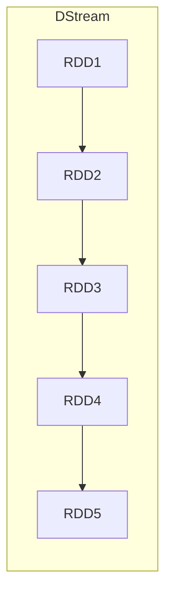
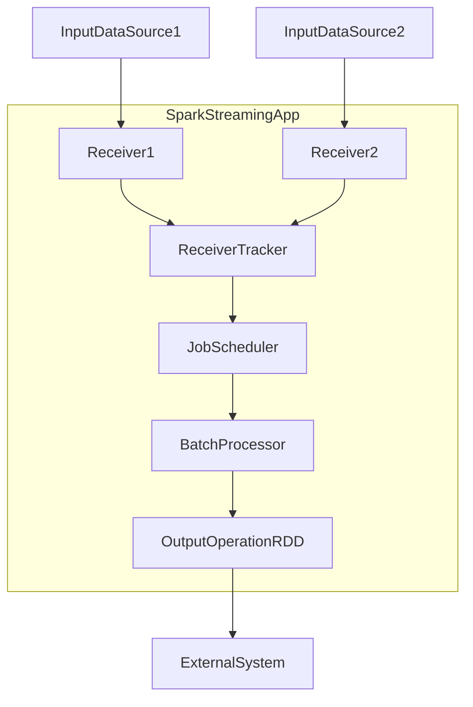

# Spark Streaming 原理与代码实例讲解

## 1.背景介绍

随着大数据时代的到来,实时数据处理变得越来越重要。传统的批处理系统无法满足实时性的要求,因此流式计算应运而生。Apache Spark Streaming作为Spark生态系统中的流式计算引擎,广泛应用于各种实时数据处理场景。

Spark Streaming可以高效地从各种数据源(如Kafka、Flume、Kinesis等)获取数据流,并使用Spark引擎对其进行分布式计算。它基于Spark Core的RDD(Resilient Distributed Dataset)抽象,将实时数据流划分为一系列的小批数据集,从而将流式计算转化为一系列小规模批处理作业。

## 2.核心概念与联系

### 2.1 DStream(Discretized Stream)

DStream是Spark Streaming的基础抽象,代表一个连续不断的数据流。每个DStream由一系列连续的RDD组成,每个RDD包含一个数据批次。



### 2.2 输入DStream

输入DStream代表从数据源接收到的原始数据流,如Kafka、Flume等。Spark Streaming提供了多种内置数据源,也支持通过自定义Receiver接收数据。

### 2.3 Transform操作

与RDD的转换操作类似,Spark Streaming提供了丰富的Transform操作,如map、flatMap、filter等,可以对DStream中的每个RDD应用相同的操作。

### 2.4 输出操作

经过一系列Transform操作后,可以使用输出操作将结果写入外部系统,如HDFS、数据库等。常用的输出操作有foreach、foreachRDD等。

### 2.5 窗口操作

窗口操作允许对滑动窗口范围内的数据执行计算。Spark Streaming提供了window、countByWindow等窗口操作。

## 3.核心算法原理具体操作步骤  

### 3.1 Spark Streaming架构

Spark Streaming的核心架构如下图所示:



1. **Receiver**负责从数据源接收数据,并将数据存储在Spark内存中。
2. **ReceiverTracker**用于跟踪接收器的状态,并将接收到的数据分发给JobScheduler。
3. **JobScheduler**根据Transform操作生成相应的作业,并提交给Spark引擎执行。
4. **BatchProcessor**执行实际的计算任务,并生成最终的RDD。
5. **OutputOperationRDD**执行输出操作,将结果写入外部系统。

### 3.2 工作流程

Spark Streaming的工作流程如下:

1. **启动Spark Streaming应用程序**,创建输入DStream、定义Transform操作和输出操作。
2. **启动Receiver**,从数据源接收数据,并将数据存储在Spark内存中。
3. **ReceiverTracker**定期向Receiver获取数据块,并将它们组合成一个RDD。
4. **JobScheduler**根据Transform操作生成相应的Spark作业。
5. **Spark引擎**执行这些作业,对RDD进行计算。
6. **执行输出操作**,将计算结果写入外部系统。
7. **重复步骤3-6**,处理新的数据块。

## 4.数学模型和公式详细讲解举例说明

在Spark Streaming中,一个重要的概念是**窗口操作**。窗口操作允许对一定时间范围内的数据执行计算。常用的窗口操作包括window和countByWindow。

### 4.1 Window操作

Window操作会对滑动窗口范围内的数据执行计算。它有两个参数:

- **windowLength**: 窗口的时间范围,例如30秒。
- **slideInterval**: 窗口滑动的时间间隔,例如10秒。

假设我们有一个DStream,每秒产生一个元素,我们希望计算最近30秒内的元素计数。可以使用以下代码:

```scala
val counts = dstream.window(Seconds(30), Seconds(1)).count()
```

这里,windowLength为30秒,slideInterval为1秒。每次计算最近30秒内的元素计数。

窗口操作的数学模型如下:

设$D$为DStream,元素到达的时间序列为$t_1, t_2, ..., t_n$。

对于给定的windowLength $W$和slideInterval $S$,窗口操作的结果为:

$$
\begin{align*}
\text{Window}(D, W, S) &= \big\{ \big( [t_b, t_e), \text{Func}(\{x \in D | t_b \leq t(x) < t_e\}) \big) \\
&\qquad\qquad\qquad\qquad\qquad\qquad\qquad| t_b = k \cdot S, t_e = t_b + W, k \in \mathbb{N}_0 \big\}
\end{align*}
$$

其中,$\text{Func}$是应用于窗口数据的转换函数,如count、sum等。$t(x)$表示元素$x$的到达时间。

例如,对于上面的例子,当$W=30$秒,$S=1$秒时,窗口操作的结果为:

$$
\begin{align*}
\text{Window}(D, 30, 1) &= \big\{ \big( [0, 30), \text{count}(\{x \in D | 0 \leq t(x) < 30\}) \big), \\
&\qquad\qquad\qquad\qquad\qquad\qquad\qquad\big( [1, 31), \text{count}(\{x \in D | 1 \leq t(x) < 31\}) \big), \\
&\qquad\qquad\qquad\qquad\qquad\qquad\qquad\big( [2, 32), \text{count}(\{x \in D | 2 \leq t(x) < 32\}) \big), \\
&\qquad\qquad\qquad\qquad\qquad\qquad\qquad\ldots \big\}
\end{align*}
$$

### 4.2 CountByWindow操作

CountByWindow操作类似于Window操作,但它返回的是元素在窗口中的数量,而不是应用转换函数的结果。

CountByWindow操作的数学模型如下:

$$
\begin{align*}
\text{CountByWindow}(D, W, S) &= \big\{ \big( [t_b, t_e), \text{count}(\{x \in D | t_b \leq t(x) < t_e\}) \big) \\
&\qquad\qquad\qquad\qquad\qquad\qquad\qquad| t_b = k \cdot S, t_e = t_b + W, k \in \mathbb{N}_0 \big\}
\end{align*}
$$

其中,$t(x)$表示元素$x$的到达时间。

## 5.项目实践：代码实例和详细解释说明

下面是一个使用Spark Streaming从Kafka读取数据流并进行词频统计的示例:

```scala
import org.apache.spark.streaming.{Seconds, StreamingContext}
import org.apache.spark.streaming.kafka.KafkaUtils

// 创建SparkConf和StreamingContext
val conf = new SparkConf().setAppName("KafkaWordCount")
val ssc = new StreamingContext(conf, Seconds(2))

// 从Kafka获取输入DStream
val kafkaParams = Map("metadata.broker.list" -> "broker1:9092,broker2:9092")
val topics = Set("topic1", "topic2")
val kafkaStream = KafkaUtils.createDirectStream[String, String, StringDecoder, StringDecoder](
  ssc, kafkaParams, topics)

// 执行词频统计
val words = kafkaStream.flatMap(_.value.split(" "))
val wordCounts = words.map(x => (x, 1)).reduceByKey(_ + _)

// 输出结果
wordCounts.print()

// 启动Spark Streaming应用程序
ssc.start()
ssc.awaitTermination()
```

**代码解释:**

1. 首先创建SparkConf和StreamingContext对象,StreamingContext的批量间隔设置为2秒。
2. 使用KafkaUtils.createDirectStream从Kafka获取输入DStream,指定Kafka Broker列表和订阅的Topic。
3. 对输入DStream执行flatMap操作,将每条消息拆分为单词。
4. 使用map操作将每个单词映射为(单词,1)的对偶,然后使用reduceByKey操作统计每个单词的出现次数。
5. 使用print输出操作将结果打印到控制台。
6. 启动Spark Streaming应用程序并等待终止。

## 6.实际应用场景

Spark Streaming广泛应用于各种实时数据处理场景,包括但不限于:

1. **实时日志分析**: 从Web服务器、应用程序等获取实时日志数据,进行实时分析和监控。
2. **实时数据处理**: 处理来自传感器、物联网设备等的实时数据流。
3. **实时机器学习**: 使用实时数据流训练机器学习模型,实现实时预测和决策。
4. **实时监控和报警**: 实时监控系统指标,发现异常并及时报警。
5. **实时推荐系统**: 根据用户实时行为数据,提供个性化推荐。
6. **金融领域**: 实时处理金融交易数据,进行实时风险评估和交易决策。

## 7.工具和资源推荐

### 7.1 Spark Streaming官方文档

Spark Streaming官方文档提供了详细的概念介绍、API说明和示例代码,是学习Spark Streaming的重要资源。

- [Spark Streaming Programming Guide](https://spark.apache.org/docs/latest/streaming-programming-guide.html)

### 7.2 Kafka

Kafka是一个分布式流式处理平台,常与Spark Streaming一起使用作为数据源或接收器。

- [Apache Kafka官网](https://kafka.apache.org/)
- [Kafka入门教程](https://kafka.apache.org/documentation/#gettingStarted)

### 7.3 Spark Streaming相关书籍

- 《Learning Spark Streaming》by Mohd Gupta
- 《Mastering Apache Spark Streaming》by Jacek Laskowski

### 7.4 在线课程

- [Spark Streaming and Kafka Integration](https://www.udemy.com/course/spark-streaming-and-kafka-integration/) (Udemy)
- [Apache Spark Streaming with Scala](https://www.coursera.org/learn/apache-spark-streaming-scala) (Coursera)

### 7.5 社区和论坛

- [Apache Spark Mailing Lists](https://spark.apache.org/community.html)
- [Spark on Stack Overflow](https://stackoverflow.com/questions/tagged/apache-spark)

## 8.总结：未来发展趋势与挑战

Spark Streaming作为流式计算领域的重要引擎,未来发展趋势和面临的挑战包括:

1. **低延迟和高吞吐量**: 随着实时数据处理需求的增加,对低延迟和高吞吐量的要求也越来越高。Spark Streaming需要继续优化性能,以满足这些需求。

2. **流式机器学习**: 将机器学习模型应用于实时数据流,实现实时预测和决策,是一个重要的发展方向。Spark Streaming需要与Spark MLlib等机器学习库更好地集成。

3. **流式SQL**: 提供类SQL的查询语言,使用户能够更方便地处理实时数据流,是未来的一个发展趋势。Spark Structured Streaming正朝着这个方向发展。

4. **流式处理和批处理的融合**: 未来可能会看到流式处理和批处理的进一步融合,使用统一的API和引擎处理静态数据和实时数据。

5. **容错性和可靠性**: 对于关键任务,容错性和可靠性是非常重要的。Spark Streaming需要继续改进容错机制,提高可靠性。

6. **资源管理和自动调优**: 随着应用规模的增长,资源管理和自动调优将变得越来越重要,以提高资源利用率和系统稳定性。

7. **与其他大数据系统的集成**: Spark Streaming需要与其他大数据系统(如Kafka、Flink等)更好地集成,形成完整的大数据生态系统。

## 9.附录：常见问题与解答

1. **Spark Streaming和Spark Structured Streaming有什么区别?**

Spark Structured Streaming是Spark 2.x版本引入的新的流式处理引擎,它基于Spark SQL引擎,提供了更好的性能、更丰富的API和与批处理的无缝集成。相比之下,Spark Streaming是较早的流式处理引擎,基于RDD抽象,API和性能方面略逊于Structured Streaming。未来,Structured Streaming可能会逐渐取代Spark Streaming。

2. **Spark Streaming如何实现