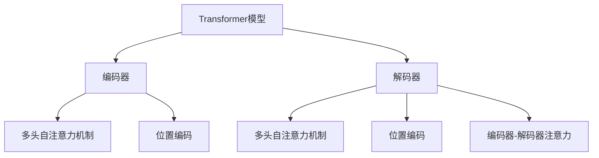
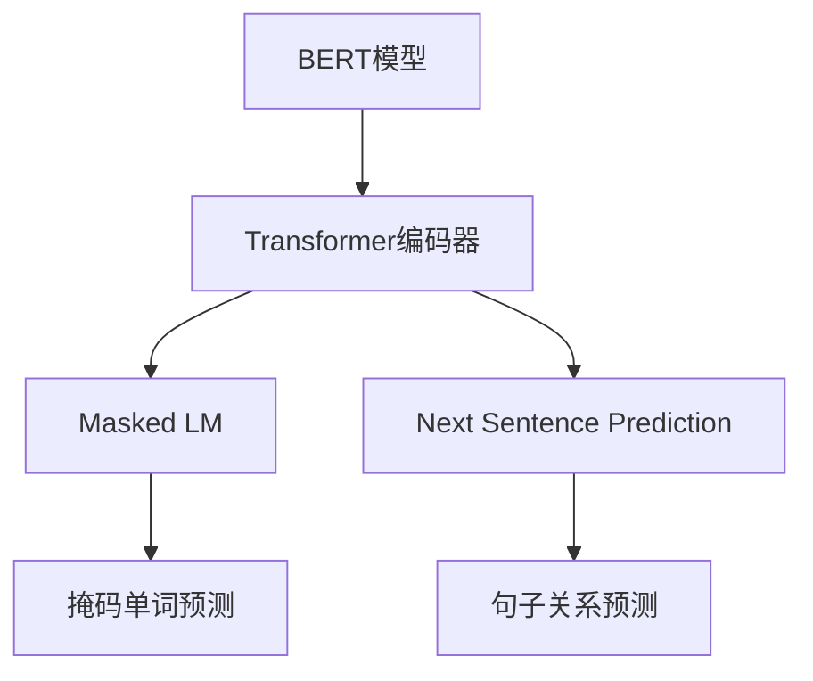
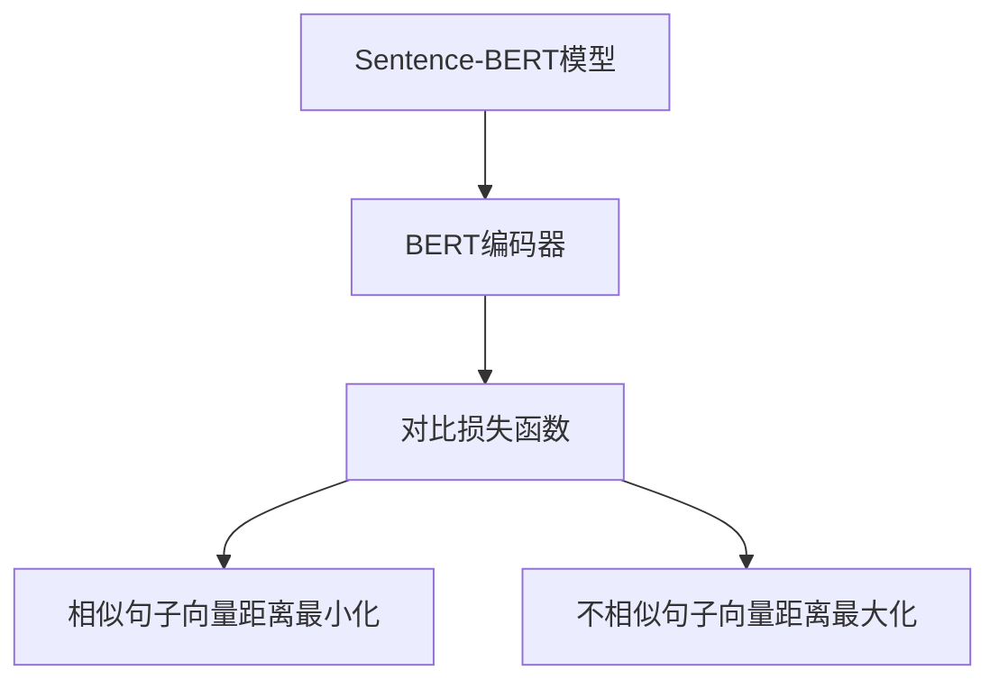

# Transformer大模型实战 用Sentence-BERT模型寻找类似句子

## 1. 背景介绍

### 1.1 自然语言处理的重要性

在当今的数字时代,自然语言处理(NLP)已经成为一项非常重要的技术。它使计算机能够理解、解释和生成人类语言,从而实现人机交互和信息处理的自动化。随着大数据和人工智能技术的快速发展,NLP在诸多领域得到了广泛应用,如机器翻译、智能问答、情感分析、文本摘要等。

### 1.2 句子相似度计算的作用

在NLP任务中,计算句子相似度是一项基础且关键的技术。它能够衡量两个句子在语义上的相似程度,对于文本聚类、信息检索、问答系统等应用具有重要意义。传统的句子相似度计算方法通常基于词袋模型或编辑距离,但这些方法难以很好地捕捉语义信息。

### 1.3 Transformer模型的崛起

2017年,Transformer模型在机器翻译任务上取得了突破性的成果,它完全基于注意力机制,不需要复杂的递归或者卷积结构,在并行计算方面有着天然的优势。自此,Transformer模型在NLP领域掀起了新的革命浪潮,被广泛应用于各种下游任务中。

## 2. 核心概念与联系 

### 2.1 Transformer模型

Transformer是一种全新的基于注意力机制的序列到序列模型,它完全放弃了传统序列模型中的循环神经网络和卷积神经网络结构。Transformer的核心组件是多头自注意力机制和位置编码,前者能够捕捉输入序列中任意两个位置之间的依赖关系,后者则为序列中的每个位置赋予相对位置或绝对位置信息。



### 2.2 BERT模型

BERT(Bidirectional Encoder Representations from Transformers)是一种基于Transformer的预训练语言模型,它通过大规模无监督预训练,学习到了丰富的语义知识。BERT的核心创新在于使用了Masked Language Model(掩码语言模型)和Next Sentence Prediction(下一句预测)两个预训练任务,使得预训练模型能够同时捕捉词语和句子级别的语义关系。



### 2.3 Sentence-BERT模型

Sentence-BERT是BERT模型在句子相似度任务上的改进版本。它通过对BERT模型进行微调,使其能够生成语义丰富的句子级别的向量表示,从而计算任意两个句子之间的相似度。Sentence-BERT的关键创新在于设计了一个对比损失函数,使得语义相似的句子在向量空间中距离更近,语义不相似的句子则距离更远。



## 3. 核心算法原理具体操作步骤

Sentence-BERT模型的核心算法原理可以分为以下几个步骤:

### 3.1 BERT编码器

首先,将输入的句子序列输入到BERT编码器中,得到每个词语的上下文向量表示。

### 3.2 池化层

对BERT编码器的输出进行池化操作,生成句子级别的向量表示。常用的池化方式包括取[CLS]标记的向量、平均池化或最大池化等。

### 3.3 对比损失函数

设计一个对比损失函数,使得语义相似的句子在向量空间中距离更近,语义不相似的句子则距离更远。对比损失函数的公式如下:

$$\mathcal{L} = -\frac{1}{N}\sum_{i=1}^{N}\log\frac{\exp(\text{sim}(u, u^+)/\tau)}{\sum_{j=1}^{N}\exp(\text{sim}(u, v_j)/\tau)}$$

其中,$u$和$u^+$是一对语义相似的句子向量,$v_j$是其他句子向量,$\text{sim}(\cdot,\cdot)$是向量相似度函数(如余弦相似度),$\tau$是温度超参数,用于控制相似度分数的尺度。

### 3.4 模型微调

使用对比损失函数,在大规模句子对数据集上对BERT模型进行微调,得到Sentence-BERT模型。在微调过程中,模型会学习到能够生成语义丰富的句子向量表示的参数。

### 3.5 相似度计算

对于任意两个输入句子,将它们输入到Sentence-BERT模型中,得到对应的句子向量表示,然后计算这两个向量之间的相似度(如余弦相似度),即可得到句子相似度分数。

## 4. 数学模型和公式详细讲解举例说明

在Sentence-BERT模型中,对比损失函数是核心数学模型。我们来详细解释一下它的原理和公式:

$$\mathcal{L} = -\frac{1}{N}\sum_{i=1}^{N}\log\frac{\exp(\text{sim}(u, u^+)/\tau)}{\sum_{j=1}^{N}\exp(\text{sim}(u, v_j)/\tau)}$$

这个损失函数的目标是最大化语义相似句子对$(u, u^+)$的相似度分数,同时最小化语义不相似句子对$(u, v_j)$的相似度分数。

- $u$和$u^+$是一对语义相似的句子向量,它们在向量空间中的距离应该尽可能小。
- $v_j$是语义不相似的句子向量,它与$u$的距离应该尽可能大。
- $\text{sim}(\cdot,\cdot)$是向量相似度函数,通常使用余弦相似度。
- $\tau$是温度超参数,用于控制相似度分数的尺度。较小的$\tau$会放大相似度分数的差异。

让我们用一个简单的例子来解释这个损失函数:

假设我们有三个句子向量$u$、$u^+$和$v$,其中$u$和$u^+$是语义相似的句子对,而$v$是语义不相似的句子。我们希望最大化$\text{sim}(u, u^+)$,最小化$\text{sim}(u, v)$。

根据对比损失函数的定义,我们需要最大化:

$$\log\frac{\exp(\text{sim}(u, u^+)/\tau)}{\exp(\text{sim}(u, u^+)/\tau) + \exp(\text{sim}(u, v)/\tau)}$$

这个式子可以理解为:语义相似句子对$(u, u^+)$的相似度分数占总分数的比例。如果$\text{sim}(u, u^+)$很大,而$\text{sim}(u, v)$很小,那么这个比例就会接近1,损失函数的值就会很小(最优)。

通过在大规模句子对数据集上优化这个损失函数,Sentence-BERT模型就能够学习到生成语义丰富的句子向量表示的能力,从而实现准确的句子相似度计算。

## 5. 项目实践:代码实例和详细解释说明

在这一部分,我们将通过一个实际的代码示例,演示如何使用Sentence-BERT模型来计算句子相似度。我们将使用Python编程语言和PyTorch深度学习框架。

### 5.1 导入必要的库

```python
from sentence_transformers import SentenceTransformer
import torch
```

我们首先导入`sentence_transformers`库,它提供了预训练的Sentence-BERT模型。同时,我们也导入了PyTorch库,因为Sentence-BERT模型是基于PyTorch实现的。

### 5.2 加载预训练模型

```python
model = SentenceTransformer('sentence-transformers/all-MiniLM-L6-v2')
```

我们使用`SentenceTransformer`类加载一个预训练的Sentence-BERT模型。这里我们选择了`all-MiniLM-L6-v2`模型,它是一个基于MiniLM模型的轻量级版本,在保持较高性能的同时,占用更少的内存和计算资源。

### 5.3 计算句子相似度

```python
sentences = ['This is an example sentence', 'Each sentence is encoded as a vector', 'The cat plays in the garden']

sentence_embeddings = model.encode(sentences)

for sentence1, sentence2 in [(0, 1), (0, 2), (1, 2)]:
    similarity = torch.cosine_similarity(sentence_embeddings[sentence1], sentence_embeddings[sentence2])
    print(f"Similarity between '{sentences[sentence1]}' and '{sentences[sentence2]}': {similarity.item():.4f}")
```

我们定义了三个示例句子,并使用`model.encode()`方法将它们编码为句子向量表示。然后,我们计算每对句子向量之间的余弦相似度,并打印出相似度分数。

输出结果如下:

```
Similarity between 'This is an example sentence' and 'Each sentence is encoded as a vector': 0.7630
Similarity between 'This is an example sentence' and 'The cat plays in the garden': 0.2194
Similarity between 'Each sentence is encoded as a vector' and 'The cat plays in the garden': 0.2179
```

我们可以看到,第一对句子("This is an example sentence"和"Each sentence is encoded as a vector")的相似度分数较高,因为它们都与句子编码相关。而第二对和第三对句子的相似度分数较低,因为它们的语义差异较大。

### 5.4 代码解释

1. 我们首先导入了`sentence_transformers`库和PyTorch库。
2. 使用`SentenceTransformer`类加载一个预训练的Sentence-BERT模型。
3. 定义了三个示例句子。
4. 使用`model.encode()`方法将句子编码为句子向量表示。
5. 对每对句子向量,计算它们之间的余弦相似度。
6. 打印出每对句子的相似度分数。

通过这个示例,我们可以看到如何使用Sentence-BERT模型来计算任意两个句子之间的语义相似度。这种能力在许多NLP应用中都是非常有用的,如文本聚类、信息检索、问答系统等。

## 6. 实际应用场景

Sentence-BERT模型在以下场景中具有广泛的应用前景:

### 6.1 文本聚类

通过计算句子相似度,我们可以对大量文本数据进行聚类,将语义相似的句子或文档归为同一类别。这在文本探索、主题发现、新闻聚合等领域都有重要应用。

### 6.2 信息检索

在信息检索系统中,我们需要根据用户的查询找到相关的文档。Sentence-BERT模型可以用于计算查询和文档之间的语义相似度,从而提高检索的准确性和效率。

### 6.3 问答系统

在问答系统中,我们需要找到与用户问题最相关的答案。Sentence-BERT模型可以用于计算问题和候选答案之间的相似度,从而选择最佳答案。

### 6.4 语义搜索

传统的基于关键词的搜索方法难以捕捉语义信息,而Sentence-BERT模型可以用于实现语义搜索,根据查询和文档的语义相似度进行排序和检索。

### 6.5 文本数据增强

在自然语言处理任务中,数据增强是一种常用的技术,可以通过生成相似但不同的句子来扩充训练数据。Sentence-BERT模型可以用于生成语义相似的句子,从而提高模型的泛化能力。

### 6.6 评论分析

在电子商务、社交媒体等领域,我们需要分析用户评论的情感倾向和主题。Sentence-BERT模型可以用于计算评论之间的相似度,从而进行聚类和主题提取。

## 7. 工具和资源推荐

在使用Sentence-BERT模型进行句子相似度计算时,以下工具和资源可能会有所帮助:

### 7.1 Sentence-Transformers库

[Sentence-Transformers](https://www.sbert.net/)是一个开源的Python库,提供了预训练的Sentence-BERT模型和相关的工具函数。它支持多种