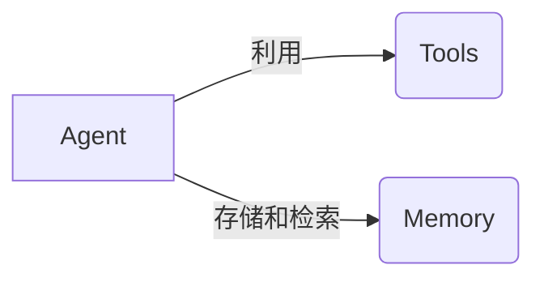
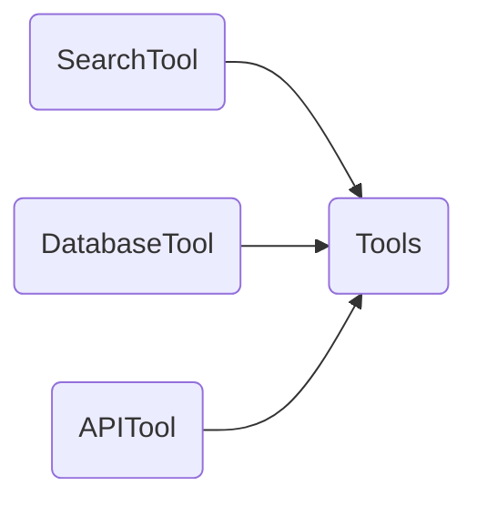
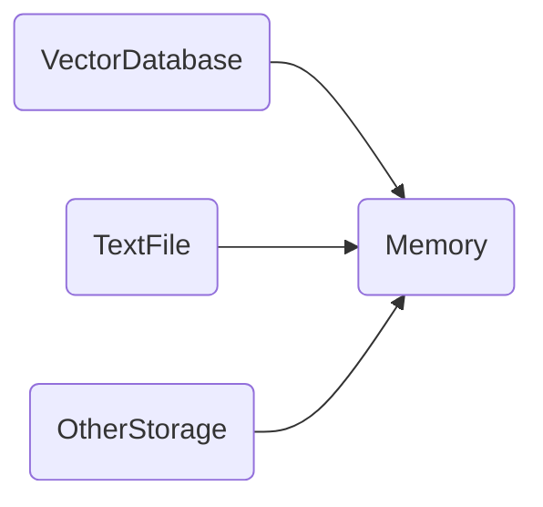
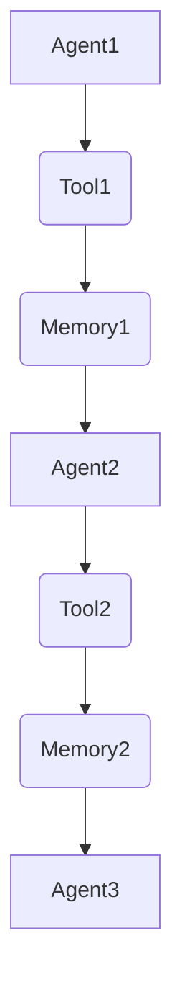
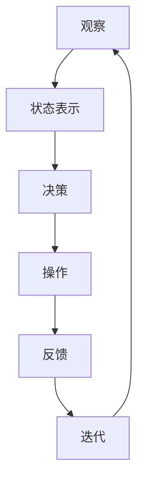

# 【LangChain编程：从入门到实践】生态系统概览

## 1. 背景介绍

在当今数据驱动的时代,人工智能(AI)和大数据分析已经成为各行业的核心竞争力。随着数据量的不断增长和复杂性的提高,传统的数据处理方式已经无法满足现代应用的需求。因此,一种新的编程范式应运而生——LangChain。

LangChain是一个强大的Python库,旨在简化人工智能(AI)应用程序的构建过程。它提供了一种标准化的方式来组合不同的AI模型、数据源和工具,从而创建复杂的工作流程。LangChain的出现,使得开发人员能够更高效地利用大规模数据和AI模型,解决现实世界中的各种挑战。

## 2. 核心概念与联系

LangChain的核心概念包括Agent、Tool、Memory和Chain。这些概念相互关联,共同构建了LangChain的生态系统。

### 2.1 Agent

Agent是LangChain中最核心的概念,它代表了一个智能代理,能够根据特定的目标和约束条件执行一系列操作。Agent可以与各种工具(Tools)和知识库(Memory)进行交互,以完成复杂的任务。



### 2.2 Tools

Tools是LangChain中的另一个关键概念,它代表了各种可用于执行特定任务的工具或服务。Tools可以是搜索引擎、数据库、API或任何其他可以与代理进行交互的资源。Agent可以根据需要选择和调用适当的Tools来完成任务。



### 2.3 Memory

Memory是LangChain中用于存储和检索信息的组件。它允许Agent在执行任务过程中记住和访问相关的数据、中间结果和上下文信息。Memory可以采用不同的形式,如向量数据库、文本文件或其他存储介质。



### 2.4 Chain

Chain是LangChain中用于组合和编排多个Agent、Tools和Memory的概念。它定义了一系列步骤,指导Agent如何执行特定的任务。Chain可以是简单的线性序列,也可以是复杂的条件分支和循环结构。



通过将这些核心概念组合在一起,LangChain提供了一种灵活且可扩展的方式来构建复杂的AI应用程序。开发人员可以根据特定的需求和约束条件,自由地组合和配置不同的Agent、Tools、Memory和Chain,从而创建定制化的解决方案。

## 3. 核心算法原理具体操作步骤

LangChain的核心算法原理是基于代理-环境交互模型(Agent-Environment Interaction Model)。该模型描述了智能代理如何与环境进行交互,以达成特定的目标。在LangChain中,这个过程可以概括为以下几个步骤:

1. **观察(Observation)**: 代理首先观察当前的环境状态,包括任务目标、可用资源(Tools和Memory)以及任何其他相关信息。

2. **状态表示(State Representation)**: 代理将观察到的环境状态转换为内部的状态表示,以便进行后续的决策和规划。

3. **决策(Decision Making)**: 基于当前的状态表示,代理根据预定义的策略或算法做出决策,确定下一步要执行的操作。这可能涉及调用特定的工具、访问记忆或执行其他任务相关的操作。

4. **操作(Action)**: 代理执行决策中选择的操作,可能会导致环境状态的变化。

5. **反馈(Feedback)**: 环境根据代理的操作提供反馈,反映操作的结果和影响。这种反馈将被用于更新代理的状态表示和决策过程。

6. **迭代(Iteration)**: 代理重复上述步骤,直到达成任务目标或满足终止条件。



在这个过程中,LangChain利用了多种算法和技术,包括但不限于:

- **语言模型(Language Models)**: 用于理解和生成自然语言,支持与代理的交互。
- **规划算法(Planning Algorithms)**: 用于确定达成目标所需的操作序列。
- **强化学习(Reinforcement Learning)**: 用于优化代理的决策策略,以获得更好的性能。
- **知识表示(Knowledge Representation)**: 用于有效地存储和检索相关信息,支持代理的决策过程。

通过将这些算法和技术与LangChain的核心概念相结合,开发人员可以构建出高度智能和自适应的AI应用程序,能够处理复杂的任务并与人类协作。

## 4. 数学模型和公式详细讲解举例说明

在LangChain中,数学模型和公式主要应用于以下几个方面:

### 4.1 语言模型

语言模型是LangChain中一个关键的组件,用于理解和生成自然语言。常见的语言模型包括基于神经网络的模型,如Transformer模型和BERT模型。这些模型通常采用了自注意力机制(Self-Attention Mechanism)来捕捉输入序列中的长距离依赖关系。

自注意力机制的核心公式如下:

$$
\text{Attention}(Q, K, V) = \text{softmax}\left(\frac{QK^T}{\sqrt{d_k}}\right)V
$$

其中:
- $Q$ 表示查询(Query)矩阵
- $K$ 表示键(Key)矩阵
- $V$ 表示值(Value)矩阵
- $d_k$ 表示键的维度

通过计算查询和键之间的相似性得分,并对这些得分进行软最大化处理,自注意力机制可以为每个查询词捕获与其他词之间的关联关系,从而更好地理解输入序列的语义。

### 4.2 强化学习

强化学习是LangChain中另一个重要的组成部分,用于优化代理的决策策略。在强化学习中,代理与环境进行交互,根据采取的行动获得奖励或惩罚,目标是最大化累积奖励。

强化学习问题通常建模为马尔可夫决策过程(Markov Decision Process, MDP),可以用元组 $(S, A, P, R, \gamma)$ 表示,其中:

- $S$ 表示状态空间
- $A$ 表示动作空间
- $P(s' | s, a)$ 表示状态转移概率,即在状态 $s$ 下执行动作 $a$ 后转移到状态 $s'$ 的概率
- $R(s, a, s')$ 表示在状态 $s$ 下执行动作 $a$ 并转移到状态 $s'$ 时获得的奖励
- $\gamma \in [0, 1)$ 表示折现因子,用于权衡即时奖励和长期奖励的重要性

代理的目标是找到一个策略 $\pi: S \rightarrow A$,使得期望累积奖励最大化:

$$
\max_\pi \mathbb{E}\left[\sum_{t=0}^\infty \gamma^t R(s_t, a_t, s_{t+1}) \mid \pi\right]
$$

常见的强化学习算法包括Q-Learning、策略梯度(Policy Gradient)等。

### 4.3 知识表示

在LangChain中,知识表示是一个重要的挑战,因为代理需要有效地存储和检索各种形式的信息,包括结构化数据、非结构化文本等。常见的知识表示方法包括向量化(Vectorization)和图嵌入(Graph Embedding)。

向量化是将文本或其他数据映射到向量空间中的过程,使得相似的数据点在向量空间中彼此靠近。常见的向量化方法包括TF-IDF、Word2Vec和BERT等。

图嵌入则是将图结构数据映射到低维向量空间中,保留图中节点和边的拓扑结构信息。常见的图嵌入方法包括Node2Vec、GraphSAGE等。

通过将这些数学模型和公式应用于LangChain的不同组件中,开发人员可以构建出更加智能和高效的AI应用程序。

## 5. 项目实践:代码实例和详细解释说明

为了更好地理解LangChain的使用方式,我们将通过一个实际项目来演示如何利用LangChain构建一个智能问答系统。

### 5.1 项目概述

在这个项目中,我们将构建一个智能问答系统,能够回答关于特定主题(如科技、金融等)的各种问题。该系统将利用LangChain提供的各种组件,包括语言模型、知识库和工具等。

### 5.2 项目设置

首先,我们需要导入所需的库和模块:

```python
from langchain import OpenAI, VectorDBQA, ConversationalRetrievalChain
from langchain.chains.question_answering import load_qa_chain
from langchain.llms import OpenAI
from langchain.vectorstores import Chroma
```

接下来,我们需要设置OpenAI API密钥,以便使用OpenAI的语言模型:

```python
import os
os.environ["OPENAI_API_KEY"] = "your_openai_api_key"
```

### 5.3 构建知识库

在这个示例中,我们将使用一些关于科技主题的文本作为知识库。我们首先需要将这些文本加载到向量数据库中:

```python
from langchain.document_loaders import TextLoader
loader = TextLoader('path/to/your/text/files')
documents = loader.load()

from langchain.text_splitter import CharacterTextSplitter
text_splitter = CharacterTextSplitter(chunk_size=1000, chunk_overlap=0)
texts = text_splitter.split_documents(documents)

from langchain.vectorstores import Chroma
db = Chroma.from_documents(texts, embeddings, persist_directory="path/to/persist/directory")
```

这里我们使用了`TextLoader`来加载文本文件,`CharacterTextSplitter`将长文本分割成多个块,并使用`Chroma`向量数据库存储这些文本块及其向量表示。

### 5.4 构建问答链

接下来,我们将构建一个问答链(Question Answering Chain),用于处理用户的查询并从知识库中检索相关答案:

```python
retriever = db.as_retriever()
qa_chain = ConversationalRetrievalChain.from_llm(OpenAI(temperature=0), retriever=retriever)
```

这里我们使用`ConversationalRetrievalChain`创建了一个对话式的问答链,它将用户的查询与知识库中的相关文本进行匹配,并使用OpenAI的语言模型生成答案。

### 5.5 交互式问答

最后,我们可以通过一个交互式循环来与问答系统进行对话:

```python
while True:
    query = input("请输入您的问题: ")
    result = qa_chain({"question": query, "chat_history": []})
    print(f"答案: {result['result']}")
```

在这个循环中,用户可以输入问题,系统将根据知识库中的相关信息生成答案并输出。

通过这个示例,我们可以看到如何利用LangChain的各种组件构建一个智能问答系统。LangChain提供了灵活的方式来组合不同的模型、数据源和工具,使得开发人员可以快速构建出复杂的AI应用程序。

## 6. 实际应用场景

LangChain的应用场景非常广泛,涵盖了各个领域。以下是一些典型的应用场景:

### 6.1 智能助手

利用LangChain,我们可以构建智能助手系统,用于回答各种问题、执行任务或提供建议。这些助手可以应用于客户服务、个人助理、教育辅导等领域。

### 6.2 知识管理

LangChain可以帮助组织更好地管理和利用其知识资产。通过将各种数据源和知识库集成到LangChain中,组织可以更高效地检索和利用相关信息,支持决策和业务运营。

### 6.3 自动化工作流

LangChain可以用于自动化各种复杂的工作流程,