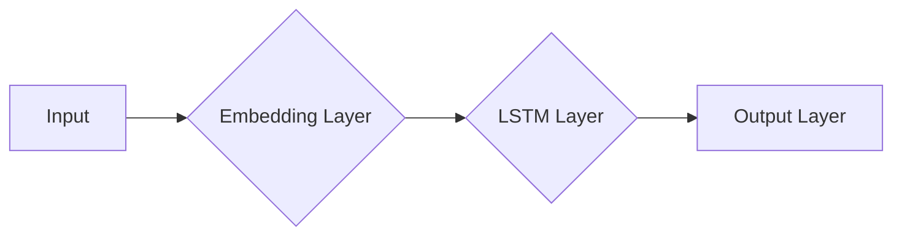

# 一切皆是映射：使用深度学习进行情感分析

## 1. 背景介绍

随着互联网的飞速发展，人们产生和传播的内容日益丰富。在这些内容中，情感信息蕴含着巨大的价值，它反映了人们的情绪、态度和观点。情感分析（Sentiment Analysis），又称意见挖掘，旨在对文本数据中的情感倾向进行自动识别和分类。深度学习作为人工智能领域的一个重要分支，在情感分析领域展现出强大的能力。本文将深入探讨深度学习在情感分析中的应用，分析其核心概念、算法原理、项目实践以及实际应用场景。

## 2. 核心概念与联系

### 2.1 情感分析

情感分析是自然语言处理（NLP）的一个重要分支，主要任务是从文本中提取情感倾向，即识别文本是正面、负面还是中性。情感分析在舆情分析、产品评价、客户服务等领域有着广泛的应用。

### 2.2 深度学习

深度学习是一种模拟人脑神经网络结构和功能的人工智能技术，通过多层级特征提取，从原始数据中自动学习到具有较强表征能力的特征表示。深度学习在图像识别、语音识别、自然语言处理等领域取得了显著的成果。

### 2.3 关系

深度学习在情感分析中的应用，是将深度学习技术与自然语言处理技术相结合，通过深度学习模型自动学习文本中的情感特征，实现对情感倾向的识别。

## 3. 核心算法原理具体操作步骤

### 3.1 数据预处理

在深度学习模型进行训练之前，需要对原始文本数据进行预处理，主要包括以下步骤：

1. 分词：将文本拆分成单个词语。
2. 去除停用词：去除对情感倾向影响不大的词语，如“的、是、在”等。
3. 词性标注：标注每个词语的词性，如名词、动词、形容词等。
4. 向量化：将文本数据转化为向量形式，以便输入深度学习模型。

### 3.2 深度学习模型

目前，在情感分析中常用的深度学习模型有：

1. 卷积神经网络（CNN）：通过卷积操作提取文本特征，适用于短文本情感分析。
2. 循环神经网络（RNN）：通过循环连接学习文本序列信息，适用于长文本情感分析。
3. 长短期记忆网络（LSTM）：LSTM是RNN的一种变体，能够更好地处理长序列数据。

以下为LSTM模型的基本结构：



### 3.3 模型训练与评估

1. 将预处理后的数据划分为训练集和测试集。
2. 使用训练集对深度学习模型进行训练，不断调整模型参数，使其收敛。
3. 使用测试集对训练好的模型进行评估，计算准确率、召回率等指标。

## 4. 数学模型和公式详细讲解举例说明

### 4.1 词向量

词向量是一种将词语转化为向量表示的方法，常用的词向量模型有：

1. Word2Vec：通过训练大量语料库，将词语映射到连续的向量空间，具有语义相似性。
2. GloVe：基于词共现信息，学习词语的向量表示，具有较好的语义相似性。

以下为Word2Vec的原理：

$$
\\text{Word2Vec} = \\text{Word Embedding} + \\text{Neural Network}
$$

### 4.2 LSTM

LSTM是一种特殊的RNN，具有以下特点：

1. 门控机制：通过遗忘门、输入门和输出门控制信息流向。
2. 长短期记忆单元：能够存储长期依赖信息。

以下为LSTM的门控机制：

$$
\\begin{align*}
f_t &= \\sigma(W_f \\cdot [h_{t-1}, x_t] + b_f) \\\\
i_t &= \\sigma(W_i \\cdot [h_{t-1}, x_t] + b_i) \\\\
\\end{align*}
$$

## 5. 项目实践：代码实例和详细解释说明

以下是一个简单的情感分析项目实例，使用Python和TensorFlow实现：

```python
import tensorflow as tf
from tensorflow.keras.models import Sequential
from tensorflow.keras.layers import Embedding, LSTM, Dense, Dropout

# 加载数据
# ...

# 创建模型
model = Sequential()
model.add(Embedding(input_dim=vocab_size, output_dim=embedding_dim, input_length=max_length))
model.add(LSTM(units=128, return_sequences=True))
model.add(Dropout(0.2))
model.add(LSTM(units=128))
model.add(Dropout(0.2))
model.add(Dense(1, activation='sigmoid'))

# 编译模型
model.compile(optimizer='adam', loss='binary_crossentropy', metrics=['accuracy'])

# 训练模型
model.fit(X_train, y_train, epochs=10, batch_size=32, validation_split=0.1)

# 评估模型
loss, accuracy = model.evaluate(X_test, y_test)
print(\"Test accuracy:\", accuracy)
```

### 5.1 代码解释

1. `Embedding`：将词语转化为向量表示。
2. `LSTM`：使用LSTM层提取文本特征。
3. `Dense`：使用全连接层输出情感倾向。
4. `adam`：使用adam优化器。
5. `binary_crossentropy`：使用二元交叉熵损失函数。
6. `accuracy`：计算准确率。

## 6. 实际应用场景

情感分析在实际应用场景中具有广泛的应用，以下列举一些常见的应用场景：

1. 舆情分析：对网络舆情进行监测和分析，了解公众对某一事件的态度。
2. 产品评价：分析用户对产品的评价，了解产品优缺点。
3. 客户服务：分析客户反馈，提升客户满意度。
4. 健康监测：分析医疗报告，了解患者的健康状况。
5. 金融风控：分析用户评论，识别潜在风险。

## 7. 工具和资源推荐

1. 自然语言处理工具：NLTK、spaCy
2. 深度学习框架：TensorFlow、PyTorch
3. 数据集：IMDb、Sentiment140

## 8. 总结：未来发展趋势与挑战

随着深度学习技术的不断发展，情感分析在准确率和效率方面取得了显著进步。未来发展趋势如下：

1. 多模态情感分析：结合文本、语音、图像等多模态数据，提高情感分析准确率。
2. 零样本学习：无需训练数据即可进行情感分析。
3. 情感细微粒度识别：识别文本中的细微情感，如喜悦、悲伤、愤怒等。

然而，情感分析仍面临以下挑战：

1. 数据质量：高质量的情感分析数据难以获取。
2. 情感复杂度：情感表达复杂多样，难以准确识别。
3. 文化差异：不同文化背景下，情感表达存在差异。

## 9. 附录：常见问题与解答

### 9.1 如何提高情感分析准确率？

1. 使用高质量的语料库进行训练。
2. 采用合适的深度学习模型。
3. 优化模型参数。
4. 结合多模态数据。

### 9.2 如何处理带有讽刺意味的文本？

1. 使用对抗样本训练模型。
2. 引入上下文信息，分析讽刺情感。

作者：禅与计算机程序设计艺术 / Zen and the Art of Computer Programming