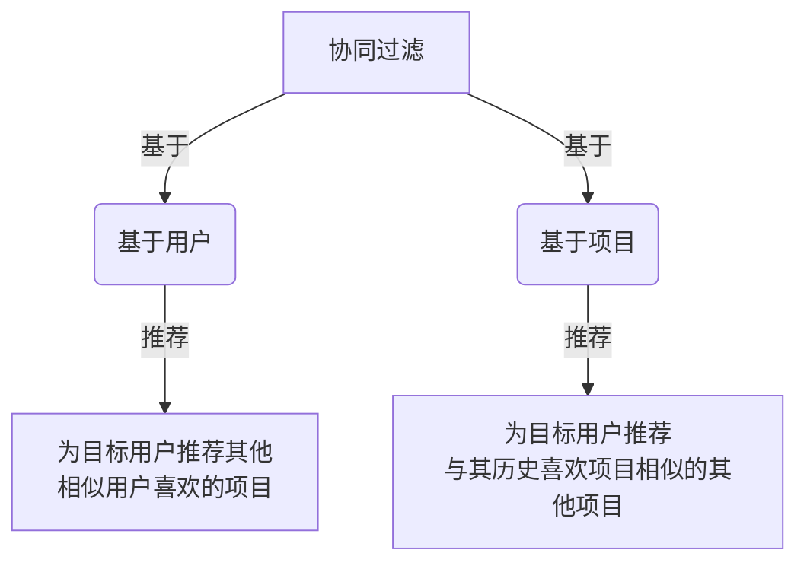
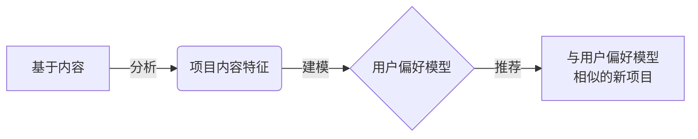
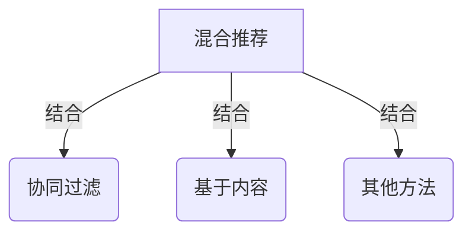
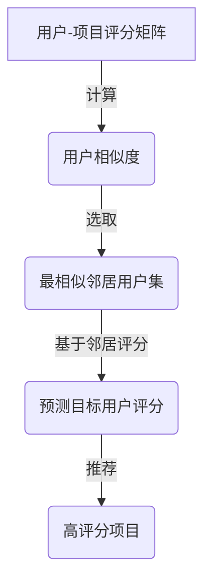
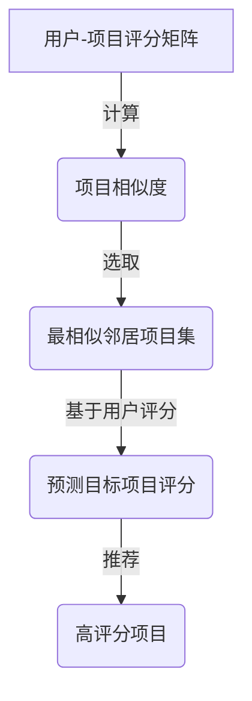
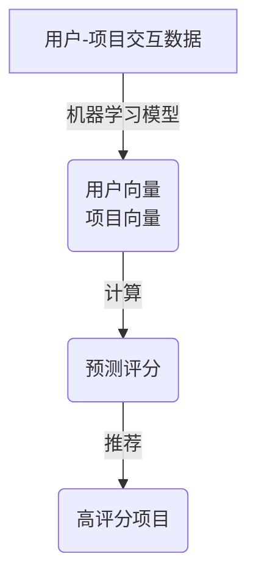
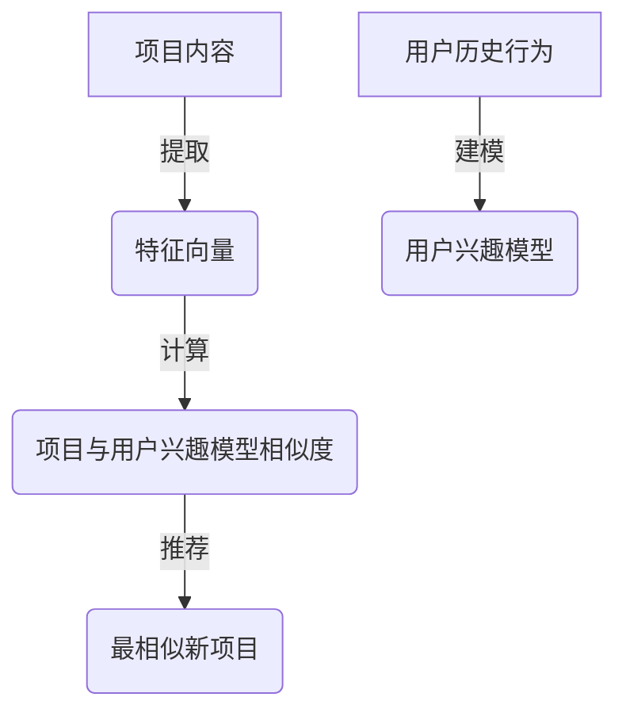

# 推荐系统(Recommender Systems) - 原理与代码实例讲解

## 1.背景介绍

### 1.1 什么是推荐系统?

推荐系统(Recommender Systems)是一种能够根据用户的过往行为、偏好和其他相关信息,预测并推荐可能感兴趣的项目(如商品、服务、信息等)的智能系统。在当今信息过载的时代,推荐系统扮演着"信息过滤器"的角色,帮助用户从海量可选项目中发现真正感兴趣和需要的内容。

### 1.2 推荐系统的重要性

推荐系统已广泛应用于电子商务、在线视频、音乐流媒体、社交网络等多个领域,为用户提供个性化和高度相关的推荐,从而提高用户体验、增加收入和留存率。事实上,推荐系统已成为当今主流互联网公司的核心业务组成部分。

### 1.3 推荐系统的挑战

尽管推荐系统带来了巨大价值,但其设计和实现也面临诸多挑战:

- 数据质量和稀疏性
- 冷启动问题
- 隐私和安全性
- 可扩展性和实时性
- 评估和在线实验

## 2.核心概念与联系

推荐系统通常基于以下三种核心方法:

### 2.1 协同过滤(Collaborative Filtering)

基于用户-项目交互数据(如评分、点击等),发现具有相似偏好的用户群或相似特征的项目群,从而为目标用户推荐其他用户喜欢的项目。协同过滤分为:

- 基于用户(User-based)
- 基于项目(Item-based)



### 2.2 基于内容(Content-based)

根据项目的内容特征(如文本、图像等),发现用户过去喜欢的项目特征模式,从而推荐具有相似特征的新项目。



### 2.3 混合推荐(Hybrid)

将协同过滤和基于内容等多种方法相结合,以弥补各自的缺陷,提高推荐质量。



## 3.核心算法原理具体操作步骤

### 3.1 协同过滤算法

#### 3.1.1 基于用户的协同过滤

1. 计算用户相似度
   - 基于评分数据,计算目标用户与其他用户之间的相似度(如皮尔逊相关系数)
2. 找到最相似的邻居用户集
3. 基于邻居用户的评分,预测目标用户对项目的评分
4. 推荐给目标用户预测评分较高的项目



#### 3.1.2 基于项目的协同过滤

1. 计算项目相似度
   - 基于用户评分数据,计算项目与项目之间的相似度(如余弦相似度)
2. 找到与目标项目最相似的邻居项目集
3. 基于目标用户对邻居项目的评分,预测其对目标项目的评分
4. 推荐给目标用户预测评分较高的项目



#### 3.1.3 基于模型的协同过滤

通过机器学习技术(如矩阵分解、神经网络等)从用户-项目交互数据中学习出潜在的用户和项目向量表示,并基于这些向量计算预测评分。



### 3.2 基于内容推荐算法

1. 从项目内容(如文本、图像等)中提取特征向量
2. 建立用户兴趣模型
   - 根据用户历史行为(如评分、点击等),学习用户对不同特征的偏好权重
3. 计算项目与用户兴趣模型的相似度
4. 推荐与用户兴趣模型最相似的新项目



## 4.数学模型和公式详细讲解举例说明

### 4.1 用户相似度计算

常用的用户相似度计算方法是皮尔逊相关系数(Pearson Correlation Coefficient):

$$sim(u,v) = \frac{\sum_{i \in I}(r_{u,i} - \overline{r_u})(r_{v,i} - \overline{r_v})}{\sqrt{\sum_{i \in I}(r_{u,i} - \overline{r_u})^2}\sqrt{\sum_{i \in I}(r_{v,i} - \overline{r_v})^2}}$$

其中:
- $u$和$v$是两个用户
- $I$是两个用户都评分过的项目集合
- $r_{u,i}$是用户$u$对项目$i$的评分
- $\overline{r_u}$是用户$u$的平均评分

该公式衡量两个用户评分向量的相关程度,取值范围为[-1, 1],值越接近1表示两个用户越相似。

### 4.2 预测评分

一旦找到最相似的邻居用户集$N$,可以使用加权平均的方式预测目标用户$u$对项目$i$的评分:

$$\hat{r}_{u,i} = \overline{r_u} + \frac{\sum_{v \in N}sim(u,v)(r_{v,i} - \overline{r_v})}{\sum_{v \in N}|sim(u,v)|}$$

其中:
- $\hat{r}_{u,i}$是预测的评分
- $\overline{r_u}$是用户$u$的平均评分
- $sim(u,v)$是用户$u$和$v$的相似度
- $r_{v,i}$是用户$v$对项目$i$的评分
- $\overline{r_v}$是用户$v$的平均评分

### 4.3 基于模型的评分预测

在基于模型的协同过滤中,常用的技术是矩阵分解(Matrix Factorization),其目标是将用户-项目评分矩阵$R$分解为两个低维矩阵$P$和$Q$的乘积:

$$R \approx P^TQ$$

其中$P$是用户向量矩阵,$Q$是项目向量矩阵。预测评分可以通过计算:

$$\hat{r}_{u,i} = p_u^Tq_i$$

其中$p_u$是用户$u$的向量表示,$q_i$是项目$i$的向量表示。

这些向量可以通过优化损失函数的方式从评分数据中学习得到,例如使用随机梯度下降优化以下均方根损失函数:

$$\min_{P,Q} \sum_{(u,i) \in R}(r_{u,i} - p_u^Tq_i)^2 + \lambda(||P||^2 + ||Q||^2)$$

其中$\lambda$是正则化系数,用于避免过拟合。

## 5.项目实践:代码实例和详细解释说明

以下是使用Python和Surprise库实现基于用户的协同过滤算法的示例代码:

```python
import surprise
from surprise import Reader, Dataset, SVD, accuracy
from surprise.model_selection import train_test_split

# 加载数据集
file_path = 'data/ratings.csv'
reader = Reader(line_format='user item rating timestamp', sep=',')
data = Dataset.load_from_file(file_path, reader=reader)

# 拆分训练集和测试集
trainset, testset = train_test_split(data, test_size=0.2)

# 使用SVD++算法训练模型
algo = SVD()
algo.fit(trainset)

# 评估模型在测试集上的准确性
predictions = algo.test(testset)
rmse = accuracy.rmse(predictions)
print(f'RMSE: {rmse:.4f}')

# 为用户推荐未评分的电影
uid = '85'
user_ratings = data.ur[uid]
unrated_movies = [str(movie_id) for movie_id in data.all_items() if str(movie_id) not in user_ratings.keys()]

recommendations = algo.get_top_n(uid, n=10)
print(f'Recommendations for user {uid}:')
for rec in recommendations:
    movie_id = rec.iid
    rating = rec.est
    print(f'Movie {movie_id}: {rating:.2f}')
```

代码解释:

1. 加载评分数据集,这里使用的是MovieLens 100K数据集。
2. 将数据集拆分为训练集和测试集。
3. 使用Surprise库中的SVD++算法训练模型,SVD++是一种基于矩阵分解的协同过滤算法。
4. 在测试集上评估模型的准确性,使用RMSE(Root Mean Squared Error)作为评估指标。
5. 为特定用户推荐未评分的电影,使用`get_top_n`方法获取预测评分最高的N个项目作为推荐结果。

## 6.实际应用场景

推荐系统在以下领域有着广泛的应用:

- **电子商务**: 亚马逊、淘宝等电商平台利用推荐系统为用户推荐感兴趣的商品,提高购买转化率。
- **视频/音乐流媒体**: Netflix、YouTube、Spotify等平台根据用户观看/收听历史推荐个性化的视频/音乐内容。
- **社交网络**: Facebook、Twitter等社交媒体利用推荐系统推荐用户可能感兴趣的人、主题和内容。
- **新闻/博客推荐**: Google News、Flipboard等新闻聚合应用程序使用推荐算法为用户推荐相关新闻和文章。
- **广告推荐**: 在线广告系统利用推荐技术为用户推荐最合适的广告。

## 7.工具和资源推荐

以下是一些流行的推荐系统工具和资源:

- **Surprise**: 一个基于Python的推荐系统库,提供多种协同过滤和基于内容的算法。
- **TensorRec**: 一个基于TensorFlow的推荐系统库,支持多种深度学习模型。
- **Microsoft Recommenders**: 微软开源的推荐系统库,提供多种推荐算法和示例。
- **LightFM**: 一个基于Python的混合推荐系统库,结合了协同过滤和基于内容的方法。
- **MovieLens数据集**: 由GroupLens研究小组提供的电影评分数据集,常用于推荐系统研究。
- **Recsys Challenges**: 推荐系统领域的一些公开数据集和竞赛,用于算法评测和比较。

## 8.总结:未来发展趋势与挑战

推荐系统是一个活跃的研究领域,未来将继续面临以下挑战和发展趋势:

- **深度学习模型**: 利用深度神经网络捕捉复杂的用户偏好和项目特征,提高推荐准确性。
- **序列化推荐**: 考虑用户行为的时序信息,推荐与用户当前状态相关的下一个项目。
- **多任务学习**: 将推荐任务与其他相关任务(如评论生成、知识图谱等)联合建模,互相增强。
- **解释性推荐**: 提供可解释的推荐结果,增加