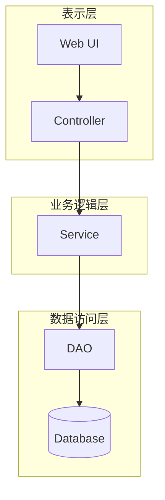

# 设计模式与软件架构原理与代码实战案例讲解

## 1.背景介绍

软件设计模式和架构原理是软件开发中的核心概念,对于构建高质量、可维护、可扩展的软件系统至关重要。设计模式提供了可重用的解决方案,帮助开发人员应对常见的软件设计挑战。而软件架构则定义了系统的整体结构、组件及其关系,确保系统满足功能和非功能需求。

本文将深入探讨设计模式和软件架构的原理,并通过实际案例展示它们在实践中的应用。无论您是资深开发人员还是初学者,本文都将为您提供宝贵的见解和实用技巧。

## 2.核心概念与联系

### 2.1 设计模式

设计模式是软件设计中可复用的解决方案,描述了在特定情况下如何解决常见的设计问题。它们不是可执行的代码,而是一种思维方式和最佳实践。设计模式遵循一些基本原则,如开放-封闭原则、单一职责原则等,帮助开发人员编写更加灵活、可维护和可扩展的代码。

常见的设计模式包括:

- **创建型模式**,如单例模式、工厂模式等,用于对象创建。
- **结构型模式**,如适配器模式、装饰器模式等,用于组合对象。
- **行为型模式**,如观察者模式、策略模式等,用于对象间的通信和职责分配。

### 2.2 软件架构

软件架构描述了系统的整体结构、组件及其之间的交互关系。它是系统的蓝图,确保系统满足功能和非功能需求,如可扩展性、性能、安全性等。软件架构通常包括以下几个方面:

- **架构风格**,如分层架构、微服务架构等。
- **架构模式**,如管道-过滤器模式、事件驱动架构等。
- **架构决策**,解决特定问题的架构选择。

### 2.3 设计模式与架构的关系

设计模式和软件架构密切相关,相辅相成。设计模式关注代码级别的设计,解决特定问题;而软件架构则关注系统级别的设计,确保整体满足需求。在实践中,设计模式常被用于构建软件架构的组件,而架构则为应用设计模式提供了上下文。

## 3.核心算法原理具体操作步骤  

虽然设计模式和软件架构本身并不涉及具体的算法,但它们提供了构建高质量软件系统的指导原则和最佳实践。以下是一些核心原理和操作步骤:

### 3.1 面向对象设计原则(SOLID)

SOLID原则是面向对象设计的五个基本原则,它们指导我们如何编写可维护、可扩展的面向对象代码。

1. **单一职责原则(SRP)**: 一个类应该只有一个职责,只有一个改变的原因。
2. **开放-封闭原则(OCP)**: 软件实体应该对扩展开放,对修改封闭。
3. **里氏替换原则(LSP)**: 子类对象应该可以替换其超类对象。
4. **接口隔离原则(ISP)**: 客户端不应该被强制依赖它不需要的接口。
5. **依赖反转原则(DIP)**: 高层模块不应该依赖低层模块,两者都应该依赖于抽象。

遵循这些原则可以提高代码的可维护性、可扩展性和可测试性。

### 3.2 设计模式的选择和应用

选择和应用合适的设计模式需要经验和实践。以下是一些常见的步骤:

1. **识别问题**: 明确需要解决的设计问题,如对象创建、对象组合还是对象通信。
2. **研究模式**: 研究不同的设计模式,了解它们的结构、优缺点和适用场景。
3. **选择模式**: 根据具体问题和上下文,选择最合适的设计模式。
4. **实现模式**: 按照模式的结构和原则,编写代码实现该模式。
5. **测试和优化**: 对实现进行单元测试,并根据需要进行优化和重构。

### 3.3 架构设计过程

设计软件架构需要考虑系统的功能和非功能需求,以及技术、业务和组织约束。以下是一个常见的架构设计过程:

1. **需求收集和分析**: 收集和分析系统的功能和非功能需求。
2. **架构驱动设计**: 选择合适的架构风格和模式,如分层架构、微服务架构等。
3. **架构分解**: 将系统分解为不同的组件和子系统,定义它们的职责和接口。
4. **架构评估**: 评估架构设计是否满足需求,是否符合架构原则和最佳实践。
5. **架构实现**: 根据架构设计实现系统,包括编码、测试和部署。
6. **架构演进**: 持续评估和优化架构,以适应变化的需求和技术环境。

## 4.数学模型和公式详细讲解举例说明

虽然设计模式和软件架构本身不涉及复杂的数学模型,但一些相关的度量和原则可以用数学公式来表示。

### 4.1 耦合度和内聚度

耦合度(Coupling)和内聚度(Cohesion)是衡量模块独立性和内部一致性的两个重要指标。低耦合和高内聚是设计高质量模块的关键。

耦合度可以用两个模块之间的依赖关系来衡量:

$$
C(A, B) = \frac{依赖关系数量}{A和B的最大可能依赖关系数量}
$$

内聚度可以用一个模块内部元素之间的关联程度来衡量:

$$
H(M) = \frac{M内部相关元素对数量}{M中元素对的总数量}
$$

理想情况下,我们希望耦合度尽可能低,内聚度尽可能高。

### 4.2 设计模式复杂度

设计模式的复杂度可以用类、接口、方法和关系的数量来衡量。例如,对于单例模式,我们可以定义以下指标:

- 类数量: 1
- 接口数量: 0
- 方法数量: 2 (getInstance()和私有构造函数)
- 关系数量: 0

复杂度越低,模式越容易理解和实现。

### 4.3 架构度量

架构度量用于评估架构设计的质量,例如可维护性、可扩展性和性能。一些常见的度量包括:

- **循环复杂度(Cyclomatic Complexity)**: 衡量代码路径的复杂程度。
- **架构抽象层次(Architecture Abstraction Level)**: 衡量架构中抽象层次的数量。
- **架构最佳实践匹配度(Architecture Best Practice Matching)**: 评估架构设计是否符合最佳实践。

这些度量可以帮助架构师和开发人员识别架构设计中的潜在问题,并进行优化。

## 5.项目实践:代码实例和详细解释说明

为了更好地理解设计模式和软件架构的应用,我们将通过一个实际案例来进行说明。

### 5.1 案例背景

假设我们需要开发一个电子商务网站,它包括以下主要功能:

- 用户可以浏览和购买商品
- 管理员可以管理商品目录和订单
- 系统需要支持多种付款方式
- 系统需要具有良好的可扩展性和可维护性

### 5.2 设计模式应用

在该项目中,我们可以应用多种设计模式来解决不同的设计问题。

#### 5.2.1 单例模式

对于一些全局唯一的资源,如数据库连接池、配置管理器等,我们可以使用单例模式来确保只有一个实例存在。以下是一个简单的单例模式实现:

```java
public class ConfigManager {
    private static ConfigManager instance;
    private Map<String, String> configurations;

    private ConfigManager() {
        // 加载配置文件
        configurations = loadConfigFromFile();
    }

    public static ConfigManager getInstance() {
        if (instance == null) {
            synchronized (ConfigManager.class) {
                if (instance == null) {
                    instance = new ConfigManager();
                }
            }
        }
        return instance;
    }

    public String getConfig(String key) {
        return configurations.get(key);
    }

    // 其他方法...
}
```

#### 5.2.2 工厂模式

对于创建不同类型的对象,如不同的付款方式,我们可以使用工厂模式。这样可以将对象创建和使用解耦,提高代码的可扩展性。

```java
// 付款方式接口
interface PaymentMethod {
    boolean pay(double amount);
}

// 具体付款方式实现
class CreditCardPayment implements PaymentMethod {
    // ...
}

class PayPalPayment implements PaymentMethod {
    // ...
}

// 付款方式工厂
class PaymentMethodFactory {
    public static PaymentMethod createPaymentMethod(String type) {
        if (type.equals("credit_card")) {
            return new CreditCardPayment();
        } else if (type.equals("paypal")) {
            return new PayPalPayment();
        }
        // 其他付款方式...
        throw new IllegalArgumentException("Invalid payment method type");
    }
}
```

#### 5.2.3 观察者模式

在电子商务网站中,当订单状态发生变化时,需要通知相关的订阅者(如用户、管理员等)。这种场景可以使用观察者模式来实现。

```java
// 订单状态
class OrderStatus {
    private List<Observer> observers = new ArrayList<>();
    private String status;

    public void attach(Observer observer) {
        observers.add(observer);
    }

    public void detach(Observer observer) {
        observers.remove(observer);
    }

    public void notifyObservers() {
        for (Observer observer : observers) {
            observer.update(status);
        }
    }

    public void setStatus(String status) {
        this.status = status;
        notifyObservers();
    }
}

// 观察者接口
interface Observer {
    void update(String status);
}

// 具体观察者实现
class UserObserver implements Observer {
    private String userId;

    public UserObserver(String userId) {
        this.userId = userId;
    }

    @Override
    public void update(String status) {
        System.out.println("User " + userId + " received order status update: " + status);
    }
}
```

### 5.3 软件架构设计

对于电子商务网站的软件架构,我们可以采用经典的三层架构,包括表示层(Web层)、业务逻辑层和数据访问层。



在这种架构中,各层之间通过定义良好的接口进行交互,实现了关注点分离和松耦合。例如,表示层只关注用户界面和请求处理,而不涉及业务逻辑和数据访问细节。

为了提高可扩展性和可维护性,我们可以在架构中引入一些设计模式:

- **服务层使用依赖注入**,通过构造函数或setter方法注入所需的依赖对象,降低耦合度。
- **数据访问层使用仓储模式**,将数据访问逻辑与业务逻辑分离,提高可测试性。
- **控制器使用命令模式**,将请求封装为命令对象,方便扩展和维护。

此外,我们还可以考虑采用微服务架构,将系统拆分为独立的服务,如商品服务、订单服务、支付服务等。这种架构具有更好的可伸缩性和灵活性,但也增加了复杂度和运维开销。

## 6.实际应用场景

设计模式和软件架构广泛应用于各种软件系统中,包括企业应用、移动应用、游戏开发等。以下是一些典型的应用场景:

### 6.1 企业应用

在企业应用中,设计模式和架构原理可以帮助构建可维护、可扩展的系统。例如:

- **电子商务系统**: 使用工厂模式创建不同类型的订单、策略模式实现不同的定价策略。
- **企业资源计划(ERP)系统**: 采用分层架构,将业务逻辑与数据访问分离。
- **客户关系管理(CRM)系统**: 使用观察者模式实现事件驱动架构,响应客户状态变化。

### 6.2 移动应用

在移动应用开发