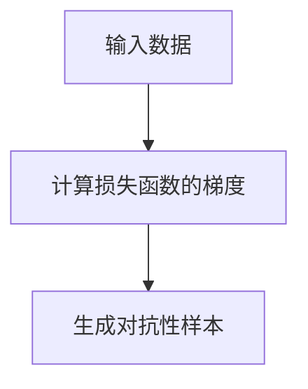
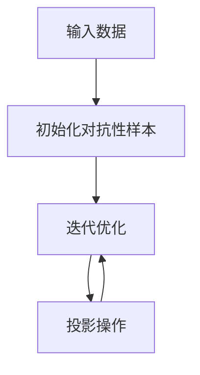
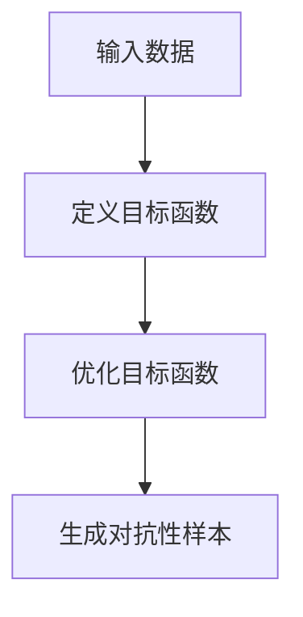

# AI Robustness原理与代码实例讲解

## 1.背景介绍

在人工智能（AI）领域，鲁棒性（Robustness）是指AI系统在面对不确定性、噪声和攻击时仍能保持其性能和功能的能力。随着AI技术在各个行业的广泛应用，确保AI系统的鲁棒性变得尤为重要。无论是在自动驾驶、医疗诊断还是金融预测中，AI系统的鲁棒性都直接关系到其可靠性和安全性。

近年来，AI系统在面对对抗性攻击（Adversarial Attacks）时表现出的脆弱性引起了广泛关注。这些攻击通过对输入数据进行微小的扰动，能够显著降低AI系统的性能。因此，研究和提升AI系统的鲁棒性成为了一个重要的研究方向。

## 2.核心概念与联系

### 2.1 鲁棒性定义

鲁棒性是指系统在面对不确定性和干扰时，仍能保持其预期功能和性能的能力。在AI系统中，鲁棒性主要体现在以下几个方面：

- **对抗性鲁棒性**：系统在面对对抗性攻击时的表现。
- **噪声鲁棒性**：系统在输入数据包含噪声时的表现。
- **泛化能力**：系统在面对未见过的数据时的表现。

### 2.2 对抗性攻击

对抗性攻击是指通过对输入数据进行微小的扰动，使得AI系统产生错误输出的攻击方式。常见的对抗性攻击包括：

- **FGSM（Fast Gradient Sign Method）**：通过计算输入数据的梯度，生成对抗性样本。
- **PGD（Projected Gradient Descent）**：通过多次迭代优化生成对抗性样本。
- **CW（Carlini & Wagner）攻击**：通过优化目标函数生成对抗性样本。

### 2.3 鲁棒性与泛化能力的联系

鲁棒性和泛化能力是AI系统性能的重要指标。一个鲁棒的AI系统通常具有较强的泛化能力，能够在面对未见过的数据时仍能保持良好的性能。提高AI系统的鲁棒性不仅能够增强其对抗性攻击的抵抗能力，还能提升其在实际应用中的可靠性。

## 3.核心算法原理具体操作步骤

### 3.1 FGSM算法

FGSM算法通过计算输入数据的梯度，生成对抗性样本。其具体操作步骤如下：

1. **计算损失函数的梯度**：对输入数据计算损失函数的梯度。
2. **生成对抗性样本**：通过对输入数据进行微小的扰动，生成对抗性样本。



### 3.2 PGD算法

PGD算法通过多次迭代优化生成对抗性样本。其具体操作步骤如下：

1. **初始化对抗性样本**：对输入数据进行微小的随机扰动，初始化对抗性样本。
2. **迭代优化**：通过多次迭代优化，对对抗性样本进行更新。
3. **投影操作**：将对抗性样本投影到合法的输入空间。



### 3.3 CW攻击算法

CW攻击算法通过优化目标函数生成对抗性样本。其具体操作步骤如下：

1. **定义目标函数**：定义一个包含对抗性样本和原始样本之间差异的目标函数。
2. **优化目标函数**：通过优化目标函数，生成对抗性样本。



## 4.数学模型和公式详细讲解举例说明

### 4.1 FGSM算法数学模型

FGSM算法的数学模型如下：

$$
x' = x + \epsilon \cdot \text{sign}(\nabla_x J(\theta, x, y))
$$

其中，$x$ 是原始输入，$x'$ 是对抗性样本，$\epsilon$ 是扰动大小，$\nabla_x J(\theta, x, y)$ 是损失函数 $J$ 对输入 $x$ 的梯度。

### 4.2 PGD算法数学模型

PGD算法的数学模型如下：

$$
x_0' = x + \delta
$$

$$
x_{t+1}' = \text{Proj}_{\epsilon}(x_t' + \alpha \cdot \text{sign}(\nabla_x J(\theta, x_t', y)))
$$

其中，$x_0'$ 是初始化的对抗性样本，$\delta$ 是随机扰动，$\alpha$ 是步长，$\text{Proj}_{\epsilon}$ 是投影操作。

### 4.3 CW攻击算法数学模型

CW攻击算法的数学模型如下：

$$
\min \|x' - x\|_2 + c \cdot f(x')
$$

其中，$x$ 是原始输入，$x'$ 是对抗性样本，$c$ 是权重参数，$f(x')$ 是目标函数。

## 5.项目实践：代码实例和详细解释说明

### 5.1 FGSM算法代码实例

以下是使用TensorFlow实现FGSM算法的代码实例：

```python
import tensorflow as tf

def fgsm_attack(model, x, y, epsilon):
    with tf.GradientTape() as tape:
        tape.watch(x)
        prediction = model(x)
        loss = tf.keras.losses.sparse_categorical_crossentropy(y, prediction)
    gradient = tape.gradient(loss, x)
    signed_grad = tf.sign(gradient)
    adversarial_example = x + epsilon * signed_grad
    return adversarial_example
```

### 5.2 PGD算法代码实例

以下是使用TensorFlow实现PGD算法的代码实例：

```python
import tensorflow as tf

def pgd_attack(model, x, y, epsilon, alpha, num_iter):
    x_adv = x + tf.random.uniform(x.shape, -epsilon, epsilon)
    for i in range(num_iter):
        with tf.GradientTape() as tape:
            tape.watch(x_adv)
            prediction = model(x_adv)
            loss = tf.keras.losses.sparse_categorical_crossentropy(y, prediction)
        gradient = tape.gradient(loss, x_adv)
        signed_grad = tf.sign(gradient)
        x_adv = x_adv + alpha * signed_grad
        x_adv = tf.clip_by_value(x_adv, x - epsilon, x + epsilon)
    return x_adv
```

### 5.3 CW攻击算法代码实例

以下是使用TensorFlow实现CW攻击算法的代码实例：

```python
import tensorflow as tf

def cw_attack(model, x, y, c, num_iter, learning_rate):
    def loss_fn(x_adv):
        logits = model(x_adv)
        real = tf.reduce_sum(y * logits, axis=1)
        other = tf.reduce_max((1 - y) * logits - y * 1e4, axis=1)
        loss = tf.maximum(0.0, real - other + 50)
        return tf.reduce_sum(loss)
    
    x_adv = tf.Variable(x)
    optimizer = tf.optimizers.Adam(learning_rate)
    
    for i in range(num_iter):
        with tf.GradientTape() as tape:
            loss = loss_fn(x_adv)
        gradient = tape.gradient(loss, x_adv)
        optimizer.apply_gradients([(gradient, x_adv)])
    
    return x_adv
```

## 6.实际应用场景

### 6.1 自动驾驶

在自动驾驶领域，AI系统需要在各种复杂的环境中保持其鲁棒性。例如，面对恶劣天气、道路障碍和其他车辆的干扰，自动驾驶系统需要能够准确识别和处理这些情况。

### 6.2 医疗诊断

在医疗诊断中，AI系统需要在面对不同患者和不同病情时保持其鲁棒性。例如，面对不同的影像质量和不同的病变类型，AI系统需要能够准确诊断和推荐治疗方案。

### 6.3 金融预测

在金融预测中，AI系统需要在面对市场波动和异常事件时保持其鲁棒性。例如，面对市场的剧烈波动和突发事件，AI系统需要能够准确预测市场趋势和风险。

## 7.工具和资源推荐

### 7.1 工具

- **TensorFlow**：一个开源的机器学习框架，支持多种AI算法的实现。
- **PyTorch**：一个开源的深度学习框架，支持动态计算图和多种AI算法的实现。
- **Adversarial Robustness Toolbox**：一个专门用于对抗性攻击和防御的工具包，支持多种对抗性攻击算法的实现。

### 7.2 资源

- **《Deep Learning》**：一本深度学习领域的经典教材，详细介绍了深度学习的基本原理和算法。
- **《Adversarial Machine Learning》**：一本专门介绍对抗性机器学习的书籍，详细介绍了对抗性攻击和防御的基本原理和算法。
- **TensorFlow官方文档**：详细介绍了TensorFlow的使用方法和API参考。

## 8.总结：未来发展趋势与挑战

随着AI技术的不断发展，提升AI系统的鲁棒性将成为一个重要的研究方向。未来，AI系统需要在更加复杂和多变的环境中保持其鲁棒性，这对AI算法和系统设计提出了更高的要求。

### 8.1 发展趋势

- **多模态鲁棒性**：未来的AI系统需要在多种模态下保持其鲁棒性，例如图像、语音和文本等。
- **自适应鲁棒性**：未来的AI系统需要能够自适应地调整其鲁棒性，以应对不同的环境和任务。
- **鲁棒性评估标准**：未来需要建立统一的鲁棒性评估标准，以便更好地评估和比较不同AI系统的鲁棒性。

### 8.2 挑战

- **对抗性攻击的多样性**：对抗性攻击的形式和方法多种多样，如何应对这些多样化的攻击是一个重要的挑战。
- **鲁棒性与性能的权衡**：提升AI系统的鲁棒性往往会影响其性能，如何在鲁棒性和性能之间找到平衡是一个重要的挑战。
- **鲁棒性评估的复杂性**：鲁棒性评估涉及多个维度和指标，如何进行全面和准确的评估是一个重要的挑战。

## 9.附录：常见问题与解答

### 9.1 什么是对抗性攻击？

对抗性攻击是指通过对输入数据进行微小的扰动，使得AI系统产生错误输出的攻击方式。

### 9.2 如何提升AI系统的鲁棒性？

提升AI系统的鲁棒性可以通过多种方法，例如对抗性训练、数据增强和模型正则化等。

### 9.3 什么是对抗性训练？

对抗性训练是指在训练过程中加入对抗性样本，以提升AI系统对对抗性攻击的抵抗能力。

### 9.4 什么是数据增强？

数据增强是指通过对训练数据进行各种变换和扰动，以提升AI系统的泛化能力和鲁棒性。

### 9.5 什么是模型正则化？

模型正则化是指通过在损失函数中加入正则化项，以防止模型过拟合和提升其鲁棒性。

---

作者：禅与计算机程序设计艺术 / Zen and the Art of Computer Programming