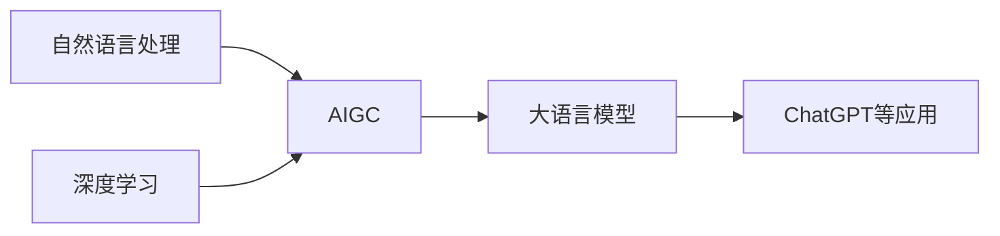

# AIGC从入门到实战：ChatGPT 仅仅是个聊天机器人？

## 1. 背景介绍
### 1.1 人工智能的发展历程
#### 1.1.1 人工智能的起源与定义
#### 1.1.2 人工智能的三次浪潮
#### 1.1.3 人工智能的现状与挑战

### 1.2 生成式AI(Generative AI)的崛起
#### 1.2.1 生成式AI的定义与特点 
#### 1.2.2 生成式AI的代表技术：DALL-E、Stable Diffusion、GPT-3等
#### 1.2.3 生成式AI的应用前景

### 1.3 ChatGPT的诞生与影响
#### 1.3.1 ChatGPT的发布与迅速走红
#### 1.3.2 ChatGPT引发的讨论与争议
#### 1.3.3 ChatGPT对人工智能发展的意义

## 2. 核心概念与联系
### 2.1 自然语言处理(NLP)
#### 2.1.1 NLP的定义与发展历程
#### 2.1.2 NLP的主要任务与技术
#### 2.1.3 NLP在AIGC中的应用

### 2.2 深度学习(Deep Learning) 
#### 2.2.1 深度学习的原理与特点
#### 2.2.2 深度学习的主要模型：CNN、RNN、Transformer等
#### 2.2.3 深度学习在AIGC中的应用

### 2.3 大语言模型(Large Language Models)
#### 2.3.1 大语言模型的定义与特点
#### 2.3.2 大语言模型的训练方法与挑战
#### 2.3.3 大语言模型在AIGC中的应用

### 2.4 AIGC的核心概念联系


## 3. 核心算法原理具体操作步骤
### 3.1 Transformer模型
#### 3.1.1 Transformer的网络结构
#### 3.1.2 Self-Attention机制
#### 3.1.3 位置编码

### 3.2 预训练和微调
#### 3.2.1 无监督预训练
#### 3.2.2 有监督微调
#### 3.2.3 提示学习(Prompt Learning)

### 3.3 Transformer的训练过程
#### 3.3.1 数据准备与预处理
#### 3.3.2 模型初始化
#### 3.3.3 前向传播与反向传播
#### 3.3.4 梯度下降与参数更新

### 3.4 推理与生成
#### 3.4.1 贪心搜索(Greedy Search)
#### 3.4.2 波束搜索(Beam Search) 
#### 3.4.3 Top-k采样与Top-p采样

## 4. 数学模型和公式详细讲解举例说明
### 4.1 Transformer的数学表示
#### 4.1.1 输入表示
$$X = [x_1, x_2, ..., x_n]$$
其中，$x_i \in \mathbb{R}^d$ 表示第i个输入token的d维嵌入向量。

#### 4.1.2 Self-Attention计算
$$Attention(Q,K,V) = softmax(\frac{QK^T}{\sqrt{d_k}})V$$

其中，$Q,K,V \in \mathbb{R}^{n \times d}$分别表示查询、键、值矩阵，$d_k$为缩放因子。

#### 4.1.3 前馈神经网络
$$FFN(x) = max(0, xW_1 + b_1)W_2 + b_2$$

其中，$W_1 \in \mathbb{R}^{d \times d_{ff}}, b_1 \in \mathbb{R}^{d_{ff}}$和$W_2 \in \mathbb{R}^{d_{ff} \times d}, b_2 \in \mathbb{R}^d$为可学习参数。

### 4.2 损失函数
#### 4.2.1 交叉熵损失
对于语言模型，常用交叉熵损失函数：

$$L_{CE} = -\sum_{i=1}^{n} y_i \log(\hat{y}_i)$$

其中，$y_i$为真实标签的one-hot向量，$\hat{y}_i$为模型预测的概率分布。

#### 4.2.2 掩码语言模型损失
对于预训练阶段的掩码语言模型任务，损失函数为：

$$L_{MLM} = -\sum_{i \in masked} \log P(x_i | x_{\backslash masked})$$

其中，$masked$表示被掩码的token位置集合，$x_{\backslash masked}$表示未被掩码的token序列。

### 4.3 优化算法
#### 4.3.1 随机梯度下降(SGD)
$$\theta \leftarrow \theta - \eta \nabla_{\theta} L(\theta)$$

其中，$\theta$为模型参数，$\eta$为学习率，$\nabla_{\theta} L(\theta)$为损失函数对参数的梯度。

#### 4.3.2 Adam优化器
Adam优化器结合了动量和自适应学习率的思想，更新公式为：

$$m_t \leftarrow \beta_1 m_{t-1} + (1-\beta_1) g_t$$
$$v_t \leftarrow \beta_2 v_{t-1} + (1-\beta_2) g_t^2$$
$$\hat{m}_t \leftarrow \frac{m_t}{1-\beta_1^t}$$
$$\hat{v}_t \leftarrow \frac{v_t}{1-\beta_2^t}$$
$$\theta_t \leftarrow \theta_{t-1} - \frac{\eta}{\sqrt{\hat{v}_t} + \epsilon} \hat{m}_t$$

其中，$m_t$和$v_t$分别为一阶矩和二阶矩估计，$\beta_1$和$\beta_2$为衰减率，$\epsilon$为平滑项。

## 5. 项目实践：代码实例和详细解释说明
### 5.1 使用PyTorch实现Transformer
```python
import torch
import torch.nn as nn

class SelfAttention(nn.Module):
    def __init__(self, embed_size, num_heads):
        super().__init__()
        self.embed_size = embed_size
        self.num_heads = num_heads
        self.head_dim = embed_size // num_heads

        self.query = nn.Linear(embed_size, embed_size)
        self.key = nn.Linear(embed_size, embed_size)  
        self.value = nn.Linear(embed_size, embed_size)

        self.fc_out = nn.Linear(embed_size, embed_size)

    def forward(self, x):
        batch_size, seq_len, embed_size = x.size()
        
        Q = self.query(x).view(batch_size, seq_len, self.num_heads, self.head_dim).transpose(1,2)
        K = self.key(x).view(batch_size, seq_len, self.num_heads, self.head_dim).transpose(1,2)
        V = self.value(x).view(batch_size, seq_len, self.num_heads, self.head_dim).transpose(1,2)
        
        energy = torch.matmul(Q, K.transpose(-1,-2)) / (self.head_dim ** 0.5)
        attention = torch.softmax(energy, dim=-1)
        
        x = torch.matmul(attention, V)
        x = x.transpose(1,2).contiguous().view(batch_size, seq_len, embed_size)
        x = self.fc_out(x)
        
        return x

class TransformerBlock(nn.Module):
    def __init__(self, embed_size, num_heads, ff_dim, dropout=0.1):
        super().__init__()
        self.attention = SelfAttention(embed_size, num_heads)
        self.norm1 = nn.LayerNorm(embed_size)
        self.ff = nn.Sequential(
            nn.Linear(embed_size, ff_dim),
            nn.ReLU(),
            nn.Linear(ff_dim, embed_size)
        )
        self.norm2 = nn.LayerNorm(embed_size)
        self.dropout = nn.Dropout(dropout)

    def forward(self, x):
        attended = self.attention(x)
        x = self.norm1(attended + x)
        x = self.dropout(x)
        
        feedforward = self.ff(x)
        x = self.norm2(feedforward + x)
        x = self.dropout(x)
        
        return x

class Transformer(nn.Module):
    def __init__(self, vocab_size, embed_size, num_heads, ff_dim, num_layers):
        super().__init__()
        self.embedding = nn.Embedding(vocab_size, embed_size)
        self.layers = nn.ModuleList([
            TransformerBlock(embed_size, num_heads, ff_dim) 
            for _ in range(num_layers)
        ])
        
    def forward(self, x):
        x = self.embedding(x)
        for layer in self.layers:
            x = layer(x)
        return x
```

以上代码实现了Transformer模型的主要组件，包括Self-Attention、前馈神经网络和Transformer块。通过堆叠多个Transformer块，可以构建完整的Transformer模型。

### 5.2 使用Hugging Face的Transformers库
Hugging Face的Transformers库提供了许多预训练的Transformer模型，可以方便地进行微调和推理。

```python
from transformers import AutoTokenizer, AutoModelForCausalLM

tokenizer = AutoTokenizer.from_pretrained("gpt2")
model = AutoModelForCausalLM.from_pretrained("gpt2")

input_text = "Hello, how are you?"
input_ids = tokenizer.encode(input_text, return_tensors="pt")

output = model.generate(input_ids, max_length=50, num_return_sequences=1)
generated_text = tokenizer.decode(output[0], skip_special_tokens=True)

print(generated_text)
```

以上代码使用了预训练的GPT-2模型进行文本生成。通过简单的API调用，可以轻松实现基于Transformer的自然语言处理任务。

## 6. 实际应用场景
### 6.1 聊天机器人
AIGC技术可以用于构建智能聊天机器人，如ChatGPT。这些聊天机器人能够理解用户的自然语言输入，并生成相关的、连贯的回复。它们可以应用于客户服务、个人助理等领域，提供24/7的服务。

### 6.2 内容创作
AIGC可以辅助内容创作，如自动生成文章、新闻报道、脚本等。通过提供关键词或主题，AIGC系统可以生成相关的、高质量的文本内容。这可以大大提高内容创作的效率，同时确保内容的一致性和质量。

### 6.3 代码生成
AIGC技术也可以应用于代码生成领域。通过学习大量的编程语料库，AIGC系统可以根据自然语言描述或代码片段，自动生成完整的、可执行的代码。这可以帮助程序员提高开发效率，减少重复性的编码工作。

### 6.4 创意设计
AIGC可以在创意设计领域发挥重要作用，如生成图像、音乐、视频等。通过学习大量的设计数据，AIGC系统可以根据用户的输入或描述，自动生成相关的、有创意的设计作品。这可以为设计师提供灵感和参考，加速设计流程。

## 7. 工具和资源推荐
### 7.1 开源框架
- PyTorch (https://pytorch.org/)
- TensorFlow (https://www.tensorflow.org/)
- Hugging Face Transformers (https://huggingface.co/transformers/)

### 7.2 预训练模型
- GPT系列 (https://openai.com/blog/better-language-models/)
- BERT (https://github.com/google-research/bert)
- T5 (https://github.com/google-research/text-to-text-transfer-transformer)

### 7.3 数据集
- WikiText (https://blog.einstein.ai/the-wikitext-long-term-dependency-language-modeling-dataset/)
- BookCorpus (https://yknzhu.wixsite.com/mbweb)
- OpenWebText (https://github.com/jcpeterson/openwebtext)

### 7.4 教程和课程
- CS224n: Natural Language Processing with Deep Learning (http://web.stanford.edu/class/cs224n/)
- Practical Deep Learning for Coders (https://course.fast.ai/)
- Natural Language Processing Specialization (https://www.coursera.org/specializations/natural-language-processing)

## 8. 总结：未来发展趋势与挑战
### 8.1 AIGC的发展趋势
- 模型规模不断增大，性能持续提升
- 多模态AIGC系统的兴起，实现文本、图像、音频等的生成
- 个性化和定制化AIGC服务的普及
- AIGC与传统创作方式的融合与协同

### 8.2 AIGC面临的挑战
- 生成内容的真实性和可靠性问题
- 版权和知识产权问题
- 伦理和安全问题，如生成有害或偏见的内容
- 计算资源和训练成本问题

### 8.3 未来展望
尽管AIGC技术还面临诸多挑战，但其潜力和前景是巨大的。随着技术的不断进步和完善，AIGC将在更多领域