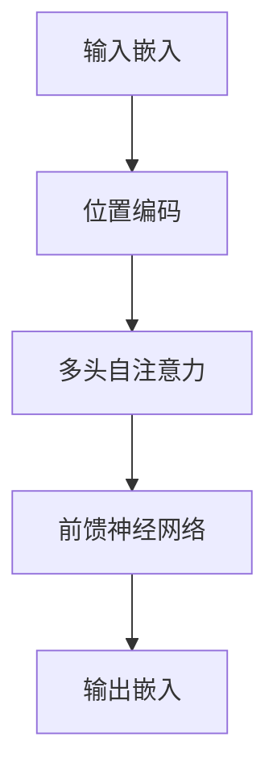
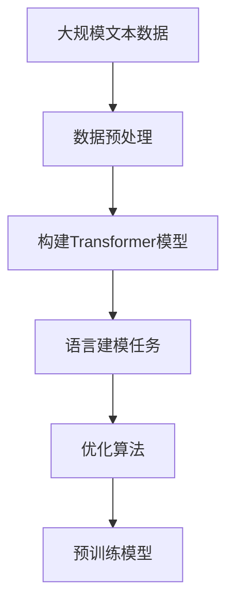
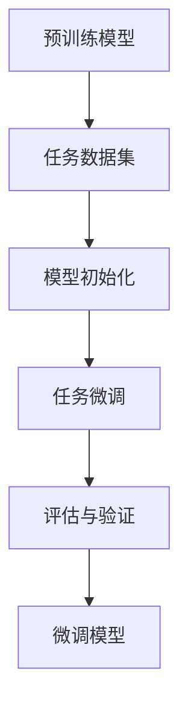

# AIGC从入门到实战：ChatGPT 简介：从 GPT-1 到 GPT-4 的发展历程和应用领域

## 1.背景介绍

### 1.1 人工智能生成内容（AIGC）的兴起

人工智能生成内容（AIGC，Artificial Intelligence Generated Content）是指利用人工智能技术生成文本、图像、音频、视频等多种形式的内容。近年来，随着深度学习和自然语言处理技术的快速发展，AIGC在各个领域得到了广泛应用。特别是以GPT（Generative Pre-trained Transformer）为代表的语言模型，展示了强大的文本生成能力，成为AIGC的重要推动力量。

### 1.2 GPT系列模型的诞生与发展

GPT系列模型由OpenAI开发，旨在通过大规模预训练和微调技术生成高质量的自然语言文本。自2018年发布GPT-1以来，GPT系列模型经历了多次迭代和改进，逐步提升了生成文本的质量和多样性。本文将详细介绍从GPT-1到GPT-4的发展历程及其在各个应用领域的实际应用。

## 2.核心概念与联系

### 2.1 GPT模型的基本概念

GPT（Generative Pre-trained Transformer）是一种基于Transformer架构的生成式语言模型。其核心思想是通过大规模预训练获取语言的广泛知识，然后通过微调适应特定任务。GPT模型的主要特点包括：

- **生成式**：能够生成连贯且有意义的文本。
- **预训练**：在大规模文本数据上进行预训练，获取语言知识。
- **微调**：通过少量任务相关数据进行微调，适应特定任务。

### 2.2 Transformer架构

Transformer是一种基于自注意力机制的神经网络架构，广泛应用于自然语言处理任务。其主要特点包括：

- **自注意力机制**：能够捕捉序列中不同位置的依赖关系。
- **并行计算**：相比于传统的RNN，Transformer能够更高效地进行并行计算。
- **多头注意力**：通过多个注意力头捕捉不同的语义信息。

以下是Transformer架构的Mermaid流程图：



### 2.3 GPT模型的演进

GPT系列模型的演进主要体现在模型规模、训练数据和生成能力的提升。以下是各代GPT模型的主要特点：

- **GPT-1**：首次引入生成式预训练，参数量为1.17亿。
- **GPT-2**：显著提升模型规模，参数量达到15亿，展示了强大的文本生成能力。
- **GPT-3**：进一步扩大模型规模，参数量达到1750亿，能够生成高质量的长文本。
- **GPT-4**：在GPT-3的基础上进行优化，提升了生成文本的多样性和一致性。

## 3.核心算法原理具体操作步骤

### 3.1 数据预处理

在训练GPT模型之前，需要对大规模文本数据进行预处理。主要步骤包括：

1. **数据收集**：从互联网、书籍、新闻等多种来源收集文本数据。
2. **数据清洗**：去除噪声数据，如HTML标签、特殊字符等。
3. **分词处理**：将文本分割成单词或子词，常用的分词方法包括BPE（Byte Pair Encoding）和WordPiece。

### 3.2 模型预训练

预训练是GPT模型的核心步骤，通过在大规模文本数据上进行无监督学习，获取语言的广泛知识。主要步骤包括：

1. **构建Transformer模型**：根据模型规模设置Transformer的层数、注意力头数等参数。
2. **语言建模任务**：采用自回归语言建模任务，即预测给定上下文的下一个单词。
3. **优化算法**：常用的优化算法包括Adam和LAMB，通过反向传播更新模型参数。

以下是预训练过程的Mermaid流程图：



### 3.3 模型微调

微调是将预训练模型适应特定任务的关键步骤。主要步骤包括：

1. **任务数据集**：准备特定任务的数据集，如文本分类、问答系统等。
2. **模型初始化**：加载预训练模型的参数。
3. **任务微调**：在任务数据集上进行有监督学习，优化模型参数。
4. **评估与验证**：通过验证集评估模型性能，调整超参数。

以下是微调过程的Mermaid流程图：



## 4.数学模型和公式详细讲解举例说明

### 4.1 自注意力机制

自注意力机制是Transformer的核心组件，用于捕捉序列中不同位置的依赖关系。其计算过程如下：

1. **输入表示**：将输入序列表示为矩阵 $X \in \mathbb{R}^{n \times d}$，其中 $n$ 是序列长度，$d$ 是嵌入维度。
2. **线性变换**：通过线性变换得到查询矩阵 $Q$、键矩阵 $K$ 和值矩阵 $V$：
   $$
   Q = XW_Q, \quad K = XW_K, \quad V = XW_V
   $$
   其中 $W_Q, W_K, W_V \in \mathbb{R}^{d \times d_k}$ 是可学习的参数矩阵。
3. **注意力得分**：计算查询和键的点积，并进行缩放和归一化：
   $$
   \text{Attention}(Q, K, V) = \text{softmax}\left(\frac{QK^T}{\sqrt{d_k}}\right)V
   $$
4. **多头注意力**：通过多个注意力头捕捉不同的语义信息：
   $$
   \text{MultiHead}(Q, K, V) = \text{Concat}(\text{head}_1, \ldots, \text{head}_h)W_O
   $$
   其中 $\text{head}_i = \text{Attention}(QW_{Q_i}, KW_{K_i}, VW_{V_i})$，$W_O \in \mathbb{R}^{hd_k \times d}$ 是可学习的参数矩阵。

### 4.2 语言建模任务

语言建模任务是GPT模型的预训练任务，旨在预测给定上下文的下一个单词。其目标函数为最大化条件概率：
$$
P(w_t | w_1, w_2, \ldots, w_{t-1})
$$
通过最大化整个序列的对数似然函数进行优化：
$$
\mathcal{L} = \sum_{t=1}^T \log P(w_t | w_1, w_2, \ldots, w_{t-1})
$$

### 4.3 优化算法

GPT模型的训练通常采用Adam优化算法，其更新规则如下：
1. **一阶矩估计**：
   $$
   m_t = \beta_1 m_{t-1} + (1 - \beta_1) g_t
   $$
2. **二阶矩估计**：
   $$
   v_t = \beta_2 v_{t-1} + (1 - \beta_2) g_t^2
   $$
3. **偏差校正**：
   $$
   \hat{m}_t = \frac{m_t}{1 - \beta_1^t}, \quad \hat{v}_t = \frac{v_t}{1 - \beta_2^t}
   $$
4. **参数更新**：
   $$
   \theta_t = \theta_{t-1} - \alpha \frac{\hat{m}_t}{\sqrt{\hat{v}_t} + \epsilon}
   $$

## 5.项目实践：代码实例和详细解释说明

### 5.1 数据预处理

以下是一个简单的Python代码示例，用于对文本数据进行预处理：

```python
import re
import nltk
from nltk.tokenize import word_tokenize

# 下载NLTK数据
nltk.download('punkt')

def preprocess_text(text):
    # 转换为小写
    text = text.lower()
    # 去除HTML标签
    text = re.sub(r'<.*?>', '', text)
    # 去除特殊字符
    text = re.sub(r'[^a-zA-Z0-9\s]', '', text)
    # 分词
    tokens = word_tokenize(text)
    return tokens

# 示例文本
text = "Hello, world! This is a sample text for preprocessing."
tokens = preprocess_text(text)
print(tokens)
```

### 5.2 模型预训练

以下是一个使用Hugging Face Transformers库进行GPT模型预训练的示例：

```python
from transformers import GPT2LMHeadModel, GPT2Tokenizer, Trainer, TrainingArguments

# 加载GPT-2模型和分词器
model = GPT2LMHeadModel.from_pretrained('gpt2')
tokenizer = GPT2Tokenizer.from_pretrained('gpt2')

# 准备训练数据
train_texts = ["Hello, world!", "This is a sample text for training."]
train_encodings = tokenizer(train_texts, return_tensors='pt', padding=True, truncation=True)

# 定义训练参数
training_args = TrainingArguments(
    output_dir='./results',
    num_train_epochs=1,
    per_device_train_batch_size=2,
    save_steps=10,
    save_total_limit=2,
)

# 定义Trainer
trainer = Trainer(
    model=model,
    args=training_args,
    train_dataset=train_encodings['input_ids'],
)

# 开始训练
trainer.train()
```

### 5.3 模型微调

以下是一个使用Hugging Face Transformers库进行GPT模型微调的示例：

```python
from transformers import GPT2LMHeadModel, GPT2Tokenizer, Trainer, TrainingArguments

# 加载预训练模型和分词器
model = GPT2LMHeadModel.from_pretrained('gpt2')
tokenizer = GPT2Tokenizer.from_pretrained('gpt2')

# 准备微调数据
finetune_texts = ["This is a fine-tuning example.", "GPT-2 is a powerful language model."]
finetune_encodings = tokenizer(finetune_texts, return_tensors='pt', padding=True, truncation=True)

# 定义微调参数
finetuning_args = TrainingArguments(
    output_dir='./finetune_results',
    num_train_epochs=1,
    per_device_train_batch_size=2,
    save_steps=10,
    save_total_limit=2,
)

# 定义Trainer
finetuner = Trainer(
    model=model,
    args=finetuning_args,
    train_dataset=finetune_encodings['input_ids'],
)

# 开始微调
finetuner.train()
```

## 6.实际应用场景

### 6.1 文本生成

GPT模型在文本生成方面表现出色，能够生成连贯且有意义的文本。常见的应用场景包括：

- **新闻生成**：自动生成新闻报道，提高新闻生产效率。
- **故事创作**：生成小说、短篇故事等文学作品。
- **对话系统**：构建智能