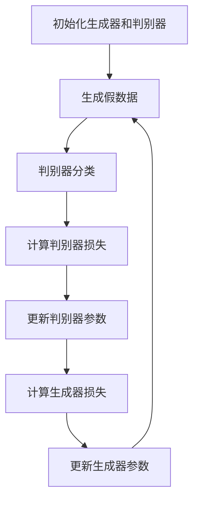
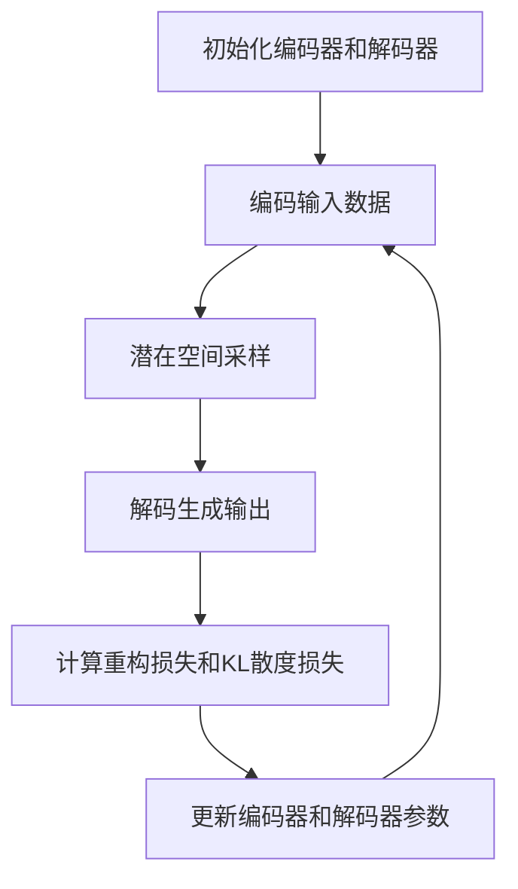
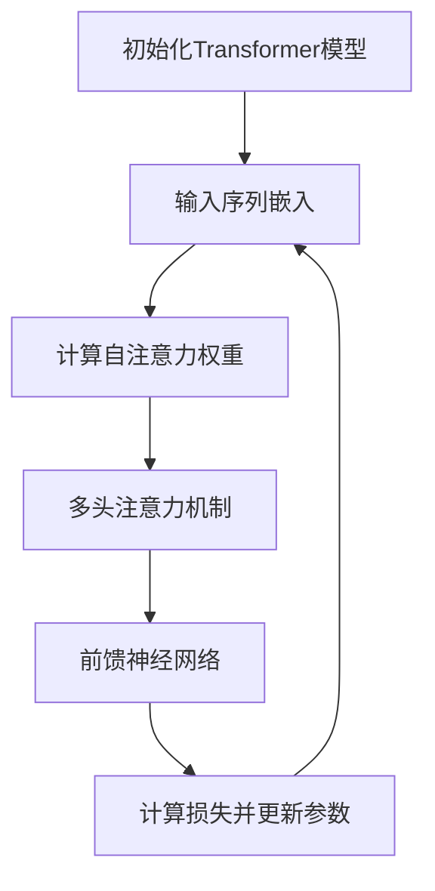

# AIGC从入门到实战：超强的“文科状元”

## 1.背景介绍

人工智能生成内容（AIGC，Artificial Intelligence Generated Content）是近年来迅速崛起的技术领域。它不仅在技术圈内引起了广泛关注，也在文艺、教育、媒体等多个领域产生了深远影响。AIGC技术的核心在于利用深度学习和自然语言处理（NLP）技术，生成高质量的文本、图像、音频和视频内容。本文将深入探讨AIGC的核心概念、算法原理、数学模型、实际应用场景以及未来发展趋势。

## 2.核心概念与联系

### 2.1 人工智能生成内容（AIGC）

AIGC是指利用人工智能技术自动生成各种形式的内容。其主要应用包括但不限于文本生成、图像生成、音频生成和视频生成。AIGC的核心技术包括深度学习、生成对抗网络（GANs）、变分自编码器（VAEs）和Transformer模型等。

### 2.2 深度学习

深度学习是机器学习的一个分支，主要通过多层神经网络来模拟人脑的工作方式。深度学习在AIGC中的应用非常广泛，尤其是在图像和文本生成方面。

### 2.3 自然语言处理（NLP）

NLP是人工智能的一个重要分支，主要研究如何通过计算机理解和生成人类语言。在AIGC中，NLP技术被广泛应用于文本生成和语言翻译等任务。

### 2.4 生成对抗网络（GANs）

GANs是一种深度学习模型，由生成器和判别器两个部分组成。生成器负责生成内容，判别器负责判断内容的真实性。通过两者的对抗训练，GANs可以生成非常逼真的内容。

### 2.5 变分自编码器（VAEs）

VAEs是一种生成模型，通过编码器将输入数据映射到潜在空间，再通过解码器从潜在空间生成数据。VAEs在图像生成和数据压缩方面有广泛应用。

### 2.6 Transformer模型

Transformer模型是近年来NLP领域的重大突破，尤其在文本生成和翻译任务中表现出色。其核心思想是通过自注意力机制来捕捉序列数据中的长距离依赖关系。

## 3.核心算法原理具体操作步骤

### 3.1 生成对抗网络（GANs）

GANs的核心思想是通过生成器和判别器的对抗训练来生成高质量的内容。具体操作步骤如下：

1. 初始化生成器和判别器的参数。
2. 生成器生成一批假数据。
3. 判别器对真实数据和假数据进行分类。
4. 计算判别器的损失，并更新判别器的参数。
5. 计算生成器的损失，并更新生成器的参数。
6. 重复步骤2-5，直到生成器生成的内容足够逼真。



### 3.2 变分自编码器（VAEs）

VAEs的核心思想是通过编码器将输入数据映射到潜在空间，再通过解码器从潜在空间生成数据。具体操作步骤如下：

1. 初始化编码器和解码器的参数。
2. 编码器将输入数据映射到潜在空间。
3. 从潜在空间采样生成数据。
4. 解码器将采样数据生成输出。
5. 计算重构损失和KL散度损失。
6. 更新编码器和解码器的参数。
7. 重复步骤2-6，直到生成的内容足够逼真。



### 3.3 Transformer模型

Transformer模型的核心思想是通过自注意力机制来捕捉序列数据中的长距离依赖关系。具体操作步骤如下：

1. 初始化Transformer模型的参数。
2. 将输入序列嵌入到高维空间。
3. 计算自注意力权重。
4. 通过多头注意力机制进行信息融合。
5. 通过前馈神经网络进行非线性变换。
6. 计算损失并更新模型参数。
7. 重复步骤2-6，直到模型收敛。



## 4.数学模型和公式详细讲解举例说明

### 4.1 生成对抗网络（GANs）

GANs的数学模型由生成器 $G$ 和判别器 $D$ 组成。生成器 $G$ 的目标是生成尽可能逼真的数据，而判别器 $D$ 的目标是区分真实数据和生成数据。其损失函数定义如下：

$$
\min_G \max_D V(D, G) = \mathbb{E}_{x \sim p_{data}(x)}[\log D(x)] + \mathbb{E}_{z \sim p_z(z)}[\log(1 - D(G(z)))]
$$

其中，$p_{data}(x)$ 是真实数据的分布，$p_z(z)$ 是生成器的输入噪声分布。

### 4.2 变分自编码器（VAEs）

VAEs的数学模型由编码器 $q(z|x)$ 和解码器 $p(x|z)$ 组成。其目标是最大化似然函数，同时最小化KL散度。其损失函数定义如下：

$$
\mathcal{L} = -\mathbb{E}_{q(z|x)}[\log p(x|z)] + KL(q(z|x) \| p(z))
$$

其中，$KL(q(z|x) \| p(z))$ 是编码器输出分布和先验分布之间的KL散度。

### 4.3 Transformer模型

Transformer模型的核心是自注意力机制，其计算公式如下：

$$
\text{Attention}(Q, K, V) = \text{softmax}\left(\frac{QK^T}{\sqrt{d_k}}\right)V
$$

其中，$Q$ 是查询矩阵，$K$ 是键矩阵，$V$ 是值矩阵，$d_k$ 是键矩阵的维度。

## 5.项目实践：代码实例和详细解释说明

### 5.1 生成对抗网络（GANs）

以下是一个简单的GANs实现示例，使用Python和TensorFlow：

```python
import tensorflow as tf
from tensorflow.keras import layers

# 生成器模型
def build_generator():
    model = tf.keras.Sequential()
    model.add(layers.Dense(128, activation='relu', input_dim=100))
    model.add(layers.Dense(784, activation='sigmoid'))
    model.add(layers.Reshape((28, 28, 1)))
    return model

# 判别器模型
def build_discriminator():
    model = tf.keras.Sequential()
    model.add(layers.Flatten(input_shape=(28, 28, 1)))
    model.add(layers.Dense(128, activation='relu'))
    model.add(layers.Dense(1, activation='sigmoid'))
    return model

# 构建和编译GAN模型
generator = build_generator()
discriminator = build_discriminator()
discriminator.compile(optimizer='adam', loss='binary_crossentropy')

# GAN模型
discriminator.trainable = False
gan_input = layers.Input(shape=(100,))
gan_output = discriminator(generator(gan_input))
gan = tf.keras.Model(gan_input, gan_output)
gan.compile(optimizer='adam', loss='binary_crossentropy')

# 训练GAN模型
import numpy as np

def train_gan(gan, generator, discriminator, epochs=10000, batch_size=128):
    for epoch in range(epochs):
        # 生成假数据
        noise = np.random.normal(0, 1, (batch_size, 100))
        generated_images = generator.predict(noise)
        
        # 获取真实数据
        real_images = np.random.rand(batch_size, 28, 28, 1)
        
        # 合并数据
        X = np.concatenate([real_images, generated_images])
        y = np.concatenate([np.ones((batch_size, 1)), np.zeros((batch_size, 1))])
        
        # 训练判别器
        discriminator.trainable = True
        d_loss = discriminator.train_on_batch(X, y)
        
        # 训练生成器
        noise = np.random.normal(0, 1, (batch_size, 100))
        y_gen = np.ones((batch_size, 1))
        discriminator.trainable = False
        g_loss = gan.train_on_batch(noise, y_gen)
        
        if epoch % 1000 == 0:
            print(f'Epoch {epoch}, Discriminator Loss: {d_loss}, Generator Loss: {g_loss}')

train_gan(gan, generator, discriminator)
```

### 5.2 变分自编码器（VAEs）

以下是一个简单的VAEs实现示例，使用Python和TensorFlow：

```python
import tensorflow as tf
from tensorflow.keras import layers

# 编码器模型
def build_encoder():
    inputs = layers.Input(shape=(28, 28, 1))
    x = layers.Flatten()(inputs)
    x = layers.Dense(128, activation='relu')(x)
    z_mean = layers.Dense(2)(x)
    z_log_var = layers.Dense(2)(x)
    return tf.keras.Model(inputs, [z_mean, z_log_var])

# 解码器模型
def build_decoder():
    inputs = layers.Input(shape=(2,))
    x = layers.Dense(128, activation='relu')(inputs)
    x = layers.Dense(784, activation='sigmoid')(x)
    outputs = layers.Reshape((28, 28, 1))(x)
    return tf.keras.Model(inputs, outputs)

# 采样层
class Sampling(layers.Layer):
    def call(self, inputs):
        z_mean, z_log_var = inputs
        batch = tf.shape(z_mean)[0]
        dim = tf.shape(z_mean)[1]
        epsilon = tf.keras.backend.random_normal(shape=(batch, dim))
        return z_mean + tf.exp(0.5 * z_log_var) * epsilon

# 构建VAE模型
encoder = build_encoder()
decoder = build_decoder()
inputs = layers.Input(shape=(28, 28, 1))
z_mean, z_log_var = encoder(inputs)
z = Sampling()([z_mean, z_log_var])
outputs = decoder(z)
vae = tf.keras.Model(inputs, outputs)

# 损失函数
reconstruction_loss = tf.keras.losses.binary_crossentropy(tf.keras.backend.flatten(inputs), tf.keras.backend.flatten(outputs))
reconstruction_loss *= 28 * 28
kl_loss = 1 + z_log_var - tf.square(z_mean) - tf.exp(z_log_var)
kl_loss = tf.reduce_sum(kl_loss, axis=-1)
kl_loss *= -0.5
vae_loss = tf.reduce_mean(reconstruction_loss + kl_loss)
vae.add_loss(vae_loss)
vae.compile(optimizer='adam')

# 训练VAE模型
import numpy as np

def train_vae(vae, epochs=10000,